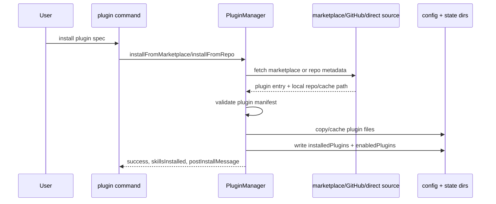
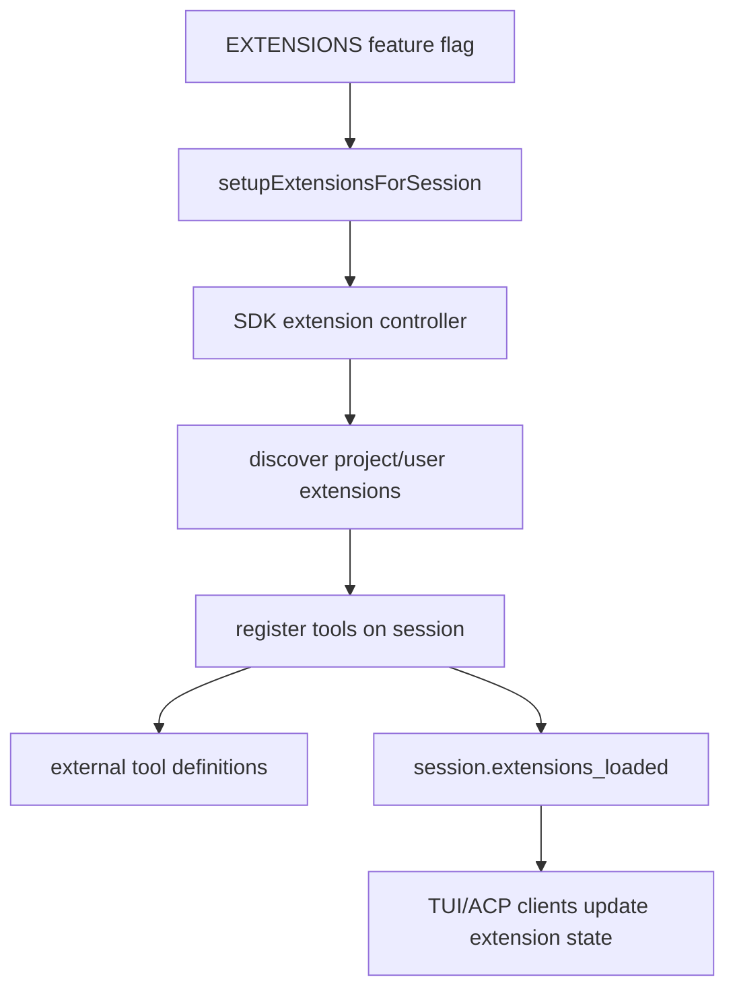

# Plugin and extension architecture

This document explains how the extracted Copilot CLI bundle supports plugins and SDK-style extensions.

In `app.js`, plugins and extensions are related but not identical:

- **Plugins** are installable packages or local directories that contribute declarative assets such as skills, agents, hooks, MCP servers, LSP servers, and metadata.
- **Extensions** are programmatic `@github/copilot-sdk` integrations loaded into a session when the `EXTENSIONS` feature gate and config discovery allow it.

Both eventually add capabilities to a session, but they enter the runtime through different loaders and persistence paths.

## Source anchors

| Semantic alias | Minified anchor | Evidence |
|---|---|---|
| Plugin state schema | `installedPlugins`, `enabledPlugins` | User settings store installed records and enabled/disabled state. |
| Plugin cache layout | `installed-plugins`, `plugin-data` | State directories under the CLI state root. |
| Plugin manager | `ET` class, `getInstalledPluginsDir`, `getPluginCacheDir`, `getPluginDataDir` | Install/update/uninstall and data-dir helpers. |
| Marketplace install | `installFromMarketplace` | Marketplace plugin lookup, source resolution, install, and config save. |
| Local plugin injection | `--plugin-dir <directory>` | Runtime option scans local directories for `plugin.json`. |
| Plugin contributions | `skills`, `agents`, `hooks`, `mcpServers`, `lspServers` | Plugin metadata schema allows multiple capability types. |
| Extension gate | `EXTENSIONS` | Feature flag text says extensions are programmatic tools and hooks via `@github/copilot-sdk`. |
| Session extension setup | `setupExtensionsForSession`, `session.extensions_loaded` | Extensions are loaded/reloaded and exposed through session events. |

Representative line anchors from the analyzed bundle:

- line `236`: settings schema for `installedPlugins` records.
- line `238`: settings merge includes `enabledPlugins` and hook/plugin-related settings.
- line `525`: plugin manifest schema includes commands, agents, skills, hooks, MCP servers, and LSP servers.
- line `528`: plugin manager and LSP/plugin loading helpers.
- line `1340`: `/plugin` slash command registration.
- line `6100`: `setupExtensionsForSession(...)` registers SDK extension tools on a session.
- line `7445`: `--plugin-dir` local plugin scanner.
- line `8221`: root CLI option declaration for `--plugin-dir <directory>`.

## User-visible surfaces

Plugins are visible from both root command mode and interactive slash-command mode.

| Surface | Role |
|---|---|
| `copilot plugin` | Root CLI command for plugin install/list/marketplace/uninstall/update. |
| `/plugin` | Interactive command for plugin management inside a session. |
| `--plugin-dir <directory>` | Loads one or more local plugin directories for the current invocation. |
| `/env` | Shows loaded plugins, skills, agents, MCP servers, LSPs, and extensions. |

The captured help text describes plugins as packages that can extend Copilot CLI with **skills, agents, hooks, MCP servers, and LSP servers**, and says they can be installed from marketplaces, GitHub repositories, repository subdirectories, or direct git URLs.

## Data model

The plugin record schema around line `236` includes fields equivalent to:

| Field | Meaning |
|---|---|
| `name` | Plugin name. |
| `marketplace` | Marketplace/source namespace for installed marketplace plugins. |
| `version` | Optional resolved version. |
| `installed_at` | Install timestamp. |
| `enabled` | Whether the plugin is active. |
| `cache_path` | Optional path to cached/local plugin content. |
| `source` | Either a string or structured GitHub/URL source metadata. |

Enabled state is tracked separately through `enabledPlugins`, merged into runtime config around line `238`. This split lets the CLI retain install records while enabling/disabling plugin capabilities without deleting cache entries.

## State layout

The plugin manager class around line `528` uses two notable state directories:

| Directory key | Purpose |
|---|---|
| `installed-plugins` | Cached plugin code/content installed from marketplaces or direct sources. |
| `plugin-data` | Writable per-plugin data directory exposed to plugin hooks/processes. |

The helper methods imply this layout:

| Method | Role |
|---|---|
| `getInstalledPluginsDir()` | Returns the base cache directory for installed plugins. |
| `getPluginCacheDir(marketplace, name)` | Returns the cache path for a marketplace plugin. |
| `getPluginDataDir(marketplace, name)` | Returns a plugin-specific data directory. Direct plugins use a `_direct` namespace. |

Plugin hook execution later injects environment variables such as `PLUGIN_ROOT`, `COPILOT_PLUGIN_DATA`, and `COPILOT_PROJECT_DIR`, so plugins can find their read-only root and writable data directory without guessing the CLI state layout.

## Install and update flow

The extracted bundle shows `installFromMarketplace(...)`, `installFromRepo(...)`, `uninstall(...)`, and `update(...)` methods. Marketplace installation resolves the marketplace, finds a plugin entry, resolves the plugin source, writes it into a cache directory, then saves both `installedPlugins` and `enabledPlugins` settings.

Uninstall removes the cache directory and prunes empty parent directories. Update reuses installation and records previous-version metadata for the user-facing result.

## Local plugin directories

The root CLI option `--plugin-dir <directory>` allows one or more local directories to be loaded for a single run.

The scanner around line `7445`:

1. resolves each provided directory;
2. deduplicates paths;
3. searches for a `plugin.json` under known plugin root conventions;
4. warns if no `plugin.json` is found;
5. reads the manifest;
6. creates an enabled plugin record with `marketplace: ""` and `cache_path` pointing to the local directory.

These local plugins are displayed separately from installed marketplace plugins as “External Plugins (via `--plugin-dir`)”.

## Plugin manifest contributions

The manifest schema around line `525` allows plugins to contribute multiple subsystems:

| Manifest field | Runtime destination |
|---|---|
| `skills` | Additional `SKILL.md` directories for the skill loader. |
| `agents` | Custom-agent definitions available to the task/subagent system. |
| `hooks` | Lifecycle, prompt, permission, and tool hooks. |
| `mcpServers` | MCP server configuration merged into session MCP config. |
| `lspServers` | Language server configuration merged into the LSP registry. |
| `commands` | Plugin command metadata or command-like affordances. |
| `postInstallMessage` | User-facing install completion text. |

The plugin manager has a `getInstalledPluginSkillDirs(...)` helper that walks enabled installed plugins and returns existing `skills` directories. Similar plugin-aware paths exist for MCP configs, hooks, custom agents, and LSP configs elsewhere in the bundle.

## LSP server contribution

Plugin-contributed LSP support is visible in two places:

- the manifest schema includes `lspServers`;
- the LSP loader scans installed plugins, reads plugin LSP config, and tags loaded server entries with source plugin metadata.

The loader also validates names and config shape. When plugin LSP servers are loaded, the bundle logs how many servers came from how many plugins. This keeps plugin LSPs in the same registry as user/project LSP config while preserving provenance.

## MCP contribution

Plugin MCP config is merged into the same MCP discovery system as user/workspace/default configs. A plugin can therefore add tools to the session by declaring MCP servers, but those tools still pass through the normal MCP host lifecycle, permission checks, OAuth flow, tool conversion, telemetry, and event handling.

This is why plugin support and MCP support are tightly coupled but not the same feature. Plugins are one source of MCP server definitions.

## Hook contribution

Plugins can also contribute hooks. The hook loader treats plugin hooks as one source among repo and user hooks. During hook execution, plugin hooks receive plugin-root and plugin-data environment variables so they can access their assets and writable state.

Authorization-sensitive hook restrictions still apply. A plugin cannot bypass HTTPS requirements for `preToolUse` or `permissionRequest` HTTP hooks unless the same explicit development environment overrides are set.

## SDK extension lifecycle

The `EXTENSIONS` feature flag is described in the bundle as enabling:

> extensions — programmatic tools and hooks via `@github/copilot-sdk`, scaffolded and managed by the agent itself

For the standalone SDK-focused map, see [Copilot SDK extension support](copilot-sdk-extension-support.md).

When config discovery and `EXTENSIONS` are enabled, session creation/resume calls `setupExtensionsForSession(...)`.

The setup path around line `6100`:

1. creates an extension controller/host with CLI distribution and SDK paths;
2. adds host-level external tool definitions;
3. registers extension tools on the session;
4. tracks disabled extension IDs;
5. exposes list/enable/disable/reload operations;
6. emits `session.extensions_loaded` with discovered extension IDs, names, sources, and statuses;
7. updates the session external tools after reloads.

## Plugins versus extensions

| Aspect | Plugin | SDK extension |
|---|---|---|
| Primary form | Installed package/local directory with manifest | Programmatic SDK integration loaded into session |
| Persistence | `installedPlugins`, `enabledPlugins`, state cache | Discovered/reloaded per session when enabled |
| Capabilities | Skills, agents, hooks, MCP, LSP, metadata | Programmatic tools/hooks and extension management |
| Feature gate | Plugin command and config paths are generally present | `EXTENSIONS` gate controls runtime loading |
| User surface | `copilot plugin`, `/plugin`, `--plugin-dir` | Extension manager/UI events, embedded/session tools |
| Trust boundary | Plugin files and hook/MCP/LSP declarations | Programmatic tool execution through session permissions |

## Runtime merge order

The exact order is distributed across startup code, but the effective merge is:

1. load user/workspace settings;
2. resolve installed plugin records and local `--plugin-dir` entries;
3. apply `enabledPlugins` filters;
4. collect plugin-provided skills, agents, hooks, MCP servers, and LSP servers;
5. merge those into session config alongside user/workspace/default sources;
6. start MCP/LSP/extension-related runtime hosts as needed;
7. emit session events such as `session.skills_loaded`, `session.custom_agents_updated`, `session.mcp_servers_loaded`, and `session.extensions_loaded`.

## Permission and trust model

Plugins and extensions add capabilities; they do not remove the central permission model.

- MCP tools from plugins still use MCP permission kinds.
- Hooks still use hook schemas and HTTPS restrictions.
- Extension management and extension permission access have distinct permission kinds.
- LSP servers are explicit configuration entries, not auto-spawned arbitrary processes.
- Local `--plugin-dir` paths are opt-in per invocation.
- Installed plugin records can be disabled without deleting cached files.

## Relationship to other docs

- `integrations-permissions-config.md` gives the broader integration overview.
- `copilot-sdk-extension-support.md` expands the programmatic `@github/copilot-sdk` extension lifecycle, APIs, events, and trust boundaries.
- `mcp-support-implementation.md` explains how plugin-provided MCP servers become tools.
- `hooks-lifecycle-automation.md` explains plugin hooks in the broader hook system.
- `ide-lsp-editor-integration.md` explains LSP and extension state from the IDE/editor perspective.
