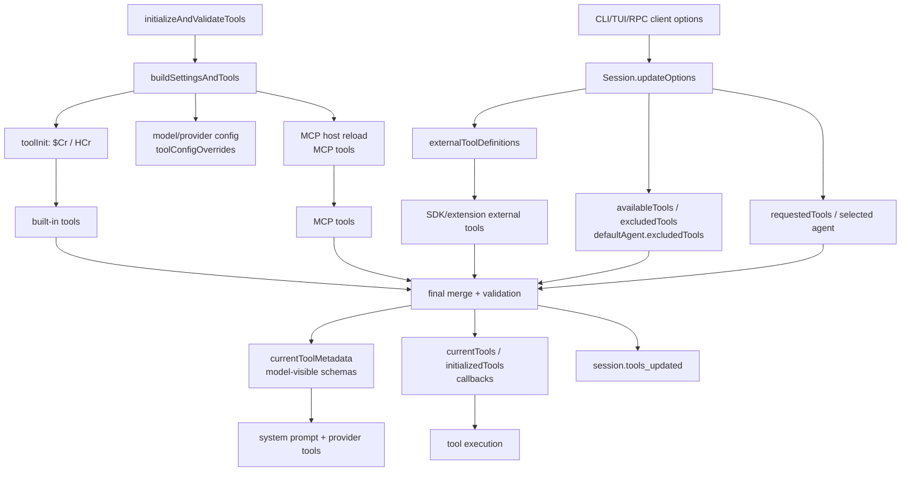
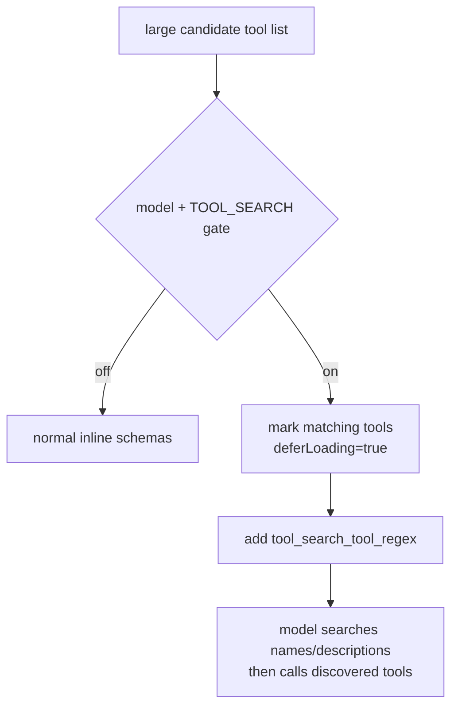
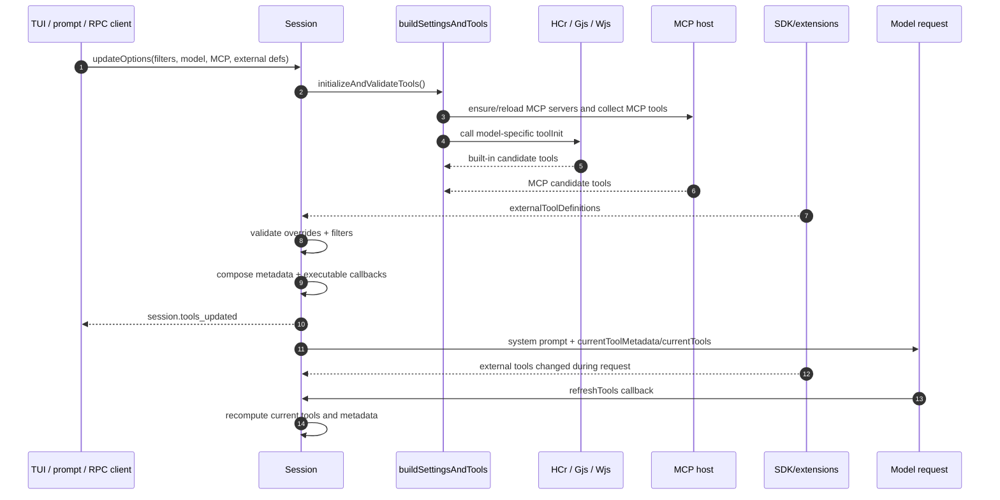

# Runtime tool assembly and filtering

## What this page covers

Use this page to answer **which tools can the model call in this session, and why this exact set?** It owns the pre-execution boundary: session options, model/provider config, MCP/external tool discovery, selected-agent filters, and deferred loading all converge here before a tool call exists.

This page does **not** explain how a tool runs after selection. Continue to [Built-in tools, execution events, and results](built-in-tools-execution-events.md) for callback execution, [Shell command execution events](shell-command-execution-events.md) for process management, and [Tool, path, and URL permissions](tool-path-url-permissions.md) for approvals.

The short version: tool assembly is a two-stage pipeline. First, model/provider configuration selects a `toolInit` function that gathers built-in tools. Then the session runtime merges those built-ins with MCP and external tools, validates allow/exclude filters, applies selected-agent constraints, adds deferred `tool_search` when needed, and publishes `session.tools_updated`.

| Input | Decision made here | Output |
|---|---|---|
| CLI/TUI/RPC session options | Apply `availableTools`, `excludedTools`, selected-agent/default-agent rules, and external tool definitions. | Filtered executable callbacks plus model-visible metadata. |
| MCP host state | Merge server tools, server instructions, namespace metadata, and server-level filters. | MCP tools become normal Copilot tool definitions. |
| SDK/extension registrations | Deduplicate external definitions and handle explicit built-in overrides. | External callbacks and signed metadata. |
| Model/provider config | Apply tool config overrides, deferred loading, and provider-specific metadata shaping. | Current prompt/tool metadata and optional `tool_search`. |

## Source anchors

`app.js` is bundled/minified, so generated symbols are useful lookup aids for this extracted build but should not be treated as stable public API.

| Area | Semantic alias | Minified anchor | Approx. line | What it does |
|---|---|---:|---:|---|
| RPC create/resume options | `session.create`, `session.resume` tool options | `availableTools`, `excludedTools`, `defaultAgent.excludedTools` | 6100 | Accepts user/client tool filters, custom agents, MCP config, external tools, and model/provider settings. |
| TUI/prompt-mode options | TUI session options, prompt-mode session options | `l1(...)`, `U4a(...)` | 7340, 7416 | Passes CLI allow/exclude-tool state into the session. |
| Session option storage | `Session.updateOptions(...)` | `updateOptions(...)` | 4471 | Stores filters, external tool definitions, requested tools, selected shell config, MCP config, and invalidates cached tool metadata. |
| Built-in tool assembly | `assembleRuntimeTools(...)`, `assembleToolSet(...)` | `$Cr(...)`, `HCr(...)` | 5734 | Collects shell, file/edit, validation, memory, skills, ask-user, workspace, task/subagent, schedule, and model/provider-specific tools. |
| Subagent tool assembly | `assembleSubagentTools(...)` | `Gjs(...)` | 5734 | Recursively builds subagent tool lists and injects `task`, agent, sidekick, and peer-agent tools. |
| Shell assembly | `assembleShellTools(...)` | `Wjs(...)` | 5734 | Adds shell/read/write/stop/list tools and chooses PTY vs process backend. |
| Memory assembly | `assembleMemoryTools(...)` | `Yjs(...)` | 5734 | Adds cloud/local memory tools when memory is enabled. |
| Final session merge | `initializeAndValidateTools(...)` | same name | 4481 | Merges built-ins, MCP tools, and external tools; handles overrides; validates filters; builds prompt metadata and executable tool callbacks. |
| Filtering helpers | `isToolEnabled`, `filterToolsForSelectedAgent`, `composeCurrentToolMetadata` | `Fyr(...)`, `_Jn(...)`, `Gq(...)`, `cwe(...)` | 4471 | Implements allow/exclude/default-agent/custom-agent filtering and metadata stripping. |
| Deferred tool search | `tool_search` injection | `m0e(...)`, `P3e(...)`, `Smt(...)` | 3454 | Marks large toolsets for deferred loading and adds a regex-based tool discovery tool when supported. |
| External tool updates | SDK/extension-host external tools | `updateSessionExternalTools(...)` | 6100 | Deduplicates host/connection/extension tools, signs definitions, updates the session, and triggers tool refresh. |
| Request-time refresh | External tool refresh during a turn | `refreshTools` callback | 4483 | Recomputes executable tools and metadata when external definitions change during an active model request. |

## End-to-end flow

There are three different tool-shaped collections that matter:

| Collection | Contains callbacks? | Used for | Notes |
|---|---:|---|---|
| `builtInTools`, `mcpTools`, `externalTools` | yes | Candidate executable tools | Produced by `buildSettingsAndTools()`, MCP host reload, and `buildExternalTools()`. |
| `currentToolMetadata` | no | System prompt and provider tool definitions | Produced by `cwe(...)` / `composeCurrentToolMetadata(...)`; strips callback/shutdown/summarizer fields. |
| `currentTools` / `initializedTools` | yes | Runtime dispatch after model tool calls | This is the executable list after filters, external overrides, selected-agent constraints, and deferred search injection. |

The separation is important: a tool can be executable but not immediately expanded into prompt metadata when deferred loading is active, and an external tool can override built-in metadata without being mixed into the built-in candidate list too early.

## Session option ingress

Tool filtering starts before any model call.

| Entry | What gets passed |
|---|---|
| TUI mode | `availableTools`, `excludedTools`, model/provider settings, sandbox/shell settings, installed plugins, custom-agent settings, and mode flags. |
| Prompt mode | Similar filters plus non-interactive permission policy and output/export options. |
| SDK/RPC `session.create` | `availableTools`, `excludedTools`, `defaultAgent.excludedTools`, `tools`/external definitions from the active connection, MCP config, custom agents, streaming/permission capabilities. |
| SDK/RPC `session.resume` | Updates an existing session with any changed filters or external tool definitions, then may notify `session.tools_updated` if the effective signature changed. |
| Subagent session creation | Parent sessions pass `requestedTools`, inherited or agent-local MCP servers, selected custom agents, external definitions, and inherited shell context. |

`updateOptions(...)` stores these fields directly on the session. When `availableTools`, `excludedTools`, or `defaultAgentExcludedTools` changes, the session marks tool definitions as changed. When external tool definitions change, the session increments `externalToolsVersion`, updates cached external metadata, and can later trigger a request-time refresh.

## Built-in candidate assembly

The default CLI model config points to `$Cr(...)`, which calls `HCr(...)` with CLI documentation helpers and selected feature-gated subagent hints. `HCr(...)` builds the built-in candidate list in layers:

1. Shell tools from `Wjs(...)`: shell execution plus read/write/stop/list controls.
2. Memory tools from `Yjs(...)` when cloud or local memory is enabled.
3. Editing tools, whose shape changes with model/tool config overrides such as split editing tools or `apply_patch` style.
4. Validation tools from `Kjs(...)` and related helpers.
5. Static helpers such as think/scratchpad-style tools and documentation helpers.
6. Skills/instruction retrieval tools when skills are available and feature gates allow them.
7. `ask_user` or elicitation only when the capability and handler exist.
8. Workspace/session-state tools when a workspace path exists.
9. `task_complete` when autopilot is active.
10. Exit-plan tools when plan-mode exit handling is enabled.
11. Agent/subagent tools from `Gjs(...)`, including `task`, background agents, sidekick helpers, and peer-agent messaging.
12. Schedule management when `enableManageScheduleTool` is active.

Model-specific configuration can override the assembly behavior. The `eb(...)` model-config resolver can set `toolConfigOverrides`, which are merged into the tool config before `HCr(...)` runs. This is why the same high-level session can expose different editing tools, tool-search behavior, or prompt instructions for different model families.

## MCP and external tool candidates

MCP tools are loaded outside `HCr(...)` by the session's MCP host path, then merged beside built-ins in `initializeAndValidateTools()`. MCP-specific allowlists, server-level `tools` filters, GitHub MCP toolset headers, and selected-agent MCP servers are covered in [MCP host, transports, and tools](mcp-host-transport-and-tools.md).

External tools enter through two paths:

- SDK/RPC clients can register tools when initializing a session connection.
- Extension hosts can register tool definitions after extension discovery and launch.

`updateSessionExternalTools(...)` deduplicates host-level, connection-level, and extension-level external definitions. Earlier tools win when duplicate names appear, and a signature over name, description, title, schema, override flag, and permission-skipping flag is used to decide whether the session actually changed.

The session converts valid external definitions into two forms:

| Form | Method | Purpose |
|---|---|---|
| Metadata | `getExternalToolMetadata(...)` | Tool schema exposed to the model, if enabled by filters. |
| Executable callback | `buildExternalTools()` | Runtime callback that requests `custom-tool` permission, then emits `external_tool.requested`. |

Invalid external schemas are ignored unless `parameters` is absent or has JSON-schema type `object`. If an external tool shares a name with a built-in tool, it must set `overridesBuiltInTool: true`; otherwise initialization throws an error. When override is explicit, the built-in callback is removed from the initialized executable set and the external tool takes that name.

## Final filtering rules

The core include/exclude helper is deliberately small:

| State | Result |
|---|---|
| `availableTools` is set | Only names listed in `availableTools` are enabled. |
| no allowlist, `excludedTools` is set | Names in `excludedTools` are disabled. |
| neither is set | The tool is enabled. |

`initializeAndValidateTools()` applies this logic after candidate collection:

1. Start with built-ins from `HCr(...)`, MCP tools from the MCP host, and external metadata/callbacks from SDK or extensions.
2. Remove built-in callbacks that are explicitly overridden by external tools.
3. Build a universe of known names from non-overridden built-ins, MCP tools, and external metadata.
4. Validate filters against that universe and emit `session.info` messages for disabled or unknown names.
5. Filter executable built-ins, MCP tools, and external tools with `isToolEnabled(...)`.
6. Compose `currentToolMetadata` by joining non-external metadata with enabled external metadata while honoring explicit external overrides.
7. Apply selected-agent or default-agent filtering through `_Jn(...)`.
8. Re-render the system prompt with the current metadata and model-specific prompt parts.
9. Save `initializedTools` / `currentTools` for runtime callback dispatch.

The selected-agent filter is stricter than the default-agent filter:

| Active agent state | Filter behavior |
|---|---|
| Selected custom agent with `tools: ["*"]` or no explicit tools | Keep most tools, excluding internal top-level-incompatible helpers. |
| Selected custom agent with named tools | Keep only requested names plus mandatory agent/top-level support tools. |
| No selected custom agent | Remove `defaultAgent.excludedTools` and internal default exclusions such as dynamic-context-only tools, unless an explicit `availableTools` allowlist is present. |

This explains a common reverse-engineering pitfall: `availableTools` and custom-agent `tools` are not the same thing. `availableTools` is a session-wide allowlist. A selected custom agent's `tools` field is a top-level agent policy that runs after the session-wide candidate universe exists.

## Deferred loading and `tool_search`

Large MCP/custom toolsets can overwhelm the prompt with schemas. The runtime handles this with deferred loading.

`m0e(...)` marks selected tools with `deferLoading` when the candidate list is above a threshold. It targets tools that are especially likely to be numerous, such as MCP/namespaced tools and externally supplied tools. When the selected model and feature flags support the behavior, `Smt(...)` allows adding `P3e(...)`, a tool named `tool_search_tool_regex`.

This means "not immediately visible in the prompt" does not necessarily mean "unavailable". Deferred tools remain in the executable set; the model discovers them through the search tool.

## Request-time refresh

External tools can change while a turn is running, especially with SDK or extension-host sessions. The request object carries a `refreshTools` callback that compares `externalToolsVersion` with the captured value from request construction.

When the version changes, the callback:

1. rebuilds external callbacks;
2. revalidates external overrides;
3. recomputes the enabled tool list;
4. reapplies selected-agent/default-agent filters;
5. optionally re-adds `tool_search_tool_regex`;
6. updates `currentTools`, `currentNonExternalToolMetadata`, and `currentToolMetadata`.

If refresh fails, the session emits a warning-like `session.info` event and continues with the previous tool set. This favors keeping the turn alive over hard-failing the whole request because an extension reloaded badly.

## Subagent toolsets

`Gjs(...)` constructs the subagent executor layer after the base tools are assembled. The recursive subagent tool provider calls `HCr(...)` again with subagent-specific config and then merges:

1. the child tool list;
2. parent MCP tools;
3. external tools.

It uses a map keyed by tool name, so later sources can replace earlier sources. The merged list is stripped of deferred-loading hints for child execution, then filtered with the parent `filterTool` when present. If the child model supports tool search, deferred loading and `tool_search_tool_regex` can be injected for the child toolset too.

Session-based subagents add one more layer: the parent can create a child session with `requestedTools` equal to the subagent/custom-agent declared tools. The child session initializes its own tools, builds a replacement system prompt, and then updates its own `availableTools` to the agent-filtered names.

## Events and cache invalidation

Tool changes surface through `session.tools_updated`, an ephemeral event consumed by UI/RPC projections. It is emitted when:

- `initializeAndValidateTools()` completes for a model/session;
- a model change triggers re-initialization;
- filters or external tool definitions change and definitions were already initialized;
- SDK/extension external tool signatures change;
- request-time refresh recomputes metadata.

The event only says that definitions changed for a model/session. It does not contain the full schema list; clients that need details call session APIs or listen through the SDK update path.

## Call path summary

## Relationship to other pages

- [Built-in tools, execution events, and results](built-in-tools-execution-events.md) covers what happens after a model calls a tool.
- [Shell command execution events](shell-command-execution-events.md) covers the shell subgraph that `Wjs(...)` contributes.
- [MCP host, transports, and tools](mcp-host-transport-and-tools.md) covers MCP server startup, MCP tool naming, and MCP-specific filtering before final session merge.
- [Custom agents and skills packaging](../06-agents-automation/custom-agents-and-skills-packaging.md) covers where custom-agent `tools` declarations come from.
- [System events and UI projection](../04-sessions-persistence-remote/system-events-and-ui-projection.md) covers how `session.tools_updated` is projected to clients.