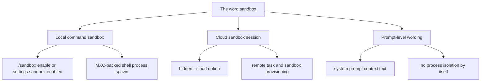
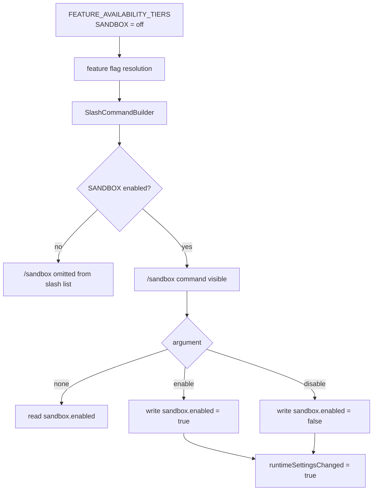
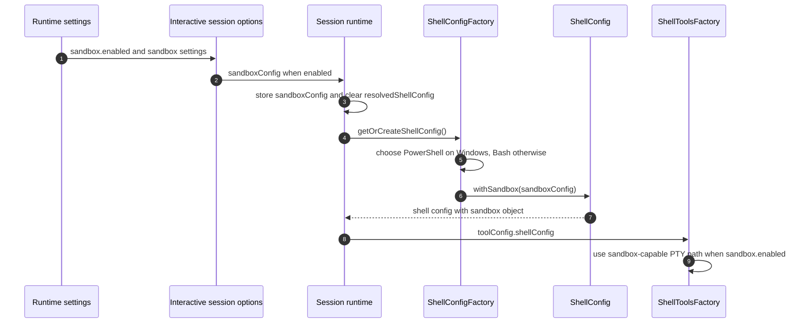
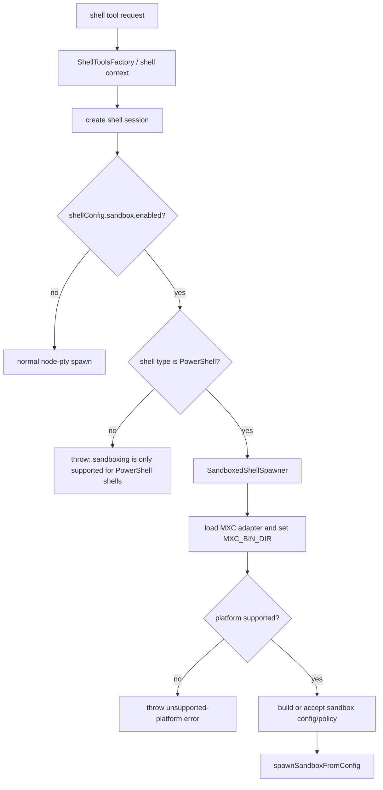
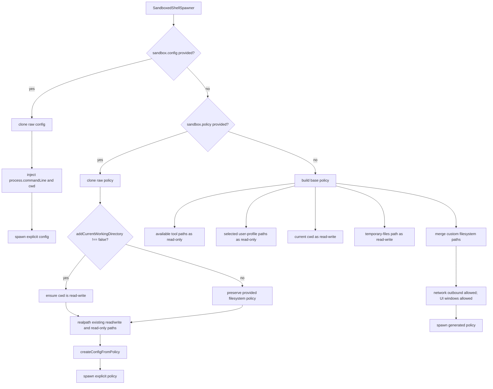
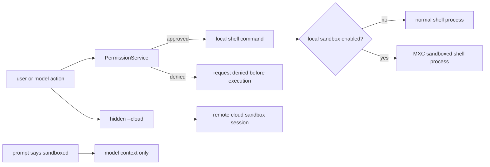

# Sandbox Implementation

This document answers a narrow reverse-engineering question: **does the extracted Copilot CLI implement sandboxing, and if so, how is it wired?**

The answer is **yes**. The bundle contains a real sandbox implementation, not just leftover prompt strings. It has settings schema support, a feature-gated `/sandbox` slash command, session and shell configuration plumbing, and a process-spawn path backed by the bundled MXC sandbox adapter and `mxc-bin` executables.

However, the implementation is easy to misread because the word “sandbox” appears in three different contexts:

1. **Local command sandboxing**: `/sandbox enable` toggles `sandbox.enabled`, which can route shell sessions through the MXC sandbox spawn path.
2. **Cloud sandbox sessions**: hidden `--cloud` creates or connects to a remote/cloud sandbox session. This is a separate session-provisioning feature.
3. **Prompt-level sandbox wording**: some system prompts say the agent is or is not in a sandboxed environment. These strings describe context for the model; they are not the enforcement layer.

The rest of this document focuses on local command sandboxing and calls out where it differs from cloud sessions, permissions, and prompt text.

## Source anchors

`app.js` is bundled and minified, so this document uses semantic aliases in prose and diagrams. Minified names are kept only in this table for searching the analyzed `@github/copilot` artifact and may shift across releases.

| Area | Semantic alias | Minified anchor | Approx. line | Role |
|---|---|---:|---:|---|
| Settings schema | `SettingsSandboxSchema` | `sandbox:Rt({ ... })` | 239 | Defines `sandbox.enabled`, filesystem path lists, raw `policy`, raw `config`, and `addCurrentWorkingDirectory`. |
| Feature gate | `SandboxFeatureGate` | `SANDBOX:"off"` | 239 | Declares the `SANDBOX` feature flag as off by default. |
| Sandbox status reader | `SandboxStatusReader` | `BBn(...)` | 1254 | Reads `settings.sandbox.enabled`, defaulting to `false`. |
| Sandbox toggle writer | `SandboxToggleWriter` | `LBn(...)` | 1254 | Writes `sandbox.enabled` while preserving other sandbox settings. |
| Slash command handler | `SandboxSlashCommand` | `jps(...)` | 1331 | Implements `/sandbox enable`, `/sandbox disable`, and current-status output. |
| Slash command metadata | `SandboxSlashMetadata` | command entry `name:"sandbox"` | 1340 | Registers `/sandbox` with hint `[enable|disable]` and description `Configure sandbox modes`. |
| Slash command gating | `SlashCommandBuilder` | `P_t(...)` | 5024 | Filters feature-gated slash commands with `sandboxEnabled`. |
| TUI slash enablement | `InteractiveSlashGate` | `sandboxEnabled:e.SANDBOX` | 7340 | Makes `/sandbox` visible only when the `SANDBOX` gate is enabled. |
| TUI session option | `InteractiveSessionOptions` | `sandboxConfig:ao.sandbox?.enabled ? ...` | 7340 | Passes sandbox settings into the session only when `sandbox.enabled` is true. |
| Session option cache | `SessionShellConfigCache` | `sandboxConfig`, `resolvedShellConfig` | 4471 | Stores sandbox config and invalidates the cached shell config when it changes. |
| Shell config factory | `ShellConfigFactory` | `djn(...)` | 4211 | Chooses default shell, applies safety/init/flags, then applies `withSandbox(...)`. |
| Shell config model | `ShellConfig` | `u0` | 5390 | Holds shell type, tool names, process flags, and the `sandbox` object. |
| Shell config clone | `ShellConfig.withSandbox` | `withSandbox(e)` | 5390 | Returns a shell config clone carrying the sandbox settings. |
| Shell tools factory | `ShellToolsFactory` | `Wjs(...)` | 5734 | Avoids the alternate non-PTY backend when sandboxing is enabled. |
| Sandboxed shell spawn | `SandboxedShellSpawner` | `_lo(...)` | 5638 | Loads MXC, checks platform support, builds policy/config, and calls sandbox spawn. |
| MXC adapter loader | `MxcSandboxAdapterLoader` | `Y7s(...)`, `K7s(...)` | 5638 | Sets `MXC_BIN_DIR` to bundled `mxc-bin` and loads the sandbox module. |
| MXC spawn wrapper | `MxcSpawnWrapper` | `SCr(...)` | 5638 | Calls `spawnSandboxFromConfig(...)` and logs success/failure. |
| Shell session creation | `InteractiveShellSession.create` | `dve.create(...)` | 5640 | Enforces PowerShell-only local sandboxing before calling `SandboxedShellSpawner`. |
| MXC platform support | `MxcPlatformSupport` | `dVs(...)` | 5637 | Reports macOS unsupported, Linux requiring LXC, and Windows AppContainer support on supported builds. |
| MXC policy conversion | `MxcPolicyToConfig` | `mlo(...)` | 5638 | Converts policy into process/AppContainer/LXC/WSLC/microVM config. |
| Packaged sandbox binaries | `SandboxBinaryInventory` | `mxc-bin` entries | manifest 72-219 | Contains `lxc-exec`, `wxc-exec.exe`, Windows sandbox daemon/guest binaries, and related assets. |
| Cloud sandbox sessions | `CloudSessionFlow` | `--cloud`, `copilot-developer-sandbox` | 4516, 6599, 8221 | Creates/provisions remote cloud sandbox sessions; separate from local `/sandbox`. |

## What exists and what does not

| Question | Finding |
|---|---|
| Is there a sandbox implementation? | Yes. There is config schema, a slash command, runtime propagation, a shell spawn guard, MXC policy/config construction, and bundled sandbox binaries. |
| Is there a normal root `--sandbox` CLI flag? | No public root `--sandbox` flag was found in captured help or root option construction. Local command sandboxing is exposed through settings and the feature-gated `/sandbox` slash command. |
| Is `/sandbox` always visible? | No. The slash command is filtered by the `SANDBOX` feature gate, which defaults to `off` in the static gate table. |
| Is local sandboxing the same as `--cloud`? | No. `--cloud` provisions a cloud sandbox session; `/sandbox` toggles local shell-command sandbox settings. |
| Does the prompt text enforce sandboxing? | No. Prompt wording can describe a sandboxed environment, but enforcement happens at shell process spawn time. |
| Does it replace the permission service? | No. Permissions decide whether a request may execute; the sandbox constrains what the spawned process can access after execution starts. |

## Terminology map

## Entry points and visibility

Local command sandboxing starts from configuration, not from a root CLI flag.

The settings schema accepts a `sandbox` object with these observed fields:

| Setting | Meaning in the traced flow |
|---|---|
| `sandbox.enabled` | Main toggle. When true, the TUI session receives `sandboxConfig`. |
| `sandbox.filesystem.readwritePaths` | Additional paths added to the generated read-write filesystem policy. |
| `sandbox.filesystem.readonlyPaths` | Additional paths added to the generated read-only filesystem policy. |
| `sandbox.filesystem.deniedPaths` | Paths passed through as denied filesystem paths. |
| `sandbox.filesystem.clearPolicyOnExit` | Controls whether the generated filesystem policy is cleaned up on exit; defaults to true in base policy construction. |
| `sandbox.policy` | Raw policy object. The runtime can convert it to an MXC config and inject the shell command. |
| `sandbox.config` | Raw MXC config object. The runtime can inject the shell command and working directory directly. |
| `sandbox.addCurrentWorkingDirectory` | If not false, the explicit-policy path ensures the current working directory is included as read-write. |

The `/sandbox` slash command is the user-facing toggle when the gate is active:

- `/sandbox` with no argument reports the current status.
- `/sandbox enable` writes `sandbox.enabled: true`.
- `/sandbox disable` writes `sandbox.enabled: false`.
- It returns `runtimeSettingsChanged: true`, signaling that runtime settings have changed.

## Runtime propagation

Once enabled in settings, sandbox configuration is carried into the session and then into the shell tool configuration.

Two details matter here:

1. `ShellConfigFactory` defaults to **PowerShell on Windows** and **Bash on non-Windows** platforms.
2. The shell tools factory only takes the alternate non-PTY spawn backend when sandboxing is not enabled. With sandboxing enabled, it stays on the interactive shell session creation path that can invoke the sandbox adapter.

For the full command lifecycle around this branch -- including PTY vs non-TTY backend selection, sync/async/detached execution, background promotion, and output buffering -- see [Shell command execution lifecycle](shell-command-execution-lifecycle.md).

## Shell execution flow

The enforcement point is shell session creation. When sandboxing is disabled, the runtime spawns a normal PTY shell. When sandboxing is enabled, it first checks the shell type.

The observed guard is explicit: **local command sandboxing is only supported for PowerShell shells in this shell runner**. Because the default non-Windows shell config is Bash, a default Linux CLI session with `sandbox.enabled` would not start a sandboxed Bash shell; it would hit the PowerShell-only error path.

This caveat should be read carefully. The bundled MXC library contains Linux/LXC support, but the CLI shell-session branch traced here requires PowerShell before calling the sandbox adapter.

## MXC adapter and platform support

The CLI embeds and loads an MXC sandbox package. Before spawning, it sets `MXC_BIN_DIR` to the package-local `mxc-bin` directory if that directory exists. The extraction manifest confirms the package includes sandbox-related binaries, including:

| Asset family | Examples from extraction manifest |
|---|---|
| Linux LXC executor | `copilot-cli-pkg/mxc-bin/arm64/lxc-exec`, `copilot-cli-pkg/mxc-bin/x64/lxc-exec` |
| Windows executor | `copilot-cli-pkg/mxc-bin/arm64/wxc-exec.exe`, `copilot-cli-pkg/mxc-bin/x64/wxc-exec.exe` |
| Windows sandbox helpers | `wxc-windows-sandbox-daemon.exe`, `wxc-windows-sandbox-guest.exe` for arm64 and x64 |
| WSL-related assets | `wslcsdk.dll` for arm64 and x64 |

The platform support helper reports:

- macOS: unsupported;
- Linux: supported only if LXC is available, with `lxc` as the available method;
- Windows: supported on suitable Windows builds, with `appcontainer` as the available method.

The policy-to-config converter can create different containment configs, including the default process containment, Linux LXC, Windows AppContainer, WSL container, and an explicit microVM path. The microVM path is Windows-only and has additional constraints.

For the normal local shell path on Windows, the default shell is PowerShell, so the PowerShell-only guard can pass and the default process containment path maps to Windows AppContainer behavior.

For binary-level evidence about the packaged MXC helpers, compiler fingerprints, Linux `lxc-exec` behavior, Windows helper roles, and WSLC/Windows Sandbox strings, see [MXC binary reverse-engineering notes](mxc-bin-reverse-engineering.md).

## Policy construction

The sandboxed shell spawner has three configuration modes.

### Explicit raw config

When `sandbox.config` is present, the runtime clones it and injects the command line for the shell process. If the config lacks `process.cwd`, it fills in the current working directory. It then calls the MXC spawn function directly.

This mode gives the caller the most control because the config is already in MXC's lower-level shape.

### Explicit raw policy

When `sandbox.policy` is present, the runtime clones it, optionally ensures the current working directory is read-write, normalizes existing filesystem paths through realpath where possible, converts the policy into an MXC config, injects the command line, and spawns.

If the policy has no filesystem section and `addCurrentWorkingDirectory` is not false, the runtime creates a filesystem section with the cwd as a read-write path.

### Generated base policy

When neither raw config nor raw policy is present, the runtime builds a base policy:

| Policy field | Observed behavior |
|---|---|
| `version` | Uses policy version `0.5.0-alpha`. |
| `network.allowOutbound` | Set to true in the generated base policy. |
| `ui.allowWindows` | Set to true in the generated base policy. |
| `filesystem.readonlyPaths` | Existing paths from available tools, user-profile policy, and custom `readonlyPaths`. |
| `filesystem.readwritePaths` | Existing paths from current cwd, temp-file policy, and custom `readwritePaths`. |
| `filesystem.deniedPaths` | Custom `deniedPaths`, if any. |
| `filesystem.clearPolicyOnExit` | Custom value, defaulting to true. |

Path normalization filters to existing directories and realpaths them when possible. That makes the policy less dependent on symlinks and non-existent paths.

## Local sandbox, cloud sandbox, and permissions

These layers answer different questions:

| Layer | Question it answers |
|---|---|
| Permission service | May this requested tool/path/URL/shell operation be attempted? |
| Local command sandbox | If a shell process runs, what filesystem/process/network/UI access does the spawned process get? |
| Cloud sandbox session | Should the whole session run against remote sandbox-backed compute rather than only the local workspace? |
| Prompt wording | What environment assumptions should the model follow? |

The layers are complementary. Enabling a sandbox does not automatically approve shell commands, and approving a shell command does not imply the spawned process is sandboxed.

## Platform and exposure caveats

- The `SANDBOX` gate defaults to `off`, so `/sandbox` is not part of the default slash-command list unless enabled through feature-flag mechanisms.
- A public root `--sandbox` flag was not observed in captured help or root option construction.
- Local command sandboxing is enforced through the shell spawn path, not through file tools or the permission service directly.
- The traced shell runner requires PowerShell for local sandboxed shell sessions.
- On Linux, the default CLI shell config is Bash. Therefore, a default Linux local session with `sandbox.enabled` would hit the PowerShell-only guard before reaching the MXC adapter.
- The embedded MXC platform-support code has Linux/LXC logic, but that does not override the CLI shell runner's PowerShell guard.
- `--cloud` is a separate, hidden cloud-session feature controlled by cloud-session logic and the `CLI_CLOUD_SESSIONS` gate, not by `/sandbox`.
- The generated base local sandbox policy allows outbound network and UI windows; it is not a no-network/no-UI sandbox by default.

## Takeaways

The extracted CLI has a real sandbox implementation, but it is not a broad, always-on OS isolation layer.

In this bundle, local command sandboxing is best understood as:

1. **feature-gated UI** through `/sandbox`;
2. **settings-backed state** through `sandbox.enabled` and related filesystem/policy/config fields;
3. **session-shell plumbing** through `sandboxConfig` and `ShellConfig.withSandbox(...)`;
4. **PowerShell-gated shell spawning** through the interactive shell session creator;
5. **MXC-backed enforcement** through generated or explicit sandbox policies.

For nearby systems, see [`permission-system-design.md`](permission-system-design.md) for approval semantics, [`sessions-remote-cloud.md`](../04-sessions-persistence-remote/sessions-remote-cloud.md) for cloud sandbox sessions, [`feature-gates.md`](../05-hosted-agent-ops/feature-gates.md) for gate resolution, [`tui-and-slash-commands.md`](../01-runtime-lifecycle/tui-and-slash-commands.md) for slash-command hosting, [`prompt-sources.md`](../02-context-model-loop/prompt-sources.md) for prompt wording, and [Main feature map](../00-start-here/main-feature-map.md) for the broader feature map.