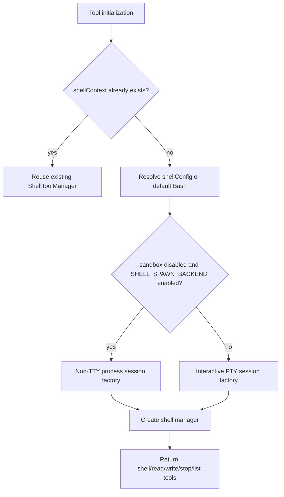
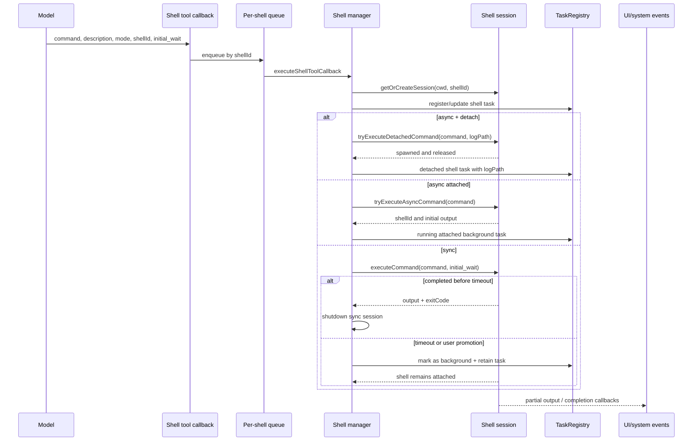
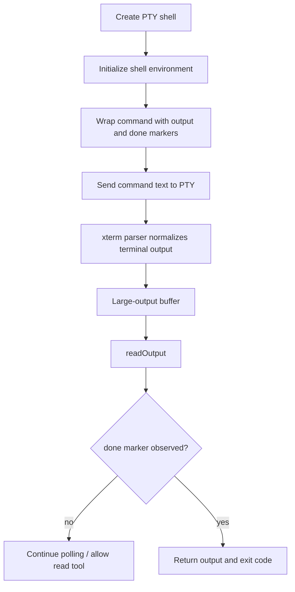
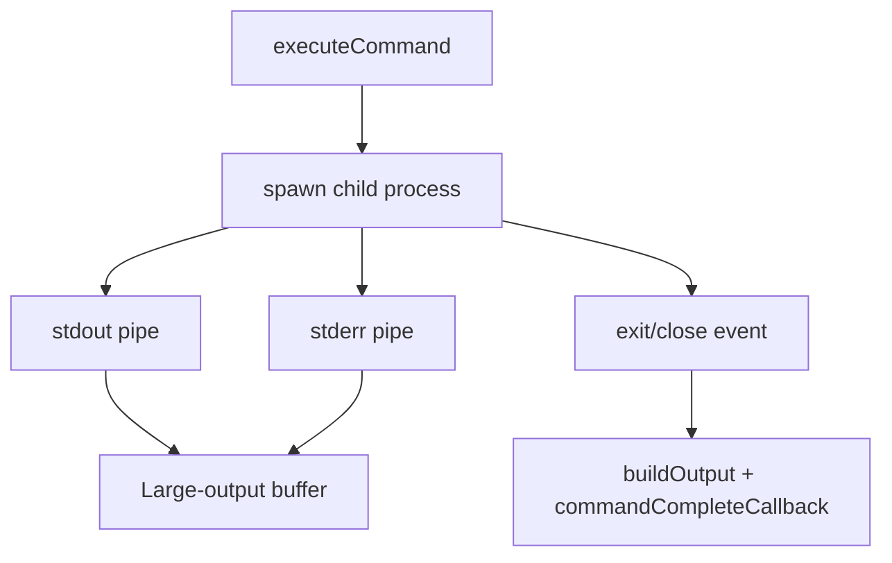
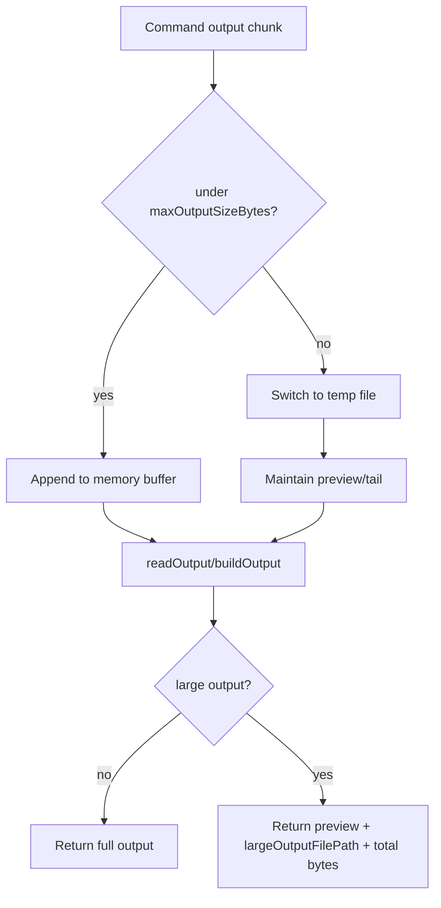

# Shell command execution events

## What this page covers

Use this page to answer **what happens inside the shell tool after the generic tool pipeline selects `bash` or `powershell`?** It owns process/session behavior: PTY vs process backend, sync/async/detach modes, background task tracking, large output buffering, input forwarding, completion notifications, and shutdown.

Read [Built-in tools, execution events, and results](built-in-tools-execution-events.md) for the generic tool lifecycle before the shell callback. Read [Sandbox implementation](sandboxing.md) for MXC policy enforcement. Read [Terminal setup and shell environment](../01-runtime-lifecycle/terminal-setup-and-shell-environment.md) for keyboard/multiline setup, which is intentionally separate from command execution.

The important implementation point is that **terminal setup, shell tool registration, and shell process execution are three different layers**. `/terminal-setup` only configures multiline keyboard input in the user's terminal. The command tools are created later from session tool configuration and run through a `ShellToolManager`-style object that owns shell sessions and task state.

| Shell layer | Owned here? | Notes |
|---|---:|---|
| Terminal keybinding setup | no | Runtime lifecycle concern; affects human input only. |
| Shell tool registration | partly | Tool names are assembled in runtime tool assembly; shell manager provides the suite. |
| Process execution | yes | PTY/process backend, queues, task state, output buffering, and cancellation. |
| Sandbox policy | adjacent | Shell execution calls into sandbox adapters when enabled; detailed policy lives in `sandboxing.md`. |

Because `app.js` is bundled/minified, symbol names are unstable. Line references below are searchable anchors in this extracted build and will shift across releases.

## Source anchors

| Semantic alias | Minified anchor | Approx. `app.js` line | Role |
|---|---|---:|---|
| Shell config | `u0` / `ShellConfig` | 5390 | Defines Bash and PowerShell tool names, descriptions, safety assessor, sandbox config, init profile, and process flags. |
| Large output buffer | `BW` | 555 | Keeps command output in memory until a threshold, then spills to a session temp file with a preview. |
| Large-output message formatter | `kMe(...)`, `Nlo(...)` | 563, 5662 | Formats "Output too large" messages and points the model to the saved output file. |
| Interactive PTY session | `dve` / `InteractiveShellSession` | 5640 | Long-lived TTY-backed shell with xterm parsing, command markers, input writing, output reading, and shutdown. |
| Shell manager | `mCt` / shell context manager | 5666 | Creates shell/read/write/stop/list tools and tracks shell sessions, task metadata, detached sessions, queues, and promotion state. |
| Command schemas | `vCr`, `Rlo`, `ICr`, `Plo` | 5666 | Shell command, write-input, read-output, and stop/list input schemas. |
| Command execution callback | `executeShellToolCallback(...)` | 5676 | Dispatches sync/async/detached execution, registers tasks, sets partial-output callbacks, and handles timeout/background transitions. |
| Background promotion | `promotableSyncShells`, `syncShellPromotionResolvers` | 5682-5683 | Allows a running sync command to be promoted to background from the UI/session task layer. |
| Non-TTY process session | `hCt` / process shell session | 5685 | Feature-gated backend that spawns one child process per command and does not support terminal input. |
| Shell tool assembly | `Wjs(...)` | 5734 | Chooses PTY vs non-TTY backend and returns the shell, read, write, stop, and list tool definitions. |
| Session task projection | `getBackgroundTasks`, `promoteTaskToBackground` | 4471 | Merges shell tasks with agent tasks for UI/background-task APIs. |

## Runtime assembly

Shell tools are assembled lazily from the session tool configuration. The assembly path around `Wjs(...)` checks whether `toolConfig.shellContext` already exists. If not, it builds one and stores it back on the config so later tool initialization shares the same shell context.

Backend selection has two notable consequences:

| Backend | Capability flags | Consequence |
|---|---|---|
| Interactive PTY (`dve`) | `ttySupport: true`, `terminalInput: true` | Exposes the write-input tool, can keep shell state across async commands, and supports interactive programs. |
| Process spawn (`hCt`) | `ttySupport: false`, `terminalInput: false` | Runs each command in a fresh child process, omits the write-input tool, and warns that shell state does not persist. |

The non-TTY backend is only selected when sandboxing is disabled and the `SHELL_SPAWN_BACKEND` feature flag is enabled. When sandboxing is enabled, the shell path stays on the PTY/session factory because the sandbox adapter lives on that branch.

## Tool suite

The shell manager generates a small family of tools from the active `ShellConfig`.

| Shell type | Execute | Read | Write | Stop | List |
|---|---|---|---|---|---|
| Bash | `bash` | `read_bash` | `write_bash` | `stop_bash` | `list_bash` |
| PowerShell | `powershell` | `read_powershell` | `write_powershell` | `stop_powershell` | `list_powershell` |

`write_*` is only emitted when the backend advertises `terminalInput: true`. `read_*`, `stop_*`, and `list_*` are emitted for both backends.

The execute tool schema includes:

| Field | Meaning |
|---|---|
| `command` | Shell command text. |
| `description` | Short human-readable summary used for task lists and notifications. |
| `shellId` | Optional identifier for an async session. Reusing a shell ID reuses the session when the backend supports it. |
| `mode` | `sync` by default, or `async` for background execution. |
| `detach` | Optional async-only path that starts a fully detached process and logs output to a file. |
| `initial_wait` | Sync wait budget in seconds before a still-running command is moved to background. |

## Main execution flow

The shell manager serializes work per `shellId` with an execution queue. This prevents two commands from being injected into the same shell at the same time.

The task state stored by the manager includes the command text, description, execution mode, started/completed timestamps, PID, status, notification preference, and whether the task should remain visible after completion.

## Sync, async, promotion, and detach

The shell tool has four materially different behaviors.

| Mode | Attachment | Session behavior | Task behavior |
|---|---|---|---|
| `sync` completes before `initial_wait` | Attached | Runs command, reads final output, then shuts down sync session. | Usually removed from active shell tasks after completion. |
| `sync` exceeds `initial_wait` | Attached | Leaves command running in the session. | Converts to background shell task and may notify on completion. |
| `sync` promoted by user | Attached | Resolver returns early with a model-hidden "moved to background" message. | Marks the same task as background and retained. |
| `async` | Attached | Starts command and returns a `shellId`; session remains available for `read_*`, `write_*`, and `stop_*`. | Registered as running background shell task. |
| `async` + `detach` | Detached | Starts an independent OS process, writes PID/log files, then releases session resources. | Registered as detached task with `logPath`; progress is read from the log file. |

The promotion path is implemented with `promotableSyncShells` and `syncShellPromotionResolvers`. The session-level background-task APIs consult shell promotion first-class alongside agent task promotion, which is why a timed-out or promoted command can appear in the same UI surface as a background subagent.

## Interactive PTY backend

The PTY-backed session keeps a real shell process alive and wraps each command with markers.

Observed implementation details:

- The session uses an xterm `Terminal` object with zero scrollback to parse terminal data and respond to terminal control queries.
- Raw ANSI sequences are stripped/normalized before appending model-visible output.
- Commands are wrapped with a printed-output marker and a `___BEGIN___COMMAND_DONE_MARKER___<exitCode>` completion marker.
- The output buffer ignores shell preamble before the printed-output marker and ignores content after the done marker.
- PowerShell receives a small initialization profile that simplifies the prompt and sets UTF-8 output defaults.
- Bash initialization clears prompts and history state; in non-interactive profile mode it can source `BASH_ENV` before clearing prompt variables.
- `write_*` uses `trySendInput(...)` and converts text or key notation into terminal input, then `read_*` retrieves the resulting output.
- On Windows shutdown, a running PTY command triggers a process-tree kill through `taskkill.exe`; otherwise the PTY process is killed directly.

The PTY backend is the only path that can support interactive command-line programs because it owns a TTY and can send input after the command starts.

## Non-TTY process backend

The process backend is a separate session implementation. It spawns a new child process for each command instead of injecting commands into a long-lived TTY.

Key differences from the PTY backend:

- `trySendInput(...)` always returns false, so no write-input tool is exposed.
- Bash commands are run as `bash --norc --noprofile -c <command>` using the shell config process flags.
- PowerShell commands are run with `-NonInteractive -Command` and wrapper logic that maps `$?`/`$LASTEXITCODE` to the process exit code.
- stdout and stderr are appended into the same output buffer.
- Partial-output callbacks are throttled to roughly 100 ms.
- On Unix shutdown, the runtime sends `SIGTERM` to the process group and follows with `SIGKILL` after 5 seconds.

This backend is useful for simpler, isolated command execution. It is less suitable for commands that require shell state, REPL input, TTY control, or follow-up interaction.

## Large output handling

Both shell backends use the same `BW` output buffer. The buffer starts in memory and switches to a temp file when output exceeds the configured threshold.

The formatter reports that output was saved and suggests using grep/read tools against the saved file. For detached commands, the primary long-running output location is the detached log file (`copilot-detached-<shellId>-<timestamp>.log`) plus a sibling `.pid` file.

## Read, write, stop, and list tools

The supporting shell tools are thin adapters over manager/session state.

| Tool | Main behavior |
|---|---|
| `read_*` | Waits for `delay`, reads output from an attached session, or reads detached progress from the log path. Invalid delay values are rejected. |
| `write_*` | Sends input to a running attached PTY session, then reads output after a delay. Not available for non-TTY backend. |
| `stop_*` | Stops an attached session by shutting down the shell, or cancels a detached task by using its registered PID/log metadata. |
| `list_*` | Lists active shell sessions/tasks with shell ID, command, mode, PID, status, attachment mode, and unread-output hints. |

The manager tracks three overlapping views:

| State map/set | Meaning |
|---|---|
| `sessions` | Live shell session objects keyed by shell ID. |
| `currentExecutions` | Commands currently running or recently completed in attached sessions. |
| `detachedSessions` | Shell IDs whose command was detached and no longer has an attached session. |
| `retainedAttachedShellTasks` | Completed attached tasks that remain visible because they were async, timed out, or promoted. |
| `recentShutdowns` | Short-lived diagnostics for explaining later read/stop attempts against a missing shell ID. |

## Completion notifications

When background-task notifications are enabled, the manager wires a command-completion callback into each session. Completion updates the tracked task and can trigger a model-visible system notification such as `shell_completed` or `shell_detached_completed` through the broader session event/UI projection path.

The important nuance is that notifications are tied to task state, not to polling. A background command can finish without the model repeatedly calling `read_*`; the next turn can include a system notification telling the model that output is ready.

## Error classification

The manager does more than return "shell not found." For read/stop/list operations it classifies missing or stopped shells using recent shutdown information.

Examples of categories include:

- unknown shell ID;
- shell was recently shut down after completion;
- shell was shut down because of an error or cancellation;
- detached task has log/PID state instead of a live attached session.

The classification result becomes both a model-visible error message and telemetry fields such as `shell_error_category`, `shell_operation`, and a restricted diagnostic summary.

## Relationship to other docs

- [`built-in-tools-execution-events.md`](built-in-tools-execution-events.md) explains the generic tool lifecycle surrounding shell callbacks.
- [`terminal-setup-and-shell-environment.md`](../01-runtime-lifecycle/terminal-setup-and-shell-environment.md) explains terminal keybinding setup and why it is separate from command execution.
- [`sandboxing.md`](sandboxing.md) explains how the PTY shell creation path can enter MXC sandbox spawning.
- [`system-events-and-ui-projection.md`](../04-sessions-persistence-remote/system-events-and-ui-projection.md) explains shell completion system events.
- [`agent-task-orchestration.md`](../06-agents-automation/agent-task-orchestration.md) explains how shell tasks are projected next to background agent tasks.