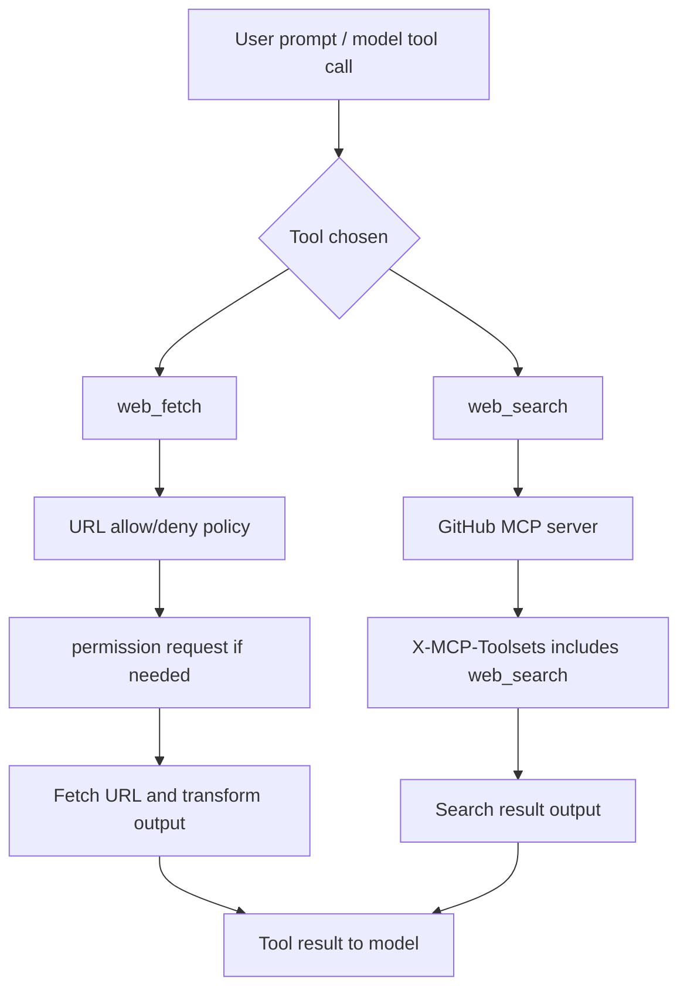
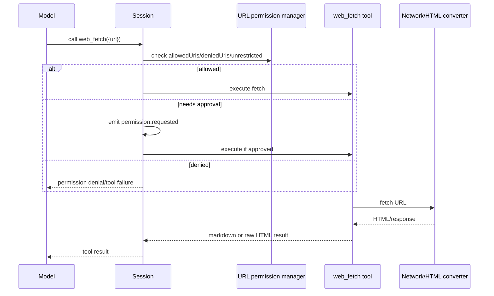

# Web search, URL fetching, and URL permissions

## MVP placement

> **Why this page is here:** This page belongs to [Tools, integrations, and security](README.md). It documents an action boundary: how tools, MCP/plugins/SDK/IDE/web bridges, policies, approvals, redaction, hooks, or sandboxing become safe runtime behavior. Pair it with [Context and model loop](../02-context-model-loop/README.md) for what the model sees and [Sessions, persistence, and remote](../04-sessions-persistence-remote/README.md) for how events/results persist.

This document explains how web search, URL fetching, and URL permissions are wired in the extracted Copilot CLI bundle. In the analyzed `app.js`, web access is split across a built-in `web_fetch` tool, a GitHub MCP web-search compatibility shim, URL allow/deny settings, permission requests, CLI flags, and feature gates.

The important implementation point is that “web” capability is not one tool:

- `web_fetch` retrieves a specific URL and converts HTML to markdown/raw output.
- `web_search` is exposed through the built-in GitHub MCP server by renaming `github-mcp-server-web_search` when appropriate.
- URL permission policy decides whether the runtime can access a URL without prompting.
- CLI flags and persisted settings can allow/deny URL patterns or allow all URLs.

Because `app.js` is bundled/minified, symbol names are unstable. Line references below are searchable anchors in the extracted bundle and will shift across releases.

## Source anchors

| Semantic alias | Minified anchor | Approx. `app.js` line | Role |
|---|---|---:|---|
| Built-in fetch tool | `web_fetch`, `Fetching web content`, `raw`, `start_index` | 1144 | Tool fetches a URL and returns markdown or raw HTML with pagination. |
| GitHub MCP web search shim | `github-mcp-server-web_search`, `web_search`, `Bgr(...)` | 4149 | GitHub MCP web search can be renamed/exposed as `web_search`. |
| Tool categories | `web_fetch`, `web_search`, `fetch`, `search` | 6103 | Web tools map to fetch/search categories for permissions/tool grouping. |
| URL permission request mapping | `case "url": toolName:"web_fetch"` | 4211 | URL permission prompts are represented as `web_fetch` tool requests. |
| URL allow/deny settings | `allowedUrls`, `deniedUrls`, `Dy`, `pZe` | 239, 555 | Persistent URL allow/deny lists and unrestricted mode. |
| CLI URL flags | `--allow-url`, `--deny-url`, `--allow-all-urls`, `--allow-all`, `--yolo` | 8090-8130, 8221 | User-visible URL permission flags and help text. |
| Feature gate | `DISABLE_WEB_TOOLS` | 239 | Static feature gate can disable web tools. |
| Built-in GitHub MCP toolsets | `X-MCP-Toolsets`, `web_search`, `X-MCP-Tools` | 2789, 4207, 4288 | Built-in GitHub MCP requests can include web search/toolset headers. |
| Tool allowlist parsing | `webfetch`, `web_fetch`, `websearch`, `web_search` | 3194 | Tool names are recognized in allowed-tools parsing. |
| Research guardrails | `web_fetch`, `web_search` forbidden in some research agent prompts | 1359 | Some agents delegate web access instead of using direct tools. |

## Capability map



## Built-in `web_fetch`

The built-in `web_fetch` tool is defined around line `1144`. Its description says it:

- fetches a URL from the internet;
- returns the page as markdown or raw HTML;
- safely retrieves up-to-date information from HTML pages.

The input schema includes:

| Field | Meaning |
|---|---|
| `url` | URL to fetch. |
| `start_index` | Pagination offset for continuing truncated content. |
| `raw` | If true, return raw HTML; otherwise convert to simplified markdown. |

This tool is URL-specific. It does not perform general search by itself.

## `web_search` through GitHub MCP

The bundle defines two names:

| Name | Meaning |
|---|---|
| `github-mcp-server-web_search` | Tool as provided by the built-in GitHub MCP server. |
| `web_search` | CLI-friendly exposed alias. |

The shim function around line `4149` looks for the GitHub MCP `web_search` tool, removes it from the tool list, renames it to `web_search`, marks it safe for telemetry, and pushes it back unless a tool config says `webSearch === true`.

This means web search is implemented as a GitHub MCP capability exposed as a normal Copilot tool name, not as a completely separate search backend in this bundle.

## Built-in GitHub MCP toolsets

The built-in GitHub MCP configuration uses headers such as:

| Header | Purpose |
|---|---|
| `X-MCP-Toolsets` | Select enabled GitHub MCP toolsets, including `web_search`. |
| `X-MCP-Tools` | Select individual GitHub MCP tools when not enabling all. |
| `X-MCP-Host` | Identifies caller/host such as `copilot-cli` or coding agent. |
| `X-MCP-Readonly` | Indicates read-only mode for selected permissions. |

One path includes toolsets such as repositories, issues, users, pull requests, discussions, code security, secret protection, actions, and `web_search`. Environment variables can add other toolsets such as Copilot Spaces.

## URL permission model

URL permissions use persisted settings and runtime flags.

The settings schema includes:

| Key | Meaning |
|---|---|
| `allowedUrls` | URL/domain patterns that can be accessed without prompting. |
| `deniedUrls` | URL/domain patterns explicitly denied. |

The URL manager (`Dy` in the minified bundle) stores normalized allowed URLs and supports `unrestrictedMode` for allow-all behavior. The helper class (`pZe`) persists allow/deny entries with `writeKey`.

Deny rules are documented as taking precedence over allow rules.

## URL normalization

The URL manager normalizes URLs/domains before storing them:

- domains are lowercased;
- default ports are normalized away;
- optional path inclusion can preserve path-level rules;
- domains without protocol default to HTTPS according to CLI help;
- protocols are significant.

The help text explicitly states:

> approving `https://example.com` does NOT allow `http://example.com`.

This is important because some tools or links may downgrade/upgrade protocol differently.

## CLI flags

The root CLI exposes URL permission flags:

| Flag | Meaning |
|---|---|
| `--allow-url [urls...]` | Allow access to specific URLs or domains. |
| `--deny-url [urls...]` | Deny access to specific URLs or domains; takes precedence over allow. |
| `--allow-all-urls` | Allow all URLs without confirmation. |
| `--allow-all` | Enable all tools, all paths, and all URLs. |
| `--yolo` | Alias for `--allow-all`. |

These runtime flags can avoid interactive prompts in scripts or trusted automation, while persisted settings can retain repeated allow/deny decisions.

## Permission prompt projection

URL permission requests are projected as tool-like requests. In the permission-to-tool mapping around line `4211`, a URL request becomes:

```text
toolName: "web_fetch"
toolInput: { url }
```

This allows permission UI and telemetry to present URL access in the same framework as other tool calls. Even when the underlying operation is a URL policy decision, the user sees it as access for a web-fetch style tool.

## Tool grouping

The tool-category mapper around line `6103` groups:

| Tool name | Category |
|---|---|
| `web_search` | `search` |
| `github-mcp-server-web_search` | `search` |
| `web_fetch` | `fetch` |
| `fetch_copilot_cli_documentation` | `fetch` |

This grouping matters for allow-tool rules, prompt instructions, and tool filtering. It also explains why web search and web fetch appear in different policy buckets even though both use network access.

## Feature gate

The static feature table includes `DISABLE_WEB_TOOLS` with default value `off`. That indicates the bundle has a gate capable of disabling web tools, even though the default extracted configuration does not disable them.

This gate is separate from URL permission prompts. A disabled web-tools gate removes capability; URL permissions decide whether an enabled capability may access a particular URL without user approval.

## Fetch/browser transport stack

The bundle includes a large amount of fetch/browser infrastructure from bundled dependencies: Undici-style `fetch`, request/response classes, headers, WebSocket/EventSource pieces, DOM/browser-like classes, and HTML parsing/markdown conversion support.

Most of those strings are dependency/runtime support, not Copilot-specific policy. The Copilot-specific pieces are the `web_fetch` tool definition, URL permission mapping, and GitHub MCP web-search shim.

## Research-agent restrictions

Some embedded research/agent instructions explicitly forbid direct use of `web_fetch`, `web_search`, and GitHub MCP tools and instead require delegation to subagents. This does not mean the CLI lacks those tools; it means certain agent modes constrain tool use for workflow reasons.

This is a good example of the difference between:

- tool existence in the runtime;
- model-visible tool availability in a particular agent/mode;
- policy/prompt restrictions for that workflow.

## End-to-end fetch flow



## Relationship to other docs

- `permission-system-design.md` explains URL allow/deny precedence and permission prompts.
- `mcp-support-implementation.md` explains the built-in GitHub MCP server and tool exposure.
- `built-in-tool-execution-pipeline.md` explains how `web_fetch` and `web_search` become normal tool calls.
- `settings-config-persistence.md` explains persisted `allowedUrls` and `deniedUrls` settings.
- `agent-task-orchestration.md` explains research workflows that may delegate web access to subagents.
