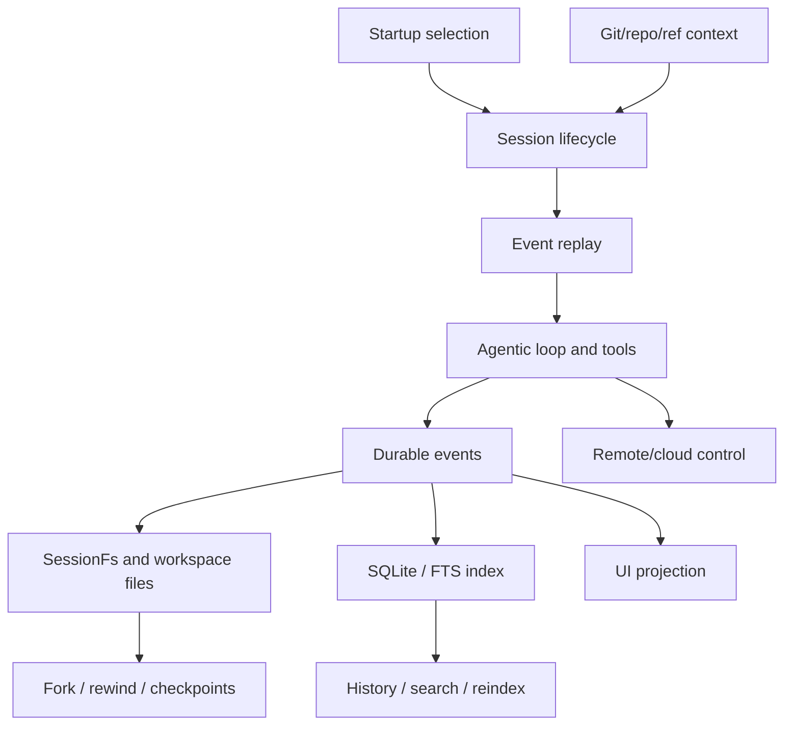

# Sessions, persistence, and remote

This chapter treats sessions as the durable spine of the runtime. A session is not just a chat transcript: it is an event-sourced state machine with replay, workspace sidecars, file-system abstractions, SQLite/FTS indexes, UI projections, repository/ref metadata, and local/remote handoff behavior.

Read this chapter when the question is: **where did the agent's state come from, where was it saved, and how can it be resumed, forked, searched, or controlled remotely?**

## Source-anchor policy

This page is a chapter guide. Linked implementation pages carry concrete `app.js` anchors.

| Semantic alias | Minified anchor | Scope |
|---|---|---|
| Sessions/persistence/remote chapter | N/A — navigation page | Groups event-sourced sessions, replay, SessionFs, SQLite indexing, schemas, UI projection, git context, cloud sessions, and remote control. |
| Session implementation pages | See linked source-anchor tables | Concrete bundle anchors live in the destination pages. |

## Session spine

## Primary reading order

| Order | Page | Session question answered |
|---:|---|---|
| 1 | [End-to-end session lifecycle](session-lifecycle-end-to-end.md) | How do create/resume/continue, replay, workspace state, tool refresh, UI projection, indexing, remote export, and shutdown connect? |
| 2 | [Session support implementation](session-support-implementation.md) | How does event-sourced local persistence, workspace artifact management, startup resolution, APIs, and handoff behavior work? |
| 3 | [Persistence pipeline for sessions](persistence-pipeline.md) | How do JSONL events, SessionFs, workspace sidecars, SQLite/FTS, search/reindex, fork, rewind, checkpoints, and cloud sync fit together? |
| 4 | [SessionFs provider and state-file lifecycle](session-fs-provider-and-state-files.md) | How do local and SDK/RPC-backed filesystems handle state files, reverse calls, large output temp files, and fork-time copying? |
| 5 | [Session, remote, cloud, and history workflows](sessions-remote-cloud.md) | How do resume/continue/name handling, background sessions, cloud sessions, remote steering, and history interact? |
| 6 | [Remote control implementation](remote-control-implementation.md) | How do Mission Control export, command polling, `/remote`, permission bridging, and remote task attach work? |

## Supporting session topics

| Topic | Page | Why it matters |
|---|---|---|
| Schema contracts | [API and session event schema contracts](api-and-session-event-schemas.md) | Connects JSON-RPC/session schemas to runtime forwarding and replay behavior. |
| Search/indexing | [Session-store SQLite indexing](session-store-sqlite-indexing.md) | Documents session-store DB schema, FTS, refs, Chronicle, sync, and backfill. |
| UI projection | [System events and UI projection](system-events-and-ui-projection.md) | Explains system messages, notifications, timeline entries, and ephemeral UI state. |
| Repository metadata | [Git, repository, PR, and ref context](git-repository-context.md) | Shows Git root/branch/head/base detection, PR context, session refs, and GitHub MCP overlap. |

## Handoffs

- Session startup is selected by [Runtime lifecycle](../01-runtime-lifecycle/README.md).
- Model turns and compaction decisions are explained by [Context and model loop](../02-context-model-loop/README.md).
- Tool calls and permission decisions are explained by [Tools, integrations, and security](../03-tools-integrations-security/README.md).
- Hosted job environment and operational callbacks are explained by [Hosted agent ops](../05-hosted-agent-ops/README.md).

## Navigation

- [Start here](../00-start-here/README.md)
- [Full table of contents](../SUMMARY.md)
