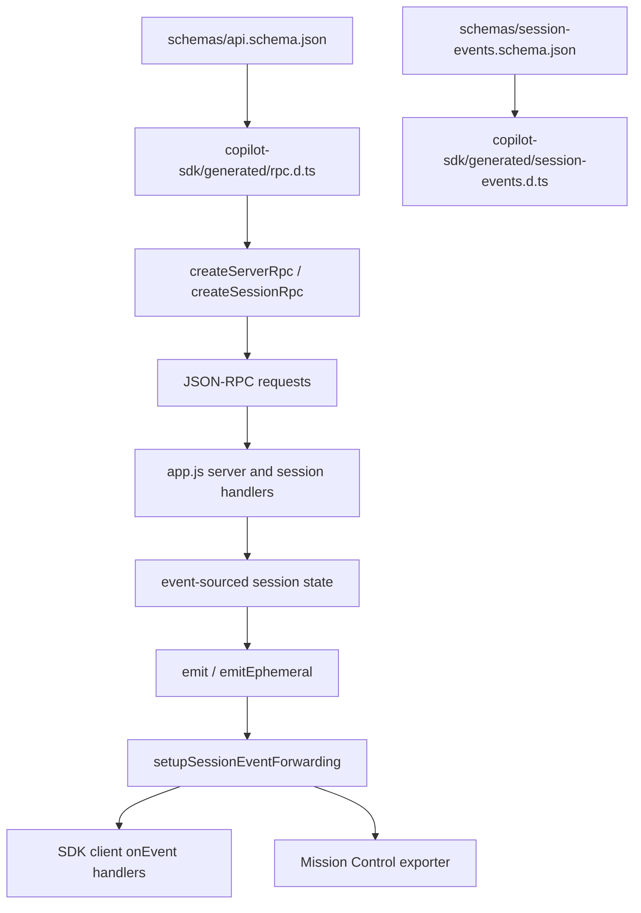
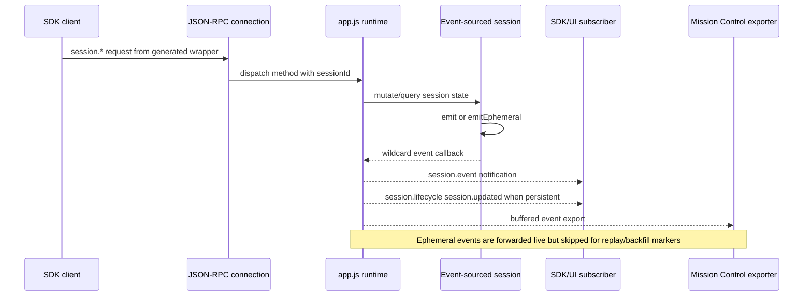

# API and session event schema contracts

The `copilot-cli-pkg/schemas/` directory is worth documenting as its own contract surface. It is not just descriptive metadata: the package ships these schema files, the SDK generated types point back to them, and `app.js` implements the runtime behavior that those contracts describe.

This page cross-checks the two schema files against the bundled runtime and the generated SDK artifacts.

## Source anchors

`app.js` is bundled/minified, so semantic aliases below describe runtime roles. Minified anchors are searchable strings or generated symbols for this analyzed artifact.

| Semantic alias | Minified anchor | Location | Role |
|---|---|---|---|
| API schema contract | `api.schema.json` | `copilot-cli-pkg/schemas/` | JSON-RPC method catalog consumed by SDK code generation. |
| Session event schema contract | `session-events.schema.json` | `copilot-cli-pkg/schemas/` | Discriminated union for persisted/forwarded session event objects. |
| Generated RPC client surface | `createServerRpc`, `createSessionRpc`, `registerClientSessionApiHandlers` | `copilot-sdk/generated/rpc.d.ts`, `copilot-sdk/index.js` | Typed request wrappers and client-session handler registration generated from `api.schema.json`. |
| Generated event surface | `SessionEvent`, `SessionEventType`, `SessionEventPayload` | `copilot-sdk/generated/session-events.d.ts`, `copilot-sdk/types.d.ts` | Typed event union generated from `session-events.schema.json`. |
| Session event notification | `SESSION_EVENT:"session.event"`, `Tee.SESSION_EVENT` | `app.js` 6063, 6100 | JSON-RPC notification carrying schema-shaped events to clients. |
| Runtime event envelope | `emitInternal`, `emitEphemeral` | `app.js` 4471 | Builds `id`, `timestamp`, `parentId`, optional `ephemeral`, and optional `agentId`. |
| Event forwarder/replay | `setupSessionEventForwarding` | `app.js` 6100 | Routes live events, replays non-ephemeral history, and emits lifecycle updates. |

## Source files and generated surfaces

| Source | Contract role | Cross-check anchor |
|---|---|---|
| `copilot-cli-pkg/schemas/api.schema.json` | JSON-RPC method catalog for server-scoped, session-scoped, and client-session APIs. | `copilot-cli-pkg/copilot-sdk/generated/rpc.d.ts` is marked `Generated from: api.schema.json`; `copilot-cli-pkg/copilot-sdk/index.js` contains the generated `createServerRpc`, `createSessionRpc`, and `registerClientSessionApiHandlers` implementations. |
| `copilot-cli-pkg/schemas/session-events.schema.json` | Discriminated union for session event objects emitted, persisted, replayed, and forwarded to clients. | `copilot-cli-pkg/copilot-sdk/generated/session-events.d.ts` is marked `Generated from: session-events.schema.json`; `copilot-cli-pkg/copilot-sdk/types.d.ts` re-exports `SessionEvent`. |
| `copilot-cli-pkg/package.json` | Packaging boundary. | The `files` list includes `schemas/**/*`, so the schemas are shipped with the package. |
| `copilot-cli-pkg/app.js` | Runtime implementation for event emission, JSON-RPC notifications, shell notifications, session replay, and remote export. | Search anchors: `SESSION_EVENT:"session.event"`, `emitInternal`, `setupSessionEventForwarding`, `setShellNotifier`, and `RemoteSessionExporter`. |

## Contract flow

## `api.schema.json`

`api.schema.json` describes **86 JSON-RPC methods** across three owner groups:

| Group | Count | Direction | Main responsibility |
|---|---:|---|---|
| `server` | 16 | Client → CLI server | Process/session-independent calls such as handshake, model/tool listing, MCP/skill discovery/config, `sessionFs.setProvider`, and session fork. |
| `session` | 60 | Client → active session | Calls that require `sessionId`, such as model/mode/name/plan/workspace APIs, skills/MCP/extensions, tool and command responses, UI elicitation, permissions, shell execution, history, usage, and remote toggles. |
| `clientSession` | 10 | CLI server → SDK client | Delegated `sessionFs.*` calls implemented by the client-provided session filesystem provider. |

The schema marks **32 methods as `experimental`** and one method, `connect`, as `internal`. Those flags are preserved in the generated TypeScript declarations as comments such as `@experimental` and `@internal`. The `sessionFs.*` reverse-call implementation behind the `clientSession` group is documented in [SessionFs provider and state-file lifecycle](session-fs-provider-and-state-files.md).

### Method inventory

| Group | Methods |
|---|---|
| `server` | `ping`, `connect`, `models.list`, `tools.list`, `account.getQuota`, `mcp.config.list`, `mcp.config.add`, `mcp.config.update`, `mcp.config.remove`, `mcp.config.enable`, `mcp.config.disable`, `mcp.discover`, `skills.config.setDisabledSkills`, `skills.discover`, `sessionFs.setProvider`, `sessions.fork` |
| `session` | `session.suspend`, `session.auth.getStatus`, `session.model.getCurrent`, `session.model.switchTo`, `session.mode.get`, `session.mode.set`, `session.name.get`, `session.name.set`, `session.plan.read`, `session.plan.update`, `session.plan.delete`, `session.workspaces.getWorkspace`, `session.workspaces.listFiles`, `session.workspaces.readFile`, `session.workspaces.createFile`, `session.instructions.getSources`, `session.fleet.start`, `session.agent.list`, `session.agent.getCurrent`, `session.agent.select`, `session.agent.deselect`, `session.agent.reload`, `session.tasks.startAgent`, `session.tasks.list`, `session.tasks.promoteToBackground`, `session.tasks.cancel`, `session.tasks.remove`, `session.tasks.sendMessage`, `session.skills.list`, `session.skills.enable`, `session.skills.disable`, `session.skills.reload`, `session.mcp.list`, `session.mcp.enable`, `session.mcp.disable`, `session.mcp.reload`, `session.mcp.oauth.login`, `session.plugins.list`, `session.extensions.list`, `session.extensions.enable`, `session.extensions.disable`, `session.extensions.reload`, `session.tools.handlePendingToolCall`, `session.commands.list`, `session.commands.invoke`, `session.commands.handlePendingCommand`, `session.commands.respondToQueuedCommand`, `session.ui.elicitation`, `session.ui.handlePendingElicitation`, `session.permissions.handlePendingPermissionRequest`, `session.permissions.setApproveAll`, `session.permissions.resetSessionApprovals`, `session.log`, `session.shell.exec`, `session.shell.kill`, `session.history.compact`, `session.history.truncate`, `session.usage.getMetrics`, `session.remote.enable`, `session.remote.disable` |
| `clientSession` | `sessionFs.readFile`, `sessionFs.writeFile`, `sessionFs.appendFile`, `sessionFs.exists`, `sessionFs.stat`, `sessionFs.mkdir`, `sessionFs.readdir`, `sessionFs.readdirWithTypes`, `sessionFs.rm`, `sessionFs.rename` |

### SDK generation check

The generated SDK files are the clearest consumer of this schema:

- `copilot-sdk/generated/rpc.d.ts` declares typed request/result shapes and factory APIs.
- `copilot-sdk/index.js` contains generated request wrappers. For example, `createServerRpc()` sends `models.list`, `tools.list`, MCP config methods, skill discovery, and `sessions.fork`; `createSessionRpc()` injects `sessionId` and sends the `session.*` methods; `registerClientSessionApiHandlers()` registers incoming `sessionFs.*` request handlers.

When cross-checking against `app.js`, exact string matching is useful but not sufficient. The bundled/minified server code only exposes some RPC names verbatim, while the generated SDK wrapper contains the full schema method list. Treat `app.js` as the runtime implementation and `copilot-sdk/generated/rpc.d.ts` / `copilot-sdk/index.js` as the canonical generated client surface.

## `session-events.schema.json`

`session-events.schema.json` defines a discriminated union rooted at `#/definitions/SessionEvent`. A script-assisted inventory found **99 concrete event type strings**; **40** of those event definitions are explicitly ephemeral-only in the schema.

Every event has the same envelope pattern:

| Field | Runtime meaning |
|---|---|
| `id` | UUID-like unique event identifier generated at emit time. |
| `timestamp` | ISO timestamp generated at emit time. |
| `parentId` | Previous persistent event ID, forming the chronological event chain. The first event uses `null`. |
| `ephemeral` | Transient event marker. Ephemeral events are forwarded/projected but are not appended to the persistent event array and are skipped during replay. |
| `agentId` | Sub-agent instance attribution. Root/main-agent events omit it. |
| `type` | Discriminator string such as `assistant.message`, `tool.execution_start`, or `session.start`. |
| `data` | Type-specific payload. |

### Event family inventory

| Family | Examples | Notes |
|---|---|---|
| Session lifecycle/state | `session.start`, `session.resume`, `session.idle`, `session.shutdown`, `session.title_changed`, `session.mode_changed`, `session.model_change`, `session.warning`, `session.error` | Drives timeline state, metadata updates, resume behavior, and lifecycle notifications. |
| Assistant/model | `assistant.turn_start`, `assistant.message_start`, `assistant.message_delta`, `assistant.message`, `assistant.reasoning_delta`, `assistant.reasoning`, `assistant.usage`, `model.call_failure`, `abort` | Captures both durable assistant messages and transient streaming/progress deltas. |
| Tools and permissions | `tool.execution_start`, `tool.execution_progress`, `tool.execution_partial_result`, `tool.execution_complete`, `tool.user_requested`, `permission.requested`, `permission.completed` | Matches built-in/external tool pipelines and permission prompts. |
| User and UI callbacks | `user.message`, `user_input.requested`, `user_input.completed`, `elicitation.requested`, `elicitation.completed`, `exit_plan_mode.requested`, `exit_plan_mode.completed`, `auto_mode_switch.requested`, `auto_mode_switch.completed` | Bridges runtime prompts back to SDK/host clients. |
| External clients and commands | `external_tool.requested`, `external_tool.completed`, `command.execute`, `command.queued`, `command.completed`, `commands.changed` | Used by SDK tools, extension-owned commands, and queued command execution. |
| MCP, skills, extensions | `mcp.oauth_required`, `mcp.oauth_completed`, `session.mcp_servers_loaded`, `session.mcp_server_status_changed`, `skill.invoked`, `session.skills_loaded`, `session.extensions_loaded`, `session.custom_agents_updated` | Mirrors integration/configuration state. |
| Subagents/tasks | `subagent.started`, `subagent.completed`, `subagent.failed`, `subagent.selected`, `subagent.deselected`, `session.background_tasks_changed`, `session.task_complete` | Provides task/subagent attribution and progress. |
| Attachments/resources | `file`, `directory`, `selection`, `github_reference`, `blob`, `image`, `audio`, `resource`, `resource_link`, `terminal`, `text`, `object` | Normalizes attachment/resource blocks used in messages and tool results. |
| Compaction/history/remote | `session.compaction_start`, `session.compaction_complete`, `session.snapshot_rewind`, `session.truncation`, `session.handoff`, `session.remote_steerable_changed` | Supports history mutation, handoff, checkpoint/rewind, and remote session state. |
| System notifications/hooks | `system.message`, `system.notification`, `hook.start`, `hook.end`, `instruction_discovered`, `new_inbox_message`, `shell_completed`, `shell_detached_completed`, `agent_completed`, `agent_idle` | Powers UI notifications, hook lifecycle output, and shell/task completion notices. |

## `app.js` runtime cross-check

The runtime behavior in `app.js` lines up with the schema shape:

| Runtime anchor | What it confirms |
|---|---|
| `SESSION_EVENT:"session.event"`, `SESSION_LIFECYCLE:"session.lifecycle"`, `SHELL_OUTPUT:"shell.output"`, `SHELL_EXIT:"shell.exit"` | `app.js` has JSON-RPC notification constants for session events, session lifecycle events, and shell streaming notifications. |
| `emitInternal` | Builds the event envelope with `type`, `data`, `id`, `timestamp`, `parentId`, optional `ephemeral`, and optional `agentId`. Non-ephemeral events are appended to the session event array and update `lastEventId`. |
| `emit` / `emitEphemeral` | Persistent and transient event emission split. Streaming deltas such as `assistant.message_start`, `assistant.message_delta`, `assistant.reasoning_delta`, and `assistant.streaming_delta` are emitted through the ephemeral path. |
| `setupSessionEventForwarding` | Subscribes to `session.on("*")`, sends `session.event` notifications, handles special routing for `external_tool.requested` and `command.execute`, filters subagent streaming events by interested connection, broadcasts `session.updated` lifecycle updates for non-ephemeral events, and replays only non-ephemeral existing events. |
| `setShellNotifier` | Wires shell output/exit callbacks to `shell.output` and `shell.exit` notifications. |
| `RemoteSessionExporter` | Buffers/batches session events for Mission Control, redacts secrets before upload, and advances the last uploaded marker using non-ephemeral event IDs. Backfill upload code also filters out ephemeral events. |

A literal string scan cross-checked all 99 event type strings from `session-events.schema.json` in `app.js`. This is a stronger match than the API method string scan because session event discriminators are emitted directly by the runtime.

## Request and event sequence

## How to use this chapter

Use this page when answering questions such as:

- Which SDK calls are stable versus experimental?
- Which methods are scoped to a session and therefore require `sessionId`?
- Which events are durable history versus live-only UI/progress events?
- How does an event become a JSON-RPC `session.event` notification?
- Why do some schema RPC method names appear in generated SDK code but not as easy-to-find literals in the minified `app.js` bundle?

## Related docs

- [Embedded server, ACP, and JSON-RPC protocol](../01-runtime-lifecycle/embedded-server-acp-protocol.md)
- [Session support implementation in the Copilot CLI](session-support-implementation.md)
- [SessionFs provider and state-file lifecycle](session-fs-provider-and-state-files.md)
- [System events and UI projection](system-events-and-ui-projection.md)
- [Remote control implementation in Copilot CLI](remote-control-implementation.md)
- [Built-in tool execution pipeline](../03-tools-integrations-security/built-in-tool-execution-pipeline.md)
- [MCP support implementation in the Copilot CLI](../03-tools-integrations-security/mcp-support-implementation.md)