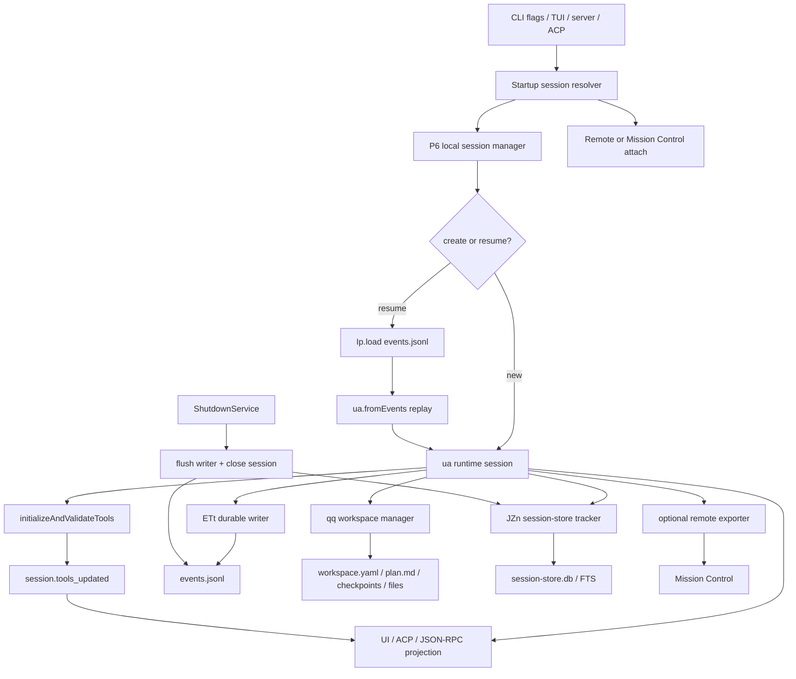
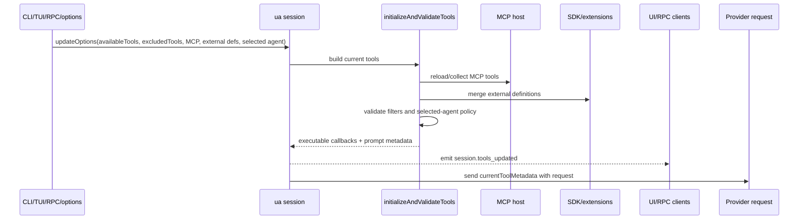

# Conversation session end-to-end

This page stitches together the full session path in the extracted Copilot CLI bundle: session creation, resume/continue selection, event-log replay, workspace state, tool configuration refresh, UI projection, indexing, remote export, and shutdown cleanup.

It intentionally does not replace the focused pages on [session manager](session-manager-and-event-replay.md), [SessionFs](session-fs-provider-and-state-files.md), [session-store indexing](session-store-sqlite-indexing.md), [UI projection](system-events-and-ui-projection.md), or [runtime tool assembly](../03-tools-integrations-security/runtime-tool-assembly-and-filtering.md). Instead, it is the missing reader path for following one conversation from startup to durable state and visible UI.

Because `app.js` is bundled/minified, names below are semantic aliases with version-specific search anchors for the analyzed artifact.

## Source anchors

| Area | Semantic alias | Minified anchor / string | Approx. line | Role |
|---|---|---:|---:|---|
| Root session flags | `SessionStartupOptions` | `--resume [value]`, `--continue`, `--name`, `--connect [sessionId]`, `--cloud` | 8225-8298 | User-visible inputs that choose new, resumed, continued, connected, or cloud-attached sessions. |
| Startup resolver | `SessionStartupResolver` | `getLastSessionIdForContext`, `findSessionByTaskId`, `findSessionByPrefix`, `Yve(...)` | 8298 | Resolves the requested local, remote, named, or context-relevant session before mode dispatch. |
| Local manager | `LocalSessionManager` | `P6` | 5756 | Creates, resumes, lists, forks, deletes, locks, stores, closes, and hands off local sessions. |
| Runtime session | `RuntimeSession` | `ua`, `fromEvents`, `processEventForState` | 4471 | Reconstructs chat/session state by replaying `session.start` and subsequent events. |
| Event log store | `SessionEventLogStore` | `Ip=HHr(..., "session", ...)`, `events.jsonl` | 236, 4396 | Loads, appends, truncates, and lists durable per-session JSONL events. |
| Event writer | `DebouncedSessionWriter` | `ETt` | 4396-4481 | Subscribes to non-ephemeral session events and writes them to `events.jsonl`. |
| Workspace manager | `WorkspaceManager` | `qq`, `workspace.yaml`, `plan.md`, `checkpoints`, `files`, `research`, `session.db` | 3559-3573 | Stores sidecar state that is awkward or too large for the event stream. |
| Tool initialization | `initializeAndValidateTools` | `availableTools`, `excludedTools`, `defaultAgent.excludedTools`, `session.tools_updated` | 4471-4481 | Merges built-ins, MCP tools, extensions, external tools, and filters into the model-visible toolset. |
| Built-in tool assembly | `assembleRuntimeTools` | `$Cr(...)`, `HCr(...)`, `Gjs(...)`, `Wjs(...)` | 5734 | Builds candidate shell, edit, validation, memory, skills, task, subagent, and schedule tools. |
| Event schemas | `SessionEventSchema` | `session.start`, `session.resume`, `session.shutdown`, `system.notification`, `session.info` | 4361 | Defines durable and ephemeral session event shapes consumed by persistence, UI, telemetry, and APIs. |
| UI projection | `TimelineProjection` | `add-timeline-entry`, `onSystemNotification`, `IFa(...)`, `jze(...)` | 1739, 4644, 4783, 6860 | Converts session events and command results into terminal/ACP/timeline-visible entries. |
| JSON-RPC server API | `SessionServerApi` | `session.create`, `session.resume`, `session.send`, `session.getMessages`, `session.list` | 6100 | Exposes the same lifecycle through headless/server clients. |
| ACP session API | `AcpSessionApi` | `session_new`, `session_load`, `session_list`, `session_fork`, `session_resume` | 6096-6100 | Adapts Agent Client Protocol sessions to the same local manager and event projection. |
| SQLite/session store | `SessionStoreTracker` | `AR(...)`, `JZn(...)`, `session-store.db`, `search_index` | 4518-4582 | Derives searchable/indexed history from raw events and workspace files. |
| Shutdown | `ShutdownService` | `eke` | 7420 | Flushes session writers, disposables, output, logs, and telemetry on normal or error exit. |

## Full lifecycle map

The core invariant is that a session is not just a terminal UI object. It is a replayable event stream plus sidecar workspace state, with several projections layered on top.

## Phase-by-phase flow

| Phase | Runtime anchor | What happens | User-visible implication |
|---|---|---|---|
| 1. Resolve startup intent | Root options and `SessionStartupResolver` | CLI flags decide whether to create a fresh local session, resume by ID/name/prefix, continue the most relevant session, connect to remote Mission Control state, or start a hidden cloud attach path. | `--continue` is context-aware; it prefers branch/repository/git-root/cwd relevance rather than simply the newest session. |
| 2. Create or reconstruct runtime state | `P6`, `ua`, `ua.fromEvents(...)` | New sessions emit `session.start`; resumed sessions load `events.jsonl`, replay non-filtered events, restore model/context/tool state, and emit `session.resume`. | A resumed conversation is reconstructed from event history, not from a separate transcript file. |
| 3. Attach sidecar workspace | `qq` workspace manager | The runtime opens or creates `workspace.yaml`, `plan.md`, `checkpoints/`, `files/`, `research/`, and `session.db` when a `sessionStatePath` is available. | `/session plan`, `/session checkpoints`, workspace files, and forked sessions depend on this sidecar state. |
| 4. Initialize tools | `initializeAndValidateTools`, `$Cr(...)`, `HCr(...)` | Built-ins, MCP tools, SDK/extension tools, custom-agent constraints, allow/exclude filters, and model-specific tool overrides are merged into current executable tools and model-visible metadata. | The `session.tools_updated` event tells clients that tool definitions changed; it does not carry the full schema list. |
| 5. Process turns and emit events | `RuntimeSession`, tool execution callbacks, model adapters | User messages, assistant messages, tool starts/progress/completions, permission events, usage events, compaction, warnings, and errors are emitted through the session event bus. | Durable events can be replayed; ephemeral deltas/progress mostly drive live UI/protocol state. |
| 6. Persist and index | `ETt`, `Ip`, `JZn`, `AR(...)` | Non-ephemeral events are appended to `events.jsonl`; selected turn/file/ref/checkpoint information is mirrored into `session-store.db`; remote exporters may forward events. | `events.jsonl` remains the local replay source; SQLite is a derived index optimized for search and Chronicle-style queries. |
| 7. Project to clients | `system-events` handlers, JSON-RPC, ACP, TUI renderers | Events become timeline entries, model-visible system context, status messages, telemetry, ACP updates, or remote control state depending on event type. | `system.message`, `system.notification`, `session.info`, and `session.tools_updated` have different semantics even though all are session events. |
| 8. Close and cleanup | `ShutdownService`, `P6.closeSession(...)` | Shutdown callbacks flush pending events, close sessions, dispose MCP/extensions/servers, unmount or restore UI, and flush logs/telemetry. | A clean exit is expected to preserve pending durable events and operational logs before process termination. |

## Entry points into the same lifecycle

| Surface | Main operations | Shared runtime object |
|---|---|---|
| Root CLI flags | new, resume, continue, name, connect, cloud attach | `P6` + `ua` |
| TUI slash commands | `/session`, `/fork`, `/compact`, `/rewind`, `/remote`, diagnostics commands | current `ua` session plus `P6` manager |
| Headless/server JSON-RPC | `session.create`, `session.resume`, `session.send`, `session.getMessages`, `session.list`, `session.delete` | `Fee` server adapter around `P6` |
| ACP | `session_new`, `session_load`, `session_list`, `session_fork`, `session_resume` | ACP adapter around `P6` and event projection |
| Mission Control / remote | attach, export, handoff, remote steering | remote adapters that convert logs/events back into the session event model |
| SDK SessionFs provider | provider-owned state files and reverse filesystem calls | same session manager with injected `SessionFs` factory |

The entry points differ in UI/protocol shape, but they converge on the same session manager, runtime session, event model, and persistence abstractions.

## Durable versus live-only state

| State or event family | Durable replay source? | Other projections | Notes |
|---|---:|---|---|
| `session.start`, user/assistant messages, most tool completion events | Usually yes | UI, telemetry, remote export, session-store indexing | These are the backbone of local resume and fork. |
| `system.message` | Yes when emitted as a durable event | Model context and telemetry | Rebuilds provider-level system/developer context on replay. |
| `system.notification` | Often yes, but behavior varies by kind | User-like model context, UI, telemetry | `instruction_discovered` is filtered from chat-message replay. |
| `assistant.*_delta`, tool progress, pending queue updates | No or generally ephemeral | Live TUI/ACP/JSON-RPC updates | These avoid bloating replay logs with streaming fragments. |
| `workspace.yaml`, `plan.md`, checkpoints, `files/` | Filesystem sidecar, not JSONL-only | Slash commands, fork, search/indexing | Workspace state complements the event stream. |
| `session-store.db` rows | Derived, rebuildable | Search, Chronicle, SQL/debug tools | SQLite should not be treated as the canonical transcript. |
| Remote Mission Control state | Optional export/control plane | Web/mobile steering and handoff | Remote history can be converted back into local session events. |

## Tool configuration inside the session path

Tool configuration is the most common part of the session lifecycle that appears to live elsewhere. The end-to-end path is:

Tool state is therefore session state, but its detailed mechanics live in [Runtime tool assembly and filtering](../03-tools-integrations-security/runtime-tool-assembly-and-filtering.md). The session page should treat it as a lifecycle phase rather than a separate product.

## UI projection is not persistence

Session events have several consumers, and they do not all agree on the same subset:

- event replay restores chat and session state;
- the TUI and ACP render live/ephemeral progress events;
- JSON-RPC clients can request converted messages;
- the session store indexes selected turns, files, refs, and checkpoint summaries;
- telemetry/OpenTelemetry receives accounting and operational projections;
- remote exporters forward an event-compatible stream to Mission Control.

This explains why a raw `events.jsonl` inspection, SQLite search result, and terminal timeline can legitimately show different levels of detail.

## Failure and edge cases

| Case | Behavior to expect |
|---|---|
| Missing or invalid event log | The manager can reject legacy/unsupported layouts or skip selected invalid records where the loader predicate allows it. |
| Already-active session | Server-mode resume can reuse the in-process session and emits resume metadata indicating active state. |
| Ambiguous `--resume` name | Interactive paths can show a picker; non-interactive paths should report ambiguity. |
| Writer failure | The writer emits an ephemeral `session.error` with `errorType: "persistence"` and requeues pending events. |
| Tool filter references an unknown tool | Initialization emits informational messages and validates against the known built-in/MCP/external universe. |
| Rewind/fork boundaries | Rewind mutates current event history by truncation; fork creates a new branch and copies/rewrites state. |
| Shutdown during active work | `ShutdownService` coordinates callbacks, disposables, session flush, renderer restoration, logs, and telemetry. |

## Relationship to other docs

- [Session manager and event replay](session-manager-and-event-replay.md) is the detailed local/remote manager reference.
- [Session persistence, replay, and indexing](session-persistence-replay-and-indexing.md) zooms in on event logs, workspace sidecars, SQLite, indexing, fork, and rewind.
- [SessionFs provider and state-file lifecycle](session-fs-provider-and-state-files.md) explains local versus SDK/RPC-backed file storage.
- [System events and UI projection](system-events-and-ui-projection.md) explains model-visible versus UI-only event projection.
- [Runtime tool assembly and filtering](../03-tools-integrations-security/runtime-tool-assembly-and-filtering.md) explains the tool configuration phase in detail.
- [Telemetry, update, and shutdown](../05-hosted-agent-ops/telemetry-update-and-shutdown.md) covers logs, telemetry, and graceful exit.
