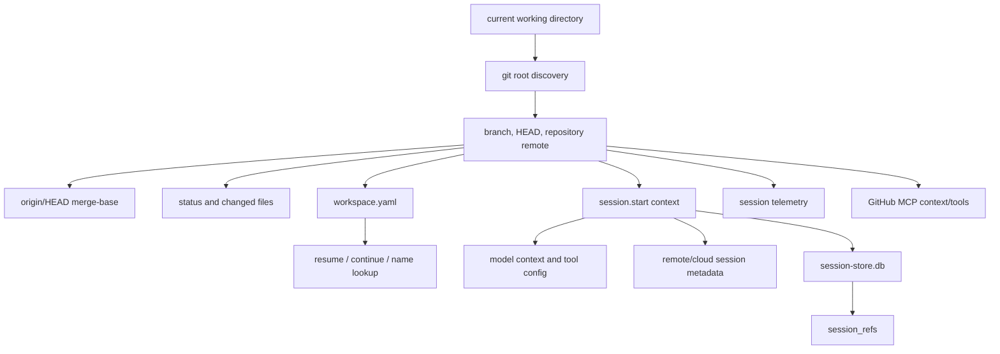

# Git, repository, PR, and ref context

This document explains how the extracted Copilot CLI bundle derives and reuses Git/repository context. In the analyzed `app.js`, Git context is not just a prompt nicety. It feeds session metadata, workspace persistence, telemetry, file identity, code review, remote/cloud task metadata, session indexing, dynamic context boards, and GitHub MCP instructions.

Because `app.js` is bundled/minified, symbol names are unstable. Line references below are searchable anchors in the extracted bundle and will shift across releases.

## Source anchors

| Semantic alias | Minified anchor | Approx. `app.js` line | Role |
|---|---|---:|---|
| Git root discovery | `Mi(...)`, `rev-parse --show-toplevel`, `--git-dir`, `--git-common-dir` | 216 | Working directory is resolved to a git root, with worktree handling and caching. |
| Branch/head/repo context | `oT(...)`, `branch --show-current`, `headCommit`, `repository`, `hostType`, `repositoryHost` | 219 | Session working-directory context includes branch, commit, and repository identity. |
| Base commit | `origin/HEAD`, `merge-base`, `baseCommit` | 219 | Base commit is derived from `HEAD` and `origin/HEAD` when available. |
| Dirty state | `status --porcelain -uall -z`, `hasUnstagedChanges`, `hasStagedChanges`, `hasUntrackedFiles` | 219 | Git status is parsed into staged/unstaged/untracked booleans. |
| File identity | `hash-object`, `git-sha1:` | 219 | Git object hashes are used as stable file identities. |
| Workspace metadata | `workspace.yaml`, `git_root`, `host_type`, `branch` | 3559, 3573 | Session workspace state persists repository context. |
| Session telemetry | `git_root`, `repository`, `host_type`, `branch`, `head_commit`, `base_commit` | 4033 | Session start telemetry carries repo context in restricted properties. |
| Session index refs | `session_refs`, `idx_session_refs_type_value` | 4569, 4582, 4629 | SQLite session store records refs such as PRs/issues/commits. |
| Remote task metadata | `pullRequestNumber`, `repository`, `remoteSessionIds`, `resourceId` | 4487-4489 | Remote/cloud task sessions carry repository and PR/task metadata. |
| Child repo scanning | `CHILD_GIT_REPO_SCAN` | 239, 4491 | Feature-gated additional git scan for child/session contexts. |
| GitHub MCP context | `github-mcp-server`, `get_file_contents`, issue/PR/check tools | 528, 4288 | GitHub MCP tools and instructions enrich repo/PR/build context. |

## Runtime map



## Git root discovery

The helper around line `216` resolves the current working directory to a Git root using:

```text
git rev-parse --show-toplevel
```

If worktree resolution is requested, it also checks:

```text
git rev-parse --git-dir
git rev-parse --git-common-dir
```

This allows the runtime to normalize linked worktrees to the shared common directory when needed. Results are cached by working directory and worktree-resolution mode, with a bounded cache size to avoid repeated `git` calls.

If the directory is not inside a Git repository, the context still records `cwd`, but `gitRoot` is not marked as found.

## Working-directory context

The context builder around line `219` starts with:

```text
{ cwd }
```

If a Git repository is found, it adds:

| Field | How it is derived |
|---|---|
| `gitRoot` | `rev-parse --show-toplevel` result, optionally worktree-normalized. |
| `branch` | `git branch --show-current`, falling back to `detached@<short-head>`. |
| `headCommit` | `git rev-parse HEAD`. |
| `repository` | Parsed remote/repository identifier. |
| `hostType` | Repository host category such as GitHub or ADO. |
| `repositoryHost` | Hostname or host identity from remote parsing. |
| `baseCommit` | Merge-base between `HEAD` and `origin/HEAD`, when available. |

The branch fallback is significant. Detached HEAD state is still represented as a useful branch-like label rather than dropping branch context entirely.

## Base commit derivation

When `headCommit` exists, the bundle tries to compute `baseCommit` by:

1. resolving `origin/HEAD`;
2. running `git merge-base <headCommit> <origin/HEAD>`;
3. caching the result by `<gitRoot>:<headCommit>`.

This gives the runtime a stable baseline for changed-file analysis, code review, CodeQL checks, and other tools that need to know “what changed relative to the default remote branch.”

## Dirty-state and changed-file context

The Git helper parses porcelain status output:

```text
git status --porcelain -uall -z
```

It derives booleans for:

- unstaged changes;
- staged changes;
- untracked files.

Separate helper paths collect changed files, skip deleted paths, handle rename/copy status prefixes, and avoid directories. For file identity, the bundle uses:

```text
git hash-object -- <file>
```

and stores identities with a `git-sha1:` prefix. For batches, it runs `git hash-object --` across chunks of file paths.

## Session workspace persistence

Session workspace state is stored under each local session’s state directory. The workspace manager exposes paths such as:

| Artifact | Purpose |
|---|---|
| `workspace.yaml` | Main session workspace metadata. |
| `plan.md` | Plan-mode/session plan artifact. |
| `checkpoints/` | Compaction/checkpoint snapshots. |
| `files/` | Session file state. |
| `research/` | Research artifacts. |

The `workspace.yaml` schema includes:

| YAML field | Source context |
|---|---|
| `id` | Session ID. |
| `cwd` | Working directory. |
| `git_root` | Git root. |
| `repository` | Repository identifier. |
| `host_type` | Host type, e.g. GitHub/ADO. |
| `branch` | Current branch or detached label. |
| `name` / `user_named` | Session name metadata. |
| `created_at` / `updated_at` | Workspace timestamps. |

The workspace manager updates these fields when session context changes. Search-by-name logic also scans `workspace.yaml` files to resolve named sessions.

## Session start and telemetry

Session start events include a context object derived from the Git helper. Telemetry around line `4033` records restricted properties such as:

- `git_root`;
- `repository`;
- `host_type`;
- `repository_host`;
- `branch`;
- `head_commit`;
- `base_commit`.

This explains why repository context appears in telemetry, remote state, and session indexing even when it is not printed directly in the chat transcript.

## Session store and refs

The session-store database includes a `session_refs` table:

| Column | Meaning |
|---|---|
| `session_id` | Owning session. |
| `ref_type` | Type of ref, such as issue, PR, commit, or other parsed reference type. |
| `ref_value` | Normalized ref value. |
| `turn_index` | Turn where it appeared. |
| `created_at` | Insertion timestamp. |

The database also creates an index on `(ref_type, ref_value)`, which makes it efficient to find sessions related to a specific repository ref.

This is separate from file indexing (`session_files`) and full-text search (`search_index`), but all three cooperate in session search and dynamic context-board retrieval.

## Remote and cloud task metadata

Remote/cloud task sessions carry repository and PR metadata. The remote task session class around line `4487` stores fields such as:

| Field | Meaning |
|---|---|
| `repository` | Repository associated with the remote task. |
| `remoteSessionIds` | Remote session IDs attached to the task. |
| `pullRequestNumber` | PR number when the remote task is PR-scoped. |
| `resourceId` | Remote task/resource ID. |
| `taskType` | Remote task category. |
| `staleAt` / `state` | Remote lifecycle metadata. |

`getMetadata()` returns these fields so the same session APIs can present local and remote sessions with comparable metadata.

## GitHub MCP interaction

GitHub MCP tools augment repository context. The bundle includes instruction text that tells the agent to use GitHub MCP tools for:

- failing builds/checks (`summarize_job_log_failures`, `get_job_logs`);
- GitHub issues (`issue_read`);
- issue comments;
- repository file content (`get_file_contents`);
- search and pull-request context.

This is not a replacement for local Git context. Local Git tells the CLI where it is and what changed; GitHub MCP gives it network-side repository, PR, issue, action, and file data when available.

## Child repo scanning

The static feature gate table includes `CHILD_GIT_REPO_SCAN`. Around session start telemetry, the code checks whether the current context lacks `gitRoot` and whether that feature flag is enabled. If so, it runs an additional async scan and reports telemetry.

This suggests the CLI has an experimental/staff path for discovering nested or child repository context when the primary working-directory scan did not find a Git root.

## Code review and PR context

The bundle’s code-review paths include fields such as:

- `input_file_mode: "pr"`;
- `repo_path`;
- `pr_title`;
- `pr_body`;
- `pull_request` callback payloads;
- `pullRequestNumber` in remote task metadata.

Together with `baseCommit`, changed-file hashing, and GitHub MCP PR tools, this gives the CLI enough context to connect local edits, PR metadata, and remote review workflows.

## What depends on Git context

| Subsystem | Dependency |
|---|---|
| Session resume/continue | Workspace metadata and cwd/repository ranking. |
| Remote control | Repository metadata in Mission Control export and remote task attach. |
| Session indexing | `repository`, `cwd`, `session_refs`, `session_files`. |
| Code review | Base/head commits, changed files, PR title/body/number. |
| CodeQL/security checks | Changed-file sets relative to base commit. |
| Prompt assembly | Repo name, branch, cwd, dynamic instructions, GitHub refs. |
| MCP GitHub tools | Repository identity for file/issues/PR/build context. |
| Telemetry | Host category, repository, branch, commit metadata. |

## Failure and fallback behavior

| Situation | Behavior |
|---|---|
| Not inside Git repo | Context still includes `cwd`; Git-specific fields are absent. |
| Detached HEAD | Branch becomes `detached@<short-head>` if possible. |
| Missing `origin/HEAD` | `baseCommit` is omitted. |
| Git commands fail | Helpers return partial context rather than failing the whole session in many paths. |
| Worktree repository | Optional worktree resolution can normalize to common git root. |
| Child repo scan disabled | No extra nested scan occurs if initial context lacks `gitRoot`. |

## Relationship to other documents

- `session-manager-and-event-replay.md` explains workspace artifacts and session persistence.
- `sessions-remote-cloud.md` explains local/remote/cloud session metadata.
- `remote-control-protocol-and-steering.md` explains repository metadata in Mission Control export.
- `mcp-host-transport-and-tools.md` explains GitHub MCP tool setup.
- `agent-task-orchestration.md` explains code review, research, and subagent workflows that consume repo context.
