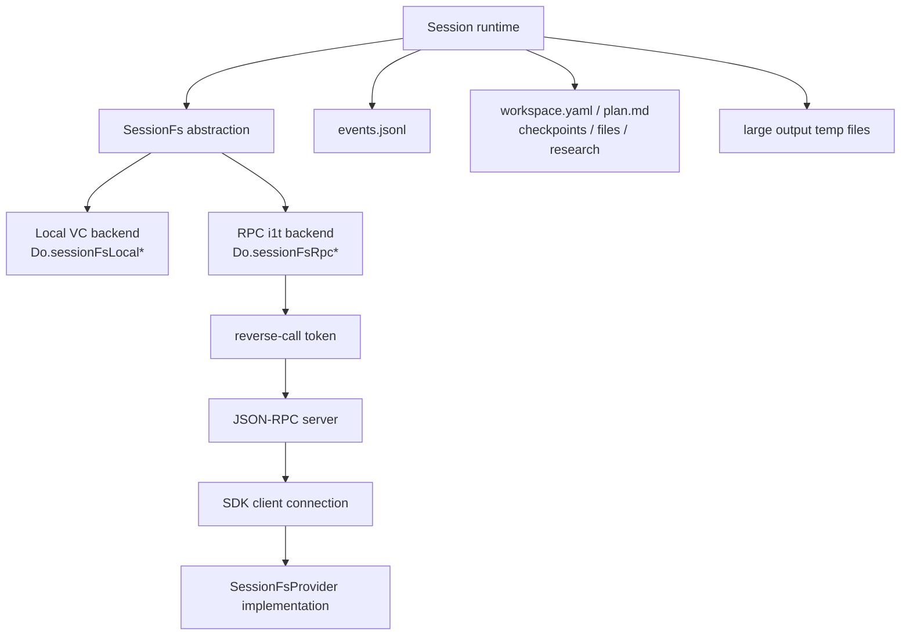
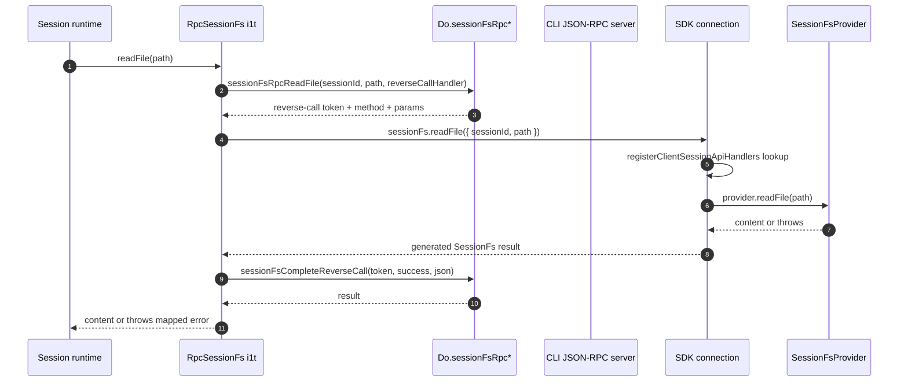
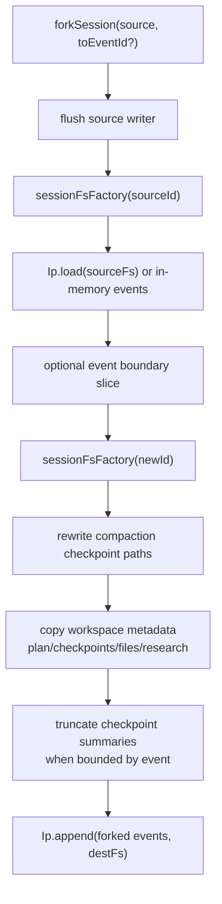

# SessionFs provider and state-file lifecycle

This page documents the `SessionFs` abstraction in the extracted Copilot CLI bundle: local session-state storage, SDK/RPC-backed filesystem providers, reverse calls, workspace artifacts, large-output files, and fork-time state copying.

It fills a gap left by [Session manager and event replay](session-manager-and-event-replay.md), which explains event-sourced sessions at a high level, and [API and session event schema contracts](api-and-session-event-schemas.md), which lists the JSON-RPC method surface.

## Source anchors

`app.js` is bundled/minified, so symbols are lookup aids for this extracted build rather than stable public API.

| Area | Semantic alias | Minified anchor | Approx. line | What it does |
|---|---|---:|---:|---|
| JSONL session store | `SessionEventLogStore` | `Ip=HHr(..., "session", ...)` | 236, 4396 | Reads, appends, truncates, and lists `events.jsonl` through a `SessionFs` instance. |
| Base filesystem abstraction | `SessionFsBase` | `Zge` | 555 | Defines path joining, path conventions, and lock keys. |
| Local backend | `LocalSessionFs` | `VC extends Zge` | 555 | Delegates local file operations to native `Do.sessionFsLocal*` helpers. |
| RPC backend | `RpcSessionFs` | `i1t extends Zge` | 6096 | Delegates file operations through native `Do.sessionFsRpc*` helpers and reverse calls to the SDK client. |
| Workspace artifacts | `WorkspaceManager` | `qq` | 3559-3573 | Manages `workspace.yaml`, `plan.md`, `checkpoints/`, `files/`, `research/`, and `session.db`. |
| Runtime session constructor | session `sessionFs` selection | `this.sessionFs = r.sessionFs ?? ...` | 4471 | Uses an injected `SessionFs`, an event-log directory override, or the local default. |
| Workspace enablement | infinite-session workspace setup | `this.sessionFs.sessionStatePath && new qq(...)` | 4475 | Enables workspace artifacts only when the filesystem exposes a `sessionStatePath`. |
| Tool integration | large-output and shell buffers | `LW(...)`, `BW(...)`, `rAe(...)` | 555, 567, 4481, 5654, 5691 | Writes large tool/shell output through the active session filesystem. |
| Session manager factory | per-session filesystem factory | `sessionFsFactory`, `setSessionFsFactory(...)` | 5756 | Creates a filesystem for each session and lets server-mode clients replace the factory before sessions exist. |
| Fork state copy | session-state cloning | `forkSession(...)`, `copyForkedSessionState(...)` | 5756 | Copies selected workspace artifacts and rewrites checkpoint paths when forking. |
| Server RPC provider registration | `sessionFs.setProvider` | `createSessionFsApi()` | 6096-6100 | Lets one SDK/RPC connection become the process-wide session filesystem provider. |
| SDK generated handlers | `registerClientSessionApiHandlers(...)` | same name | SDK `index.js` 3467 | Registers client-side handlers for incoming `sessionFs.*` reverse requests. |
| SDK provider adapter | `createSessionFsAdapter(...)` | same name | SDK `index.js` 4406 | Converts thrown provider errors into generated RPC result shapes. |
| SDK client startup | provider handshake | `sessionFs.setProvider` request | SDK `index.js` 4833 | Sends `initialCwd`, `sessionStatePath`, and path conventions after connecting. |
| Per-session SDK handler | `createSessionFsHandler` | same name | SDK `index.js` 5081, 5218 | Requires a provider per created/resumed session when client-level `sessionFs` is enabled. |

## Big picture



The same session code writes event logs, workspaces, checkpoints, and temporary large-output files through a small filesystem interface. In normal CLI/TUI mode the backend is local. In SDK server mode a client can become the filesystem provider, so the CLI process stores all session-state files in a caller-controlled filesystem without rewriting the session manager.

## Two backends

| Backend | Created by | `sessionStatePath` | `tmpdir` | Typical use |
|---|---|---|---|---|
| `VC` local backend | `new VC(_y(sessionId, settings))` or `VC.default` | Optional constructor argument | OS temp directory | TUI, prompt mode, server mode without custom provider. |
| `i1t` RPC backend | `sessionFs.setProvider` → `setSessionFsFactory(...)` | Required provider-config path | `<sessionStatePath>/temp` | SDK/server clients that want to own persistence. |

Both extend `Zge`, which centralizes path joining and path separators. The local backend uses the host platform for path conventions. The RPC backend uses provider-supplied conventions (`windows` or `posix`) so the CLI can build paths that the remote/client filesystem understands.

The lock key differs by backend:

- local `VC.lockKey(path)` returns the path itself;
- RPC `i1t.lockKey(path)` prefixes the session id, producing `${sessionId}:${path}`.

That distinction prevents cross-session lock collisions when multiple SDK sessions use the same provider connection and path style.

## Local layout

When the default manager creates local session files, the path helper stack is:

```text
I1(settings)      -> <settings state root>/session-state
_y(sessionId, s)  -> I1(s)/<sessionId>
Ip.path(id, s)    -> I1(s)/<sessionId>/events.jsonl
```

The per-session workspace normally looks like:

```text
session-state/<session-id>/
  events.jsonl
  workspace.yaml
  plan.md
  checkpoints/
    index.md
    001-<short-title>.md
  files/
    <persistent workspace artifacts>
  research/
    <research artifacts>
  session.db
```

`WorkspaceManager` requires `sessionStatePath`. If a session is constructed with `VC.default` and no state path, the session can still execute, but workspace artifacts are unavailable and `requireWorkspaceManager()` throws.

## SDK/RPC provider handshake

The SDK exposes a client-level `sessionFs` option:

| Field | Meaning |
|---|---|
| `initialCwd` | Working directory returned by `SessionFs.getInitialCwd()` when a session does not pass an explicit working directory. |
| `sessionStatePath` | Root path inside each session's provider-owned filesystem where the CLI stores session-scoped files. |
| `conventions` | Path conventions: `windows` or `posix`. |

During SDK client startup, after JSON-RPC connection and protocol verification, the SDK sends:

```text
sessionFs.setProvider({ initialCwd, sessionStatePath, conventions })
```

The server handler enforces three invariants:

1. The provider must be installed before any sessions are active.
2. Only one connection can be the session filesystem provider for the server process.
3. If the provider connection disconnects, the runtime logs that the instance should not be reused.

When accepted, the handler creates a `SessionFs` factory that returns `new i1t(clientConnection, sessionId, initialCwd, sessionStatePath, conventions)` for every session id, then installs it through `SessionManager.setSessionFsFactory(...)`.

## Reverse-call path

The RPC backend does not call JSON-RPC directly from every method. Instead, it goes through native bridge helpers such as `Do.sessionFsRpcReadFile(...)` with a `reverseCallHandler` callback. The bridge produces a tokenized reverse-call request, and `i1t.handleReverseCall(...)` completes the token when the SDK client returns.



The method switch in `i1t.invokeClientSessionFs(...)` recognizes exactly these client-session methods:

- `readFile`
- `writeFile`
- `appendFile`
- `exists`
- `stat`
- `mkdir`
- `readdir`
- `readdirWithTypes`
- `rm`
- `rename`

Unknown methods fail the reverse call. A reverse call for a different session id also fails, which protects a provider from accidentally serving the wrong session.

## SDK-side provider contract

The SDK's `SessionFsProvider` interface is idiomatic TypeScript: provider methods return values directly and throw on failure. `createSessionFsAdapter(...)` converts that into the generated RPC handler contract.

| Provider behavior | Adapter behavior |
|---|---|
| `readFile` returns a string | Returns `{ content }`. |
| `writeFile` / `appendFile` / `mkdir` / `rm` / `rename` succeed | Returns `undefined`. |
| `exists` succeeds | Returns `{ exists }`. |
| `stat` succeeds | Returns file metadata directly. |
| `readdir` succeeds | Returns `{ entries }`. |
| provider throws with `code === "ENOENT"` | Maps to `{ code: "ENOENT", message }`. |
| provider throws anything else | Maps to `{ code: "UNKNOWN", message }`. |

When client-level `sessionFs` is configured, every `createSession(...)` and `resumeSession(...)` call must provide `createSessionFsHandler(session)`. The SDK stores the session before issuing `session.create` or `session.resume`, attaches `session.clientSessionApis.sessionFs`, and the globally registered client-session handlers route reverse calls by `sessionId`.

This split is subtle but important:

- `CopilotClientOptions.sessionFs` declares a process-wide provider configuration and causes the server to switch filesystem factories.
- `SessionConfig.createSessionFsHandler` supplies the actual provider implementation for each session object.

## Event persistence through SessionFs

`Ip.load(sessionFs)` and `Ip.append(events, sessionFs)` are filesystem-agnostic. They build `<sessionStatePath>/events.jsonl` with `sessionFs.join(...)` and protect read/write operations with `sessionFs.lockKey(...)`.

| Operation | Local backend | RPC backend |
|---|---|---|
| `load` | Opens a native line stream with `Do.sessionFsLocalOpenReadFileStream(...)`. | Reads the whole file and splits by line in `i1t.readFileStream(...)`. |
| `append` | Appends newline-delimited JSON through `Do.sessionFsLocalAppendFile(...)`. | Reverse-calls provider `appendFile(...)`. |
| `truncate` | Rewrites `events.jsonl` through `Do.sessionFsLocalWriteFile(...)`. | Reverse-calls provider `writeFile(...)`. |
| metadata/listing | Uses local stat/readdir helpers. | Reverse-calls provider stat/readdir operations. |

`ETt` is the debounced writer that feeds `Ip.append(...)`. Because it writes through `session.sessionFs`, the same persistence code works for local and SDK-provided storage.

## Workspace artifacts through SessionFs

`WorkspaceManager` stores non-event artifacts in the same `sessionStatePath`:

| Path | Producer/consumer |
|---|---|
| `workspace.yaml` | Session metadata, cwd, git root, repository, branch, friendly name, remote-state markers. |
| `plan.md` | Plan-mode content exposed through session plan APIs. |
| `checkpoints/index.md` and numbered markdown summaries | Compaction checkpoints, `/session checkpoints`, rewind/fork naming, and checkpoint truncation. |
| `files/` | Persistent session files and large pasted content. |
| `research/` | Research/session-local artifacts. |
| `session.db` | Session-local database path for state that benefits from SQLite. |

All reads/writes go through `sessionFs`. The path sanitizer for workspace files resolves paths under `files/` and rejects attempts to escape that directory.

## Large output and temporary files

Tool and shell output buffers also use `SessionFs`:

- generic large tool results call `LW(sessionFs, largeOutputConfig, grepToolName)`;
- shell buffers create `BW(...)` with `sessionFs` in both PTY and process backends;
- temp output paths are registered for cleanup with `rAe(sessionFs, filePath)`;
- cleanup later removes temp files through the same backend, unless `COPILOT_KEEP_TEMP_FILES=true`.

For the RPC backend, temp files live under `<sessionStatePath>/temp`, not the server's OS temp directory. That keeps SDK-owned state inside the provider-controlled filesystem.

## Forking and state copying

`SessionManager.forkSession(...)` is the densest state-file path.



Key fork behaviors:

1. The source writer is flushed before reading persisted events.
2. If no persisted events exist, the manager can fall back to in-memory non-ephemeral events.
3. The first `session.start` event is rewritten with the new session id and start time.
4. Compaction checkpoint paths inside events are rewritten from the source `sessionStatePath` prefix to the destination prefix.
5. `workspace.yaml` is cloned with remote/Mission Control fields removed and the new id/name/timestamps applied.
6. `plan.md`, `checkpoints/`, `files/`, and `research/` are copied recursively when both source and destination filesystems expose `sessionStatePath`.
7. If the fork is bounded by `toEventId`, checkpoint summaries after the last included compaction checkpoint are removed.
8. A fork-info `session.info` event is appended to the new session and, when possible, also appended to the source session.

Because copy uses the abstract `SessionFs` operations (`stat`, `readdirWithTypes`, `readFile`, `writeFile`, `mkdir`), local-to-local and provider-backed copies use the same code path as long as both session ids use the same installed factory.

## Operational guardrails

| Guardrail | Why it matters |
|---|---|
| Install provider before sessions exist | Prevents one process from mixing local and provider-backed sessions. |
| One provider connection per server instance | Prevents ambiguous reverse-call routing. |
| `createSessionFsHandler` required per session | The SDK needs a concrete handler for each `sessionId` before the runtime can read/write. |
| Provider disconnection is effectively terminal | The server logs that the runtime should not be reused because future persistence calls cannot be completed reliably. |
| Path conventions are explicit | The runtime uses provider conventions for joins and path separators instead of assuming the CLI host OS. |
| Provider errors are result-shaped | `createSessionFsAdapter(...)` maps thrown errors into generated RPC results, and the runtime rethrows them with `Fg(...)`. |

## Relationship to other pages

- [Session persistence, replay, and indexing](session-persistence-replay-and-indexing.md) shows how SessionFs-backed files fit into JSONL replay, workspace sidecars, SQLite indexing, reindex, fork, and rewind.
- [Session manager and event replay](session-manager-and-event-replay.md) covers the broader event-sourced session manager and resume/continue flow.
- [API and session event schema contracts](api-and-session-event-schemas.md) lists the generated `sessionFs.*` methods.
- [Checkpoints, undo, rewind, and fork](../02-context-model-loop/checkpoints-undo-rewind.md) covers the user-visible checkpoint/history workflows that consume these files.
- [Shell command execution events](../03-tools-integrations-security/shell-command-execution-events.md) covers the shell output buffers that use `SessionFs` for large output.