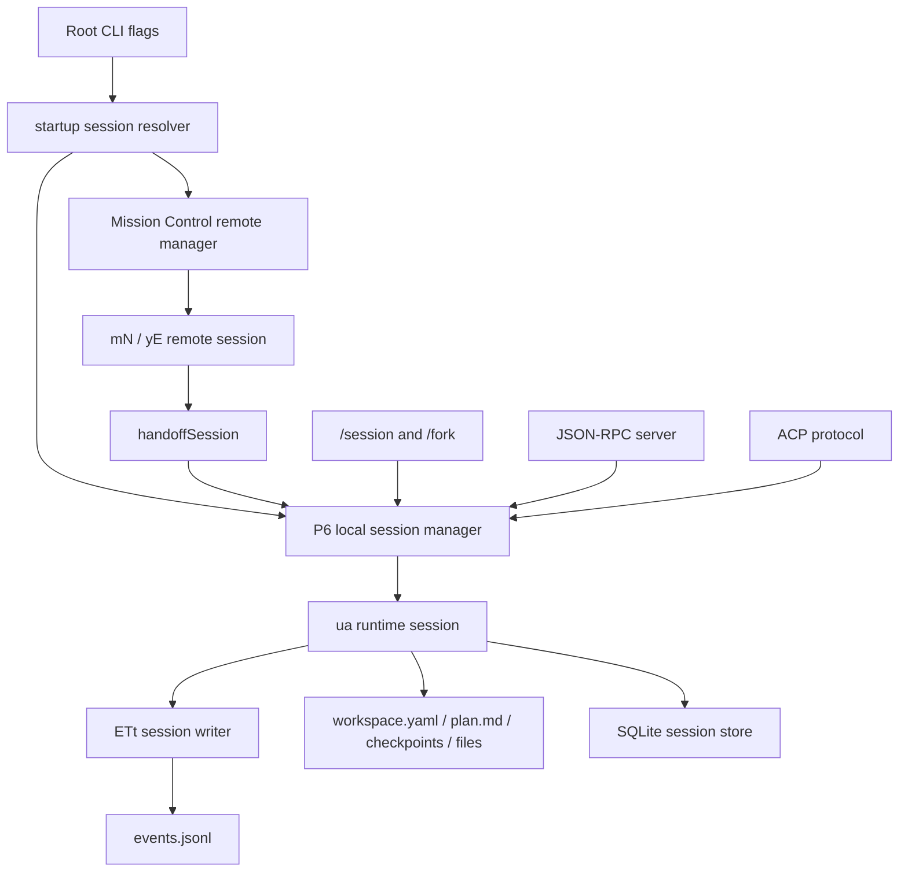
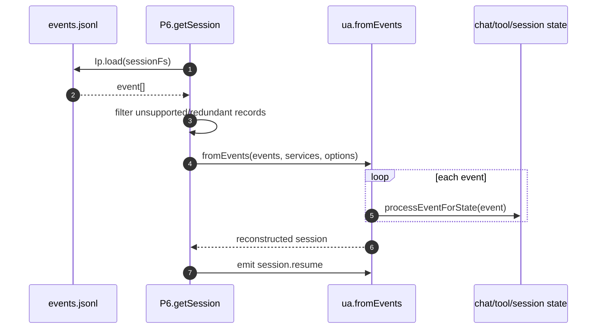
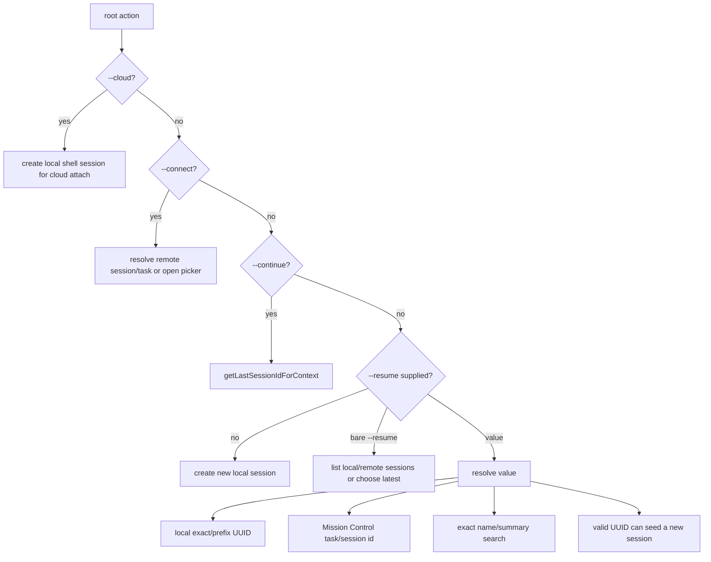
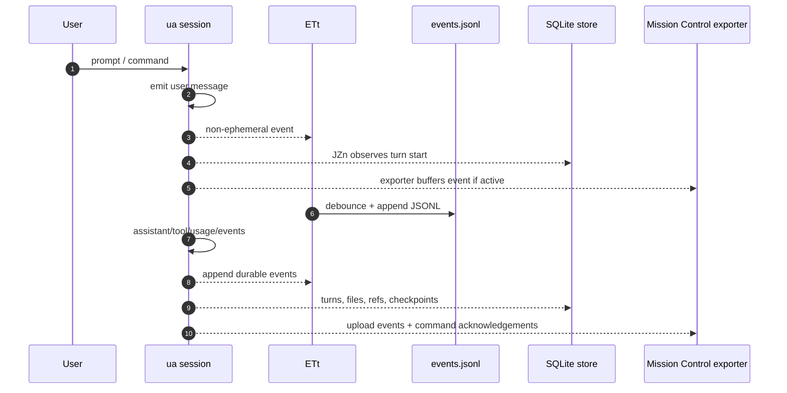

# Session manager and event replay

## Internals scope

> **Why this page is here:** This page belongs to [Sessions, persistence, and remote](README.md). It explains a durable-state or protocol facet: event replay, SessionFs, SQLite/FTS indexing, repository context, remote/cloud steering, or UI projection. Pair it with [Runtime lifecycle](../01-runtime-lifecycle/README.md) for the mode that creates the session and [Context and model loop](../02-context-model-loop/README.md) for how session history becomes model context.

This document describes how session manager is implemented in the extracted Copilot CLI `app.js`. The implementation is not a single subsystem; it is an event-sourced runtime that combines local JSONL persistence, workspace metadata, checkpoint files, session indexing, remote/cloud adapters, TUI slash commands, JSON-RPC APIs, and ACP protocol handlers.

At a high level, every CLI conversation is a **session**. The runtime records significant session events, reconstructs a session by replaying those events, keeps per-session workspace artifacts beside the event log, and exposes session lifecycle operations through several entry points: root CLI flags, `/session`, `/fork`, server/headless JSON-RPC, ACP, remote Mission Control attach, and local/cloud session-store search.

## Source anchors

`app.js` is bundled and minified, so the symbols below are search anchors for the analyzed artifact, not stable public APIs.

| Area | Semantic alias | Minified anchor / string | Role |
|---|---|---|---|
| Feature gates | Session gates | `SESSION_STORE`, `CLOUD_SESSION_STORE`, `BACKGROUND_SESSIONS`, `SESSION_INDEXING`, `SESSION_INDEXING_REPO`, `CLI_CLOUD_SESSIONS`, `REMOTE_KICKSTART` | Controls local store, cloud store, background sessions, indexing, cloud sessions, and remote-spawn behavior. |
| State root helpers | Session-state path helpers | `I1(t)`, `_y(t,e)`, `ili="session-state"` | Computes the local session-state root and per-session workspace directory. |
| JSONL store | Session event log store | `Ip=HHr(...,"session",...)`, `events.jsonl`, `.jsonl` | Loads, appends, truncates, lists, and reads metadata for event logs. |
| Session filesystem | Local session FS | `VC extends Zge`, `sessionFsLocal*` | Abstracts session-state file operations and lock keys. |
| Event schema | Session event definitions | `session.start`, `session.resume`, `session.shutdown`, `session.handoff`, `session.compaction_complete` | Defines the event-sourced record format used for persistence, telemetry, UI, and remote export. |
| Runtime session | Session object | `ua`, `fromEvents`, `processEventForState` | Reconstructs in-memory chat/runtime state by replaying persisted events. |
| Session writer | Debounced event writer | `ETt` | Subscribes to non-ephemeral events, redacts bulky tool results, debounces writes, and appends JSONL records. |
| Local manager | Local session manager | `P6` | Creates, resumes, lists, deletes, prunes, forks, locks, stores, and hands off sessions. |
| Workspace manager | Per-session workspace | `qq`, `workspace.yaml`, `plan.md`, `checkpoints`, `files`, `research`, `session.db` | Stores metadata, plans, checkpoints, persistent files, and session-local database files. |
| Name search | Exact local name lookup | `G3e(...)` | Scans `workspace.yaml` files for exact, case-insensitive session-name matches. |
| Remote name search | Remote name lookup | `WRt(...)` | Finds remote sessions by exact `name` or `summary`, case-insensitively. |
| Relevance ranking | Continue scoring | `SZs(...)`, `qve(...)`, `Mgo` | Scores recent sessions by repository, branch, git root, and working directory for `--continue` and pickers. |
| Root options | CLI surface | `--resume [value]`, `--continue`, `--name`, `--connect [sessionId]`, `--cloud`, `--session-idle-timeout` | User-visible flags that select, create, attach, or name sessions. |
| Startup resolver | Session selection | root action around `getLastSessionIdForContext`, `findSessionByTaskId`, `findSessionByPrefix`, `Yve(...)` | Implements new/resume/continue/name/connect/cloud decision flow. |
| Slash commands | Runtime management | `qps`, `oeo`, `/session`, `Veo`, `/fork` | Implements session info, checkpoints, files, plan, rename, cleanup/prune/delete, and fork behavior. |
| Server API | JSON-RPC session API | `AE`, `Fee`, `session.create`, `session.resume`, `session.list`, `session.delete` | Exposes sessions to headless/server clients. |
| ACP API | Agent Client Protocol sessions | `sVe`, `session_new`, `session_load`, `session_list`, `session_fork`, `session_resume` | Maps ACP requests to local session manager operations. |
| Session index | Local SQLite session store | `AR(...)`, `JZn(...)`, `VSr`, `session_store_sql` | Mirrors turns, checkpoints, files, refs, and FTS rows into a queryable store. |
| Cloud/index sync | Remote session-store bridge | `F$s`, `Q$s`, `H$s`, `G$s` | Syncs/query-routes session history to local/cloud stores when gated and authenticated. |
| Remote sessions | Mission Control adapters | `Xce`, `mN`, `yE`, `Rz(...)`, `handoffSession` | Lists, reconstructs, attaches, exports, and hands off remote/cloud sessions. |

## Architecture overview



The design has four layers:

1. **Event log layer** — durable session events are appended to `events.jsonl` and replayed later.
2. **Workspace layer** — `workspace.yaml`, `plan.md`, checkpoint markdown, and persistent files store session metadata and artifacts that are easier to inspect/edit outside the event stream.
3. **Access layer** — CLI flags, TUI commands, JSON-RPC, ACP, and remote attach all select or operate on sessions.
4. **Index/sync layer** — local SQLite and optional cloud session-store paths make previous sessions searchable and queryable.

## Feature gates

The session implementation is heavily feature-gated. In the analyzed bundle, the static gate table includes:

| Gate | Static rollout tier in bundle | Inferred purpose |
|---|---|---|
| `SESSION_STORE` | `on` | Enables local session-store/indexing infrastructure. |
| `CLOUD_SESSION_STORE` | `staff` | Allows cloud-backed query execution for historical sessions. |
| `BACKGROUND_SESSIONS` | `staff-or-experimental` | Enables background session/fork behavior. |
| `SESSION_INDEXING` | `staff` | Enables cloud/session indexing sync paths. |
| `SESSION_INDEXING_REPO` | `staff` | Adds repository-aware indexing behavior. |
| `CLI_CLOUD_SESSIONS` | `staff` | Enables hidden cloud-session startup mode. |
| `REMOTE_KICKSTART` | `team` | Allows Mission Control to request/start a new local session remotely. |

These are runtime gates: the bundled code contains all paths, but several are only active when feature flags, authentication, repository context, and settings agree.

## Local persistence model

### Event logs

The core persistence format is JSONL. The path helper stack is:

```text
I1(settings)      -> <settings state root>/session-state
_y(sessionId, s)  -> I1(s)/<sessionId>
Ip.path(id, s)    -> I1(s)/<sessionId>/events.jsonl
```

`Ip` is created by `HHr(..., "session", ...)`. It provides:

| Method | Behavior |
|---|---|
| `load(sessionFs)` | Reads `events.jsonl` line by line under the current `sessionStatePath`, parses each JSON event, and can skip invalid records when the skip predicate allows it. |
| `append(events, sessionFs)` | Creates the directory, serializes events as newline-delimited JSON, and appends under a lock. |
| `truncate(eventId, sessionFs)` | Rewrites the event log up to the event before `eventId`, returning kept/removed counts. |
| `directoryFiles(settings)` / `directoryFilesWithMetadata(settings)` | Lists session directories sorted by event-log modification time. |
| `getFileMetadata(sessionId, settings)` | Reads `events.jsonl` metadata for one session. |

The storage helper still has a legacy flat-file shape internally (`session-state/events.jsonl` and `.jsonl` file matching), but the active per-session layout is directory-based: `session-state/<uuid>/events.jsonl`. The manager also detects and rejects legacy flat JSONL sessions in some paths because they are no longer resumable as full session workspaces.

### What gets written

`ETt` subscribes to `session.on("*", ...)` and writes only non-ephemeral events. It intentionally does **not** treat `session.resume` and `session.shutdown` as persistable changes by themselves. A resumed session starts writing again once real user/activity events arrive.

Important details:

- ephemeral events are ignored for JSONL persistence;
- the writer starts saving automatically after a `user.message` or when explicitly asked to save;
- writes are debounced, with a default flush debounce around `500 ms` in the session manager path;
- if a flush fails, the writer emits an ephemeral `session.error` with `errorType: "persistence"` and requeues the events;
- before appending, tool execution result content is sanitized/reduced so large or sensitive tool payloads are not blindly duplicated in the event log.

### Session filesystem abstraction

`VC` wraps the local session filesystem by delegating to native `Do.sessionFsLocal*` methods. The session code uses this abstraction rather than direct `fs` calls so the same high-level workspace/event code can operate through a controlled session filesystem. `Zge` provides common path joining and lock-key behavior. The deeper local-vs-RPC provider path is covered in [SessionFs provider and state-file lifecycle](session-fs-provider-and-state-files.md).

## Runtime session reconstruction

The runtime session class (`ua`) is event-sourced. `ua.fromEvents(...)` requires the first event to be `session.start`, creates a new runtime session with the original `sessionId` and `startTime`, pushes events into memory, updates metrics, and calls `processEventForState(...)` for each event.



`processEventForState(...)` handles both conversation state and session-specific state:

- `user.message`, `assistant.message`, `tool.*`, and permission/user-input events rebuild chat messages and pending tool state;
- `session.model_change` restores selected model and reasoning effort;
- `session.resume` decides whether to continue pending tool work or mark interrupted tools as orphaned;
- `session.handoff` records remote handoff context;
- `session.compaction_start` and `session.compaction_complete` manage compaction checkpoints and replace old chat history with summary content;
- many UI/telemetry events are recognized but do not mutate core chat state.

The resume path filters out stored `assistant.reasoning` events before reconstruction in the analyzed code path. This prevents model reasoning traces from becoming replayed chat state even if they appear in older event logs.

## Per-session workspace

The event log is only one part of a session. `qq` manages a per-session workspace directory rooted at `_y(sessionId, settings)`.

```text
session-state/<session-id>/
  events.jsonl
  workspace.yaml
  plan.md
  checkpoints/
    index.md
    001-<short-title>.md
    002-<short-title>.md
  files/
    <persistent artifacts>
  research/
    <research artifacts>
  session.db
```

### `workspace.yaml`

The schema includes:

| Field | Meaning |
|---|---|
| `id` | Session UUID. |
| `cwd` | Working directory. |
| `git_root` | Git root when detected. |
| `repository` | Repository identity such as GitHub/Azure DevOps repo. |
| `host_type` | `github` or `ado`. |
| `branch` | Current branch. |
| `name` | Session display name. |
| `user_named` | Whether the name was explicitly set by the user. |
| `summary_count` | Number of persisted compaction checkpoints. |
| `created_at`, `updated_at` | ISO timestamps. |
| `remote_steerable` | Whether Mission Control steering is enabled. |
| `mc_task_id`, `mc_session_id`, `mc_last_event_id` | Mission Control linkage and export cursor. |
| `chronicle_sync_dismissed` | Dismissal state for historical sync UI. |

The preprocessing logic treats legacy `summary` values as `name` where needed and infers `user_named` when a real name exists.

### Checkpoints and compaction

Conversation compaction persists markdown checkpoints. The workspace manager:

- creates `checkpoints/` and `checkpoints/index.md` on workspace creation;
- writes checkpoint files as `NNN-<slug>.md`;
- updates `summary_count` in `workspace.yaml`;
- maintains `checkpoints/index.md` as a markdown table;
- supports reading one checkpoint by number and truncating checkpoints when a session is rewound or forked before later compactions.

The session emits `session.compaction_complete` with `checkpointNumber` and `checkpointPath` after successful compaction. The session store later parses the summary sections into searchable checkpoint rows.

### Plans and persistent files

`plan.md` is first-class session state. The session methods expose `readPlan`, `writePlan`, `deletePlan`, `hasPlan`, and `getPlanPath`; changes emit `session.plan_changed` events.

`files/` is persistent scratch storage for artifacts that should belong to the session but not necessarily to the user's repository. Writes under `files/` emit `session.workspace_file_changed`. The runtime also watches successful `edit`, `create`, and `apply_patch` tool completions to detect updates to `plan.md` and workspace files.

`research/` is created with the workspace and used by research/memory workflows.

## Local session manager (`P6`)

`P6` is the central local session manager. It owns active in-memory sessions, event writers, in-use locks, session-store tracking, startup prompts, repo hooks, and handoff/fork helpers.

### Create session

`createSession(...)` roughly performs this work:

1. resolves effective settings and runtime options;
2. creates a `ua` runtime session with a generated or supplied UUID;
3. builds a session filesystem rooted at `_y(sessionId, settings)`;
4. loads hooks, plugins, telemetry, OpenTelemetry, and MCP trace context support;
5. creates an `ETt` writer and records it in `sessionWriters`;
6. wires session-store tracking (`JZn`) and post-tool hooks;
7. updates workspace metadata from current working-directory/git context;
8. initializes the dynamic context board for the session;
9. registers an in-use lock and sets `session.alreadyInUse`;
10. emits `session.start` with model, reasoning effort, context, `remoteSteerable`, and detached-parent metadata.

A newly created session may not immediately persist an event log until it has a meaningful non-resume event, typically the first `user.message`.

### Resume session

`getSession(...)` resolves a session ID or prefix, loads `events.jsonl`, reconstructs the runtime session, wires the same writer/telemetry/hooks/store stack, updates workspace metadata, registers an in-use lock, and emits `session.resume`.

The resume event carries:

- `resumeTime`;
- `eventCount`;
- selected model and reasoning effort;
- current working-directory/git context;
- `alreadyInUse`;
- optional `remoteSteerable`;
- optional `continuePendingWork`.

When the session is already active in the same server process, server-mode resume can reuse the live session and emits `session.resume` with `sessionWasActive`.

### List, latest, metadata, delete, prune

`P6` provides the local operations behind CLI/TUI/server surfaces:

| Operation | Behavior |
|---|---|
| `listSessions()` | Lists session directories with metadata from `events.jsonl` and `workspace.yaml`, newest first. |
| `getLastSessionId()` | Returns the most recently modified local session. |
| `getLastSessionIdForContext(context)` | Scores sessions by branch/repository/git root/cwd and returns the best match for `--continue`. |
| `getSessionMetadata(sessionId)` | Reads metadata without fully resuming the event stream. |
| `bulkDeleteSessions(ids)` | Deletes event/workspace directories and returns freed bytes. |
| `pruneOldSessions(days, options)` | Finds old sessions, optionally skipping user-named sessions, and deletes or dry-runs them. |
| `closeSession(sessionId)` | Flushes writers, disposes runtime session, and releases active state. |
| `saveSessionById(sessionId)` | Forces pending event writes for shutdown/remote export paths. |

`SZs(...)` and `qve(...)` implement relevance scoring: same repository and branch score highest, then same repository, same git root, same directory, then other sessions. The TUI labels these buckets as `This branch`, `This repository`, `This git root`, `This directory`, and `Other sessions`.

### In-use locks

The manager tracks active sessions in memory and also registers a lock for the session-state directory. Resume/create events include `alreadyInUse` so UI clients can warn when the same persisted session is being used elsewhere. Server-mode resume also distinguishes a live in-process session from a cold resume.

## Startup session selection

The root command exposes several session-related flags:

| Option | Meaning in the analyzed startup path |
|---|---|
| `--resume [value]` | Resume a previous session. The optional value can be a local session ID/prefix, task ID, or exact session name. |
| `--continue` | Resume the most recent relevant session for the current context. |
| `-n, --name <name>` | Name a new session; conflicts with resume/continue/connect. |
| `--connect [sessionId]` | Connect to a remote session/task; conflicts with resume/continue. |
| `--cloud` | Hidden cloud-session mode; conflicts with resume/continue/connect/name/interactive/prompt. |
| `--session-idle-timeout <ms>` | Controls session idle timeout behavior in server/headless-style operation. |
| `--server`, `--ui-server`, `--headless` | Select non-TUI serving modes that still create/resume sessions through the same manager. |

The resolver's decision tree is roughly:



Important resolution behavior:

- `--continue` prefers the most relevant local session for the current repository/branch/cwd, not simply a random saved session.
- In server mode, bare `--resume` is rejected: the server requires an explicit session ID.
- A string `--resume` first tries local session ID/prefix matching, then task/remote resolution, then exact local/remote name matching.
- Local name matching (`G3e`) scans `workspace.yaml` and requires exact case-insensitive equality.
- Remote name matching (`WRt`) checks exact case-insensitive `name`, then `summary`.
- If multiple sessions match a name, the interactive TUI can show a picker; non-interactive paths report ambiguity.

## Slash-command surfaces

### `/session`

There are two layers of `/session` handling in the bundle: a lightweight runtime command (`qps`) and a richer TUI/dialog command path (`oeo`). Together they expose:

| Subcommand / action | Behavior |
|---|---|
| `info` | Prints session ID, working directory, name, repository, branch, and checkpoint count. |
| `checkpoints [n]` | Lists checkpoint titles or reads a specific checkpoint markdown file. |
| `files` | Lists files under the session workspace `files/` directory. |
| `plan` | Reads `plan.md` when present. |
| `rename <name>` | Calls `session.renameSession`, sets `user_named`, and emits `session.title_changed`. |
| picker/dialog | Shows local and remote sessions grouped/ranked by relevance. |
| cleanup / prune | Deletes old sessions, with dry-run and skip-named behavior. |
| delete / delete-all | Deletes one or more sessions after confirmation in the UI path. |

### `/fork`

`/fork` is guarded by `BACKGROUND_SESSIONS`. It creates a new session from the current one, optionally at a specified event/checkpoint boundary.

Forking does more than copy a file:

1. load persisted events, or active in-memory non-ephemeral events if not yet saved;
2. choose the event prefix to fork;
3. generate a new session UUID;
4. rewrite the original `session.start` event with the new ID/start time and without inherited remote-steerable state;
5. rewrite checkpoint paths that point to the old workspace;
6. copy `plan.md`, `checkpoints/`, `files/`, and `research/` into the new workspace;
7. truncate copied checkpoints if the fork point is before later compactions;
8. write a fork-info event into both source and forked sessions.

This makes forked sessions independent local histories while still preserving provenance.

## Server/headless JSON-RPC API

The server/headless path defines request names in `AE` and implements them in `Fee`. The same local manager (`P6`) is used underneath.

| Request | Role |
|---|---|
| `session.create` | Create a new session and return `sessionId`, `workspacePath`, and UI capabilities. |
| `session.resume` | Resume or reuse a session, optionally with auth/provider/MCP/config options. |
| `session.destroy` | Destroy/close an active in-process session without necessarily deleting disk state. |
| `session.abort` | Abort the running turn for a session. |
| `session.delete` | Delete persisted session state. |
| `session.send` | Send a user message/command into a session. |
| `session.getMessages` | Convert events into client-displayable messages. |
| `session.list` | List local sessions. |
| `session.getMetadata` | Return metadata for one session. |
| `session.getLastId` | Return latest/relevant local session ID. |
| `session.getForeground` | Return the current foreground session. |
| `session.setForeground` | Mark one session as foreground. |

`Fee` also owns cross-cutting server concerns: foreground session tracking, preloaded sessions, event forwarding, external tool callbacks, permission/user-input/elicitation bridges, remote exporters, built-in GitHub MCP setup, extension setup, and stale session cleanup.

On `session.resume`, if a session is already active, the server can reuse it. Otherwise it calls `P6.getSession(...)`, updates workspace context, registers in-use state, emits `session.resume`, and optionally starts remote export for the session.

## ACP session API

The Agent Client Protocol path (`sVe`) provides another programmatic surface. It adapts ACP session requests into the same manager operations. The analyzed bundle includes handlers for operations such as:

- `session_new` — create a new session;
- `session_load` — load/resume an existing session;
- `session_list` — list known sessions;
- `session_fork` — fork a session;
- `session_resume` — resume foreground work or pending output;
- `session_close` — close a session;
- `session_set_mode` — switch agent mode.

ACP output is event-derived. Many low-level session events are ignored for display, while assistant messages, thoughts, tool progress, warnings, and errors are converted into ACP updates.

## Session indexing and SQL tools

Local JSONL is optimized for replay, not search. The CLI therefore mirrors useful session history into a SQLite-like store through `AR(...)` and `JZn(...)` when session-store support is active.

### Live tracking (`JZn`)

`JZn(session, settings, options)` subscribes to session events and installs post-tool hooks:

| Source | Indexed data |
|---|---|
| `user.message` | Starts a new turn and stores the user prompt. The first prompt can become the session summary. |
| `assistant.message` | Stores assistant response text when it is not just a tool-call message. |
| `session.compaction_complete` | Parses summary sections into checkpoint rows and FTS entries. |
| `session.title_changed` | Updates the session summary/name in the store. |
| post-tool `edit` / `create` | Records touched files and indexes workspace artifact content when under the session workspace. |
| post-tool GitHub MCP calls | Extracts repository/PR/issue refs into `session_refs`. |
| post-tool `bash` | Extracts commit/PR/issue-like refs from command output. |

### Store schema

The local SQL tool documentation embedded in `app.js` lists these tables:

| Table | Key columns |
|---|---|
| `sessions` | `id`, `cwd`, `repository`, `branch`, `summary`, `created_at`, `updated_at` |
| `turns` | `session_id`, `turn_index`, `user_message`, `assistant_response`, `timestamp` |
| `checkpoints` | `session_id`, `checkpoint_number`, `title`, `overview`, `history`, `work_done`, `technical_details`, `important_files`, `next_steps` |
| `session_files` | `session_id`, `file_path`, `tool_name`, `turn_index`, `first_seen_at` |
| `session_refs` | `session_id`, `ref_type`, `ref_value`, `turn_index`, `created_at` |
| `search_index` | FTS5 virtual table with `content`, `session_id`, `source_type`, `source_id` |

`VSr` exposes a model tool named like `sql` / `session_store_sql`. It supports:

- a per-session `session` database;
- a global read-only `session_store` database across past sessions;
- FTS5 `MATCH` queries for keyword retrieval;
- read-only execution protections and single-statement enforcement;
- local/cloud query routing when cloud store gates are active.

### Reindexing

The reindex path scans existing session-state directories, reads `workspace.yaml`, checkpoint markdown, JSONL turns, tool calls, and workspace files, then repopulates the SQLite store. It can also prompt for cloud reindex confirmation when `SESSION_INDEXING`, authentication, and repository context are present.

## Remote, cloud, and handoff sessions

Session support also includes remote/cloud variants:

| Path | Implementation role |
|---|---|
| `--connect` | Attaches the local TUI/server to a Mission Control task/session by ID, task ID, or picker selection. |
| `--cloud` | Hidden cloud-session startup path that creates a local shell session for cloud attach mode. |
| `Xce` remote manager | Lists tasks, retrieves logs/events, converts remote logs into session events, and builds `mN`/`yE` remote sessions. |
| `mN` remote session | Runtime session reconstructed from Mission Control events/logs. |
| `yE` CLI remote session | Polls Mission Control for remote task events and maintains remote task frontend URL/status. |
| `Rz(...)` exporter | Exports a local session to Mission Control and optionally enables steering. |
| `handoffSession(...)` | Replays remote session events into a new local session and emits `session.handoff`. |

Remote sessions are still represented as event streams. When a remote task lacks a `session.start`, the adapter synthesizes one so the normal event-sourced reconstruction path can work. Handoff converts remote history into a normal local session by replaying filtered remote events into a freshly created local session, then recording a `session.handoff` event with source repository/context metadata.

## Event flow from a user message to durable history



The important distinction is that persistence has multiple sinks with different purposes:

- `events.jsonl` is the authoritative replay log for local resume/fork/handoff.
- `workspace.yaml` and markdown artifacts are human-readable session metadata and long-lived workspace context.
- SQLite/session-store tables are derived indexes for search, memory, and historical querying.
- Mission Control is an optional remote export/control plane, not the source of truth for local sessions unless attaching to remote tasks.

## Caveats and implementation notes

- Minified anchors are not stable APIs; use them only to search this extracted bundle.
- `session.resume` and `session.shutdown` are events, but the writer does not treat them alone as meaningful changes that force persistence.
- Ephemeral events such as `session.idle`, many UI updates, and `session.title_changed` are usually not written to JSONL, though some are used by telemetry, UI, remote export, or session-store indexing.
- Session names live in `workspace.yaml`; local name lookup is exact and case-insensitive, not fuzzy.
- `--continue` is context-aware and uses repository/branch/cwd scoring.
- Workspace files and plans are outside the event log but are still session state.
- Forking rewrites IDs and paths; it is not a byte-for-byte copy of the source event log.
- The SQL/session-store database is derived. It can be rebuilt from JSONL/workspace files, but it may contain fewer details than raw events.
- Cloud session-store queries have a different schema shape in some paths; for example, cloud `sessions.cwd` is documented as always `NULL`, and cloud event tables expose many denormalized event columns.
- Remote attach/handoff reconstructs sessions from Mission Control logs/events, then maps them back into the same local event model where possible.

## Takeaways

The CLI's session system is built around **event replay plus sidecar workspace state**. `P6` is the local lifecycle manager, `ETt` is the durable event writer, `ua.fromEvents` is the replay engine, `qq` manages human-readable workspace artifacts, and `JZn`/`AR` provide searchable derived indexes. Root flags decide which session to open, `/session` and `/fork` expose interactive management, `Fee` and `sVe` expose programmatic APIs, and Mission Control adapters let local sessions become remote/cloud-visible without changing the core event model.
