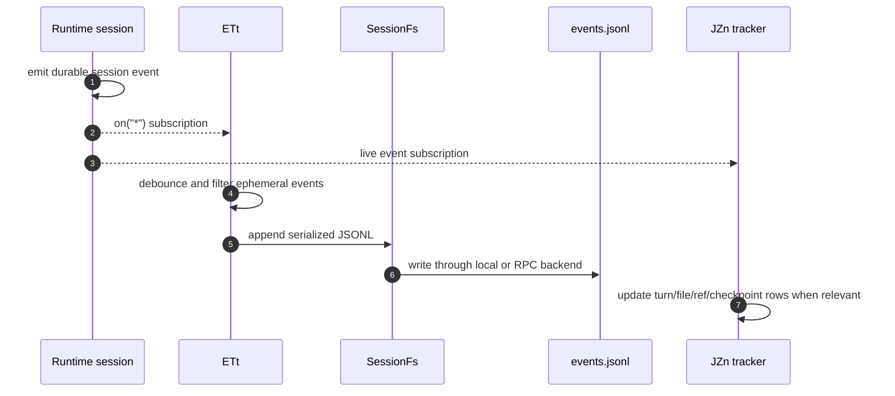
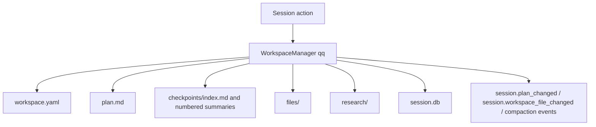

# Session persistence, replay, and indexing

This page maps the Copilot CLI session persistence stack end to end: raw JSONL events, `SessionFs`, workspace sidecar files, SQLite indexing, dynamic context storage, search/reindex, fork, checkpoint, rewind, and cloud sync. It fills the gap between the broad [session lifecycle](conversation-session-end-to-end.md), the [SessionFs provider](session-fs-provider-and-state-files.md), and [session-store SQLite indexing](session-store-sqlite-indexing.md).

The key idea is that the CLI has several persistence layers with different authority levels. `events.jsonl` is the local replay source of truth; workspace files store human-readable sidecar state; `session-store.db` is a derived searchable index; remote/cloud state is an optional synchronization/export layer.

Because `app.js` is bundled/minified, source anchors below are search aids for this extracted package, not stable API names.

## Source anchors

| Layer | Semantic alias | Minified anchor / string | Approx. line | Role |
|---|---|---:|---:|---|
| State roots | `SessionStatePaths` | `I1(t)`, `_y(t,e)`, `ili="session-state"` | 236, 7449 | Computes the state root and per-session directory under `.copilot`/state. |
| Event log store | `SessionEventLogStore` | `Ip=HHr(..., "session", ...)`, `events.jsonl`, `.jsonl` | 236, 4396 | Reads, appends, truncates, and lists durable JSONL events. |
| Filesystem abstraction | `SessionFsBase` | `Zge`, `VC extends Zge`, `i1t extends Zge` | 555, 6096 | Lets the same session code write local files or SDK/RPC-backed provider files. |
| Debounced writer | `DebouncedSessionWriter` | `ETt` | 4396-4481 | Buffers non-ephemeral events and appends them through the active `SessionFs`. |
| Runtime replay | `RuntimeSessionReplay` | `ua.fromEvents`, `processEventForState` | 4471 | Rebuilds chat, system, tool, compaction, and session state from retained events. |
| Workspace sidecars | `WorkspaceManager` | `qq`, `workspace.yaml`, `plan.md`, `checkpoints`, `files`, `research`, `session.db` | 3559-3573 | Stores metadata, plans, checkpoint markdown, persistent files, research artifacts, and session-local DB state. |
| Plan/file events | `WorkspaceStateEvents` | `session.plan_changed`, `session.workspace_file_changed` | 4361, 4477-4487 | Bridges sidecar file changes back into the event stream and UI projections. |
| Compaction checkpoints | `CompactionCheckpointStore` | `persistCompactionCheckpoint(...)`, `qq.addSummary(...)`, `session.compaction_complete` | 3559, 4361, 4479 | Writes summary checkpoints and links them to compaction events. |
| Rewind truncation | `SnapshotRewind` | `truncate`, `session.snapshot_rewind`, `upToEventId`, `eventsRemoved` | 236, 4361, 4471 | Rewrites event history to a boundary and rebuilds in-memory state. |
| Fork copy | `ForkStateCopy` | `forkSession(...)`, `copyForkedSessionState(...)` | 5756 | Copies/rekeys events and workspace artifacts into a new session branch. |
| Local SQLite store | `SessionStoreDatabase` | `session-store.db`, `node:sqlite`, `DatabaseSync` | 4518, 7449 | Stores searchable/indexed session history in the CLI state directory. |
| Store schema | `SessionStoreSchema` | `sessions`, `turns`, `checkpoints`, `session_files`, `session_refs`, `search_index`, `dynamic_context_items` | 4569-4582 | Defines relational and FTS tables derived from events and sidecar files. |
| Live indexer | `SessionStoreTracker` | `JZn(...)`, post-tool hooks | 4518-4582 | Subscribes to live events and tool completions to maintain SQLite rows. |
| Reindex command | `SessionReindexCommand` | `/reindex`, `Index all session history into the session store.` | 4643-4644 | Rebuilds local SQLite rows and optionally syncs cloud session state. |
| SQL query tool | `SessionStoreSqlTool` | `session_store_sql`, `executeReadOnly`, `SQLITE_READ`, `SQLITE_SELECT` | 4518 | Exposes read-only local/global session-store queries. |
| State migration | `CopilotStateMigration` | `.copilot`, `session-state`, `session-store.db`, `command-history-state` | 7449 | Treats session-state and session-store DB as first-class persistent artifacts. |
| Cloud sync | `CloudSessionStoreSync` | `Starting cloud session sync`, `eventsUploaded`, `backfillQueued`, `analytics/backfill` | 4516, 4643-4644 | Uploads/indexes events into optional cloud session-store paths when gated. |

## Layer model

```mermaid
flowchart TD
    Session[Runtime session events] --> Writer[ETt debounced writer]
    Writer --> Jsonl[events.jsonl]

    Session --> Workspace[WorkspaceManager qq]
    Workspace --> YAML[workspace.yaml]
    Workspace --> Plan[plan.md]
    Workspace --> Checkpoints[checkpoints/*.md]
    Workspace --> Files[files/ and research/]
    Workspace --> LocalDb[session.db]

    Session --> LiveIndexer[JZn live tracker]
    Jsonl --> Reindex[/reindex scanner]
    Workspace --> Reindex
    LiveIndexer --> Store[session-store.db]
    Reindex --> Store
    Store --> FTS[search_index FTS5]
    Store --> SQL[session_store_sql]
    Store --> Chronicle[/chronicle]

    Session --> RemoteExporter[Mission Control exporter]
    Jsonl --> CloudSync[cloud session-store sync]
    CloudSync --> Cloud[cloud indexed history]
```

The layers should be read from left to right by authority:

1. runtime emits events and sidecar changes;
2. JSONL and workspace files are the local replay and artifact sources;
3. SQLite indexes selected information for search/query;
4. cloud sync/export provides optional remote visibility.

## Persistence layers and authority

| Layer | Primary files/tables | Canonical for | Rebuildable? | Notes |
|---|---|---|---:|---|
| Event log | `session-state/<id>/events.jsonl` | Local resume, replay, fork, handoff reconstruction | No, except from external backups or remote logs | Most important durable session record. |
| Workspace sidecars | `workspace.yaml`, `plan.md`, `checkpoints/`, `files/`, `research/`, `session.db` | Human-readable metadata, plans, checkpoint summaries, session-owned artifacts | Partly | Some sidecars are derived from events, but user/session artifacts may be unique state. |
| SessionFs backend | Local `VC` or RPC `i1t` provider | Where event/workspace files physically live | Depends on provider | Enables SDK-owned persistence without changing session logic. |
| SQLite store | `session-store.db` tables and `search_index` | Search, Chronicle, refs, SQL/debug query | Yes, via `/reindex`, with possible information loss versus raw events | Derived index, not the canonical event log. |
| Dynamic context board | `dynamic_context_items` table | Repository/branch memory/context board entries | Partly | Produced by memory/context workflows, not all session transcript text. |
| Cloud store/export | Mission Control/cloud session store records | Remote steering, cloud history, analytics backfill | Partly | Optional and gated; schema can differ from local SQLite. |

## Write paths

### 1. Event append path



Important behavior:

- ephemeral UI/progress events are not blindly persisted;
- `session.resume` and `session.shutdown` alone do not force meaningful persistence;
- writer failures emit ephemeral persistence errors and requeue pending events;
- large/bulky tool payloads can be reduced before appending to the event log.

### 2. Workspace sidecar path



Sidecar files are used when plain event replay is not the best representation:

| Artifact | Producer | Consumer |
|---|---|---|
| `workspace.yaml` | create/resume/update metadata path | session listing, name lookup, relevance ranking, remote export, cleanup |
| `plan.md` | plan APIs and editing/tool detection | `/session plan`, model context, checkpoint/fork copy |
| `checkpoints/*.md` | compaction checkpoint persistence | `/session checkpoints`, rewind/fork truncation, search/indexing |
| `files/` | session workspace tools and large/session-owned artifacts | tools, fork copying, session-store file indexing |
| `research/` | research and memory workflows | fork copying, session-local research artifacts |
| `session.db` | session-local database path | state that benefits from SQLite-like access inside one session |

### 3. Derived index path

```mermaid
flowchart TD
    Live[Live session events] --> Tracker[JZn]
    Tracker --> Turns[turns]
    Tracker --> Sessions[sessions]
    Tracker --> Files[session_files]
    Tracker --> Refs[session_refs]
    Tracker --> Checkpoints[checkpoints]
    Tracker --> Search[search_index]

    Existing[Existing session-state dirs] --> Reindex[/reindex]
    Reindex --> Turns
    Reindex --> Files
    Reindex --> Refs
    Reindex --> Checkpoints
    Reindex --> Search
```

`session-store.db` is optimized for query rather than replay. It tracks turns, summaries, checkpoint sections, touched files, refs, full-text search rows, and dynamic context entries. It can be regenerated from available JSONL and workspace files, but it may not preserve every detail from raw event logs.

## Read and reconstruction paths

| Operation | Reads from | Reconstructs or returns |
|---|---|---|
| `--resume <id>` / server `session.resume` | `events.jsonl` plus workspace metadata | `ua.fromEvents(...)` runtime session, then `session.resume` event. |
| `--continue` | `workspace.yaml`, event metadata, git/repo context, possibly local/remote listings | Best matching previous session for branch/repository/git-root/cwd. |
| `/session info` | live session and workspace metadata | ID, cwd, repo, branch, name, checkpoint count. |
| `/session checkpoints` | `checkpoints/index.md` and numbered checkpoint files | list or checkpoint markdown content. |
| `/fork` | source event log or in-memory non-ephemeral events plus sidecar files | new session ID, rewritten `session.start`, copied/truncated workspace artifacts. |
| `/rewind` / `/undo` | event log boundary and retained event prefix | truncated `events.jsonl`, replayed in-memory state, ephemeral `session.snapshot_rewind`. |
| `/reindex` | all session-state directories and workspace artifacts | rebuilt `session-store.db` and optional cloud sync. |
| `session_store_sql` | `session-store.db` or cloud prefetch data | read-only query results, capped/truncated for safety. |

## Fork, rewind, checkpoint, and compaction interactions

These operations are easy to confuse because all touch history boundaries.

| Operation | Mutates current event log? | Creates a new session? | Touches workspace sidecars? | Main event/schema |
|---|---:|---:|---:|---|
| `/compact` | Appends compaction events; does not remove the existing JSONL prefix by itself | No | Writes checkpoint markdown and updates `summary_count` | `session.compaction_start`, `session.compaction_complete` |
| `/rewind` / `/undo` | Yes, truncates `events.jsonl` before the target event | No | Can require checkpoint/workspace state alignment | `session.snapshot_rewind` ephemeral update |
| `/fork` | No for the source; writes a rewritten prefix to the destination | Yes | Copies/rekeys `workspace.yaml`, `plan.md`, `checkpoints/`, `files/`, `research/` | fork-info events and rewritten `session.start` |
| `/reindex` | No | No | Reads sidecars and checkpoint markdown | SQLite rows and optional cloud sync results |

Compaction is semantic compression of current conversation state. Rewind is event-log truncation. Fork is branch creation. Reindex is derived-store rebuild. They share inputs but have different authority and safety properties.

## SessionFs and provider-owned persistence

The persistence pipeline is filesystem-agnostic. `SessionFs` abstracts file operations, path conventions, and lock keys:

| Backend | Typical context | Persistence implication |
|---|---|---|
| Local `VC` | TUI, prompt, normal CLI/server without a custom provider | Files live under the local CLI state root. |
| RPC `i1t` | SDK/server client installed `sessionFs.setProvider` | The connected SDK client owns the provider filesystem; runtime file operations become reverse calls. |

Provider mode matters because the same `events.jsonl`, checkpoints, plans, and large-output temp files may not be on the CLI host filesystem. Docs and debugging tools should identify the active `SessionFs` backend before assuming local paths.

## Search, Chronicle, and SQL are derived consumers

`session-store.db` supports:

- full-text search through `search_index`;
- session metadata queries through `sessions`;
- turn analysis through `turns`;
- file/ref discovery through `session_files` and `session_refs`;
- checkpoint summary retrieval through `checkpoints`;
- dynamic context board entries through `dynamic_context_items`;
- read-only SQL via `session_store_sql`;
- Chronicle standup/tips/improvement flows.

The read-only SQL authorizer permits read/select/function/recursive-style operations and rejects mutation. This makes the query tool suitable for debugging and reports without turning the model into a write-capable database client.

## Staleness and recovery

| Symptom | Likely layer | Recovery or interpretation |
|---|---|---|
| Session resumes but does not appear in search | SQLite index stale or missing | Run `/reindex`; raw `events.jsonl` may still be fine. |
| Search result lacks a detailed tool payload | Derived index intentionally summarized or filtered | Inspect raw event log or session workspace artifacts if safe. |
| `/session checkpoints` missing entries after compaction failure | Workspace checkpoint write failed or compaction failed before persistence | Check `session.compaction_complete` status and logs. |
| Forked session misses later checkpoints | Fork boundary excluded later compactions | Expected when forking before the later checkpoint event. |
| Provider-backed session files are not on disk locally | RPC `SessionFs` active | Inspect the SDK provider's storage, not the CLI host path. |
| Cloud history differs from local SQLite | Cloud sync schema/gating/backfill differences | Treat cloud store as a separate derived/exported view. |

## Relationship to other docs

- [Conversation session end-to-end](conversation-session-end-to-end.md) places persistence in the broader create/resume/tool/UI/shutdown path.
- [Session manager and event replay](session-manager-and-event-replay.md) explains `P6`, `ua`, `ETt`, `Ip`, `qq`, local/remote managers, and startup resolution.
- [SessionFs provider and state-file lifecycle](session-fs-provider-and-state-files.md) explains local versus SDK/RPC filesystem backends.
- [Session-store SQLite indexing](session-store-sqlite-indexing.md) explains schema, FTS, `/reindex`, Chronicle, and cloud sync in more detail.
- [Checkpoints, undo, rewind, and fork](../02-context-model-loop/checkpoints-undo-rewind.md) explains user-visible rollback/branching behavior.
- [Conversation compaction](../02-context-model-loop/conversation-compaction.md) explains checkpoint-producing semantic compression.
- [Memory and dynamic context board](../02-context-model-loop/memory-and-context-board.md) explains the long-term context entries stored beside session history.
