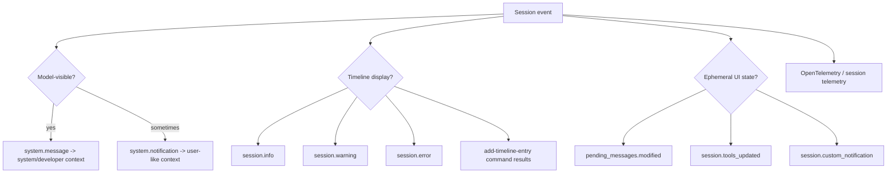
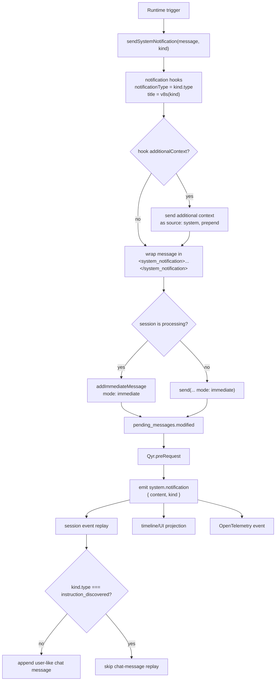

# System events and UI projection

## Internals scope

> **Why this page is here:** This page belongs to [Sessions, persistence, and remote](README.md). It explains a durable-state or protocol facet: event replay, SessionFs, SQLite/FTS indexing, repository context, remote/cloud steering, or UI projection. Pair it with [Runtime lifecycle](../01-runtime-lifecycle/README.md) for the mode that creates the session and [Context and model loop](../02-context-model-loop/README.md) for how session history becomes model context.

This document explains how system-level session events become model context, timeline entries, telemetry, and UI updates in the extracted Copilot CLI bundle. In the analyzed `app.js`, events such as `system.message`, `system.notification`, `session.info`, `session.warning`, `session.error`, `pending_messages.modified`, and `session.custom_notification` are not equivalent. Some are model-visible, some are timeline-only, some are ephemeral UI state, and some are telemetry-only.

Because `app.js` is bundled/minified, symbol names are unstable. Line references below are searchable anchors in the extracted bundle and will shift across releases.

## Source anchors

| Semantic alias | Minified anchor | Approx. `app.js` line | Role |
|---|---|---:|---|
| System prompt event | `system.message`, `upsertSystemContextMessage` | 4361, 4471, 4475 | System/developer messages update model-visible system context. |
| System notification schema | `E6s`, `b6s`, `f6s`, `g6s`, `A6s`, `m6s`, `h6s`, `y6s` | 4361 | Defines `system.notification` and the structured `kind` union. |
| System notification sender | `sendSystemNotification(...)`, `v8s(...)`, `Qyr.preRequest(...)` | 4471, 4479, 4481 | Wraps notification text in XML, fires hooks, queues immediate system prompts, and emits `system.notification`. |
| Instruction discovery notification | `instruction_discovered`, `onFileAccessed`, `I8s(...)` | 4361, 4471, 4481 | Directly emits a notification when on-demand instruction loading discovers new instruction files. |
| Info/warning/error events | `session.info`, `session.warning`, `session.error` | 4361, 4396 | Timeline display messages with category and optional URL. |
| Notification API bridge | `level`, `info`, `warning`, `error`, `emitEphemeral` | 4396 | A notification helper maps severity to session info/warning/error events. |
| Pending queue update | `pending_messages.modified` | 4361, 4471, 4479 | Empty ephemeral event tells clients prompt queue state changed. |
| Custom notifications | `session.custom_notification`, `payload`, `mcp task event callback` | 4361, 4481 | Opaque source-defined notifications, including MCP task events. |
| Tool/capability state | `session.tools_updated`, `session.context_changed`, `session.mode_changed` | 4361, 4471, 4475 | UI/state update events that are not ordinary chat messages. |
| Telemetry projection | `SYSTEM_NOTIFICATION`, `github.copilot.system.notification.*` | 5742 | System notifications are projected into OpenTelemetry attributes/events. |
| Timeline entries | `add-timeline-entry`, `timeline`, `onSystemNotification`, `IFa(...)`, `jze(...)` | 1739, 4644, 4783, 6860 | Command handlers return timeline entries; renderer maps event-like records to UI/Markdown. |
| Ephemeral event helper | `emitEphemeral` | 4207+ | Streaming, queue, tool, and status updates can be emitted without durable conversation semantics. |

## Event categories



The important design point is that session events have multiple projections. The same event stream can drive model replay, terminal UI, ACP/JSON-RPC clients, remote control, telemetry, and persistence.

## `system.message`

`system.message` is the clearest model-visible system event. Its schema includes:

| Field | Meaning |
|---|---|
| `content` | System/developer prompt text sent as model input. |
| `role` | Either `system` or `developer`. |
| `name` | Optional name identifier for a developer/system message. |

During event processing, `system.message` calls `upsertSystemContextMessage(...)`. That method maintains a system context message list and updates `currentSystemMessage` when the role is `system` and content is string text.

This means `system.message` is not just UI copy. It mutates the model context used for future calls.

## `system.notification`

`system.notification` is runtime-generated notification text, typically wrapped in `<system_notification>` XML tags. Its schema includes:

| Field | Meaning |
|---|---|
| `content` | Notification text. |
| `kind` | Structured metadata identifying what triggered it. |

The event processor treats most `system.notification` events as user-like model context by pushing a `{ role: "user", content }` chat message. There is one important exception: if the kind is `instruction_discovered`, it is not pushed into `_chatMessages` during replay.

That exception avoids turning every dynamic instruction discovery notice into persistent user prompt content while still allowing the UI/telemetry to show that an instruction file was discovered.

### System notification lifecycle

Most runtime notifications go through `sendSystemNotification(message, kind)`:



Two details matter:

- The model sees system notifications as **user-role content** containing the XML-wrapped `<system_notification>` block, not as a new provider-level role.
- `instruction_discovered` is unusual: the on-demand instruction loader emits `system.notification` directly from the file-access callback instead of calling `sendSystemNotification(...)`, and replay filters it out of model chat history. The actual instruction text is loaded through the dynamic instruction pipeline.

The system prompt includes a companion `<system_notifications>` rule telling the model to acknowledge relevant notifications briefly, avoid repeating them verbatim, and never generate its own `<system_notification>` tags. That prompt contract is cataloged in [`app-js-prompt-catalog.md`](../02-context-model-loop/app-js-prompt-catalog.md#system-notifications-prompt).

### System notification kinds

`kind` is a discriminated union (`b6s`) with six observed variants:

| `kind.type` | Required fields | Optional fields | Trigger/source | Model/UI behavior |
|---|---|---|---|---|
| `agent_completed` | `agentId`, `agentType`, `status` (`completed` or `failed`) | `description`, `prompt` | Background agent task completion callback. `sendBackgroundAgentCompletionNotification(...)` tells the main agent to call `read_agent` for full results. | Model-visible as a user-like system notification; timeline text is `Background agent "..." (...) completed/failed`, with the original agent prompt as detail when available. |
| `agent_idle` | `agentId`, `agentType` | `description` | Multi-turn/background agent idle callback. `sendBackgroundAgentIdleNotification(...)` tells the main agent it can `read_agent` or `write_agent`. | Model-visible; timeline text says the background agent completed/idle. |
| `shell_completed` | `shellId` | `exitCode`, `description` | Background shell completion callback for non-detached shell sessions. | Model-visible; timeline text reports completion or `exited (code N)`. |
| `shell_detached_completed` | `shellId` | `description` | Detached shell completion callback. | Model-visible; timeline text reports detached-shell completion. |
| `new_inbox_message` | `entryId`, `senderName`, `senderType`, `summary` | none | Sidekick/plugin/hook inbox entry. `sendInboxNotification(...)` tells the main agent it may call `read_inbox(entry_id=...)` if useful. | Model-visible, but `jze(...)` filters it from the normal timeline projection to avoid duplicating inbox UI state. |
| `instruction_discovered` | `sourcePath`, `triggerFile`, `triggerTool` | `description` | On-demand instruction discovery after a file access, currently from the `view`-style access path. | UI/telemetry-visible, but filtered from model chat replay; the dynamic instruction loader handles the instruction content itself. |

`v8s(kind)` also derives the title passed into notification hooks:

| `kind.type` | Hook title fallback |
|---|---|
| `agent_completed` | `Agent ${agentId} completed` or `Agent ${agentId} failed` |
| `agent_idle` | `Agent ${agentId} idle` |
| `new_inbox_message` | `Inbox entry ${entryId} from ${senderName}` |
| `shell_completed` | `description` or `Shell completed` |
| `shell_detached_completed` | `description` or `Detached shell completed` |
| `instruction_discovered` | `description` or `Discovered instruction: ${sourcePath}` |

`notifyPermissionPrompt(...)` also uses the notification hook path with `notificationType: "permission_prompt"`, but it does **not** emit a `system.notification` event. Treat it as hook-only notification plumbing rather than a system-notification kind.

## Instruction discovery notifications

When on-demand instructions are enabled, file access can discover additional instruction sources. The runtime emits:

```text
system.notification({
  content: "Discovered instruction: <path>",
  kind: {
    type: "instruction_discovered",
    sourcePath,
    triggerFile,
    triggerTool,
    description
  }
})
```

The notification is visible as a runtime event and telemetry signal, but the chat-message replay path filters it out from model-visible user content. The actual instruction content is handled through the dynamic instruction loader, not by relying on the notification text as the instruction.

## `session.info`, `session.warning`, and `session.error`

These events are timeline/status messages rather than prompt messages.

| Event | Typical purpose |
|---|---|
| `session.info` | Informational timeline message: timing, context window, MCP, snapshot, configuration, auth, model, notification. |
| `session.warning` | Warning timeline message: subscription, policy, MCP, resume continuity, notification. |
| `session.error` | Error timeline message: auth, authorization, quota, rate limit, context limit, query, notification, IDE, etc. |

The event schemas include category fields (`infoType`, `warningType`, `errorType`), human-readable `message`, and optional `url` for user action.

A notification helper maps severity levels:

| Input level | Emitted event |
|---|---|
| `info` or missing | `session.info` |
| `warning` | `session.warning` |
| `error` | `session.error` |

Each can be emitted as durable or ephemeral depending on the notification request.

## Ephemeral event semantics

Many UI events are emitted through `emitEphemeral(...)`. Ephemeral events are useful for live clients but do not always carry durable conversation meaning.

Examples include:

| Event | Meaning |
|---|---|
| `assistant.message_delta` | Streaming assistant text chunk. |
| `assistant.reasoning_delta` | Streaming reasoning/summary chunk. |
| `assistant.streaming_delta` | Streaming byte/size update. |
| `pending_messages.modified` | Prompt queue changed. |
| `tool.execution_progress` | Tool/MCP progress update. |
| `session.tools_updated` | Tool definitions changed. |
| `session.extensions_loaded` | Extension state changed. |
| `session.custom_notification` | Source-defined notification payload. |

Ephemeral does not mean unimportant. It means the event is primarily a live UI/protocol state update rather than a stable model message.

## `pending_messages.modified`

This event has an empty payload. Its only meaning is that the pending prompt/message queue changed.

It is emitted when:

- immediate prompts are injected;
- queued messages are shifted for processing;
- a prompt is enqueued while processing is active;
- queue processing is stopped/cleared by a command handler.

Clients use it to refresh queue indicators, pending prompt counts, or status displays.

## `session.custom_notification`

`session.custom_notification` carries opaque custom notification data with a source-defined payload. The schema includes version/source/subject/payload-like fields rather than a fixed event-specific shape.

MCP task event callbacks emit this event after converting task events into custom notification payloads. This gives external subsystems a way to notify the TUI/ACP clients without adding a new first-class session event for every source.

## State-update events

Some events update UI state or telemetry but are not chat messages:

| Event | Role |
|---|---|
| `session.context_changed` | Working directory/Git context changed. |
| `session.mode_changed` | Agent mode changed, e.g. interactive/plan/autopilot. |
| `session.tools_updated` | Available tools changed for the selected model/session. |
| `session.skills_loaded` | Skill catalog changed. |
| `session.custom_agents_updated` | Custom agent catalog changed. |
| `session.mcp_servers_loaded` | MCP server list/status changed. |
| `session.mcp_server_status_changed` | One MCP server status changed. |
| `session.extensions_loaded` | SDK extension list/status changed. |

The event processor recognizes these events and avoids treating them as unknown errors, but they do not become model-visible chat messages by default.

## Timeline entries from command results

Slash command handlers often return objects like:

```text
{ kind: "add-timeline-entry", entry: { type: "info" | "error" | "copilot" | ..., text } }
```

These are not the same as session events in the persisted event schema, but the TUI projection layer renders them into the visible timeline. Examples appear in LSP commands, plugin commands, MCP commands, reindexing, and many diagnostics commands.

The renderer also has timeline entry handlers such as `onSystemNotification`, `onToolCallRequested`, `onToolCallCompleted`, and `onCompaction`, which convert internal timeline records into terminal/Markdown output.

## Telemetry projection

OpenTelemetry projection has a separate mapping. The scan found constants such as:

- `github.copilot.system.notification`;
- `github.copilot.system.notification.type`;
- `github.copilot.system.notification.agent_id`;
- `github.copilot.system.notification.agent_type`;
- `github.copilot.system.notification.status`;
- `github.copilot.system.notification.shell_id`;
- `github.copilot.system.notification.exit_code`.

This means system notifications can be represented in telemetry even when they are filtered from chat replay or displayed only as timeline state.

## Model-visible versus UI-visible

| Event/result | Model-visible? | UI-visible? | Notes |
|---|---|---|---|
| `system.message` | Yes | Usually not as ordinary chat | Updates system/developer context. |
| `system.notification` | Usually yes | Yes | Except `instruction_discovered` is filtered from chat replay. |
| `session.info` | No | Yes | Timeline/status display. |
| `session.warning` | No | Yes | Timeline/status display. |
| `session.error` | No direct prompt role | Yes | Also telemetry and control-flow effects. |
| `pending_messages.modified` | No | Yes | Ephemeral queue state. |
| `session.custom_notification` | No by default | Yes | Opaque event for clients. |
| `add-timeline-entry` command result | No by itself | Yes | Command handler UI projection. |

## Relationship to other docs

- `session-manager-and-event-replay.md` explains event-sourced session persistence and replay.
- `built-in-tools-execution-events.md` explains tool lifecycle events.
- `hooks-events-and-automation.md` explains hook events and notification hooks.
- `remote-control-protocol-and-steering.md` explains which events are exported to remote clients.
- `telemetry-update-and-shutdown.md` explains telemetry/logging projections.
