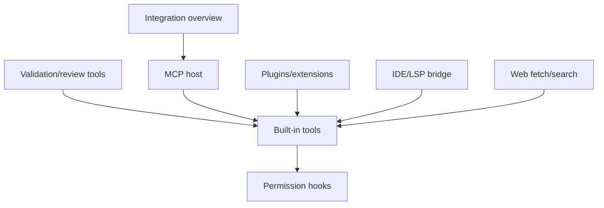

# Tools and integrations

Built-in tools, validation/review tools, MCP, plugins, IDE/LSP/editor bridges, web access, and integration overview surfaces.

## Semantic alias and minified anchor mapping

This is a section index, not a direct `app.js` implementation analysis. Topic pages linked below carry the concrete bundle mappings.

| Semantic alias | Minified anchor | Scope |
|---|---|---|
| Tools and integrations section index | N/A — navigation page | Groups tool, MCP, plugin, IDE/LSP, web, and integration overview docs. |
| Tools and integrations topic pages | See linked page-level mappings | Concrete `app.js` anchors are documented in the child pages. |

## How this section fits

## Pages

| Page | Why read it | File |
|---|---|---|
| [Built-in tool execution pipeline](./built-in-tool-execution-pipeline.md) | Tool registration, model-visible schemas, permission/hook flow, execution events, streaming, and telemetry. | `built-in-tool-execution-pipeline.md` |
| [Coding-agent validation and review toolchain](./coding-agent-validation-toolchain.md) | `parallel_validation`, `code_review`, CodeQL, secret scanning, advisory checks, trivial-change declarations, budgets, and validation telemetry. | `coding-agent-validation-toolchain.md` |
| [MCP support implementation in the Copilot CLI](./mcp-support-implementation.md) | MCP config discovery, transports, host lifecycle, tool exposure, OAuth, permissions, and tasks. | `mcp-support-implementation.md` |
| [Plugin and extension architecture](./plugin-extension-architecture.md) | Plugin install/cache/config lifecycle, marketplaces, local plugin dirs, contributions, and SDK loading. | `plugin-extension-architecture.md` |
| [IDE, LSP, and editor integration](./ide-lsp-editor-integration.md) | IDE tools, selections, diagnostics, diffs, session title sync, LSP config, and extension state. | `ide-lsp-editor-integration.md` |
| [Web search, URL fetching, and URL permissions](./web-search-url-fetching.md) | Built-in web_fetch, GitHub MCP web_search, URL allow/deny persistence, and web-tool gates. | `web-search-url-fetching.md` |
| [Integrations, permissions, auth, and config workflows](./integrations-permissions-config.md) | Cross-cutting overview of MCP, plugins, permissions, auth/provider selection, login, and updates. | `integrations-permissions-config.md` |

## Reading guidance

- Start with the generic tool pipeline, then read validation/review and specific integration sources.
- MCP, plugins, IDE, and web are different tool providers/bridges.

## Back to wiki home

- [Wiki home](../README.md)
- [Full table of contents](../SUMMARY.md)
