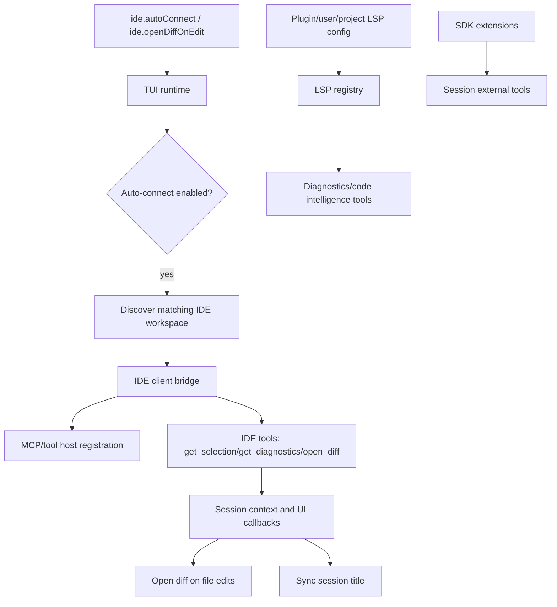

# IDE, LSP, and editor integration

This document explains how the extracted Copilot CLI bundle integrates with IDE/editor state and language-server configuration. In the analyzed `app.js`, IDE support is built around a session-connected IDE client, a small set of IDE tools, TUI settings for auto-connect and diff display, and an LSP registry that can load user/project/plugin language-server configs.

The implementation is intentionally optional. The CLI can run headless without an IDE, but when an IDE connection is available it can pull selection/diagnostic context, open editor diffs for file edits, synchronize the session title, and register IDE-related capabilities on the MCP/tool host.

Because `app.js` is bundled/minified, symbol names are unstable. Line references below are searchable anchors in the extracted bundle and will shift across releases.

## Source anchors

| Area | Anchor strings / minified symbols | Approx. `app.js` line | What it shows |
|---|---|---:|---|
| IDE tool names | `get_diagnostics`, `get_selection`, `open_diff`, `$S="ide"` | 1340 | Built-in IDE method names and selection/diagnostic schemas. |
| IDE config | `ide:{autoConnect,openDiffOnEdit}` | 239 | User/runtime settings for IDE auto-connect and diff display. |
| IDE client bridge | `callIdeTool(...)`, `isConnectedToIde()`, `updateSessionName(...)` | 6024 | Runtime bridge that calls tools on the connected IDE client. |
| Auto-connect UI | `Auto-connect to matching IDE workspace`, `Open file edit diffs in IDE` | 6574 | TUI settings dialog for IDE behavior. |
| Open diff on edit | `callIdeTool("open_diff", ...)`, `close_diff` | 6689 | TUI/session edit callbacks can open and close IDE diff tabs. |
| Title sync | `session.title_changed`, `update_session_name` | 6689, 6024 | Session names are pushed to the IDE when connected. |
| LSP schema | `lspServers` | 525 | Language-server config schema. |
| Plugin LSP loading | `Loaded ... LSP servers from ... plugins`, `sourcePlugin` | 528 | Enabled plugins can contribute LSP servers. |
| LSP command | `Manage language server configuration`, `/lsp test`, `/lsp reload` | 4785 | Interactive LSP management surface. |
| Extension state | `setupExtensionsForSession`, `session.extensions_loaded` | 6100, 4361 | SDK extension tools are registered on sessions and reported to clients. |

## Runtime map



## IDE connection model

The IDE bridge uses the name `ide` internally. It maintains:

| Runtime state | Role |
|---|---|
| IDE client | Object used to call IDE-provided tools. |
| IDE transport | Connection transport registered in the host/registry. |
| connected IDE info | IDE name and workspace folder metadata. |
| latest IDE selection | Cached editor selection context. |
| disconnected callback | Cleanup/reaction path when IDE disconnects. |

The `isConnectedToIde()` method returns true only when both the IDE client and connected IDE metadata exist. If no IDE is connected, `callIdeTool(...)` logs that the IDE tool call was skipped and returns `null` rather than failing the whole session.

## IDE tools

The bundle defines three core IDE method names:

| Tool/method | Purpose |
|---|---|
| `get_selection` | Retrieve current editor selection(s), including file path/URL and range metadata. |
| `get_diagnostics` | Retrieve editor/LSP diagnostics. |
| `open_diff` | Ask the IDE to open a diff for generated file edits. |

The schema around line `1340` includes selection range objects with `line`, `character`, `start`, `end`, `isEmpty`, and file metadata. This shows that editor selection is structured context, not just pasted text.

## Calling IDE tools

The bridge method `callIdeTool(name, arguments)` performs these steps:

1. If no IDE client is connected, log and return `null`.
2. Build a debug label for the call.
3. Use a very large timeout for `open_diff`, because opening a diff is user-facing and may take longer than normal tool calls.
4. Call the IDE client tool with `{ name, arguments }`.
5. Log completion or catch/log failure and return `null`.

`updateSessionName(name)` is a thin wrapper over `callIdeTool("update_session_name", { name })`.

## Auto-connect and TUI settings

The config schema includes:

| Setting | Default behavior implied by UI code |
|---|---|
| `ide.autoConnect` | Auto-connect unless explicitly set to `false`. |
| `ide.openDiffOnEdit` | Open IDE diffs for file edits unless explicitly set to `false`. |

The TUI settings dialog exposes:

- “Auto-connect to matching IDE workspace”;
- “Open file edit diffs in IDE”.

During TUI startup, if there is an IDE bridge object, no existing IDE connection, `ide.autoConnect !== false`, and the session is not already in use, the CLI tries to connect to a matching IDE workspace based on the current working directory.

## File edit diff workflow

When connected and `openDiffOnEdit` is enabled, file edit callbacks call:

```text
open_diff({
  original_file_path,
  new_file_contents,
  tab_name
})
```

The return value is normalized by a diff-result parser. A companion `close_diff` call can close the corresponding tab. This lets the CLI show file edits in the user's IDE while still running the model/tool loop in the terminal.

The diff workflow is conditional. If no IDE is connected or `openDiffOnEdit` is false, the CLI falls back to terminal/TUI rendering.

## Session title synchronization

The TUI subscribes to `session.title_changed`. When the IDE is connected, it calls `updateSessionName(...)`, which forwards the new title through the IDE bridge as `update_session_name`.

This keeps the IDE-side session UI aligned with `/rename`, model-derived title updates, or resumed session metadata.

## IDE connection and MCP host registration

The IDE bridge can register itself on the session MCP/tool host when one exists. The flow around line `6689` shows:

1. connect to a matching IDE workspace;
2. emit `session.info` or `session.error` depending on result;
3. add approved rules for the IDE server name;
4. register IDE on the MCP host;
5. update the IDE session name from the workspace name.

This is why the IDE integration appears near MCP startup and extension loading code. The bridge uses the same host/transport patterns as other tool integrations while exposing IDE-specific methods.

## LSP configuration

LSP support is separate from the IDE bridge but feeds related code-intelligence behavior.

The schema around line `525` validates an `lspServers` object. Each server name must be non-empty and contain only alphanumeric characters, underscores, and hyphens. Server configs include spawn/request/initialization timeout settings and disabled markers.

The interactive command surface around line `4785` supports:

| Command | Purpose |
|---|---|
| `/lsp` or `/lsp show` | Display configured language servers and status. |
| `/lsp test <name>` | Test whether a language server starts correctly. |
| `/lsp reload` | Reload LSP configuration from disk. |
| `/lsp help` | Display usage and config paths. |

The help text points users to user config and project config such as `.github/lsp.json`.

## Plugin-provided LSP servers

Plugins can include `lspServers` in their manifest. The plugin LSP loader:

1. loads global/user LSP config;
2. scans enabled installed plugins;
3. resolves plugin cache paths;
4. reads plugin LSP config from plugin metadata or companion files;
5. validates and normalizes server definitions;
6. tags entries with `sourcePlugin` metadata;
7. adds them to the runtime LSP registry.

This makes plugin-provided LSPs first-class LSP servers while preserving their source for display/debugging.

## SDK extensions and editor state

The `session.extensions_loaded` event is not IDE-specific, but it is part of the same editor/tool integration story. When `EXTENSIONS` is enabled, `setupExtensionsForSession(...)` registers SDK extension tools on the session and emits extension status.

An extension can therefore add tools or hooks that interact with project/user state, while IDE tools add editor selection, diagnostics, and diff display. Both become session external tools and both are represented through session events.

## Failure modes

| Failure | Runtime behavior |
|---|---|
| No IDE connected | `callIdeTool` logs a skipped call and returns `null`. |
| IDE connection fails | Session emits `session.error` with `errorType: "ide"`. |
| IDE disconnects | Transport/client entries are removed and disconnect callbacks run. |
| `open_diff` fails | Error is logged; terminal/TUI remains the fallback display. |
| LSP config invalid | `/lsp` commands return error timeline entries or warnings. |
| Plugin LSP missing/invalid | Loader skips or warns without disabling all plugins. |

## What this integration enables

When connected, the IDE/LSP/editor bridge lets the CLI:

- understand the current selection as structured context;
- retrieve editor diagnostics;
- open rich file-edit diffs in the IDE;
- synchronize session names with the IDE UI;
- register IDE-related tools through the session host;
- load language servers from user, project, and plugin config;
- expose extension state to the TUI/ACP clients.

When disconnected, the CLI still works as a terminal-first agent. IDE integration is an optional enhancement rather than a hard dependency.

## Relationship to other documents

- `tui-and-slash-commands.md` explains the interactive host that owns IDE dialogs/settings.
- `plugin-extension-architecture.md` explains plugin/extension sources for LSP and tools.
- `built-in-tool-execution-pipeline.md` explains how external tools become session tool events.
- `permission-system-design.md` covers extension/IDE-adjacent permission boundaries.
- `tree-sitter-wasm-usage.md` covers terminal-side diff highlighting when IDE diff display is not the active path.
