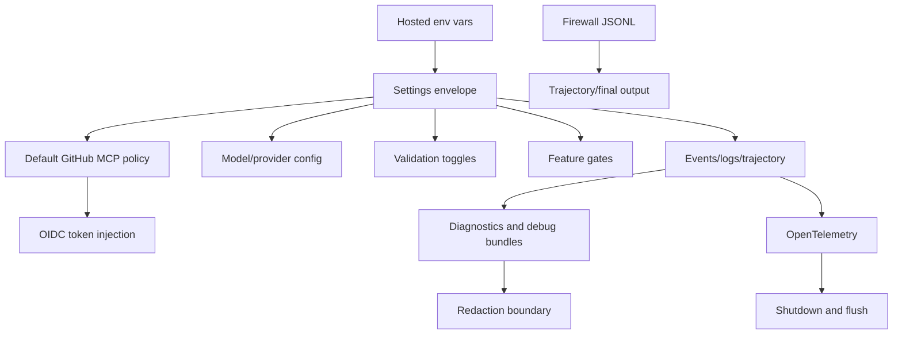

# Hosted agent ops

This chapter collects runtime contracts that only become obvious when the CLI is viewed as a hosted coding-agent worker: job environment variables, hosted settings construction, GitHub MCP defaults, OIDC token exchange, feature gates, diagnostics, debug bundles, OpenTelemetry, firewall logs, trajectory output, and shutdown behavior.

Read this chapter when the question is: **how does the same agent runtime behave inside a hosted GitHub/coding-agent job, and which operational surfaces control or observe it?**

## Source-anchor policy

This page is a chapter guide. Linked implementation pages carry concrete `app.js` anchors.

| Semantic alias | Minified anchor | Scope |
|---|---|---|
| Hosted agent ops chapter | N/A — navigation page | Groups hosted-agent environment contracts, MCP/OIDC bootstrap, feature gates, diagnostics, debug bundles, OTel switches, support artifacts, and shutdown. |
| Hosted implementation pages | See linked source-anchor tables | Concrete bundle anchors live in the destination pages. |

## Hosted operations map

## Primary reading order

| Order | Page | Hosted/runtime question answered |
|---:|---|---|
| 1 | [Hosted agent environment](hosted-agent-environment.md) | Which `COPILOT_AGENT_*` settings, MCP/OIDC bootstrap values, OTel switches, firewall logs, trajectory outputs, and managed-agent SDK watchpoints are real runtime surfaces? |
| 2 | [Feature gates and rollout logic](feature-gates.md) | How do static gates, env/settings overrides, remote experiments, repo/team allowlists, and MCP permission gates affect behavior? |
| 3 | [Diagnostics, feedback, and debug bundles](diagnostics-feedback-debug-bundles.md) | How do `/diagnose`, `/feedback`, `/bug`, `/collect-debug-logs`, local archives, and secret gist uploads work? |
| 4 | [Debug bundle and redaction boundaries](debug-bundle-redaction-boundaries.md) | What can enter a diagnostic bundle, which redaction layers apply, and where support-sharing caveats remain? |
| 5 | [Telemetry, update, and shutdown](telemetry-update-and-shutdown.md) | How are logging, telemetry, OpenTelemetry, update/version behavior, debug artifacts, signal handling, and graceful shutdown coordinated? |

## Operational boundaries

| Boundary | Primary page | Notes |
|---|---|---|
| Hosted settings construction | [Hosted agent environment](hosted-agent-environment.md) | `TWe()` turns job/env state into a settings envelope. |
| Default hosted MCP policy | [Hosted agent environment](hosted-agent-environment.md) and [MCP host, transports, and tools](../03-tools-integrations-security/mcp-host-transport-and-tools.md) | Hosted defaults overlay generic MCP host behavior. |
| Redaction and support artifacts | [Debug bundle and redaction boundaries](debug-bundle-redaction-boundaries.md) | Debug bundles are operational artifacts, not guaranteed clean-room exports. |
| Runtime telemetry | [Telemetry, update, and shutdown](telemetry-update-and-shutdown.md) | OTel can be enabled by Copilot-specific or standard OTLP env vars. |

## Handoffs

- Generic tool/MCP implementation is covered by [Tools, integrations, and security](../03-tools-integrations-security/README.md).
- Remote/cloud session behavior outside the hosted environment envelope is covered by [Sessions, persistence, and remote](../04-sessions-persistence-remote/README.md).

## Navigation

- [Start here](../00-start-here/README.md)
- [Full table of contents](../SUMMARY.md)
