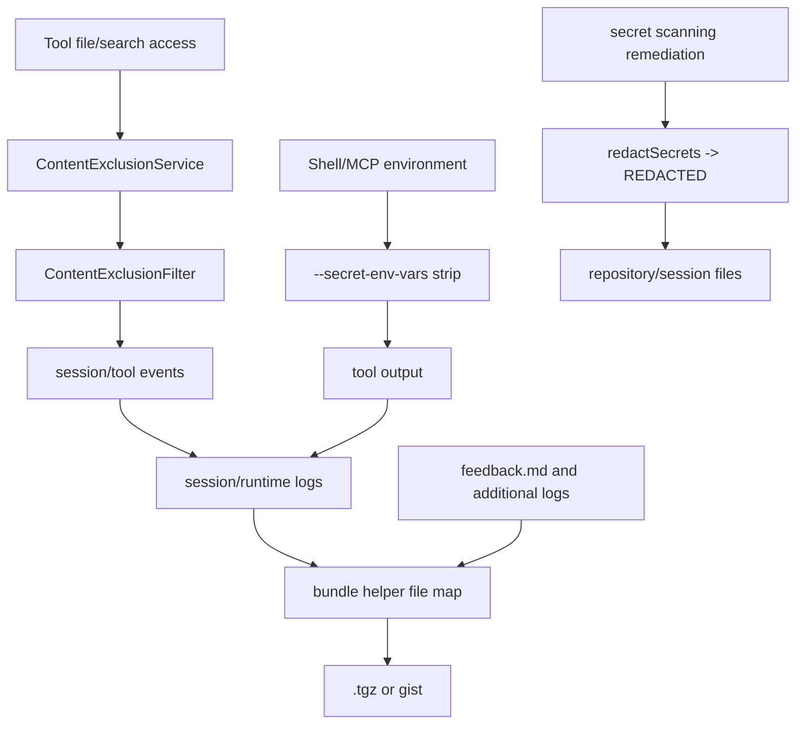

# Debug bundle and redaction boundaries

This page documents the safety boundary around Copilot CLI diagnostics, feedback bundles, debug-log collection, and redaction. It fills a gap between [Diagnostics, feedback, and debug bundles](diagnostics-feedback-debug-bundles.md), [Content exclusion and redaction](../03-tools-integrations-security/content-exclusion-and-redaction.md), and [Observability, update, and shutdown workflows](observability-update-shutdown.md).

The important conclusion is conservative: debug collection has filtering/redaction helpers and relies on existing secret/content-exclusion mechanisms, but the analyzed bundle does not prove a total data-loss-prevention guarantee for every possible log or user-supplied additional file. Debug bundles should be treated as deliberate support artifacts that may contain sensitive operational context.

Because `app.js` is bundled/minified, anchors below are approximate search anchors for this extracted package.

## Source anchors

| Area | Semantic alias | Minified anchor / string | Approx. line | Role |
|---|---|---:|---:|---|
| Diagnose command | `DiagnoseCommand` | `/diagnose`, `Analyze the current session log` | 4643, 4934 | Reads the current session log tail and asks an agent to analyze it. |
| Feedback command | `FeedbackCommand` | `/feedback`, `/bug`, `Provide feedback about the CLI` | 4643, 4942 | Opens the feedback dialog with session/log paths and optional log collection. |
| Collect command | `CollectDebugLogsCommand` | `/collect-debug-logs`, `file`, `gist`, `Collect debug logs to .tgz file or GitHub gist` | 4643, 5023 | Packages current debug/session logs into a local archive or secret gist. |
| Feature gates | `DebugCollectionGates` | `DIAGNOSE:"staff"`, `COLLECT_DEBUG_LOGS:"staff"`, `collectDebugLogsEnabled` | 239, 7344 | Controls whether diagnostics and debug collection commands are visible/enabled. |
| Runtime debug paths | `DebugLogPaths` | `debugLogPaths`, `sessionFile`, `logFile` | 4940, 4942, 5023 | Supplies known session/runtime log files to feedback and collection commands. |
| Bundle helper | `DebugBundleBuilder` | `feedback.md`, `feedback-manifest.json`, `additional-logs`, `No files to include in feedback bundle` | 4515 | Builds a named file map for feedback/debug archives. |
| Archive output | `LocalDebugArchive` | `copilot-debug-logs-<id>.tgz`, `copilot-debug-logs-${Date.now()}` | 4515, 5023, 8225 | Creates local `.tgz` files via a temporary staging directory. |
| Gist upload | `SecretGistDebugUpload` | `POST /gists`, `public:false`, `secret GitHub gist` | 4515, 5023 | Uploads bundle entries to an unlisted GitHub gist when requested. |
| Root flags | `RootDebugCollectionFlags` | `--collect-debug-logs <sessionId>`, `--collect-debug-logs-output <path>` | 8225 | Allows non-interactive staff-gated collection by session ID. |
| Logging setup | `LoggingService` | `--log-dir`, `--log-level`, log setup in root action | 8298 | Configures runtime log writers before session modes start. |
| Secret env vars | `SecretEnvVarRedaction` | `--secret-env-vars`, `stripped from shell and MCP server environments and redacted from output` | 8225 | User-declared secret names are stripped from tool environments and redacted from output. |
| Content exclusion | `ContentExclusionService` | `CONTENT_EXCLUSION`, `ContentExclusionFilter`, `excludedCount` | 239, 559-561, 4198 | Blocks/filters excluded path/content from normal tool output paths. |
| Secret scanning redaction | `SecretScanningRedaction` | `redactSecrets`, `[REDACTED]`, `Secret scanning` | 519-525 | Rewrites detected secret tokens in files after remediation attempts. |
| Shutdown flush | `ShutdownService` | `eke` | 7420 | Flushes logs/telemetry/output on normal or error exit. |

## Collection surfaces

```mermaid
flowchart TD
    User[User or staff surface] --> Diagnose[/diagnose]
    User --> Feedback[/feedback or /bug]
    User --> Collect[/collect-debug-logs]
    User --> RootFlags[root --collect-debug-logs]

    Diagnose --> Tail[read session log tail]
    Tail --> Agent[diagnosis agent prompt]

    Feedback --> Dialog[feedback dialog]
    Dialog --> Optional[optional log collection]

    Collect --> Paths[debugLogPaths sessionFile/logFile]
    RootFlags --> SessionId[resolve logs by session id]
    Paths --> Bundle[debug bundle builder]
    Optional --> Bundle
    SessionId --> Bundle

    Bundle --> Local[local .tgz]
    Bundle --> Gist[secret gist upload]
```

The three interactive commands are intentionally different:

| Surface | Collects files? | Main risk boundary |
|---|---:|---|
| `/diagnose` | No archive by itself; reads the session log tail | Sends selected log text into an agent prompt for analysis. |
| `/feedback` / `/bug` | Optional, depending on gate/dialog choice | User feedback plus optional logs become a support bundle. |
| `/collect-debug-logs` | Yes | Local archive or secret gist contains copied log/session files. |
| Root `--collect-debug-logs` | Yes | Non-interactive collection can package logs without entering TUI. |

## What can enter a bundle

Evidence shows bundle helpers collect a map of file names to string content. Known entries include:

| Entry | Source | Sensitivity notes |
|---|---|---|
| Session log file | `debugLogPaths.sessionFile` or session ID lookup | May include session events, prompts, model/tool summaries, errors, and paths. |
| Runtime log file | `debugLogPaths.logFile` / logging service | May include operational errors, provider/tool metadata, MCP/shell context, and redacted command/output text. |
| `feedback.md` | User-supplied feedback text | User may paste secrets or private context manually. |
| `feedback-manifest.json` | Bundle helper | Includes metadata such as version, timestamp, session ID, and file list. |
| `additional-logs/<name>` | Opt-in user path | Most sensitive category because user-selected files/directories may not be normal CLI logs. |

If no readable files are found, helpers throw explicit errors such as `No debug log files found to save` or `No files to include in feedback bundle`.

## Redaction layers



There are several redaction mechanisms, but they protect different stages:

| Mechanism | Applies before bundle collection? | What it protects | What it does not prove |
|---|---:|---|---|
| `--secret-env-vars` stripping/redaction | Yes, for shell/MCP environment and output paths using that redactor | User-declared environment secret values in tools/logged output | It only covers configured env var names/values and integrated output paths. |
| Content exclusion | Yes, for tool access/output paths that consult the service/filter | Restricted files/search result lines and model-visible content | It is not a generic post-hoc scrubber for arbitrary log files or extra attachments. |
| Command argument redaction | Yes, where command strings are formatted through the redaction helper | Known sensitive command argument positions in displayed/logged command strings | It does not change what was executed, only what is surfaced afterward. |
| Secret-scanning remediation | Sometimes, after generated/modified files are scanned | Detected secret tokens in files can be rewritten as `[REDACTED]` | It is remediation for files, not proof that old logs/bundles contain no copies. |
| Bundle helper filtering | At collection time | Known log/session files pass through helper code before archive/gist output | The evidence shows helper processing, but not an exhaustive DLP guarantee for every byte. |

## Boundary: normal logs versus opt-in additional files

The strongest guarantee is for data that has already passed through normal CLI control points: permission checks, content exclusion filters, secret env-var redaction, command display redaction, event sanitization, and logging helpers.

The weakest guarantee is for user-specified `additional-logs`:

- they are opt-in;
- they can point at files or directories outside normal session/log paths;
- bundle code can cap directory reads, but it cannot know the semantic sensitivity of every arbitrary file;
- content may not have been produced by the CLI and may not have gone through CLI redaction layers before collection.

For support workflows, treat additional files as user-curated evidence, not automatically safe telemetry.

## Local archive versus secret gist

| Output | Visibility | Operational note |
|---|---|---|
| Local `.tgz` | Stored on the user's machine at the chosen/current path | User controls upload/sharing after creation. |
| GitHub secret gist | `public:false` gist created through GitHub API | Secret gists are unlisted, not encrypted local-only artifacts; anyone with the URL can access them. |

The gist path requires login and should be treated as deliberate remote disclosure. The bundle description and command flow make the upload explicit, but operational docs should avoid calling a secret gist “private” in the local-security sense.

## Relationship to content exclusion

Content exclusion primarily protects model/tool access paths:

1. policy rules are fetched or injected;
2. tools check file paths/content;
3. search/output filters omit restricted lines;
4. prompt policy tells the model not to bypass restrictions.

Debug bundles are downstream operational artifacts. If excluded content never entered logs/events/tool output, it should not be copied from those normal logs. But if a user explicitly adds an external file as `additional-logs`, that file is outside the ordinary tool-result filtering path.

## Relationship to event persistence

Session logs are not identical to raw `events.jsonl` replay state:

- the durable writer can reduce bulky tool result content before appending events;
- ephemeral streaming/progress events may be live-only;
- runtime logs may include operational details that are not durable session events;
- SQLite/session-store rows are derived indexes and are not the archive source for debug bundles.

When debugging a support bundle, distinguish:

| Artifact | Best for | Caveat |
|---|---|---|
| `events.jsonl` / session log | Session timeline and replay hints | May omit ephemeral progress and may sanitize large tool payloads. |
| Runtime log | Operational failures, provider/tool/MCP/logging issues | Can include sensitive operational context even when content is redacted. |
| `feedback.md` | User narrative and reproduction details | User-entered content is not inherently sanitized. |
| `feedback-manifest.json` | Bundle inventory and metadata | Useful for verifying what was included. |

## Practical audit checklist

When reviewing or sharing a debug bundle:

1. Prefer local `.tgz` collection first when investigating sensitive cases.
2. Inspect `feedback-manifest.json` to see exactly which files are included.
3. Treat `additional-logs/` as high risk and manually review it.
4. Verify whether `--secret-env-vars` was configured for environment secrets used by shell/MCP tools.
5. Remember that content exclusion blocks normal tool/model access, not arbitrary manual attachments.
6. Do not assume secret gists are private; share the URL only with intended recipients.
7. If a suspected secret appears in generated files, use the secret-scanning remediation path or manual rotation/redaction; do not rely on bundle collection to fix it.

## Remaining uncertainty

The extracted bundle confirms the presence of redaction/filtering helpers and several upstream safety layers. It does not, from the available minified evidence alone, prove an exhaustive invariant such as “every debug bundle byte is redacted against every possible secret source.” The safest documentation stance is therefore explicit: debug bundles are filtered support artifacts, not guaranteed sanitized public artifacts.

## Relationship to other docs

- [Diagnostics, feedback, and debug bundles](diagnostics-feedback-debug-bundles.md) documents command syntax, bundle files, archive/gist output, and feature gates.
- [Content exclusion and redaction](../03-tools-integrations-security/content-exclusion-and-redaction.md) documents content policy, output filtering, secret env vars, command redaction, and secret-scanning remediation.
- [Observability, update, and shutdown workflows](observability-update-shutdown.md) documents logging setup, telemetry, debug artifacts, and shutdown flushing.
- [Persistence pipeline for sessions](../04-sessions-persistence-remote/persistence-pipeline.md) explains how session event logs and derived stores differ from runtime logs.
