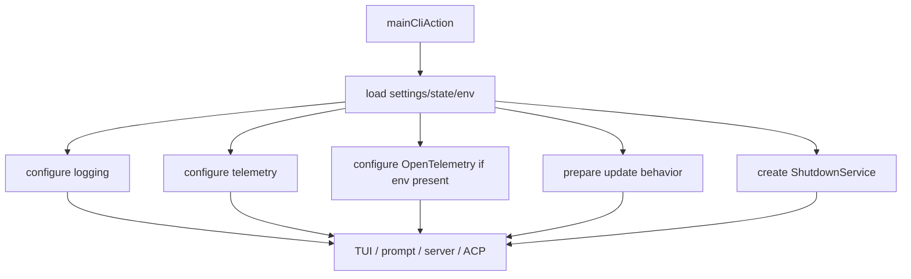
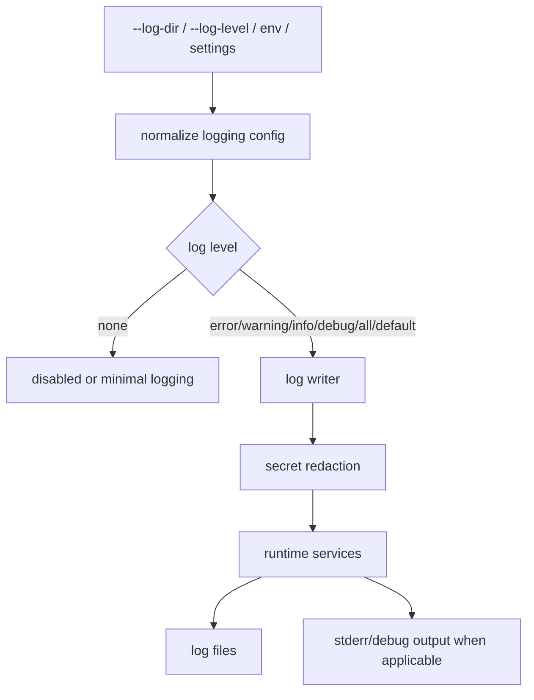
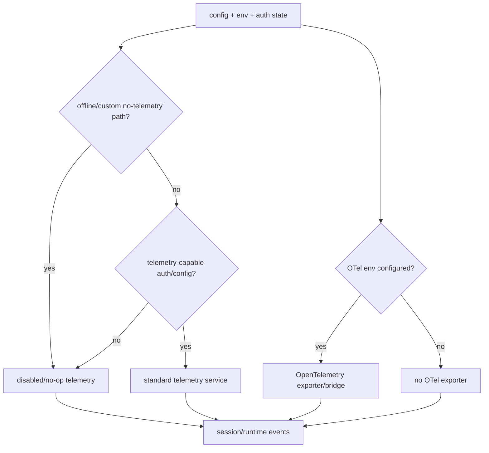
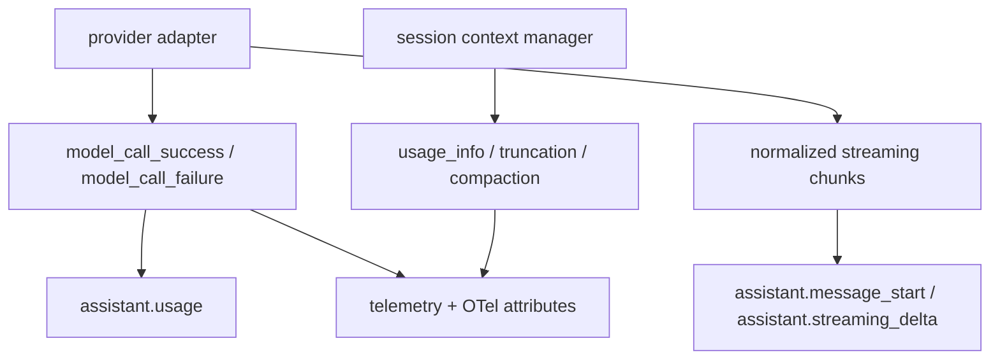
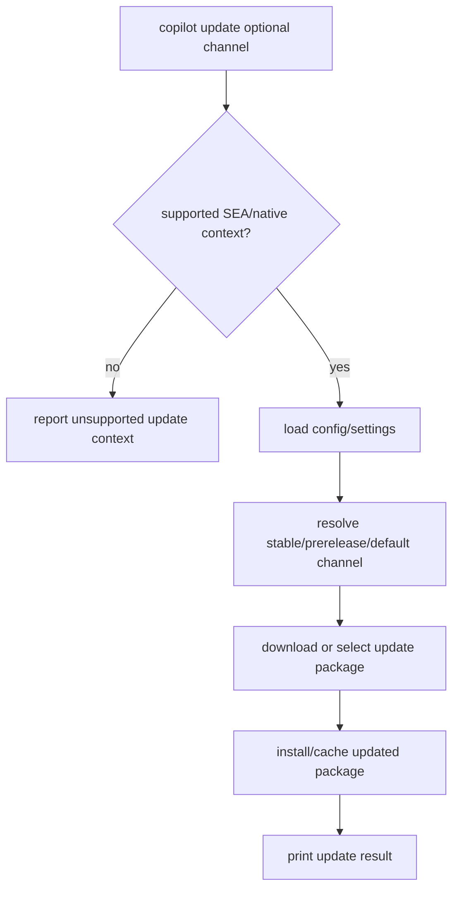
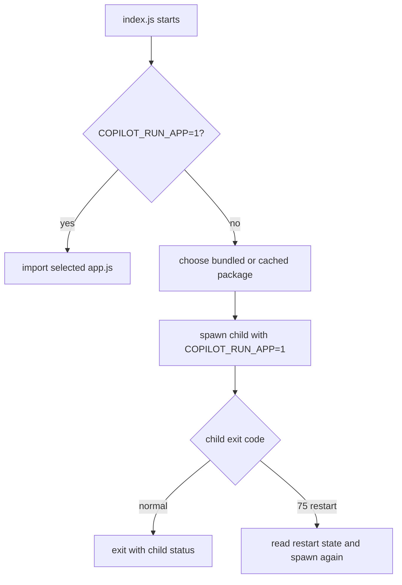
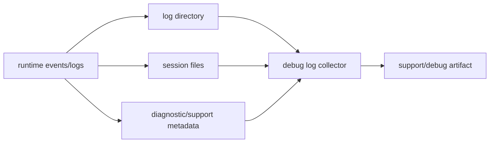
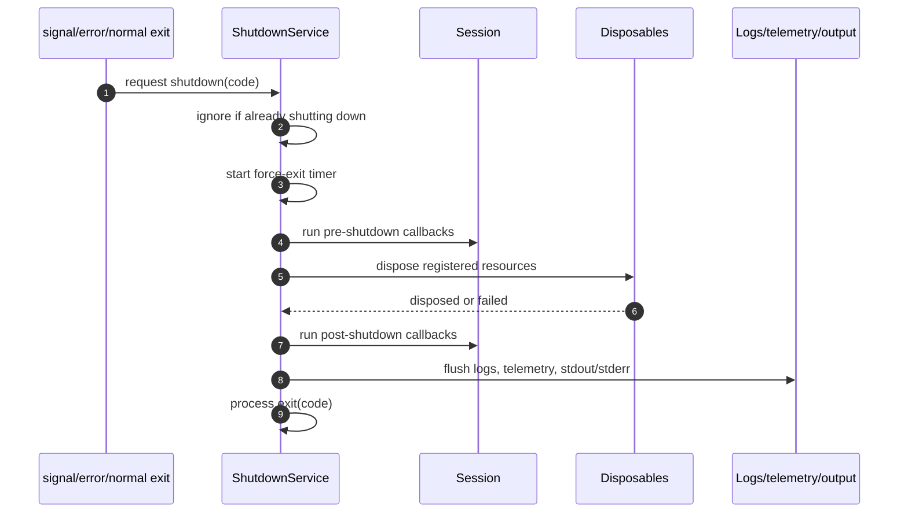
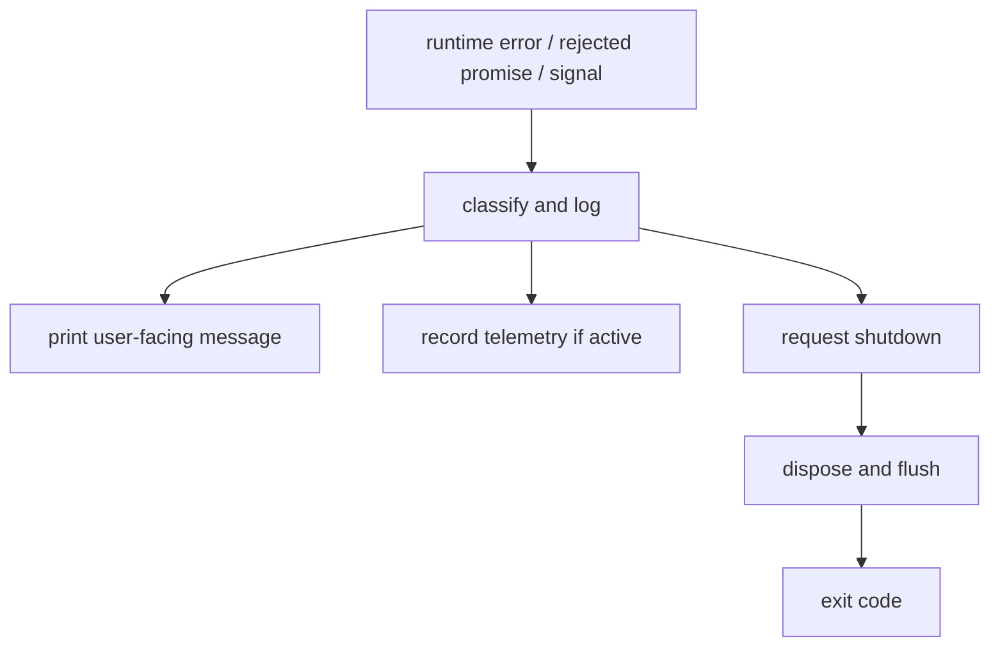

# Telemetry, update, and shutdown

## MVP placement

> **Why this page is here:** This page belongs to [Hosted agent ops](README.md). It documents hosted-job operational contracts such as environment envelopes, feature gates, validation, debug bundles, redaction, telemetry, update, or shutdown. Pair it with [Tools, integrations, and security](../03-tools-integrations-security/README.md) for trust boundaries and [Agents and automation](../06-agents-automation/README.md) when hosted runs execute delegated agent workflows.

This document expands the operational coverage for `app.js`: logging, telemetry, OpenTelemetry integration, update behavior, debug-log collection, and graceful shutdown. These systems are cross-cutting rather than agent-specific, but they are initialized by the same root runtime that prepares sessions and tools.

## Source anchors

| Area | Semantic alias | Minified anchor | Approx. line | Role |
|---|---|---:|---:|---|
| Logging setup | `LoggingService` | log setup in root action | 8298 | Applies `--log-dir`, `--log-level`, color/debug flags, and log writers. |
| Telemetry setup | `TelemetryService` | telemetry setup in root action | 8298 | Chooses active/no-op telemetry depending on auth, offline mode, and config. |
| OpenTelemetry | `OpenTelemetryBridge` | OTel environment handling | 8298 | Enables trace/metric export when OTel environment is configured. |
| Model-call telemetry | `model_call_success`, `model_call_failure`, `assistant.usage` | `getCompletionWithTools(...)`, session event handlers | 3439, 4149, 4487 | Carries request IDs, provider call IDs, latency, token usage, quota snapshots, and conversation-structure summaries. |
| Streaming UI telemetry | `StreamingChunkDisplay` | `ubt` | 4207 | Emits ephemeral assistant streaming events and response-size updates from normalized chunks. |
| Session token metrics | `session_usage_info`, `session_truncation`, `session_compaction_complete` | `q6n(...)`, `j6n(...)`, OTel mappings | 4033, 5742 | Reports token counts, truncation, compaction, removed messages/tokens, checkpoint numbers, and compaction model usage. |
| Update command | `buildUpdateCommand()` | update command builder | 8298 | Implements `copilot update [channel]`. |
| Loader update wrapper | `index.js update/restart wrapper` | `index.js` | package loader | Selects cached/bundled packages and restarts on update exit code. |
| Version command | `buildVersionCommand()` | version command builder | 8298 | Reports CLI/package version metadata. |
| Debug logs | `DebugLogCollector` | `COLLECT_DEBUG_LOGS` and TUI debug paths | 239, 7000-7445 | Exposes support/debug log collection when enabled. |
| Shutdown | `ShutdownService` | `eke` | 7420 | Runs pre-shutdown callbacks, disposables, post-shutdown callbacks, flush, and force-exit timeout. |

## Operational initialization

Operational services are configured before a runtime mode starts, so TUI, prompt, server, and ACP all inherit the same logging/telemetry/update/shutdown context.

## Logging

The root help exposes logging controls such as `--log-dir` and `--log-level`. The root action applies those controls before sessions are created.

Logging is security-sensitive because the CLI handles tokens, provider keys, MCP server environments, shell output, and model/tool payloads. The runtime therefore has multiple redaction mechanisms, including built-in secret patterns and user-provided `--secret-env-vars`.

## Telemetry and OpenTelemetry

Telemetry is configured near startup and can become active, disabled, or no-op depending on auth, offline mode, and configuration.

Observable event families include:

- startup/runtime-mode decisions;
- auth/provider/model selection outcomes;
- tool calls and permission outcomes;
- subagent/task lifecycle events;
- MCP connection/tool/task behavior;
- update and shutdown outcomes;
- error and crash paths.

## Model-turn and streaming observability

Model calls expose both durable accounting events and ephemeral UI progress.

Observed model-call metadata includes:

| Field family | Examples | Notes |
|---|---|---|
| Request identity | request ID, provider call ID, model API ID | Used for support correlation and provider debugging. |
| Latency | model-call duration, time-to-first-token, inter-token latency | Streaming adapters fill token-timing fields when available. |
| Usage | prompt, completion, total, cached, cache-creation, reasoning tokens | Also surfaced through ephemeral `assistant.usage` events for UI accounting. |
| Quota/rate snapshots | `x-quota-snapshot-*`, `x-usage-ratelimit-*` derived values | Feed usage-limit warnings and diagnostic telemetry. |
| Prompt shape | conversation-structure summaries | Lets telemetry report structure without logging full prompt content by default. |

Streaming deltas are intentionally ephemeral. They drive live rendering, response-size warnings, advisor/reasoning indicators, and prompt-mode output, but the durable audit trail is built from final assistant messages, tool completion events, model-call success/failure records, and session token-management events.

## Update behavior

Update behavior exists in two layers: the package loader wrapper and the explicit CLI command.

The `index.js` wrapper also participates in update behavior:

Operational conditions:

- `--no-auto-update` disables automatic update download behavior.
- CI environments disable auto-update by default.
- Offline mode disables online update behavior.
- The explicit `update` command is separate from automatic update preparation.

## Debug logs and support collection

The feature gate list includes `COLLECT_DEBUG_LOGS`, and the interactive UI contains debug/feedback/log-related surfaces.

Debug collection is expected to include operational state rather than clean source. Sensitive values must be treated as potentially present in shell/MCP/model contexts, so redaction remains important.

## Shutdown lifecycle

The shutdown service is a central cleanup coordinator. It prevents duplicate shutdowns, runs callbacks, disposes services, flushes output/logs, and force-exits if cleanup hangs.

Shutdown callbacks differ by mode:

| Mode | Shutdown responsibilities |
|---|---|
| TUI | End foreground session, unmount renderer, restore terminal, stop embedded server, optionally spawn detached memory agent. See [`memory-and-context-board.md`](../02-context-model-loop/memory-and-context-board.md). |
| Prompt mode | Wait for pending background tasks, save/export/share session, flush streaming output. |
| Server/headless | Stop protocol server, dispose managers, close transports. |
| ACP | Stop ACP server and dispose session/protocol resources. |

## Error and crash paths

Error handling is intertwined with logging and telemetry. User-facing errors are generally printed through output services, while internal details are preserved in logs when logging is enabled. Model-specific retry, rate-limit, fallback, cancellation, and concurrency paths are detailed in [`resilience-rate-limits-concurrency.md`](../02-context-model-loop/resilience-rate-limits-concurrency.md).

## Takeaways

- Operational services are initialized before mode dispatch and are shared by TUI, prompt, server, and ACP paths.
- Logging combines user options, settings, redaction, and runtime writers.
- Telemetry can be active or no-op depending on auth, offline/custom provider state, and configuration.
- Updates are handled both by the loader wrapper and the explicit `copilot update` command.
- Shutdown is centralized in `ShutdownService`, which coordinates session end, disposables, renderer restoration, telemetry/log flushing, and force-exit behavior.