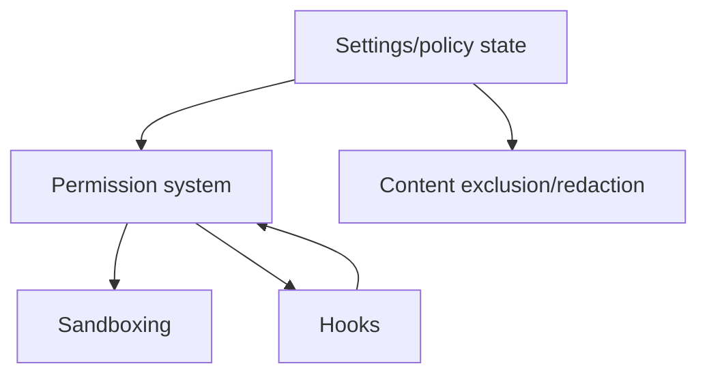

# Security and policy

Permissions, content exclusion, hooks, sandboxing, and persistent policy/configuration state.

## How this volume fits

## Pages

| Page | Why read it | File |
|---|---|---|
| [Permission system design in Copilot CLI](./permission-system-design.md) | Central PermissionService pipeline, rule precedence, path/URL managers, prompts, scopes, and allow-all behavior. | `permission-system-design.md` |
| [Content exclusion and redaction](./content-exclusion-and-redaction.md) | Content-exclusion service, policy fetch/merge, filtered outputs, bypass limits, secret env vars, and redaction. | `content-exclusion-and-redaction.md` |
| [Hooks and lifecycle automation](./hooks-lifecycle-automation.md) | Hook schema, command/HTTP hooks, VS Code aliases, security restrictions, events, and lifecycle automation. | `hooks-lifecycle-automation.md` |
| [Sandbox Implementation](./sandboxing.md) | Local command sandboxing, /sandbox, SANDBOX gate, shell wiring, MXC policy, and platform caveats. | `sandboxing.md` |
| [Settings and configuration persistence](./settings-config-persistence.md) | Config roots, typed stores, writeKey/load paths, settings overlays, URL/MCP/plugin/sandbox state, and migration. | `settings-config-persistence.md` |

## Reading guidance

- Permissions are the central policy layer.
- Content exclusion, hooks, sandboxing, and settings are cross-cutting safeguards.

## Back to wiki home

- [Wiki home](../README.md)
- [Full table of contents](../SUMMARY.md)
