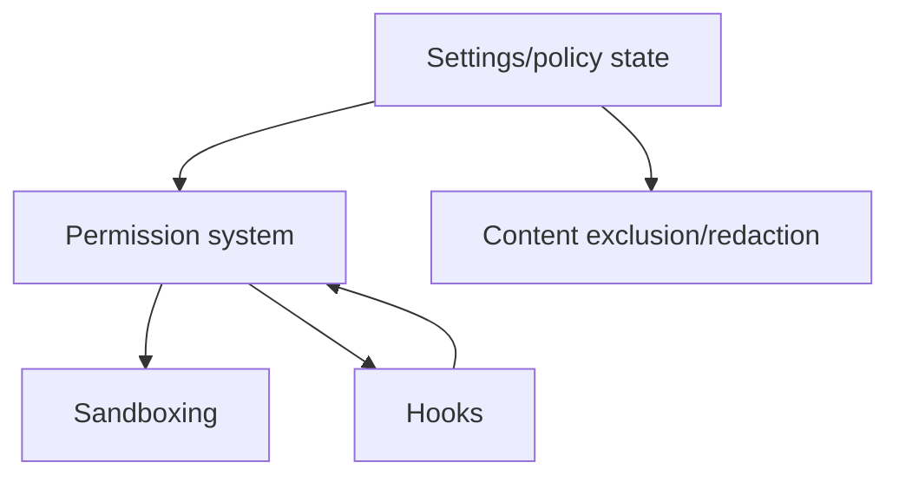

# Security and policy

Permissions, content exclusion, hooks, sandboxing, and persistent policy/configuration state.

## Semantic alias and minified anchor mapping

This is a section index, not a direct `app.js` implementation analysis. Topic pages linked below carry the concrete bundle mappings.

| Semantic alias | Minified anchor | Scope |
|---|---|---|
| Security and policy section index | N/A — navigation page | Groups permission, content-exclusion, hook, sandbox, MXC, and settings docs. |
| Security and policy topic pages | See linked page-level mappings | Concrete `app.js` anchors and binary/package anchors are documented in the child pages. |

## How this section fits

Click a node in the map to jump to that page.

## Pages

| Page | Why read it | File |
|---|---|---|
| [Permission system design in Copilot CLI](./permission-system-design.md) | Central PermissionService pipeline, rule precedence, path/URL managers, prompts, scopes, and allow-all behavior. | `permission-system-design.md` |
| [Content exclusion and redaction](./content-exclusion-and-redaction.md) | Content-exclusion service, policy fetch/merge, filtered outputs, bypass limits, secret env vars, and redaction. | `content-exclusion-and-redaction.md` |
| [Hooks and lifecycle automation](./hooks-lifecycle-automation.md) | Hook schema, command/HTTP hooks, VS Code aliases, security restrictions, events, and lifecycle automation. | `hooks-lifecycle-automation.md` |
| [Sandbox Implementation](./sandboxing.md) | Local command sandboxing, /sandbox, SANDBOX gate, shell wiring, MXC policy, and platform caveats. | `sandboxing.md` |
| [MXC binary reverse-engineering notes](./mxc-bin-reverse-engineering.md) | Static analysis of bundled `mxc-bin` helpers, compiler fingerprints, Linux LXC behavior, Windows AppContainer/Sandbox/WSLC helpers, and security implications. | `mxc-bin-reverse-engineering.md` |
| [Settings and configuration persistence](./settings-config-persistence.md) | Config roots, typed stores, writeKey/load paths, settings overlays, URL/MCP/plugin/sandbox state, and migration. | `settings-config-persistence.md` |

## Reading guidance

- Permissions are the central policy layer.
- Content exclusion, hooks, sandboxing, MXC helper behavior, and settings are cross-cutting safeguards.

## Back to wiki home

- [Wiki home](../README.md)
- [Full table of contents](../SUMMARY.md)
