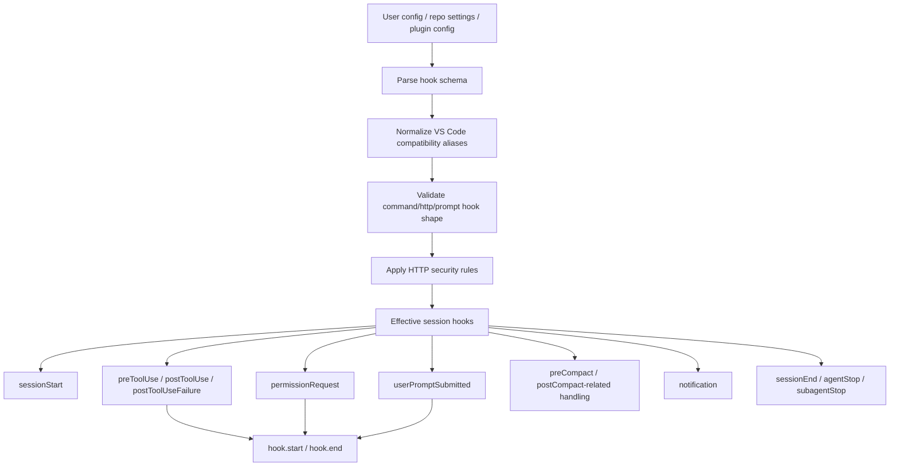

# Hooks and lifecycle automation

This document explains how hooks work in the extracted Copilot CLI bundle. Hooks are one of the broadest extension points in `app.js`: they can run at session lifecycle boundaries, prompt submission, tool execution, permission requests, compaction, notifications, and agent/subagent stop events.

The implementation is not just “run a script.” `app.js` defines a hook schema, compatibility aliases, discovery/merge logic, security restrictions for HTTP hooks, hook start/end events, and output adapters that can change prompts, approvals, and tool results.

Because `app.js` is bundled/minified, symbol names are unstable. Line references below are searchable anchors in the extracted bundle and will shift across releases.

## Source anchors

| Area | Anchor strings / minified symbols | Approx. `app.js` line | What it shows |
|---|---|---:|---|
| Hook schema | `sessionStart`, `sessionEnd`, `userPromptSubmitted`, `preToolUse`, `postToolUse`, `postToolUseFailure`, `preCompact`, `permissionRequest`, `notification` | 238 | The main hook configuration object and supported hook arrays. |
| Command hooks | `bash`, `powershell`, `command`, `cwd`, `env`, `timeoutSec` | 238 | Command hook schema and command alias normalization. |
| HTTP hooks | `type:"http"`, `url`, `headers`, `allowedEnvVars` | 238 | HTTP hook schema with credential/HTTPS validation. |
| Prompt hook | `type:"prompt"`, `prompt` | 238 | Startup/prompt-style hooks that inject prompt content. |
| VS Code compatibility | `_vsCodeCompat`, `SessionStart`, `UserPromptSubmit`, `PreToolUse`, `Stop` | 238, 2797 | Legacy/PascalCase hook names are mapped to canonical camelCase names. |
| Security overrides | `COPILOT_HOOK_ALLOW_LOCALHOST`, `COPILOT_HOOK_ALLOW_HTTP_AUTH_HOOKS` | 238, 2792 | Local development and HTTP auth-hook override gates. |
| Repo/user hook config | `.github/hooks/*.json`, `disableAllHooks`, `hooks` | 7923 | Settings/help text describes hook config shape and repo/user scopes. |
| Hook execution events | `hook.start`, `hook.end`, `hookInvocationId` | 4361, 4471 | Sessions emit start/end events around hook invocation. |
| Permission hook integration | `permissionRequest`, `resolvedByHook`, `permission.completed` | 4471 | Hooks can resolve authorization requests before normal prompting. |
| Failure guidance | `postToolUseFailure`, `Additional guidance from postToolUseFailure hook` | 2794 | Failed tools can receive hook-provided model guidance. |

## Runtime map

## Supported hook points

The schema around line `238` supports these canonical hook names:

| Hook | Timing | Main purpose |
|---|---|---|
| `sessionStart` | When a session starts | Add initial context or run startup automation. |
| `sessionEnd` | When a session exits | Cleanup, reporting, persistence, or external notification. |
| `userPromptSubmitted` | After user prompt submission and before final prompt processing | Modify prompt text or add context. |
| `preToolUse` | Before a tool runs | Approve, deny, modify arguments, suppress output, or add context. |
| `postToolUse` | After successful tool execution | Observe/log results or add context. |
| `postToolUseFailure` | After failed tool execution | Add guidance or remediation text. |
| `errorOccurred` | When a runtime error occurs | Notify or collect debug context. |
| `agentStop` | When the main agent stops | Post-turn automation. |
| `subagentStart` | When a subagent starts | Add context or filter by agent name. |
| `subagentStop` | When a subagent stops | Collect results or notify. |
| `preCompact` | Before conversation compaction | Inspect transcript/custom instructions and potentially influence compaction context. |
| `permissionRequest` | When a permission prompt would be needed | Resolve or influence authorization decisions. |
| `notification` | For system/custom notifications | Forward or transform runtime notifications. |

The scan found `postCompact` strings mostly in the compaction event path (`session.compaction_complete`), while canonical hook config in this bundle visibly centers on `preCompact`. Existing docs and compatibility layers may still mention post-compact concepts, but the directly visible config schema here is `preCompact`.

## Hook definition types

The bundle supports multiple hook definition shapes.

### Command hooks

Command hooks can specify:

| Field | Meaning |
|---|---|
| `bash` | Bash command body. |
| `powershell` | PowerShell command body. |
| `command` | Compatibility alias that is copied into shell-specific command fields. |
| `cwd` | Working directory override. |
| `env` | Extra environment variables. |
| `timeoutSec` / `timeout` | Execution timeout, with `timeout` normalized to `timeoutSec`. |
| `matcher` | Optional regex-like selector for hook points that support filtering. |

The schema requires at least one of `bash`, `powershell`, or `command`.

### HTTP hooks

HTTP hooks can specify:

| Field | Meaning |
|---|---|
| `url` | Endpoint to call. |
| `headers` | Optional static headers. |
| `allowedEnvVars` | Environment variables allowed to be sent to the hook. |
| `timeoutSec` / `timeout` | HTTP timeout. |
| `matcher` | Optional selector for compatible hook types. |

HTTP hooks are where most of the security restrictions apply.

### Prompt hooks

The schema also includes a prompt hook shape:

| Field | Meaning |
|---|---|
| `type: "prompt"` | Declares prompt-style hook content. |
| `prompt` | Text prompt to inject or return through startup prompt handling. |

Prompt hooks are useful for startup/context injection without needing to execute a command or call a URL.

## Discovery and merging

Hook definitions can come from multiple locations:

| Source | Evidence | Notes |
|---|---|---|
| User/global config | Settings help text around line 7923 | Global config hooks act as user-level hooks. |
| Repository settings | Settings help text around line 7923 | Repo settings hooks act as repo-level hooks. |
| `.github/hooks/*.json` | Settings help says same schema as `.github/hooks/*.json` | File-based repository hook discovery. |
| Plugins | Plugin manifest includes `hooks` | Plugins can package hook definitions. |
| SDK extensions | `EXTENSIONS` text mentions programmatic tools and hooks | Runtime extensions can provide hooks/tools when gated on. |

The settings field `disableAllHooks` can disable repo-level and user-level hooks. The parser also preserves passthrough fields to avoid hard-failing on future hook metadata.

## Compatibility aliases

The bundle maps VS Code-style hook names to canonical CLI hook names. Examples include:

| Compatibility name | Canonical name |
|---|---|
| `SessionStart` | `sessionStart` |
| `SessionEnd` | `sessionEnd` |
| `UserPromptSubmit` | `userPromptSubmitted` |
| `PreToolUse` | `preToolUse` |
| `PostToolUse` | `postToolUse` |
| `PostToolUseFailure` | `postToolUseFailure` |
| `ErrorOccurred` | `errorOccurred` |
| `Stop` | `agentStop` |
| `SubagentStop` | `subagentStop` |
| `PreCompact` | `preCompact` |
| `PermissionRequest` | `permissionRequest` |
| `Notification` | `notification` |

When compatibility keys are found, the loader copies those entries into the canonical hook array and annotates each entry with `_vsCodeCompat`. Later adapters use that marker to translate input/output payload shapes.

## Security rules for HTTP hooks

The hook system has explicit HTTPS requirements.

### Hooks with allowed environment variables

If an HTTP hook uses `allowedEnvVars`, the URL must use HTTPS unless it targets localhost and `COPILOT_HOOK_ALLOW_LOCALHOST=1` is set. The error text says this prevents credential exposure.

### Authorization-affecting hooks

For `preToolUse` and `permissionRequest`, HTTP hooks affect authorization. They must use HTTPS unless:

- `COPILOT_HOOK_ALLOW_HTTP_AUTH_HOOKS=1` is set; or
- `COPILOT_HOOK_ALLOW_LOCALHOST=1` is set and the host is localhost, `127.x.x.x`, or `[::1]`.

The runtime enforces this both during schema validation and immediately before HTTP hook invocation. This double-check matters because hook definitions can be loaded from multiple sources.

## Hook events

The event schema around line `4361` defines two hook lifecycle events:

| Event | Payload |
|---|---|
| `hook.start` | `hookInvocationId`, `hookType`, and input payload. |
| `hook.end` | Matching `hookInvocationId`, `hookType`, output payload, success flag, and optional error. |

The session exposes a hook event emitter that maps hook starts/ends into normal session events. This makes hooks visible to TUI/ACP/remote clients and gives replay/telemetry code a consistent record of hook behavior.

## Prompt hook outputs

`userPromptSubmitted` hooks can modify the submitted prompt. The output adapter visible around line `2797` handles fields such as:

| Output field | Effect |
|---|---|
| `modifiedPrompt` | Replaces or transforms the user prompt text. |
| `additionalContext` | Adds model-visible context around the prompt. |
| `suppressOutput` | Controls whether hook output is shown. |

This is one of the highest-impact hook points because it can change the prompt before the model sees it.

## Tool hook outputs

`preToolUse` can influence tool execution. The visible adapter logic handles fields such as:

| Output field | Effect |
|---|---|
| `permissionDecision` | Approve/deny/decide authorization before normal prompting. |
| `permissionDecisionReason` | Explanation attached to the decision. |
| `modifiedArguments` | Rewrites tool arguments. |
| `additionalContext` | Adds model-visible context around the tool call. |
| `suppressOutput` | Hides hook output from normal display. |
| `handled` / `responseContent` / `handledBy` | Lets a hook handle a tool call and return response content. |

`postToolUseFailure` can add text to a failed tool result. The bundle has explicit wording: `Additional guidance from postToolUseFailure hook`. That text is appended to the tool failure context passed back to the model.

## Permission hooks

`permissionRequest` hooks can resolve authorization requests before the normal user prompt. The session code still records the lifecycle:

1. Evaluate permission hooks.
2. If a hook returns a decision, create a request ID.
3. Emit `permission.requested` with `resolvedByHook` behavior.
4. Emit `permission.completed` with the hook result.
5. Return the decision to the waiting tool flow.

This keeps the event log complete even when no interactive prompt was shown.

## Compaction hooks

The `preCompact` adapter receives context such as:

- `sessionId`;
- timestamp;
- current working directory;
- transcript path;
- compaction trigger;
- custom instructions.

This lets hooks collect or inject information before the conversation is summarized and older messages are removed. Compaction results themselves are emitted separately as `session.compaction_complete`.

## Failure behavior

Hook failures are generally contained:

- Hook start/end events include success/error information.
- Permission hook failures are logged and the runtime falls back to normal permission prompting.
- Invalid matchers can cause a specific hook entry to be skipped.
- Unsupported hook config versions throw configuration errors.
- `disableAllHooks` returns an empty hook set.

The design avoids making every hook failure fatal to the session while still surfacing useful diagnostics.

## Why hooks matter architecturally

Hooks can affect:

- model-visible prompt text;
- tool arguments;
- permission decisions;
- failure guidance;
- compaction inputs;
- notification routing;
- session startup/shutdown automation;
- plugin and extension behavior.

They are therefore part of the CLI’s control plane, not just a logging mechanism.

## Relationship to other documents

- `permission-system-design.md` covers the permission side of `preToolUse` and `permissionRequest`.
- `prompt-sources.md` covers hooks as prompt/context sources.
- `conversation-compaction.md` covers compaction and pre-compaction interaction.
- `plugin-extension-architecture.md` explains plugin/extension sources for hooks.
- `built-in-tool-execution-pipeline.md` explains where tool hooks sit in the execution lifecycle.
