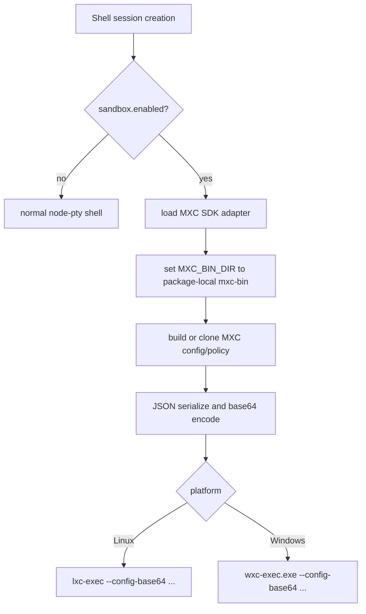
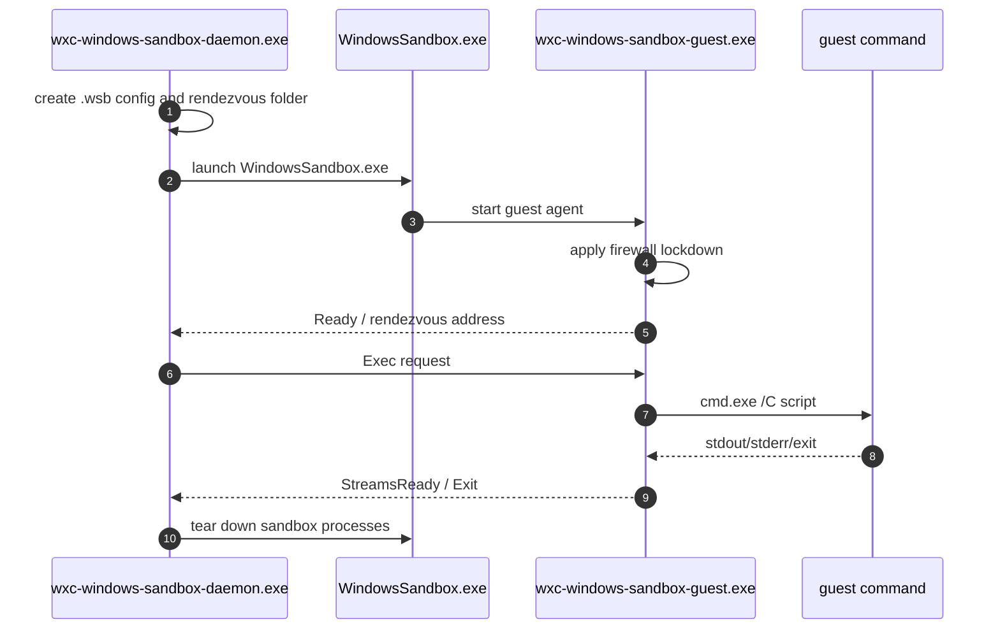

# MXC binary reverse-engineering notes

This page records a static reverse-engineering pass over the bundled MXC sandbox runtime under `copilot-cli-pkg/mxc-bin`. It complements [Sandbox Implementation](./sandboxing.md), which explains how Copilot CLI routes shell sessions into the MXC adapter.

The goal here is narrower: identify what the packaged binaries are, how they were built, what helper roles they appear to implement, and what sandbox behavior can be inferred from metadata, symbols, imports, SPDX manifests, and strings.

## Scope and method

This analysis used static inspection only. The binaries were not executed.

| Technique | What it answered |
|---|---|
| `file`, `readelf`, `objdump` | Binary format, architecture, linker metadata, dynamic imports, and ELF notes. |
| `nm -C` on `lxc-exec` | Rust symbol/module names because the Linux binary is not stripped. |
| `strings` | CLI arguments, error messages, source paths, crate names, helper protocols, and policy schema clues. |
| SPDX manifest inspection | Build provenance, package names, dependency hints, and official-build metadata. |
| `app.js` search | How the bundled CLI locates `mxc-bin`, builds MXC config, and spawns helpers. |

## Build provenance

The SPDX build stamp in `copilot-cli-pkg/mxc-bin/x64/_manifest/spdx_2.2/bsi.json` identifies the payload as an official Microsoft MXC build.

| Field | Observed value |
|---|---|
| Build definition | `MXC-Official-Build` |
| Build number | `v0.1.8_20260505.1` |
| Source repository name | `microsoft/mxc` |
| Source branch/tag | `refs/tags/v0.1.8` |
| Source commit | `dec78766b04b22e95b7f12fb002ef94ee0e61755` |
| SBOM tool | `Microsoft.SBOMTool-4.1.9` |
| SPDX document name | `MXC-Official-Build 146204352` |
| SPDX creation time | `2026-05-05T22:34:03Z` |
| Primary package found | `@microsoft/mxc-sdk` `0.1.8` |

The repository URL recorded in the manifest was not publicly fetchable during analysis, so the findings below are based on the extracted artifacts.

## Binary inventory

The package ships x64 and arm64 variants with the same helper families.

| Path family | Format | Role inferred from metadata and strings |
|---|---|---|
| `mxc-bin/{x64,arm64}/lxc-exec` | Linux ELF PIE executable | Linux LXC executor. Parses MXC config, creates/runs LXC containers, applies mount and iptables policy, and executes scripts through `lxc-attach`. |
| `mxc-bin/{x64,arm64}/wxc-exec.exe` | Windows PE console executable | Main Windows executor. Supports AppContainer by default and has experimental WSLC, Windows Sandbox, isolation-session, and microVM paths. |
| `mxc-bin/{x64,arm64}/winhttp-proxy-shim.exe` | Windows PE console executable | Elevated WinHTTP per-AppContainer proxy policy shim. |
| `mxc-bin/{x64,arm64}/wxc-test-proxy.exe` | Windows PE console executable | Test-only local CONNECT proxy for integration tests. |
| `mxc-bin/{x64,arm64}/wxc-windows-sandbox-daemon.exe` | Windows PE console executable | Host-side Windows Sandbox daemon that launches/configures `WindowsSandbox.exe` and bridges host/guest streams. |
| `mxc-bin/{x64,arm64}/wxc-windows-sandbox-guest.exe` | Windows PE console executable | Guest-side Windows Sandbox agent that locks down firewall policy and executes commands inside the sandbox VM. |
| `mxc-bin/{x64,arm64}/wslcsdk.dll` | Windows PE DLL | WSLC SDK bridge/library used by the experimental WSL container backend. |

## Toolchain fingerprints

### Linux executor

`lxc-exec` is a Rust binary built with Microsoft's Rust toolchain.

| Signal | x64 observation | arm64 observation |
|---|---|---|
| Rust compiler | `rustc version 1.93.1 (0bcbc19370 2026-04-16) (1.93.1-ms-20260416.7+0bcbc19370)` | Same Rust version string. |
| Linker/compiler comments | `Linker: LLD 21.1.8`; Ubuntu GCC `11.4.0` runtime marker | Ubuntu GCC `11.4.0`; crosstool-NG GCC `15.1.0` marker |
| Dynamic dependencies | `libgcc_s.so.1`, `libc.so.6`, ELF loader | `libgcc_s.so.1`, `libc.so.6`, ELF loader |
| Stripping | Not stripped | Not stripped |
| Linux ABI tag | Linux `3.2.0` | Linux `3.7.0` |

The unstripped x64 ELF exposed useful Rust modules such as `lxc_exec`, `lxc_common::lxc_runner`, `lxc_common::lxc_bindings`, `lxc_common::filesystem_mounts`, `lxc_common::network_iptables`, and `wxc_common::config_parser`.

### Windows Rust helpers

The Windows `.exe` helpers are PE32+ console executables targeting MSVC.

| Signal | Observation |
|---|---|
| Rust toolchain paths | `rust.tools.stable-llvm-x86_64-pc-windows-msvc.1.93.1-ms-20260416.7` |
| PE linker version | `MajorLinkerVersion 14`, `MinorLinkerVersion 44` |
| Common Rust dependencies | `clap`, `serde`, `serde_json`, `tokio`, `hyper`, `windows`, `flatbuffers` |
| Embedded PDB names | Examples include `winhttp_proxy_shim.pdb`, `wxc_test_proxy.pdb`, and `wxc_windows_sandbox_guest.pdb`. |

### WSLC DLL

`wslcsdk.dll` is C++/MSVC rather than Rust.

| Signal | Observation |
|---|---|
| Source paths | `C:\__w\1\s\src\windows\WslcSDK\wslcsdk.cpp`, `C:\__w\1\s\src\windows\common\...` |
| PDB path | `C:\__w\1\s\bin\x64\Release\wslcsdk.pdb` |
| C++ libraries | STL symbols, WIL headers, `nlohmann::json` ABI strings |
| Export family | `WslcCanRun`, `WslcCreateSession`, `WslcCreateContainer`, `WslcStartContainer`, `WslcSetProcessSettingsCmdLine`, and related WSLC APIs |

## SBOM dependency hints

The x64 SPDX manifest lists 236 packages. High-signal packages include:

| Package | Version | Relevance |
|---|---:|---|
| `@microsoft/mxc-sdk` | `0.1.8` | JavaScript/TypeScript-facing sandbox SDK bundled into the CLI. |
| `Microsoft.WSL.Containers` | `2.8.1` | WSLC backend support. |
| `tokio` | `1.50.0` | Async runtime for Windows daemons/proxies and helper processes. |
| `hyper` / `hyper-util` | `1.8.1` / `0.1.20` | HTTP proxy/test-proxy implementation. |
| `serde` / `serde_json` | `1.0.228` / `1.0.149` | MXC config/policy JSON parsing. |
| `clap` / `clap_builder` | `4.5.60` and `4.6.x` variants | Helper CLI argument parsing. |
| `flatbuffers` | `25.12.19` | IPC/config serialization hints in Windows paths. |
| `windows` / `windows-sys` | `0.62.2` / `0.61.2` | Win32/AppContainer/Windows API integration. |
| `find-msvc-tools` | `0.1.9` | Build-time MSVC discovery. |

## How Copilot CLI invokes MXC

The bundled CLI contains an MXC adapter that resolves and spawns these helpers.

The resolver also honors `MXC_BIN_DIR` if it is already set. Otherwise it looks for helpers under the package-local `mxc-bin/{arch}` directory. The config is passed as `--config-base64`, with optional `--dry-run`, `--debug`, and `--experimental` flags.

For the shell path traced in `app.js`, there is an important guard: sandboxed interactive shells are required to be PowerShell shells before the MXC spawn helper is called. The MXC package contains Linux/LXC support, but the default non-Windows shell configuration is Bash, so a default Linux interactive shell with `sandbox.enabled` can hit the PowerShell-only guard before reaching `lxc-exec`.

## Shared MXC config model

Strings in both Linux and Windows helpers expose a shared config/policy schema.

| Area | Observed fields/values |
|---|---|
| Process | `process.commandLine`, `process.cwd`, `process.env`, `process.timeout` |
| Filesystem | `readwritePaths`, `readonlyPaths`, `deniedPaths` |
| Network | `defaultPolicy`, `enforcementMode`, `allowedHosts`, `blockedHosts`, `proxy` |
| Lifecycle | `destroyOnExit`, `preservePolicy` |
| Container identity | `containerId`, `image`, `imageTarPath`, `storagePath`, `portMappings` |
| Backends | `appContainer`, `lxc`, `wslc`, `windows_sandbox`, `isolation_session` |
| UI | `disable`, `clipboard`, `injection` |
| Experimental | `windows_sandbox`, `isolation_session`; WSLC and microVM paths are also flagged experimental in strings. |

Network values include `allow` / `block` for default policy and `capabilities`, `firewall`, or `both` for enforcement mode. Containment values include `appcontainer`, `windows_sandbox`, `isolation_session`, `wslc`, `lxc`, `vm`, and `microvm`.

## Linux `lxc-exec` behavior

The Linux executor appears to orchestrate standard LXC command-line tools instead of dynamically linking to `liblxc`.

### External commands and paths

High-signal strings include:

| String | Meaning |
|---|---|
| `lxc-create`, `lxc-start`, `lxc-attach`, `lxc-stop`, `lxc-destroy`, `lxc-info` | Standard LXC lifecycle commands used by the runner. |
| `/var/lib/lxc`, `/rootfs` | Default LXC storage/rootfs paths. |
| `/bin/sh -c` | Script execution inside the container. |
| `iptables` | Firewall enforcement path. |
| `lxc.mount.entry` | LXC config entries generated for filesystem policy. |
| `tmpfs ro,size=0,create=dir` and `/dev/null ... bind,ro,create=file` | Denied-path masking behavior. |

### Exposed Rust modules

Because the ELF is not stripped, `nm -C` reveals semantically useful modules:

| Module/function family | Inferred role |
|---|---|
| `lxc_exec::main` | CLI entry point for Linux executor. |
| `lxc_common::lxc_runner::LxcScriptRunner` | High-level runner for executing configured script/process inside LXC. |
| `lxc_common::lxc_bindings::LxcContainer` | Wrapper around LXC lifecycle operations such as create/start/attach/stop/destroy. |
| `lxc_common::filesystem_mounts::configure_filesystem_mounts` | Converts filesystem policy to LXC mount entries. |
| `lxc_common::network_iptables::NetworkIptablesManager` | Resolves host rules, discovers veth, applies/removes iptables rules. |
| `wxc_common::config_parser::*` | Shared JSON config parser used by both Linux and Windows helpers. |

### Filesystem policy behavior

Strings show explicit validation against dangerous config-injection characters:

- `Path contains whitespace characters which could inject or break LXC config parsing`
- `Path contains newline characters which could inject LXC config`
- `Empty path is not allowed`

The runner logs separate read-only and read-write bind mounts:

- `Adding ro bind mount:`
- `Adding rw bind mount:`

Denied paths are described as being masked:

- `Masking denied path:`

### Network behavior

The iptables manager appears to:

- create and remove MXC-specific chains;
- scope rules to the container veth interface when it can discover one;
- allow established/related traffic;
- allow DNS on UDP/TCP port 53;
- resolve configured hosts for allow/block rules;
- skip firewall operations if the network enforcement mode does not use firewall.

Notable strings:

- `Default network policy:`
- `Allowing host:`
- `Failed to apply network firewall rules.`
- `Warning: No veth interface set for container. Cannot scope iptables rules.`
- `Network enforcement mode does not use firewall, skipping iptables.`

## Windows helper behavior

### `wxc-exec.exe`

`wxc-exec.exe` is the main Windows executor. Its CLI accepts config input and can delete container profiles:

| Argument/string | Purpose |
|---|---|
| `--config-base64` | Base64-encoded JSON config. |
| `--dry-run` | Parse and validate config without executing. |
| `--debug` / `--log-file` | Diagnostic output. |
| `--delete --containername` | Delete a named container/profile. |
| `--experimental` | Enable experimental backends. |

It logs backend selection such as:

- `Using BaseContainer runner`
- `Using WSLContainer runner (--experimental)`
- `Error: Windows Sandbox is an experimental feature. Use --experimental flag.`
- `Error: MicroVM is an experimental feature. Use --experimental flag.`

### `winhttp-proxy-shim.exe`

This helper manages per-AppContainer WinHTTP proxy settings. It expects an AppContainer SID, proxy address/port, a ready file, a cleanup event, and a parent PID.

It dynamically resolves WinHTTP functions including:

- `WinHttpConnectionSetPolicyEntries`
- `WinHttpConnectionDeletePolicyEntries`
- `WinHttpConnectionSetProxyInfo`
- `WinHttpConnectionDeleteProxyInfo`

The strings explicitly state that access denied while setting policy likely means administrator privileges are needed.

### `wxc-test-proxy.exe`

This is a local test CONNECT proxy, not a production component:

- listens on `127.0.0.1`;
- handles `CONNECT` requests;
- exits when a cleanup event is signaled or the parent process dies;
- warns that it is testing-only.

### Windows Sandbox daemon and guest

The daemon/guest pair implements an experimental Windows Sandbox backend.

Daemon strings show host responsibilities:

- generate `.wsb` config;
- launch `WindowsSandbox.exe`;
- locate host Python;
- create `C:\Sandbox-Rendezvous`, `C:\Sandbox-Python`, and `C:\Sandbox-Guest` mappings;
- bridge TCP streams;
- terminate sandbox processes on teardown.

Guest strings show in-sandbox responsibilities:

- bind a TCP listener;
- lock down firewall with `netsh advfirewall`;
- allow only agent-specific inbound/outbound TCP rules;
- execute via `cmd.exe /C`;
- bridge stdin/stdout/stderr;
- send typed control messages such as `Ready`, `Exec`, `StreamsReady`, and `Exit`.

### WSLC path

`wxc-exec.exe` dynamically loads `wslcsdk.dll` for WSLC. Strings show image import/loading, WSL session creation, container settings, process settings, exit-code retrieval, and optional iptables application inside the WSLC environment.

Runtime availability checks mention missing components such as:

- `VirtualMachinePlatform`
- `WslPackage`

The DLL exports the `Wslc*` API surface used by the Rust executor.

## Security and reliability implications

| Finding | Implication |
|---|---|
| MXC is real enforcement code, not prompt-only language. | Sandboxing happens at process spawn time through MXC helpers when the CLI reaches that path. |
| `/sandbox` is feature-gated and settings-backed. | Local sandboxing is not universally visible or always on. |
| Linux support depends on LXC and iptables. | A host without LXC cannot use the Linux MXC backend; firewall behavior depends on veth discovery and iptables availability. |
| The traced CLI shell path requires PowerShell before sandbox spawn. | The bundled Linux `lxc-exec` may not be reachable from the default Linux interactive shell flow even though the SDK supports it. |
| Generated base policy allows outbound network and UI windows. | The default generated policy is a containment policy, not a strict no-network/no-UI policy. |
| Explicit raw `sandbox.config` bypasses higher-level policy generation. | It is the most powerful configuration path and should be treated as trusted configuration. |
| Linux mount path validation rejects whitespace/newlines. | The LXC config generator includes protections against simple mount-entry injection. |
| Windows proxy policy can require elevation. | AppContainer network proxy support may fail without administrator privileges. |
| Windows Sandbox and WSLC are experimental. | They are present in binaries but gated and may require optional host components. |

## Practical reading path

- Start with [Sandbox Implementation](./sandboxing.md) for the CLI-level control flow.
- Use this page when you need binary-level evidence for the MXC helper behavior.
- Use [Settings and configuration persistence](./settings-config-persistence.md) to understand how `sandbox.enabled`, raw `sandbox.policy`, and raw `sandbox.config` persist.
- Use [Feature gates and rollout logic](../08-operations-and-research/feature-gates.md) to understand why `/sandbox` may be hidden by default.
