# Permission system design in Copilot CLI

This document explains the permission subsystem in the extracted `@github/copilot` CLI bundle. The key idea is that permissions are not a single yes/no switch. The runtime combines static allow/deny rules, path and URL guards, content-exclusion checks, hook decisions, interactive prompts, remote/RPC responses, and persistence scopes before a tool call is allowed to run.

`app.js` is bundled and minified, so this document uses semantic aliases as stable names. Generated symbols are retained only in the source-anchor table for searching the analyzed `@github/copilot` `1.0.48` artifact.

## Source anchors

| Area | Semantic alias | Minified anchor | Approx. line | Role |
|---|---|---:|---:|---|
| Central permission service | `PermissionServiceFactory` | `Kge(...)` | 555 | Evaluates raw permission requests, applies rule precedence, asks the user when possible, and records session/location approvals. |
| Permission rule parser | `parsePermissionRule` | `Yge(...)` | 555 | Parses textual permission rules through the bundled Rust/wasm parser. |
| Request-to-prompt mapper | `toPermissionPromptRequest` | `B9(...)` | 555 | Converts raw tool/path/URL/memory requests into user-facing prompt requests. |
| Session approval mapper | `approvalToRules` | `Wge(...)` | 555 | Converts a user session/location approval into stored permission rules. |
| Raw request dispatcher | `dispatchPermissionRequest` | `gZe(...)` | 555 | Routes raw request kinds to shell, write, read, MCP, URL, memory, extension, or custom-tool checks. |
| Prompt approval dispatcher | `dispatchPromptApproval` | `yZe(...)` | 555 | Routes user-facing approval kinds back into rule matching. |
| URL permission manager | `UrlPermissionManager` | `Dy` | 555 | Normalizes allowed URL patterns and checks protocol, host, port, wildcard host, and optional path constraints. |
| Persistent URL config | `PersistentUrlPermissionConfig` | `pZe` | 555 | Stores `allowedUrls` and `deniedUrls` in settings-backed configuration. |
| Default path manager | `DefaultPathPermissionManager` | `NU` | 4211 | Allows current working directory and temp directory by default, resolves realpaths, and rejects network paths. |
| Allow-all path manager | `AllowAllPathPermissionManager` | `cR` | 4211 | Makes all local paths pass path checks while preserving the path-manager interface. |
| Path manager wrapper | `DelegatingPathPermissionManager` | `_bt` | 4211 | Wraps/delegates path-manager behavior. |
| Permission hook runner | `PermissionRequestHookRunner` | `tjn(...)` | 4211 | Runs configured `permissionRequest` hooks and maps allow/deny hook outputs into permission results. |
| Permission hook input builder | `buildPermissionHookInput` | `UUs(...)` | 4211 | Maps shell/write/MCP/URL/memory/custom-tool requests into hook payloads. |
| Session runtime permission lifecycle | `SessionRuntimePermissionHost` | `vEt` permission methods | 4471 | Creates the service, wires user prompt callbacks, evaluates hooks, toggles allow-all mode, and loads persisted location approvals. |
| Pending permission RPC facade | `SessionPermissionsRpc` | `FYn(...)` | 4361 | Implements `handlePendingPermissionRequest`, `setApproveAll`, and `resetSessionApprovals`. |
| Permission event schemas | `PermissionEventSchemas` | `P6s`, `D6s`, `OYn`, `LYn`, `Y5s`, `UYn` | 4361 | Defines `permission.requested`, `permission.completed`, request, result, and decision shapes. |
| Remote prompt manager | `PromptManagerPermissionBridge` | `jve` methods | 5767 | Converts remote UI responses into approve-once, approve-for-session, or reject decisions. |
| Remote command poller | `CommandPollerPermissionResponse` | `Vve` branch | 5767 | Receives remote `permission_response` commands and forwards them to the prompt bridge. |
| Location permission persistence | `LocationPermissionStore` | `Ldt(...)`, `s5e(...)`, `CJ(...)`, `OBn(...)` | 1299 | Loads, saves, keys, and resets per-location approvals and directories. |
| Slash permission commands | `PermissionSlashCommands` | `wps(...)`, `vps(...)`, `Cps(...)`, `Nps(...)`, `jps(...)` | 1299 | Implements `/allow-all`, reset approvals, `/add-dir`, `/cwd`, plus the separate `/sandbox` settings toggle. |
| Allowed-tools frontmatter parser | `AllowedToolsFrontmatterParser` | `T4n`, `Xar(...)`, `L0s(...)` | 3194 | Converts skill/command `allowed-tools` entries into permission rules. |
| ACP permission setup | `AcpPermissionServiceFactory` | `createSessionPermissionService(...)` | 6103 | Builds permission service for Agent Client Protocol sessions from CLI flags and baseline rules. |
| ACP allow-all toggle | `AcpAllowAllApplier` | `applyAllowAll(...)` | 6103 | Applies runtime allow-all by toggling tools, paths, and URLs together. |
| MCP permission gate | `McpPermissionGateResolver` | `O7n(...)`, `CUs`, `p5e(...)` | 4207, 1343 | Reads raw `COPILOT_FEATURE_FLAGS` to decide whether the default GitHub MCP URL is forced readonly. |

## Architecture overview

At a high level, the permission system has four layers:

1. **Configuration and baseline rules** from CLI flags, settings, URL config, skill/command frontmatter, custom agents, and persisted per-location approvals.
2. **Runtime adapters** in the session host that receive permission requests from built-in tools, MCP tools, external tools, memory tools, extension tools, and hooks.
3. **The central permission service** that evaluates content exclusion, path/URL safety, deny and allow rules, approve-all state, session/location approvals, and user availability.
4. **Human or remote decision surfaces** in the TUI, embedded server, ACP session, command poller, or prompt manager.

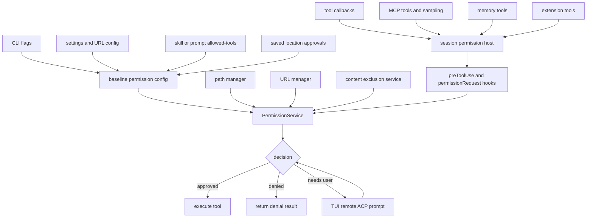

The service is deliberately shared across execution modes. Interactive TUI sessions, prompt-mode sessions, remote sessions, embedded-server clients, and ACP sessions all speak the same permission-result vocabulary, even though their user-prompt adapters differ.

## Permission inputs

The permission state is assembled from multiple sources before or during a session.

| Input | Scope | What it affects |
|---|---|---|
| `--allow-tool` / `--deny-tool` | Session baseline | Adds approved or denied rules for tool-like requests. |
| `--allow-url` / `--deny-url` | Session baseline and URL manager | Adds URL rules; allowed URL arguments seed the URL manager. |
| `--allow-all-tools` | Session baseline | Makes tool-like permission requests auto-approved unless a deny rule matches. |
| `--allow-all-paths` | Session baseline | Uses the allow-all path manager instead of the default path manager. |
| `--allow-all-urls` | Session baseline | Puts the URL manager in unrestricted mode. |
| `--allow-all` / `--yolo` | Session baseline | Equivalent to allowing all tools, paths, and URLs. |
| `--disallow-temp-dir` | Path baseline | Prevents the default temp directory from being included in allowed directories. |
| `allowedUrls` / `deniedUrls` settings | Persistent URL config | Adds URL allow/deny patterns through settings-backed storage. |
| Skill or prompt `allowed-tools` frontmatter | Prompt/skill-local | Adds permission rules derived from aliases such as `shell`, `write`, and `memory`. |
| Location approvals | Repository or cwd location | Reapplies saved tool approvals and allowed directories for the resolved location key. |
| Slash commands | Current interactive session | Toggle allow-all, add directories, change cwd, reset approvals, or toggle sandbox behavior through a separate settings path. |
| Remote/RPC commands | Current session | Approve pending requests, set approve-all, or reset session approvals. |

The CLI help makes an important distinction: tool filtering and permission approval are separate systems.

| System | Examples | Effect |
|---|---|---|
| Tool visibility | `--available-tools`, `--excluded-tools`, custom-agent tool filters | Controls which tools are exposed to the model at all. Hidden tools cannot be called by the model. |
| Tool approval | `--allow-tool`, `--deny-tool`, `--allow-all-tools`, session approvals | Controls whether a visible tool call may execute without prompting. |

This separation prevents an approval flag from accidentally exposing a tool that the tool-filter layer has hidden.

## Rule model and precedence

Permission rules use a small grammar with `kind(argument?)` style patterns. The parser produces normalized rule objects with a `kind` and optional `argument`.

Representative rule kinds:

| Rule kind | Typical argument | Request matched |
|---|---|---|
| `shell` | Command identifier or command pattern | Shell command requests. |
| `write` | Usually none | File creation/edit/write requests. |
| `read` | Usually none | Read requests when read approval is not globally granted. |
| MCP server name | Optional tool name | MCP tool requests for that server and optionally one tool. |
| `mcp-sampling` | MCP server name | MCP sampling approval checks. |
| `url` | Origin, domain, URL, wildcard host, or path pattern | URL fetch or URL-bearing shell requests. |
| `memory` | Usually none | `store_memory` and `vote_memory` requests. |
| `custom-tool` | External tool name | Custom/external tool requests. |
| `extension-management` | Extension name | Extension installation/management actions. |
| `extension-permission-access` | Extension name | Extension access to permissions. |

Deny rules take precedence over allow rules, including broad allow-all settings. The effective ordering is:

1. hard policy checks, such as content exclusion and path rejection;
2. explicit denied rules;
3. explicit approved rules;
4. session-approved rules;
5. location-approved rules;
6. approve-all or approve-all-read switches;
7. user prompt, if a prompt adapter is available;
8. denial or `user-not-available` style result when the runtime cannot ask.

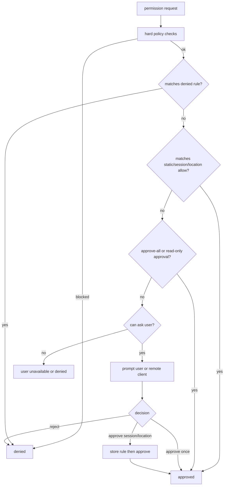

## Request kinds

Tool callbacks send raw permission requests to the session permission host. The observed kinds are:

| Raw request kind | Typical producer | Notes |
|---|---|---|
| `shell` | Shell command tool | Includes command text, command identifiers, read-only analysis, possible paths, possible URLs, and whether session approval can be offered. |
| `write` | File edit/create tools | Usually includes file path and diff-like context. |
| `read` | File read/search/LSP paths when permission is needed | Can be auto-approved by approve-all-read in ACP paths. |
| `mcp` | MCP tool invocation | Matches by server and tool name. |
| `mcp-sampling` | MCP sampling request | Checked through a dedicated sampling approval helper. |
| `url` | Web fetch or URL-bearing tools | Uses URL manager and URL prompt coalescing. |
| `memory` | `store_memory` / `vote_memory` | Treated as a permissioned state mutation. |
| `custom-tool` | External/custom tools | May include a tool-level `skipPermission` flag, otherwise checked like other tool calls. |
| `extension-management` | Extension manager | Covers installing/enabling/managing extensions. |
| `extension-permission-access` | Extension runtime | Covers extension access to permission-related capabilities. |
| `hook` | Pre-tool hook prompt | Special case: it is not routed through normal rule matching; it asks about a hook decision. |

The prompt-facing request type is slightly different from the raw type. For example, shell requests become `commands` approvals, while URL and path requests get their own prompt wrappers. That distinction lets the UI present better labels while the service stores compact rules.

## Evaluation pipeline

The actual pipeline is layered. A request can be approved by one layer and still blocked by an earlier hard guard.

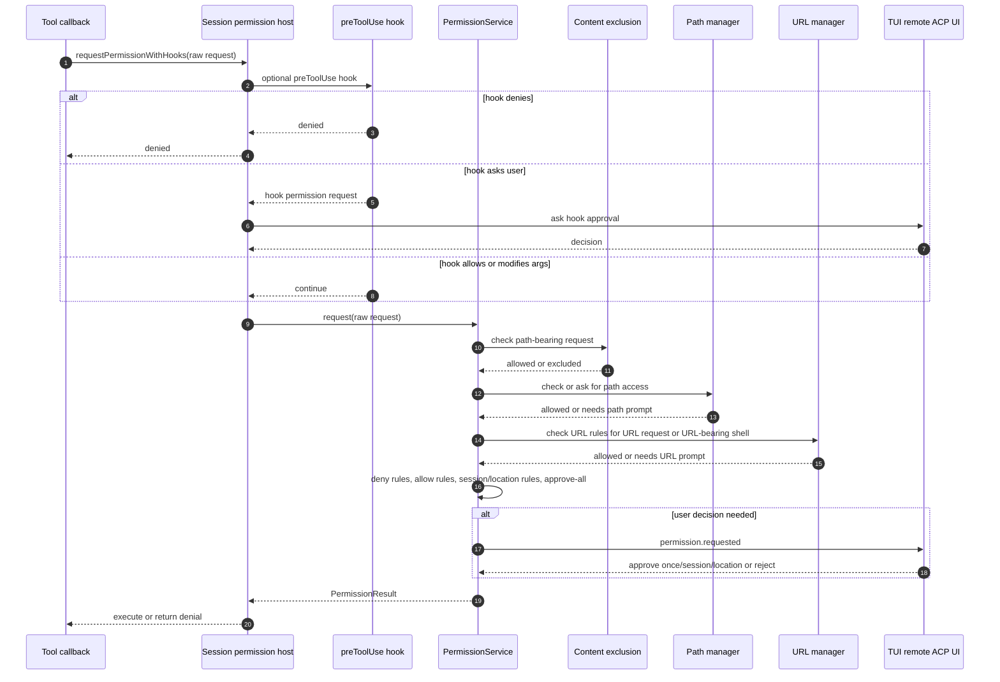

Important details:

- **Content exclusion is checked before normal prompting** for path-bearing requests. If a path is excluded by policy, user approval does not override that block.
- **Path approval is separate from tool approval**. A write tool can need both the `write` permission and access to the target directory.
- **URL approval is protocol-aware**. Allowing an HTTP URL does not implicitly allow HTTPS, and vice versa.
- **URL prompts are coalesced** by normalized origin/domain so repeated requests do not always create unrelated prompt state.
- **Shell requests can include paths and URLs** discovered by command analysis. Those derived resources are checked as part of the shell permission flow.
- **Read-only shell commands can be auto-approved** when read approval is globally enabled, but deny rules still win.

## Path permission model

The default path manager is intentionally conservative:

- the current working directory is allowed by default;
- the temp directory can be allowed by default, unless disabled by CLI option;
- additional allowed directories can be added at runtime with `/add-dir` or persisted location approvals;
- paths are resolved through realpath/symlink handling before comparison;
- network or UNC-style paths are rejected;
- a workspace path can be tracked separately from the current cwd;
- allow-all path mode swaps in an allow-all implementation that still satisfies the same interface.

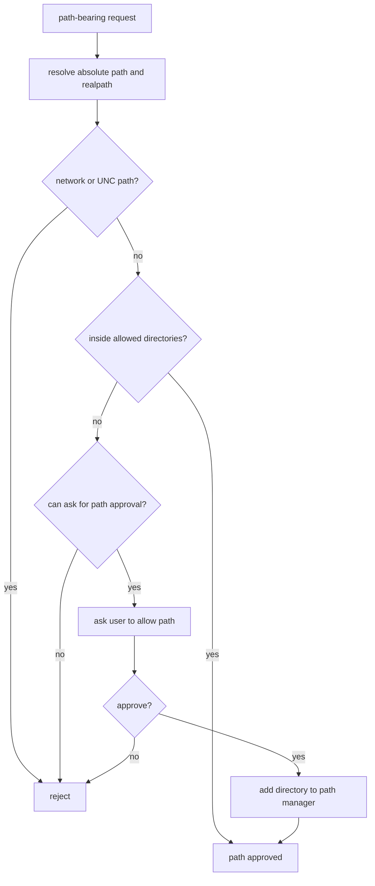

A path approval is directory-oriented rather than a tool-kind rule. This is why `--allow-all-paths`, `/add-dir`, cwd changes, and persisted allowed directories are modeled through the path manager, not just through the generic rule arrays.

## URL permission model

URL permissions are handled by both generic rules and the URL manager. The URL manager normalizes and matches URL patterns with these properties:

- protocol must match;
- default ports are normalized (`80` for HTTP, `443` for HTTPS);
- hostnames are case-insensitive;
- `*.example.com` matches `example.com` and subdomains;
- pathless patterns match the whole origin;
- exact paths can be required;
- paths ending in `/*` act as path-prefix patterns;
- unrestricted mode approves all URLs.

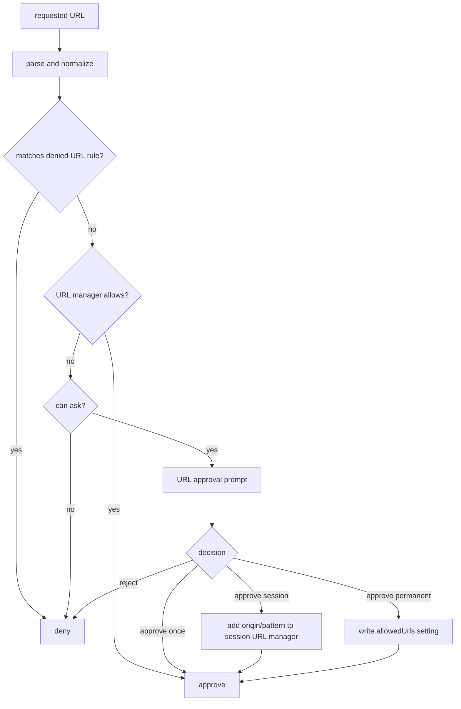

Persistent URL approvals are stored through the settings-backed URL config. Session approvals are kept in the in-memory URL manager. Denied URLs are also checked through the same pattern matching behavior.

## Shell command analysis

Shell permission is more nuanced than a simple `bash` allow prompt. The shell analyzer derives metadata that later permission checks can use:

- command identifiers, such as command stems;
- whether the command appears read-only;
- possible file paths referenced by the command;
- possible URLs referenced by the command;
- write redirections;
- dangerous shell expansion signals;
- whether a session approval can be offered.

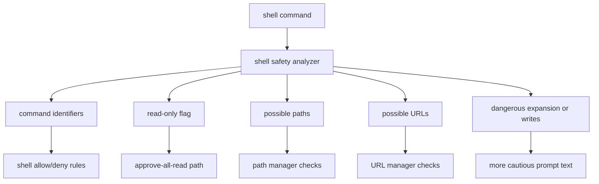

This design lets the runtime offer narrower session approvals, such as allowing a known command identifier, while still guarding paths and URLs discovered inside the command.

## User decisions and approval scopes

A user or remote client can return several kinds of decisions:

| Decision | Effect |
|---|---|
| Approve once | The current request is approved but no reusable rule is stored. |
| Approve for session | The approval is converted to rules and stored in the in-memory session approval list. |
| Approve for location | The approval is converted to rules, added to location approvals, and persisted under a location key. |
| Approve URL permanently | The URL pattern is written to persistent settings. |
| Reject | The current request is denied. |
| Deny by hook | A `permissionRequest` hook can deny with a message and optional interrupt behavior. |

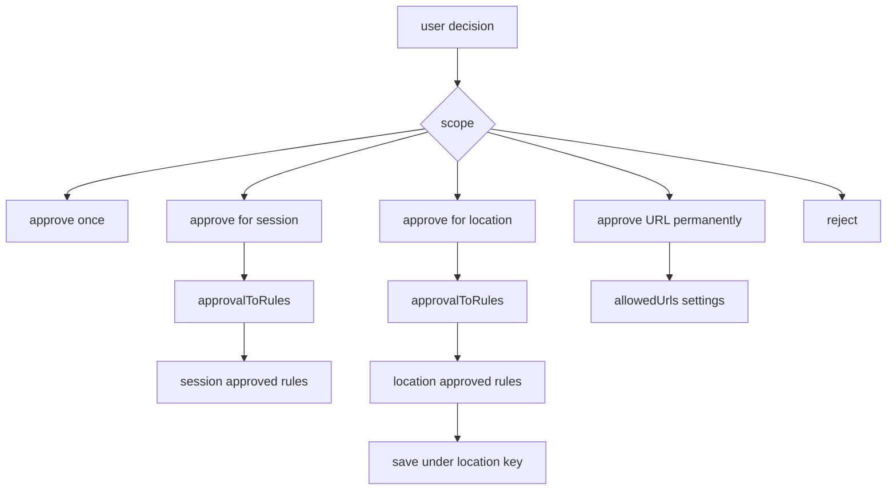

The location key is resolved from the Git repository root when possible; otherwise it falls back to a normalized cwd-style key. That gives repository-scoped approvals stable reuse without making them global across unrelated folders.

## Hook integration

There are two permission-adjacent hook systems.

### `preToolUse`

`preToolUse` runs before normal tool execution. It can:

- allow the tool;
- deny the tool;
- ask the user through a special hook permission request;
- modify tool arguments;
- add extra context.

Because `preToolUse` can affect authorization, HTTP hooks in this category are required to use HTTPS unless explicit local-development environment overrides are set.

### `permissionRequest`

`permissionRequest` hooks run from the permission flow itself. The hook input builder maps request kinds into tool-like payloads:

| Raw request | Hook tool name | Hook input summary |
|---|---|---|
| Shell | `bash` or `powershell` | Command text. |
| Write | `edit` | File path and diff-like content. |
| MCP | `server/tool` | MCP tool arguments. |
| URL | `web_fetch` | URL. |
| Memory | `store_memory` | Subject, fact, and citations for store-like memory requests. |
| Custom tool | Custom tool name | Tool arguments. |

Read and hook permission requests do not get ordinary `permissionRequest` hook payloads in the observed mapping.

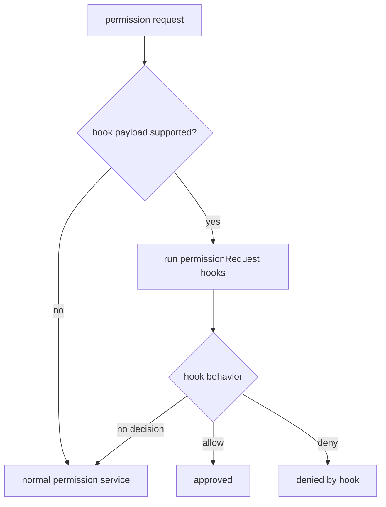

Authorization-affecting HTTP hooks are also protected against unsafe transport and local-network targets. The code rejects private, loopback, and link-local destinations unless the explicit localhost override is enabled, and it requires HTTPS unless the explicit HTTP authorization-hook override is set.

## Interactive, remote, and ACP prompt flow

When the service needs a human decision, it does not render UI directly. It emits or creates a pending permission request, and the active host is responsible for presenting it.

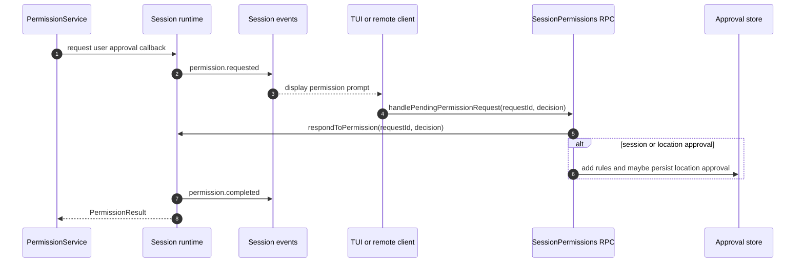

Remote steering uses a similar bridge. The command poller receives a `permission_response`, and the prompt manager converts it into the same decision vocabulary:

- tool approval -> approve once, approve for session, or reject;
- URL approval -> approve once, approve for session by origin, or reject;
- path approval -> approve once or session-style path approval;
- hook approval -> hook-specific approval or rejection.

ACP sessions build their own permission service at session creation time. They use the same central service but set baseline behavior from ACP options, including allow-all flags, approved/denied rules, URL rules, path-manager choice, and approve-all-read behavior.

## Persistence scopes

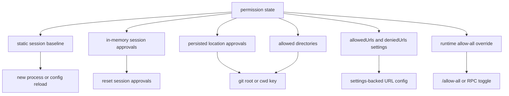

| State | Lifetime | Reset path |
|---|---|---|
| Static approved/denied rules | Session baseline from CLI/config | Start a new session with different flags/config. |
| Session approved rules | Current session | `resetSessionApprovals`, `/reset`-style flow, or session end. |
| Location approved rules | Saved for git root or cwd key | Location reset flow clears saved approvals for that location. |
| Allowed directories | Path manager plus persisted location directories | `/add-dir` adds; reset clears saved location directories. |
| Allowed/denied URLs | Settings-backed URL config plus session URL manager | URL settings update or session reset, depending on scope. |
| Allow-all override | Runtime session override | `/allow-all off`, reset approvals, RPC toggle, or session end. |

## Slash commands and CLI controls

The permission-related slash commands are thin adapters over the same service state:

| Command | Effect |
|---|---|
| `/allow-all` or `/yolo` | Enables automatic approval for tools, paths, and URLs in the current session. |
| `/allow-all off` | Disables the runtime allow-all override and restores individual approval requirements, subject to baseline CLI flags. |
| `/allow-all show` | Reports whether tool, path, and URL requests are auto-approved. |
| `/add-dir <directory>` | Adds a directory to the path manager's allowed list. |
| `/cwd <directory>` | Changes working directory and the primary allowed-directory context. |
| Reset approvals command | Clears session tool approvals, allow-all mode, autopilot permission state, and saved approvals for the location. |
| `/sandbox enable` / `/sandbox disable` | Toggles the separate local command sandbox setting when the `SANDBOX` gate exposes the command. |

The CLI flags build the initial baseline, while slash/RPC commands mutate the live session. This is why an interactive session can show messages such as an allow-all override being removed while baseline CLI flags still keep some permissions enabled.

## Specialized domains

### Memory

Memory writes and votes are permissioned side effects with rule kind `memory`. The memory tool asks for approval before storing or voting unless an allow rule, session approval, location approval, or allow-all state covers the request. See [`memory-and-context-board.md`](../02-context-and-input/memory-and-context-board.md) for the full memory subsystem.

### MCP

MCP tool calls match by server name and optional tool name. MCP sampling uses a separate sampling approval check. There is also a raw environment gate for the built-in GitHub MCP URL: when `COPILOT_FEATURE_FLAGS` does not contain the MCP permission-gate flag, the helper forces the default GitHub MCP URL to a readonly endpoint. That gate is separate from the generic permission rule service; see [`feature-gates.md`](../08-operations-and-research/feature-gates.md).

### Extensions

Extensions have dedicated permission kinds for extension management and extension permission access. This keeps extension lifecycle actions from being accidentally conflated with shell or write permissions.

### Custom and external tools

External tools are exposed only if they pass the tool-filter layer. When invoked, they send `custom-tool` permission requests unless the external tool definition explicitly skips permission. The result is converted back into a tool-visible denial or execution path.

### Sandbox

Sandbox settings are configured separately from the permission service. The sandbox constrains process/file access at execution time, while permissions decide whether a request should be allowed to attempt execution. The two layers are complementary rather than interchangeable.

In other words, `/sandbox enable` is not a permission rule and is not evaluated by the rule-precedence pipeline above. It toggles `settings.sandbox.enabled`, which later flows into shell configuration and the sandboxed shell spawn path. The full implementation trace is documented in [`sandboxing.md`](./sandboxing.md).

## Non-interactive behavior

Non-interactive prompt mode can evaluate baseline rules, URL settings, path managers, and content exclusion, but it cannot freely ask the user. If no rule or auto-approval covers a request, the result is a denial or user-unavailable outcome instead of an interactive dialog.

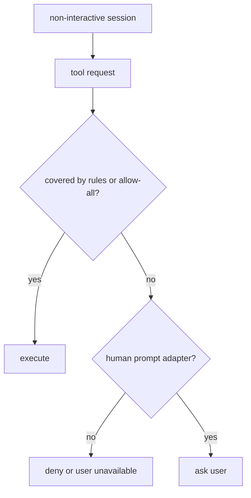

This is why the CLI exposes explicit allow/deny flags: they let automation choose a safe baseline without depending on a TUI dialog.

## Design takeaways

- Permission enforcement is layered: content exclusion and path policy can block before ordinary allow rules are considered.
- Deny rules always win over allow rules and allow-all switches.
- Tool visibility and permission approval are separate; hiding a tool is not the same as denying a visible tool invocation.
- Path, URL, and tool permissions have separate managers because they need different matching and persistence semantics.
- User approvals can be one-shot, session-scoped, location-scoped, or URL-persistent.
- Hooks can participate in authorization, so hook transport and destination validation are stricter for authorization-affecting hooks.
- Remote, TUI, and ACP modes converge on the same permission-result vocabulary, which keeps the core service reusable.
- Memory, MCP, extensions, and custom tools are first-class permission domains rather than ad-hoc prompts.

Related docs: [`integrations-permissions-config.md`](../04-tools-and-integrations/integrations-permissions-config.md), [`tui-and-slash-commands.md`](../01-runtime-and-ui/tui-and-slash-commands.md), [`sessions-remote-cloud.md`](../03-sessions-and-remote/sessions-remote-cloud.md), [`sandboxing.md`](./sandboxing.md), [`feature-gates.md`](../08-operations-and-research/feature-gates.md), [`memory-and-context-board.md`](../02-context-and-input/memory-and-context-board.md), and [`agent-task-orchestration.md`](../07-agents-and-automation/agent-task-orchestration.md).
