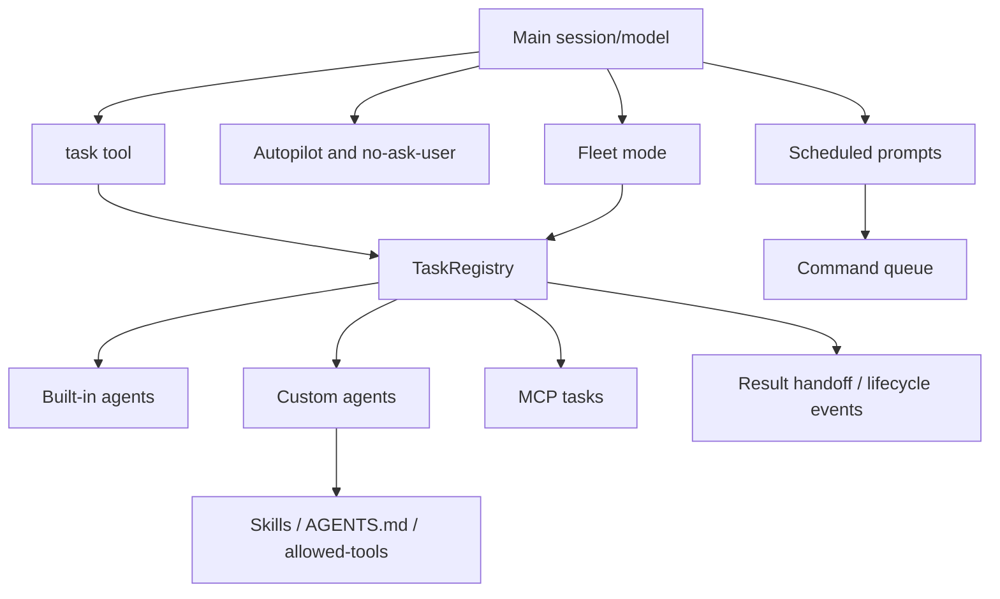

# Agents and automation

This chapter follows work that leaves the single foreground model turn: built-in agents, custom agents, skills, subagents, background and multi-turn tasks, autopilot/no-ask-user modes, fleet orchestration, scheduled prompts, and command queues.

Read this chapter when the question is: **how does the runtime delegate, parallelize, continue, or schedule work beyond one assistant response?**

## Source-anchor policy

This page is a chapter guide. Linked implementation pages carry concrete `app.js` anchors.

| Semantic alias | Minified anchor | Scope |
|---|---|---|
| Agents/automation chapter | N/A — navigation page | Groups task orchestration, built-in/custom agents, skills, autopilot/no-ask-user, fleet, and scheduled prompts. |
| Agent implementation pages | See linked source-anchor tables | Concrete bundle anchors live in the destination pages. |

## Automation map

## Primary reading order

| Order | Page | Agent/automation question answered |
|---:|---|---|
| 1 | [Agent and task orchestration](agent-task-orchestration.md) | How do the task tool, TaskRegistry, main/subagent/custom-agent collaboration, hooks, MCP tasks, research, and fleet share lifecycle state? |
| 2 | [Built-in agents](built-in-agents.md) | Which built-in agent types exist, how are YAML/runtime-defined prompts selected, and what slash-command entry points use them? |
| 3 | [Custom agents and skills packaging](custom-agents-and-skills-packaging.md) | How do AGENTS.md, SKILL.md, provided/remote/plugin agents, skill directories, invocation, allowed-tools, and enable/disable events work? |
| 4 | [Autopilot and no-ask-user flags](autopilot-and-no-ask-user.md) | How do `--autopilot`, `--no-ask-user`, continuation, `task_complete`, `ask_user`, and permission boundaries differ? |
| 5 | [Fleet mode implementation](fleet-mode.md) | How do `/fleet`, `session.fleet.start`, SQL todo coordination, dependencies, and parallel subagents interact? |
| 6 | [Scheduled prompts and command queue](scheduled-prompts-and-command-queue.md) | How do `/every`, `/after`, ScheduleRegistry replay, queue integration, and ephemeral command dispatch work? |

## Handoffs

- Agent prompts and skills feed the [Context and model loop](../02-context-model-loop/README.md).
- Agent-specific tools and approval boundaries use [Tools, integrations, and security](../03-tools-integrations-security/README.md).
- Background/multi-turn tasks persist through [Sessions, persistence, and remote](../04-sessions-persistence-remote/README.md).
- Hosted job constraints and validation toggles are covered by [Hosted agent ops](../05-hosted-agent-ops/README.md).

## Navigation

- [Start here](../00-start-here/README.md)
- [Full table of contents](../SUMMARY.md)
