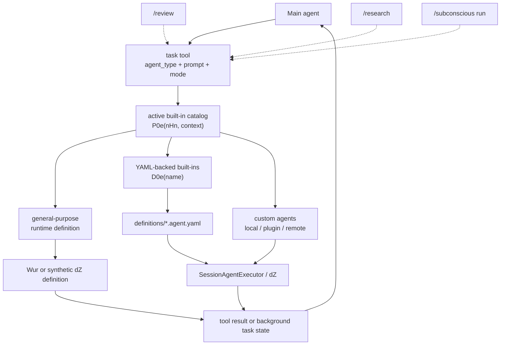
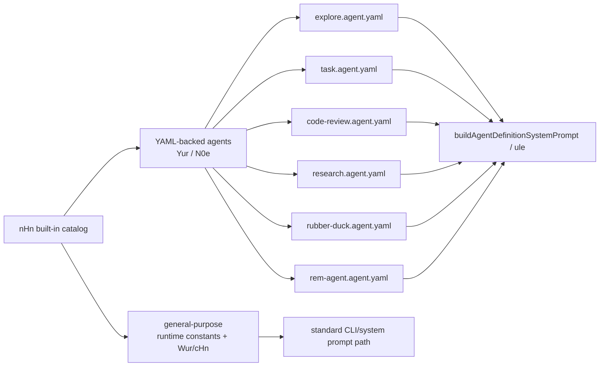
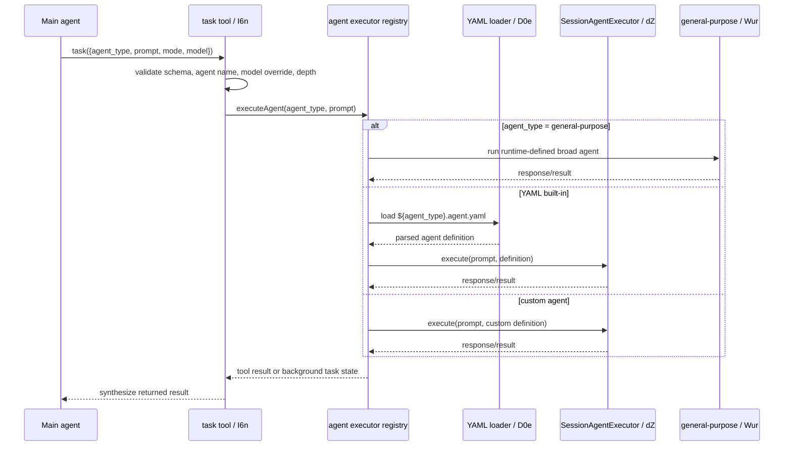

# Built-in agents in Copilot CLI

## MVP placement

> **Why this page is here:** This page belongs to [Agents and automation](README.md). It explains the delegation layer: built-in/custom agents, task orchestration, autopilot/no-ask-user behavior, fleet coordination, or scheduled command queues. Pair it with [Context and model loop](../02-context-model-loop/README.md) for prompt inputs and [Sessions, persistence, and remote](../04-sessions-persistence-remote/README.md) for background or multi-turn state.

This page is the centralized catalog for Copilot CLI's packaged built-in agents. It complements the broader orchestration map in [`agent-task-orchestration.md`](agent-task-orchestration.md) and the prompt-source inventory in [`prompt-sources.md`](../02-context-model-loop/prompt-sources.md).

The short version: the model-visible `task` tool can dispatch to a small built-in catalog. Six entries are backed by `copilot-cli-pkg/definitions/*.agent.yaml`; `general-purpose` is a runtime-defined built-in with a dedicated execution path rather than a YAML file.

## Source anchors

`app.js` is bundled/minified, so semantic aliases are explanatory names and minified anchors are version-specific lookup aids for this extracted package.

| Area | Semantic alias | Minified anchor | Approx. line | What it proves |
|---|---|---:|---:|---|
| Task tool | `createTaskTool(...)`, `TASK_TOOL_NAME`, `taskToolInputSchema` | `I6n(...)`, `H3="task"`, `v6n` | 3735-3815 | The main model-facing delegation surface accepts `agent_type`, `prompt`, `name`, optional `model`, and optional sync/background mode. |
| Built-in catalog | `BUILT_IN_AGENTS` | `nHn` | 4037 | Static catalog entries for `explore`, `task`, `general-purpose`, `rubber-duck`, `code-review`, `research`, and `rem-agent`. |
| Active catalog filter | `filterBuiltInAgents(...)` | `P0e(...)` | 4037 | Filters built-ins by feature flag and context, for example `rem-agent` being CLI/context-board gated. |
| YAML loader | `loadBuiltInAgentDefinition(...)` | `D0e(...)` | 4037 | Loads `${name}.agent.yaml` from the packaged `definitions` directory and caches the parsed definition. |
| YAML executable set | `isYamlBuiltInAgent(...)` | `N0e(...)`, `Yur`, `oHn`, `mxs` | 4037 | Separates YAML-backed executable agents from the runtime-only `general-purpose` entry. |
| General-purpose executor | `executeGeneralPurposeAgent(...)` | `Wur(...)`, `_U="general-purpose"` | 4033-4037 | Handles `general-purpose` with the standard CLI prompt/toolset and selected model defaults. |
| Session-based agent executor | `SessionAgentExecutor` | `dZ` | 4037-4043 | Creates child sessions for built-in/custom agents, runs turns, emits boundaries, handles hooks, and tears down. |
| Dispatcher | `createAgentExecutorRegistry(...)` | `Zur(...)`, `cHn(...)`, `Lur(...)`, `Uur(...)` | 4043 | Routes `general-purpose`, YAML built-ins, and custom agents to their appropriate executor. |
| Session YAML selection | `tryLoadBuiltinYamlAgent(...)` | same semantic method | 4471 | Lets a named YAML built-in be selected as a session/custom-agent-like definition. |
| Runtime tool assembly | `assembleRuntimeTools(...)` | `HCr(...)`, `$Cr(...)`, `$js(...)` | 5734 | Injects the `task` tool and may suppress `rubber-duck` when feature/model conditions are not met. |
| Slash-command macros | `/review`, `/research`, `/subconscious run` | `reviewCommand`, `researchCommand`, `subconsciousRunCommand` | 1300-1545 | User-facing macros route into `code-review`, `research`, and `rem-agent`. |
| Detached memory agent | `spawnDetachedMemoryAgent(...)` | `T5a(...)` | 7441 | Shutdown can launch a detached `copilot --agent rem-agent` process when subconscious memory is enabled. |

## Runtime model

The key distinction is **cataloged** versus **active** versus **YAML-backed**:

- `nHn` is the static built-in catalog observed in the bundle.
- `P0e(...)` filters catalog entries by runtime feature flags and context.
- `N0e(...)` recognizes the YAML-backed executable set: `explore`, `task`, `code-review`, `rubber-duck`, `research`, and `rem-agent`.
- `general-purpose` is still a built-in `agent_type`, but it is constructed in runtime code rather than loaded from `definitions/general-purpose.agent.yaml`.

## Catalog summary

| Agent type | Display name / source | Prompt source | Default model in package | Side effects | Typical entry point |
|---|---|---|---|---|---|
| `general-purpose` | `General Purpose Agent` runtime constants | Runtime CLI-style prompt, not YAML | Selected from session/settings path | Yes | Main agent delegates broad autonomous work through `task`; background task APIs can also name it. |
| `explore` | `Explore Agent` | `copilot-cli-pkg/definitions/explore.agent.yaml` | `claude-haiku-4.5` | No | Parallel codebase exploration or focused research delegated by the main agent. |
| `task` | `Task Agent` | `copilot-cli-pkg/definitions/task.agent.yaml` | `claude-haiku-4.5` | Yes | Build/test/lint/install/format commands where concise success output is desired. |
| `code-review` | `Code Review Agent` | `copilot-cli-pkg/definitions/code-review.agent.yaml` | `claude-sonnet-4.5` | No | `/review` macro or explicit `task` delegation for high-signal review. |
| `research` | `Research Agent` | `copilot-cli-pkg/definitions/research.agent.yaml` | `claude-sonnet-4.6` | No | `/research` orchestrator dispatches many `research` subagents with citations. |
| `rubber-duck` | `Rubber Duck Agent` | `copilot-cli-pkg/definitions/rubber-duck.agent.yaml` | Dynamic / runtime-selected | Yes in catalog, but intended as analysis-only | Prompt/tool guidance encourages use for non-trivial plan or implementation critique when enabled. |
| `rem-agent` | `REM Agent` | `copilot-cli-pkg/definitions/rem-agent.agent.yaml` | Not fixed in YAML | Yes | `/subconscious run` background consolidation or detached shutdown memory consolidation. |

`hasSideEffects` in the runtime catalog is conservative. For example, `rubber-duck` is described as a critic that should not make direct code changes, but the catalog marks it side-effectful because it has broad investigation tools and consumes subagent resources. Conversely, `code-review` and `research` are read-oriented in their packaged prompts.

## Per-agent notes

### `general-purpose`

`general-purpose` is the broadest built-in. The runtime constants give it the display name `General Purpose Agent` and describe it as a full-capability agent running in a separate context window with the complete toolset.

Unlike the other built-ins, there is no `copilot-cli-pkg/definitions/general-purpose.agent.yaml`. The dispatcher special-cases this name:

- non-session-based execution routes it to `Wur(...)`, which builds a normal CLI-like agent environment and runs a loop until a final response is found;
- session-based execution creates a synthetic definition with `tools: ["*"]`, environment context, AI safety, tool instructions, parallel-calling guidance, and custom-agent instructions enabled, then executes it through `SessionAgentExecutor`.

Use it when a delegated job needs broad autonomy and the full CLI tool surface. Prefer narrower agents when the task is just exploration, command execution, review, research, or critique.

### `explore`

`explore` is optimized for quick codebase investigation. Its YAML description says it uses code intelligence plus search/read/shell tools in a separate context window and is safe to call in parallel.

Notable packaged traits:

- model: `claude-haiku-4.5`;
- tools: `grep`, `glob`, `view`, Bash/PowerShell read/stop tools, `lsp`, read-only GitHub MCP tools, and Bluebird search/code-structure/history tools;
- prompt style: answer fast, stop once enough evidence is found, keep answers short, cite paths/line numbers, and call independent tools in parallel.

The task-tool instructions also warn not to use `explore` for tiny lookups that the main agent can do directly with `grep`/`glob`/`view`. Its sweet spot is cross-cutting investigation across many modules or parallel independent search threads.

### `task`

`task` is a command-execution subagent, not the same thing as the model-visible `task` tool. The shared name is easy to confuse:

| Name | Meaning |
|---|---|
| `task` tool | The model-visible dispatcher that starts subagents. |
| `agent_type: "task"` | The built-in subagent specialized for running development commands. |

The YAML-backed Task Agent has `tools: ["*"]` and model `claude-haiku-4.5`. Its prompt tells it to run tests, builds, linters, dependency installs, or formatters exactly once and report efficiently:

- on success, return a one-line summary;
- on failure, return full error output needed for debugging;
- do not fix, analyze, suggest, or retry.

This keeps verbose successful command output out of the main conversation while preserving complete failure evidence.

### `code-review`

`code-review` is the high signal-to-noise reviewer. Its YAML prompt explicitly forbids code modification and tells it to surface only material issues:

- bugs and logic errors;
- security issues;
- race conditions or resource leaks;
- missing error handling that could crash;
- breaking API changes;
- measurable performance problems.

It intentionally does **not** comment on style, formatting, naming, grammar, minor refactors, or uncertain best-practice advice. The `/review` slash command injects a prompt that routes the main agent toward `task` with `agent_type: "code-review"`.

### `research`

`research` is the deeper research worker used by the `/research` orchestration flow. Its packaged prompt requires autonomous searches with citations and emphasizes "search to discover, fetch to investigate": use a few searches to find repositories and paths, then fetch/read concrete files.

Notable packaged traits:

- model: `claude-sonnet-4.6`;
- tools: GitHub MCP search/read APIs, web fetch/search, local `grep`/`glob`/`view`;
- prompt style: call `github/get_me` first, follow the main orchestrator's search instructions, cite every claim with path and line ranges, and report gaps/uncertainties.

The `/research` macro builds a strict top-level orchestrator prompt. That top-level agent is told to manage the project and delegate investigation to several `research` subagents through the `task` tool instead of researching directly.

### `rubber-duck`

`rubber-duck` is a constructive critic. Its YAML prompt frames it as a "devil's advocate" that reviews plans, designs, implementations, or tests and reports only issues that matter to project success.

Important details:

- the YAML intentionally omits a fixed model; runtime code may pick a complementary model family based on the user's current model and feature gates;
- tools are broad (`"*"`), but the prompt says not to make direct code changes;
- the task-tool/main-system guidance encourages using it for non-trivial tasks, especially after planning and before implementation;
- runtime tool assembly can exclude it when the rubber-duck feature/model conditions are not satisfied.

This agent is best understood as an internal quality loop: it gives the main agent independent critique, while the main agent remains responsible for deciding what to do with the feedback.

### `rem-agent`

`rem-agent` is the memory-consolidation built-in. Its YAML says it reads a per-session trajectory and updates the dynamic context board through the `context_board` tool. It is not intended for spontaneous use.

Two runtime paths are documented:

1. `/subconscious run` injects an `agent-prompt` that tells the main agent to call the model-visible `task` tool exactly once with `agent_type: "rem-agent"`, `mode: "background"`, `name: "rem-consolidate"`, and `description: "Consolidate session learnings"`.
2. Interactive shutdown can spawn a detached process with `--agent rem-agent`, `-p` set to the consolidation prompt, `--yolo`, and `--silent`, carrying parent session identifiers in the environment.

The static catalog also gates `rem-agent` with `featureFlag: "COPILOT_SUBCONSCIOUS"` and `contexts: ["cli"]`, so it is a built-in catalog entry but not necessarily active in every runtime context.

## Prompt-source distinction

The YAML-backed agents share the same package format:

- `name`, `displayName`, and `description` describe the catalog entry;
- `model` is optional or fixed depending on the agent;
- `tools` controls the requested tool allowlist;
- `promptParts` controls whether AI safety, tool instructions, parallel-calling text, environment context, custom-agent instructions, or consolidation instructions are appended;
- `prompt` is the agent's core system prompt body.

`buildAgentDefinitionSystemPrompt(...)` renders those YAML definitions with runtime variables such as `cwd` and tool names. That is why these prompts are statically extractable from the package but still not exactly the final provider payload for a live session.

## Selection and execution path

The selection flow has a few practical implications:

- The main agent must provide enough context in the delegated `prompt`; subagents do not share the main agent's hidden reasoning state.
- Background mode changes how results are delivered through `TaskRegistry`, but it does not change the agent definition.
- Feature flags and context filters can make a cataloged built-in unavailable in a given session.
- Custom agents join the same `agent_type` namespace, so a runtime task prompt may mention both built-in and custom names.

## Relationship to adjacent docs

| Question | Read next |
|---|---|
| How does `task` dispatch, track background work, and communicate with subagents? | [`agent-task-orchestration.md`](agent-task-orchestration.md) |
| Which prompt files are statically packaged versus runtime-provided? | [`prompt-sources.md`](../02-context-model-loop/prompt-sources.md) |
| How do local/plugin/remote custom agents and skills differ from built-ins? | [`custom-agents-and-skills-packaging.md`](custom-agents-and-skills-packaging.md) |
| How does `rem-agent` update the context board? | [`memory-and-context-board.md`](../02-context-model-loop/memory-and-context-board.md) |
| How does `/fleet` coordinate many subagents? | [`fleet-mode.md`](fleet-mode.md) |

## Key takeaways

- There are seven cataloged built-in agent types in this package: `general-purpose`, `explore`, `task`, `code-review`, `research`, `rubber-duck`, and `rem-agent`.
- Six are YAML-backed under `copilot-cli-pkg/definitions/*.agent.yaml`; `general-purpose` is runtime-defined.
- The model-visible `task` tool is the normal dispatch surface for built-ins, custom agents, and background/multi-turn behavior.
- Slash commands are mostly macros that steer the main agent toward the appropriate built-in agent.
- Catalog membership is not the same as availability; feature flags, runtime context, model support, and tool assembly can filter the active surface.
