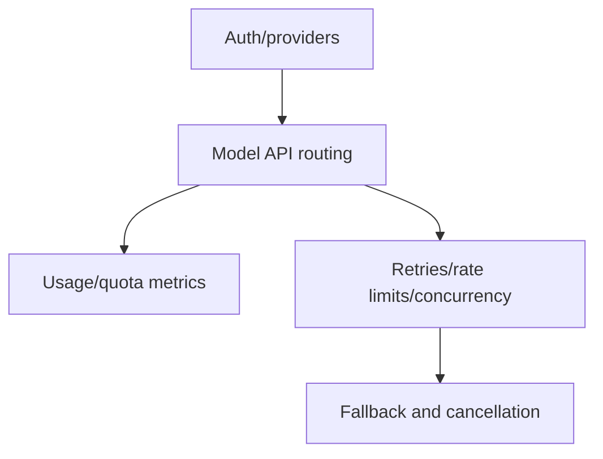

# Models and reliability

Authentication, provider selection, wire APIs, resilience, rate limits, usage metrics, quota, and billing.

## Semantic alias and minified anchor mapping

This is a section index, not a direct `app.js` implementation analysis. Topic pages linked below carry the concrete bundle mappings.

| Semantic alias | Minified anchor | Scope |
|---|---|---|
| Models and reliability section index | N/A — navigation page | Groups auth/provider, API routing, resilience, and usage/quota docs. |
| Models and reliability topic pages | See linked page-level mappings | Concrete `app.js` anchors are documented in the child pages. |

## How this section fits

## Pages

| Page | Why read it | File |
|---|---|---|
| [Models, providers, and authentication workflows](./models-providers-auth.md) | Auth manager, login, GitHub tokens, BYOK/custom providers, offline mode, model selection, and effort. | `models-providers-auth.md` |
| [Model API routing and provider wire formats](./model-api-routing.md) | Routing to Chat Completions, Responses, WebSocket Responses, and Anthropic Messages APIs. | `model-api-routing.md` |
| [Rate limits, concurrency, retries, and error recovery](./resilience-rate-limits-concurrency.md) | Retry policy, rate-limit recovery, auto-mode switching, queue pauses, concurrency limits, fallback, and cancellation. | `resilience-rate-limits-concurrency.md` |
| [Usage, quota, and billing metrics](./usage-quota-billing-metrics.md) | /usage, assistant.usage, session.usage_info, premium/AI-unit metrics, token details, and billing/quota errors. | `usage-quota-billing-metrics.md` |

## Reading guidance

- Auth/provider selection decides where calls go.
- Routing, usage, and resilience describe the lifecycle of each model call.

## Back to wiki home

- [Wiki home](../README.md)
- [Full table of contents](../SUMMARY.md)
