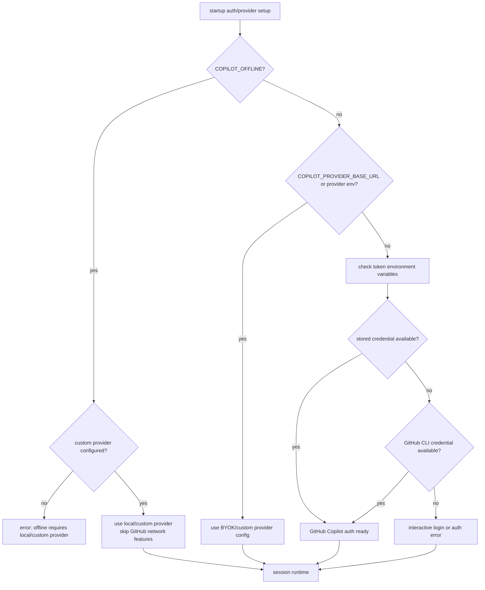
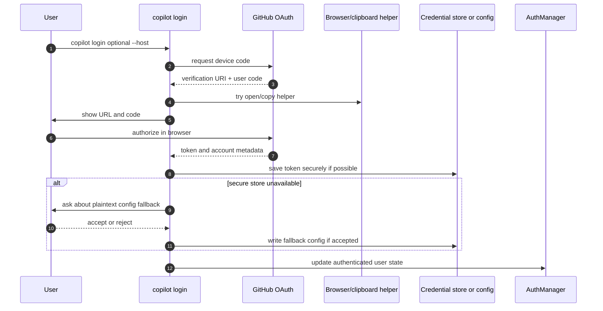
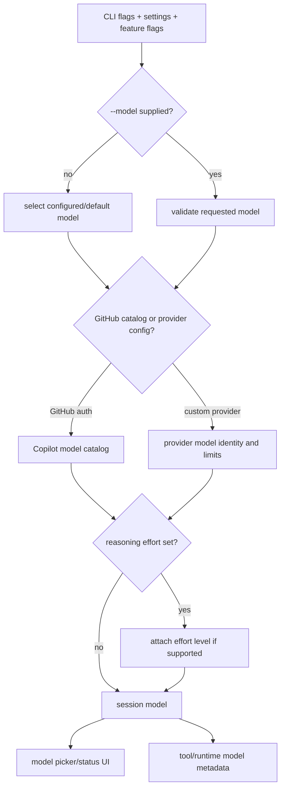
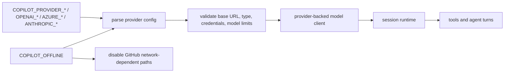
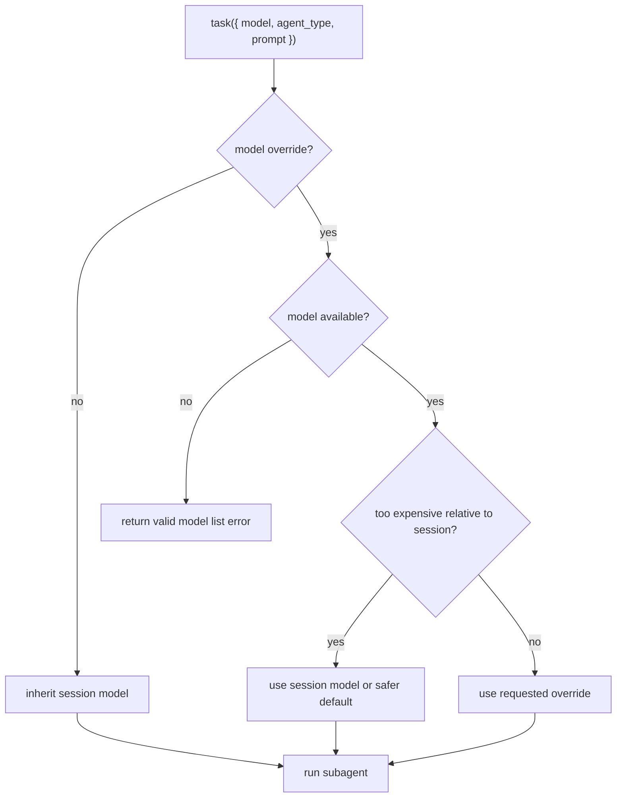
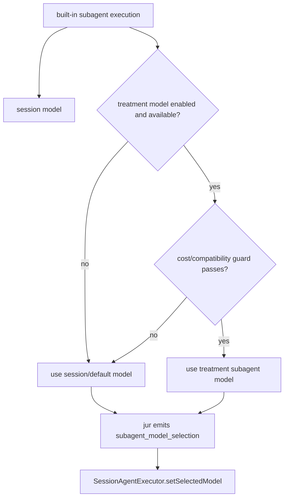

# Models, providers, and authentication workflows

This document deepens the model/auth/provider coverage that was previously summarized in the main feature map and integration document. It explains how `app.js` chooses between GitHub Copilot authentication, environment tokens, GitHub CLI credentials, BYOK/custom providers, offline mode, model selection, and subagent model overrides. For the network request shape used after a model/provider is selected, see [`model-api-routing.md`](./model-api-routing.md).

## Source anchors

| Area | Semantic alias | Minified anchor | Approx. line | Role |
|---|---|---:|---:|---|
| Auth manager | `AuthManager` | `EX` usage | 7420, 8298 | Resolves GitHub/GHE authentication and model catalog access. |
| Login command | `buildLoginCommand()` | `m9o()` | 8298 | Implements `copilot login` and token storage behavior. |
| Provider config | `ProviderConfig` | provider env parsing around `COPILOT_PROVIDER_*` | 239, 8298 | Reads BYOK/custom provider environment and model limit values. |
| Offline mode | `OfflineProviderPath` | `COPILOT_OFFLINE` checks | 239, 8298 | Requires custom/local provider and disables GitHub network features. |
| Model option | `--model` / model picker | root option and TUI handlers | 7000-8298 | Selects the session model or opens interactive selection. |
| Reasoning effort | `--effort`, `--reasoning-effort` | root option | 8298 | Sets reasoning effort for supported models. |
| Subagent model override | `task` model validation | `createTaskTool(...)` | 3735-3815 | Validates and may downshift subagent model overrides. |
| Session subagent model selection | `selectSubagentModel(...)`, `emitSubagentModelTelemetry(...)` | `Vur(...)`, `jur(...)` | 4030-4036 | Chooses treatment/default/session models for built-in subagents and emits `subagent_model_selection` telemetry. |
| Feature gates | `FeatureFlagService` | `Pfe`, `ILt` | 239 | Enables model-adjacent behavior such as special subagent models or advisor paths. |

## Authentication and provider decision tree

The startup path first determines whether the CLI should use GitHub Copilot services, a custom provider, or an offline/local-provider path.

The important split is whether the model catalog and GitHub integrations are backed by GitHub Copilot authentication or by explicit provider configuration.

## Token and provider inputs

The bundle contains allow/deny/redaction lists for many environment variables. Relevant observed inputs include:

| Input family | Examples | Purpose |
|---|---|---|
| GitHub tokens | `COPILOT_GITHUB_TOKEN`, `GITHUB_TOKEN`, `GH_TOKEN`, `GITHUB_PERSONAL_ACCESS_TOKEN` | Authenticate GitHub/Copilot API calls or provide fallback GitHub credentials. |
| Provider endpoint | `COPILOT_PROVIDER_BASE_URL`, `OPENAI_BASE_URL`, `AZURE_OPENAI_API_ENDPOINT` | Point model requests at a custom/OpenAI/Azure-compatible endpoint. |
| Provider type/wire protocol | `COPILOT_PROVIDER_TYPE`, `COPILOT_PROVIDER_WIRE_API`, `COPILOT_PROVIDER_AZURE_API_VERSION` | Describe provider family and request protocol. |
| Provider model | `COPILOT_PROVIDER_MODEL_ID`, `COPILOT_PROVIDER_WIRE_MODEL`, `COPILOT_PROVIDER_MODEL_LIMITS_ID` | Choose visible model identity and token-limit behavior. |
| Provider credentials | `COPILOT_PROVIDER_API_KEY`, `COPILOT_PROVIDER_BEARER_TOKEN`, `OPENAI_API_KEY`, `AZURE_OPENAI_API_KEY`, `ANTHROPIC_API_KEY` | Authenticate with non-GitHub model providers. |
| Provider limits | `COPILOT_PROVIDER_MAX_PROMPT_TOKENS`, `COPILOT_PROVIDER_MAX_OUTPUT_TOKENS` | Override prompt/output token caps for custom providers. |
| Offline control | `COPILOT_OFFLINE` | Forces local/custom provider mode and disables online GitHub features. |

Secrets are treated specially by logging/shell/MCP redaction paths, and users can add names with `--secret-env-vars`.

## Login workflow

The `copilot login` subcommand performs an OAuth device/browser flow and stores a token when possible.

The login path is used primarily for GitHub Copilot-backed operation. BYOK/custom providers can avoid the GitHub model path, but GitHub features such as remote sessions or GitHub MCP still require suitable GitHub authentication unless disabled.

## Model selection pipeline

Inputs that influence the selected model include:

- `--model`;
- `--effort` / `--reasoning-effort`;
- settings/config defaults;
- provider environment variables;
- account plan/model availability;
- feature gates and experiments.

## BYOK/custom provider path

Custom provider mode lets the CLI run model calls against a non-default provider endpoint.

Custom provider mode changes model routing, but it does not automatically grant GitHub API, MCP, remote-session, or telemetry behavior. Those paths are independently controlled by auth, offline mode, and policy.

## Subagent model overrides

The `task` tool accepts an optional model override for subagents. The bundle validates this override and may reject or downgrade it.

Feature gates and experiments can also influence model behavior, such as special defaults for explore/rubber-duck subagents.

### Session-based subagent selection details

The session-based subagent path adds a second model-selection layer before `SessionAgentExecutor` runs. The relevant source anchors are `Vur(...)` and `jur(...)` around line `4030`.

`Vur(...)` considers:

| Input | Meaning |
|---|---|
| `sessionModel` | The current foreground session model. This is the fallback and the model used when no treatment is active. |
| `controlModel` / default selected model | The selected/default model metadata available to the session runtime. |
| `treatmentModel` | Experiment-provided subagent model, when the feature gate says a special subagent model should be tried. |
| `isGpt54ForSubagentsEnabled` | Feature gate that allows the treatment model path for eligible subagents. |
| availability/cost checks | Guards that prevent unavailable or too-expensive treatment/override models from being used. |

`jur(...)` emits `subagent_model_selection` telemetry with the decision context. That means subagent model selection is observable as an explicit policy decision, not just a side effect of the `task` tool argument.

This complements the `task`-tool override validation: `I6n(...)` validates the optional user/model-requested override at dispatch time, while `Vur(...)` chooses the final session-based subagent model after feature flags, treatment availability, and guardrails are known.

## Offline mode implications

Offline mode is not just a provider switch. It changes the available feature surface.

| Area | Offline impact |
|---|---|
| GitHub auth | Skipped or disabled for online GitHub services. |
| Model routing | Requires a local/custom provider path. |
| GitHub MCP | Disabled unless separately backed by usable local configuration. |
| Web/GitHub tools | Network-dependent tools are not available. |
| Telemetry/update | Standard GitHub telemetry and auto-update paths are disabled/no-op. |
| Remote/cloud sessions | Generally unavailable because they require GitHub-hosted coordination. |

## Takeaways

- `app.js` supports both GitHub Copilot-authenticated operation and custom provider/BYOK operation.
- `COPILOT_OFFLINE` is stricter than custom provider mode: it requires local/custom model routing and disables online GitHub features.
- Model selection is shaped by CLI flags, settings, provider config, account/catalog availability, and feature gates.
- The selected model/provider is later routed to Chat Completions, Responses, WebSocket Responses, or Anthropic Messages as described in [`model-api-routing.md`](./model-api-routing.md).
- Subagents can request model overrides, but the task tool validates availability and can apply cost/compatibility guards.
- Authentication affects more than model calls: it also gates GitHub MCP, remote/cloud sessions, update/share behavior, and some telemetry paths.