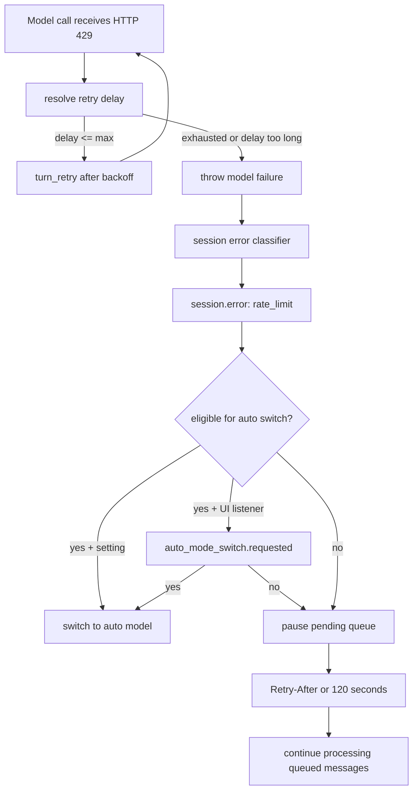
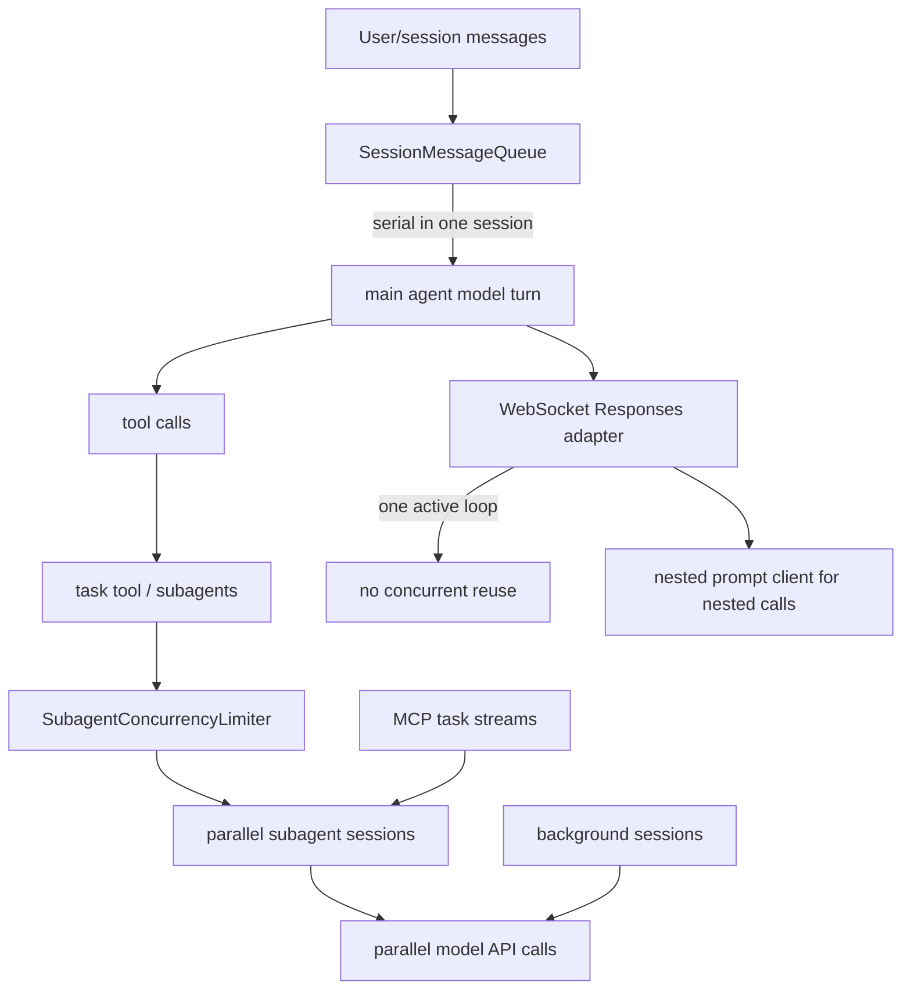
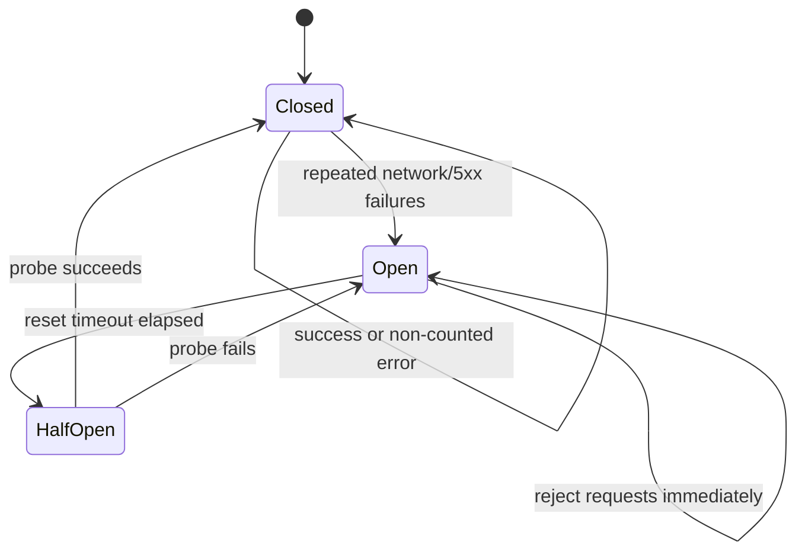

# Rate limits, concurrency, retries, and error recovery

This document explains how the extracted `@github/copilot` CLI bundle handles model rate limits, concurrent model work, retries, cancellation, and related error paths. It complements [`model-api-routing.md`](./model-api-routing.md), which explains which network API shape is selected for each provider/model.

## Executive summary

- Model API calls are wrapped by a CLI-owned retry loop. The observed model clients disable provider SDK retries with `maxRetries: 0` at the call site or client construction point, so retry decisions are centralized in the CLI runtime.
- Rate limits are handled in two layers: first by request retry/backoff, then by session-level recovery. Session recovery can switch to auto mode, prompt the UI to switch, or pause queued messages until the reset time.
- Model concurrency is not a single global HTTP throttle. A single session processes its message queue serially, while background subagents, fleet mode, background sessions, and MCP tasks can create parallel model calls.
- Parallel subagent execution is capped by a dedicated subagent concurrency limiter with account-plan defaults and `COPILOT_SUBAGENT_MAX_CONCURRENT` override support.
- WebSocket Responses has special safety rails: the WebSocket adapter cannot be reused concurrently, falls back to HTTP Responses for early 429/500/503 WebSocket failures, and resets WebSocket state when conversation history is rewritten.
- Non-rate-limit recovery includes HTTP/2 transport reset, undici dispatcher reset, session-token refresh, request-size reduction, transient bad-request retry, streaming-error retry, quota classification, context-limit errors, tool-result normalization, and cancellation propagation.

## Source anchors

`app.js` is bundled/minified, so semantic aliases below are analysis names. Minified anchors are version-specific lookup aids for the analyzed `@github/copilot` artifact and will shift across releases.

| Area | Semantic alias | Minified anchor | Approx. line | Role |
|---|---|---:|---:|---|
| Model request loop | `ModelRequestLoop` | `U3.getCompletionWithTools(...)` | `app.js` 3439 | Owns per-turn retry, tool loops, model success/failure events, and final failure construction. |
| Retry-delay resolver | `resolveModelRetryDelay(...)` | `p3n(...)` | `app.js` 3439 | Reads `x-should-retry`, `retry-after-ms`, `retry-after`, status codes, configured retry codes, exponential backoff, and jitter. |
| Default model retry options | `initDefaultModelOptions(...)` | `U3.initDefaultOptions(...)` | `app.js` 3439 | Sets default `maxRetries: 5`, default rate-limit wait, exponential growth, and maximum retry-after window. |
| Streaming transport retry processor | `StreamingErrorRetryProcessor` | `_Ce` | `app.js` 3103 | Retries non-API streaming errors after a short delay, excluding abort/timeout errors. |
| Content-annotation retry processor | `SnippyProcessor` | `aft` | `app.js` 3092 | Blocks tool execution and retries when Copilot annotations request a soft blocking pass. |
| SDK retry suppression | `DisableSdkRetriesAtModelBoundary` | `maxRetries: 0` | `app.js` 3437, 3439, 3457, 3460 | Disables provider SDK retries for model clients/calls so the CLI retry loop controls policy. |
| Rate-limit classifier | `classifyRateLimitError(...)` | `Xjn(...)`, `qgr(...)`, `zgr(...)`, `eWn(...)`, `SAr(...)` | `app.js` 4161, 4252 | Converts 429 errors into user-facing rate-limit codes, messages, retry-after seconds, and auto-switch eligibility. |
| Session rate-limit recovery | `SessionRateLimitRecovery` | `processQueuedItems(...)` branch | `app.js` 4481, 4487 | Emits rate-limit errors, switches to auto mode when allowed, prompts the UI, or pauses pending messages. |
| Rate-limit pause timer | `waitForRateLimitPause(...)` | `C8s(...)`, `S8s` | `app.js` 4471 | Waits for `retry-after` or a default 120-second pause, cancellable by the session abort signal. |
| Generic GitHub fetch retry | `GitHubFetchWithRetry` | `Sy(...)` | `app.js` 238 | Retries non-model GitHub API requests with `Retry-After`, exponential backoff, and circuit breaker integration. |
| Circuit breaker | `HostCircuitBreaker` | `b1e`, `QQ` | `app.js` 236-238 | Opens after repeated network/5xx failures, blocks requests briefly, then half-opens for a probe. |
| Session queue | `SessionMessageQueue` | `ua.itemQueue`, `processQueue(...)` | `app.js` 4475-4481 | Serializes normal messages in one session and defers idle while background agents are active. |
| Serial operation queue | `SerialOperationQueue` | `nj` | `app.js` 239 | Generic one-at-a-time async operation queue used by runtime services. |
| Task registry | `TaskRegistry` | `B3` | `app.js` 3367 | Tracks background/sync agents, states, waiters, cancellation, completion, and active-time accounting. |
| Subagent concurrency limiter | `SubagentConcurrencyLimiter` | `qmt` | `app.js` 3698 | Caps concurrent subagent execution and releases slots on completion or idle wait. |
| WebSocket Responses fallback | `WebSocketResponsesResilience` | `Pmt` | `app.js` 3469-3472 | Prevents concurrent reuse, falls back to HTTP Responses on early WebSocket failures, and closes/reset state. |
| Quota message map | `QuotaErrorMessages` | `Rii` | `app.js` 191 | Maps 402 quota/billing errors to user-facing messages. |
| Usage-limit warning UI | `UsageLimitWarningEmitter` | `wHo(...)`, `THo(...)` | `app.js` 6860 | Emits threshold warnings when weekly/session usage snapshots cross 50/75/90/95 percent. |

## Model API retry flow

```mermaid
sequenceDiagram
    autonumber
    participant Session as Session runtime
    participant Loop as ModelRequestLoop
    participant Adapter as Provider adapter
    participant API as Model API
    participant Processors as Request processors

    Session->>Loop: system prompt, messages, tools, abort signal
    Loop->>Processors: preRequest hooks
    Loop->>Adapter: send request with SDK retries disabled
    Adapter->>API: Chat / Responses / Messages / WebSocket
    API-->>Adapter: response or error
    Adapter-->>Loop: response, stream, or APIError
    alt success
        Loop-->>Session: model_call_success + message/tool events
    else retryable error
        Loop-->>Session: model_call_failure
        Loop->>Processors: onRequestError hooks
        Loop->>Loop: compute retry delay + jitter
        Loop-->>Session: turn_retry
        Loop->>Adapter: retry request
    else exhausted or non-retryable
        Loop-->>Session: turn_failed
        Loop-->>Session: throw classified error
    end
```

The observed default model retry policy is:

| Setting | Observed default | Meaning |
|---|---:|---|
| `maxRetries` | `5` | Maximum retry loop attempts before the model turn fails. |
| `defaultRetryAfterSeconds` | `5` | Base wait when a 429 lacks an explicit reset delay. |
| `initialRetryAfterBackoffExtraSeconds` | `1` | Extra exponential component for 429 backoff. |
| `retryAfterBackoffExtraGrowth` | `2` | Exponential growth factor. |
| `maxRetryAfterSeconds` | `180` | Upper bound; delays above this are treated as too long and the request gives up. |

`COPILOT_AGENT_ERROR_CODES_TO_RETRY` can add status codes or ranges to the model retry policy. The retry resolver also honors provider headers:

| Header/status | Handling |
|---|---|
| `x-should-retry: false` | Do not retry, even if the status would normally be retryable. |
| `x-should-retry: true` | Retry if a valid delay can be computed. |
| `retry-after-ms` | Millisecond retry delay; converted to seconds in the model loop. |
| `retry-after` | Parsed as seconds or HTTP date. |
| `408`, `409`, `429`, `499` | Default retryable client/server-boundary statuses for model calls. |
| `>= 500` | Default retryable server-side statuses for model calls. |
| configured status/range | Extra retryable statuses from runtime settings/env. |

When no explicit reset delay is available, 429 uses a rate-limit-specific exponential delay; other retryable errors use a shorter exponential delay. Both paths add jitter so concurrent clients do not retry at exactly the same instant.

## Rate-limit lifecycle



The rate-limit classifier recognizes several fine-grained codes when upstream includes them:

| Error code | User-facing meaning | Auto-mode switch suffix |
|---|---|---|
| `user_weekly_rate_limited` | Weekly Copilot rate limit reached. | Can suggest waiting or switching to auto model. |
| `user_model_rate_limited` | Selected model rate limit reached. | Suggests switching models or waiting. |
| `user_global_rate_limited` | Session/global limit reached. | Not eligible for auto switch in the observed eligibility set. |
| `integration_rate_limited` | Integration/model path rate limit reached. | Suggests switching models or waiting. |
| `rate_limited` | Generic rate limit. | Can suggest waiting or switching to auto model. |

Auto-mode switching is only considered when all of these are true:

1. the current selected model is not already auto mode;
2. the session is not using a custom/BYOK provider;
3. the error code is not excluded from auto-switch eligibility;
4. the user setting says to continue on auto mode, or the UI accepts the `auto_mode_switch.requested` prompt.

If no switch happens and there are pending messages, the queue pauses for the upstream `retry-after` seconds. If upstream does not provide a reset delay, the default pause is 120 seconds. The pause is abortable through the session abort signal.

## Model concurrency model

There are multiple concurrency layers; they intentionally solve different problems.



### Within one session

Normal user messages are queued and processed serially. If a turn is already active, additional user messages are appended to `itemQueue`; immediate system notifications are stored separately and injected at the next request boundary. The session also defers `session.idle` while active background agents are running.

This means a single foreground session does not normally issue overlapping main-agent model turns. It can still create concurrent model traffic through background subagents and external task mechanisms.

### Subagents and fleet mode

Subagent concurrency is controlled by a limiter:

| Account plan | Observed default concurrent subagent slots |
|---|---:|
| Free / Edu | `2` |
| Pro / Pro Plus | `4` |
| Max | `8` |
| Business | `16` |
| Enterprise / default fallback | `32` |

`COPILOT_SUBAGENT_MAX_CONCURRENT` can override the limit, clamped to the range `1..256`. A failed acquire returns a user-facing error such as “Maximum concurrent agent limit ... reached.” Slots are released when an agent completes, fails, is cancelled, or enters an idle multi-turn wait. When an idle multi-turn agent receives a new message, it reacquires a slot before resuming.

Fleet mode does not introduce a separate model scheduler. It uses the same `task` tool and `TaskRegistry`, so fleet parallelism is bounded by the same subagent limiter and by upstream model/account rate limits.

### WebSocket Responses concurrency

The WebSocket Responses adapter has a stricter local guard: one adapter instance cannot be reused for overlapping tool loops. If a nested prompt/model call is needed, it uses a nested HTTP Responses client rather than reusing the same WebSocket client. This avoids corrupting `previous_response_id`, incremental input state, and connection ownership.

## Generic GitHub API retry and circuit breaker

Some non-model GitHub API calls use a separate fetch wrapper with retry and circuit breaker behavior.



Observed behavior:

- retryable statuses include `429`, `500`, and `502` for the generic GitHub fetch wrapper;
- circuit-breaker-counted response statuses include `500`, `502`, `503`, and `504`;
- network/connect/timeout-style errors are counted by the circuit breaker;
- the default retry count is `5`, default delay is `5` seconds, and backoff factor is `2`;
- the circuit opens after repeated failures and rejects requests until its reset window elapses;
- if an HTTP response does not look like it originated from GitHub and lacks expected tracing headers, it is classified as a possible proxy/firewall interception.

This wrapper is separate from the model request loop. Do not assume every model API call goes through the generic GitHub fetch wrapper; the model adapters call SDK clients directly and then apply the model retry loop above.

## Other recovery paths worth knowing

| Scenario | Runtime behavior |
|---|---|
| `401` session token expiry | The model loop can call a session-token refresh callback once, update the client token, and retry immediately. If refresh fails for auto mode, the session clears auto-mode state and asks the user to resend. |
| `402` quota/billing | No retry. The session emits `session.error` with `errorType: "quota"` and maps known codes such as `quota_exceeded`, `session_quota_exceeded`, and `billing_not_configured` to user-facing guidance. |
| `400` transient bad request | The model loop retries a small number of times with short backoff before treating it as a query error. |
| `413` request too large | The model loop removes images/native document attachments from older messages, emits `binary_attachments_removed`, and retries. |
| Context-window overflow | The session emits `session.error` with `errorType: "context_limit"` and suggests starting a new session or compacting. |
| HTTP/2 GOAWAY / undici pool assertion | The loop resets the global dispatcher, wraps the problem as a retryable transport error, and retries. |
| WebSocket Responses early 429/500/503 | If no meaningful streaming output has arrived, the WebSocket adapter disables that attempt, closes the connection, and falls back to HTTP Responses for the remaining retry path. |
| Missing Responses completion event | If accumulated output is substantive, the Responses adapter uses the snapshot as a fallback; otherwise it throws so the outer retry path can retry. |
| Non-API streaming error | A request processor retries after a short delay, except for abort and timeout errors. |
| User/session abort | Abort signals are passed into model requests, WebSocket waits, tool execution, and rate-limit pause timers. Aborts are not retried as ordinary failures. |
| Parent subagent cancellation | `TaskRegistry` recursively cancels child agents, aborts their controllers, resolves waiters, and marks tasks as cancelled. |
| Tool execution failure | Tool failures are converted into tool-result messages for the model when possible, with telemetry/error fields preserved. |
| Invalid tool-call JSON | Tool arguments can be cleared and returned to the model as a structured failure instead of crashing the runtime. |
| Copilot content annotations | A processor can block tool execution and retry; after max retries it soft-fails and continues. |
| Git command errors | Git errors are classified by type; known expected cases can set `skipReport` to avoid noisy crash reporting. |

## Usage and quota warnings

The model success path reads quota/usage snapshot headers with prefixes such as `x-quota-snapshot-` and `x-usage-ratelimit-`. The TUI warning layer watches assistant usage events and emits ephemeral usage-limit warnings at these remaining/used thresholds:

- over 50 percent used;
- over 75 percent used;
- over 90 percent used;
- over 95 percent used.

The warning layer tracks which thresholds were already emitted so users are not repeatedly spammed for the same limit crossing. Debug env vars can force remaining percentages for testing, but the real source is the provider response headers.

## Practical takeaways

- A burst of parallel subagents can multiply model traffic; the local subagent limiter only caps local parallelism, not upstream account limits.
- For a single foreground chat, model requests are mostly serial because the session queue processes one active turn at a time.
- 429s are not immediately fatal. The CLI first retries with backoff, then may switch to auto mode or pause pending messages.
- A custom/BYOK provider can still return 429, but the auto-mode fallback is GitHub Copilot-specific and is not used for custom providers.
- `Retry-After` values longer than the model retry policy maximum are treated as too long for the immediate retry loop; the session-level pause may still use retry-after for queued-message recovery.
- WebSocket Responses is opportunistic. It can improve streaming behavior, but early WebSocket transport failures fall back to HTTP Responses.
- `402` quota errors and context-window errors are classified, user-facing terminal states, not retry loops.
