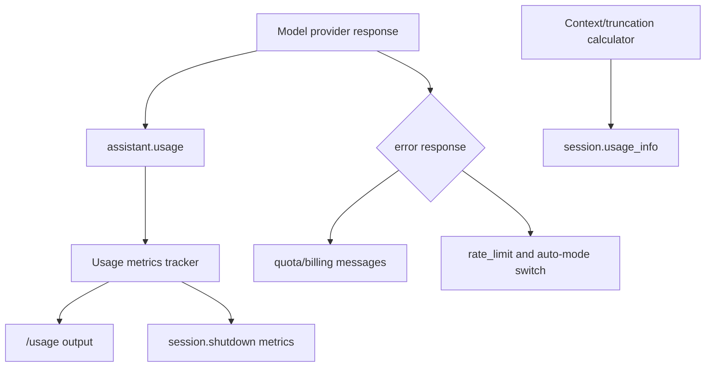
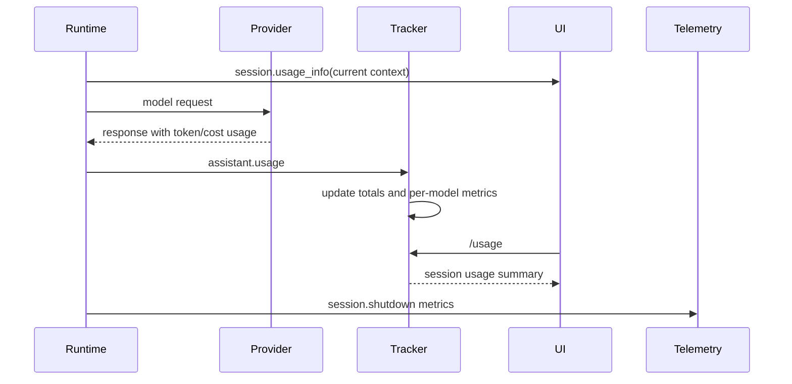

# Usage, quota, and billing metrics

This document explains how usage reporting, token accounting, quota/billing errors, and session-level metrics are implemented in the extracted Copilot CLI `app.js` bundle. The user-visible command is `/usage`, but the runtime also emits `assistant.usage`, `session.usage_info`, model metrics, quota errors, and shutdown summaries.

The important implementation point is that the CLI tracks two related but different things:

- live context-window usage, emitted as `session.usage_info`;
- accumulated request/cost/session metrics, emitted through `assistant.usage`, `/usage`, and `session.shutdown`.

Because `app.js` is bundled/minified, symbol names are unstable. Line references below are searchable anchors in the extracted bundle and will shift across releases.

## Source anchors

| Area | Anchor strings / minified symbols | Approx. `app.js` line | What it shows |
|---|---|---:|---|
| Slash command | `/usage`, `Display session usage metrics and statistics` | 4643, 1300 | User command renders accumulated session usage. |
| Live context usage | `session.usage_info`, `tokenLimit`, `currentTokens`, `messagesLength` | 3062, 4361, 4481 | Ephemeral event reports current context-window size and token breakdown. |
| API usage event | `assistant.usage`, `inputTokens`, `outputTokens`, `cacheReadTokens`, `cacheWriteTokens`, `reasoningTokens` | 4361, 4471 | Per-call usage events feed the metrics tracker. |
| Premium request metric | `totalPremiumRequests` | 1300, 4033, 4361, 4396 | Accumulated request-cost metric shown in `/usage` and shutdown telemetry. |
| AI Units metric | `totalNanoAiu`, `AI Units` | 3092, 4033, 6591 | Token-based billing/AI Units are tracked separately from premium request count. |
| API duration | `totalApiDurationMs` | 4033, 4361, 4396 | Session accumulates time spent in model API calls. |
| Per-model stats | `modelMetrics`, `requests`, `usage`, `tokenDetails` | 4033, 4361, 4396 | Shutdown and UI summarize request/token usage by model. |
| Code-change stats | `codeChanges`, `linesAdded`, `linesRemoved`, `filesModified` | 1300, 4033, 4361 | Usage display includes aggregate edit impact. |
| Quota/billing errors | `billing_not_configured`, `session_quota_exceeded`, `quota_exceeded` | 191 | 402 quota/billing responses have user-specific messages. |
| Rate-limit coupling | `eligibleForAutoSwitch`, `rate_limit` | 4361, 4487 | Rate-limit errors can trigger auto-mode switch behavior. |

## Metric map

## `/usage` command

The `/usage` command renders a compact session summary. The implementation builds output similar to:

- `Session Usage`;
- changes, as `+linesAdded -linesRemoved`;
- request total, displayed as either `Premium` or `AI Units` depending on account/billing mode;
- elapsed session duration;
- token totals when available: input, output, cached, and reasoning.

The command reads from the session’s `usageMetrics` object rather than recomputing history from raw provider responses.

## Live context usage: `session.usage_info`

`session.usage_info` is an ephemeral event describing current context-window pressure. Its schema includes:

| Field | Meaning |
|---|---|
| `tokenLimit` | Maximum prompt/context tokens for the active model. |
| `currentTokens` | Current total tokens in the context window. |
| `messagesLength` | Number of messages currently in context. |
| `systemTokens` | Optional system/developer message token count. |
| `conversationTokens` | Optional user/assistant/tool conversation token count. |
| `toolDefinitionsTokens` | Optional token count for model-visible tool definitions. |
| `isInitial` | Whether the event corresponds to initial context calculation. |

This event is emitted by truncation/compaction-related code and by context calculation paths. It helps UI surfaces display context usage without waiting for a model API response.

## API usage: `assistant.usage`

`assistant.usage` is also ephemeral, but it represents a model API call rather than context-window state. Its schema includes:

| Field | Meaning |
|---|---|
| `model` | Model identifier used for the call. |
| `inputTokens` | Input tokens consumed. |
| `outputTokens` | Output tokens produced. |
| `cacheReadTokens` | Prompt-cache read tokens. |
| `cacheWriteTokens` | Prompt-cache write tokens. |
| `reasoningTokens` | Reasoning-token count when provider reports it. |
| `copilotUsage` / `tokenDetails` | Token-based billing details when present. |
| `totalNanoAiu` | Nano AI-unit cost for token-based billing. |

A metrics tracker processes this event and updates per-model and session-level totals.

## Aggregated session metrics

The session metrics tracker accumulates:

| Metric family | Examples |
|---|---|
| Request cost | `totalPremiumRequests`, per-model `requests.count`, `requests.cost`. |
| AI Units | `totalNanoAiu`, per-model `totalNanoAiu`, token-based billing details. |
| Tokens | input, output, cache read/write, reasoning, token-type details. |
| Time | `totalApiDurationMs`, session duration since `sessionStartTime`. |
| Code changes | lines added, lines removed, modified file count. |
| Model state | `currentModel`, last-call input/output tokens, per-model breakdown. |

The `/usage` command shows a user-friendly subset. `session.shutdown` emits a fuller summary for telemetry and logs.

## Shutdown event

The `session.shutdown` schema includes accumulated usage and code-change data:

| Field | Meaning |
|---|---|
| `shutdownType` | `routine` or `error`. |
| `errorReason` | Error string when shutdown is not routine. |
| `totalPremiumRequests` | Session-wide premium request cost. |
| `totalNanoAiu` | Optional accumulated AI Units cost. |
| `tokenDetails` | Optional token-type counts. |
| `totalApiDurationMs` | Total time spent in API calls. |
| `sessionStartTime` | Millisecond timestamp of session start. |
| `codeChanges` | Lines/files modified by the session. |
| `modelMetrics` | Per-model request and token breakdown. |
| `currentTokens` | Context tokens at shutdown, when known. |
| `systemTokens`, `conversationTokens`, `toolDefinitionsTokens` | Shutdown context-window breakdown. |

The telemetry projection expands per-model metrics into model-specific fields and restricted properties.

## Premium requests versus AI Units

The UI distinguishes two billing vocabulary paths:

| Display | Inferred mode |
|---|---|
| `Requests: <n> Premium` | Premium request accounting. |
| `AI Units` | Token-based billing / AI-unit accounting. |

The bundle tracks both `totalPremiumRequests` and `totalNanoAiu`. In some account modes, the UI labels cost as AI Units rather than Premium requests. The internal metrics still retain token counts and model-level details either way.

## Token details and nano AIU

The helper that parses Copilot usage maps provider usage fields like:

- `token_details[].token_type`;
- `token_details[].token_count`;
- `token_details[].batch_size`;
- `token_details[].cost_per_batch`;
- `total_nano_aiu`.

Those details become `tokenDetails` and `totalNanoAiu` in internal events/metrics. This allows the CLI to support both simple token counters and token-based billing metadata without changing the high-level event flow.

## Quota and billing errors

The bundle contains explicit messages for 402 quota/billing cases:

| Error code | User-facing meaning |
|---|---|
| `billing_not_configured` | Multiple Copilot licenses are available and the user must configure which license to use. |
| `session_quota_exceeded` | The current session reached its spending limit; start a new session to continue. |
| `quota_exceeded` | Monthly included AI credits are exhausted; wait for reset or increase budget. |

These are distinct from HTTP 429 rate limits. Quota/billing errors are about entitlement or budget. Rate limits are about request pacing or provider capacity.

## Rate-limit relationship

`session.error` has an `errorType` path for `rate_limit`, and the schema includes `eligibleForAutoSwitch`. When a non-auto model hits a model/user/integration rate limit and a fallback model path exists, the runtime can follow with an `auto_mode_switch.requested` event or silently switch when continuation settings allow it.

This connects usage/quota tracking to resilience behavior:

- quota/billing failures usually require user/account action;
- rate limits may be recoverable through retry, waiting, or automatic model switching;
- both surfaces are represented as structured session events.

## Context usage versus billing usage

These two event families are easy to confuse:

| Event | Answers |
|---|---|
| `session.usage_info` | “How full is the current context window?” |
| `assistant.usage` | “What did the last model API call consume/cost?” |
| `/usage` | “What has this session accumulated so far?” |
| `session.shutdown` | “What final metrics should be logged for the whole session?” |

A session can have context usage before an API call, and an API call can produce usage even when the visible context window later changes due to truncation or compaction.

## End-to-end metric flow

## Relationship to other docs

- `resilience-rate-limits-concurrency.md` explains retry, rate-limit, and auto-mode switching behavior.
- `model-api-routing.md` explains provider response normalization and where usage arrives from.
- `conversation-compaction.md` explains context-window pressure and compaction triggers.
- `system-events-and-ui-projection.md` explains how ephemeral usage events reach UI clients.
- `observability-update-shutdown.md` explains telemetry and shutdown reporting.
