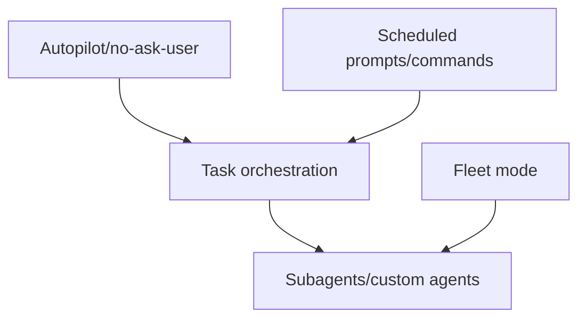

# Agents and automation

Task orchestration, subagents, autopilot, fleet mode, and scheduled prompt/command automation.

## How this volume fits

## Pages

| Page | Why read it | File |
|---|---|---|
| [Agent and task orchestration in Copilot CLI](./agent-task-orchestration.md) | Task tool dispatch, TaskRegistry, main/subagent/custom-agent collaboration, hooks, MCP tasks, research, and fleet. | `agent-task-orchestration.md` |
| [Autopilot and no-ask-user flags](./autopilot-and-no-ask-user.md) | Implementation comparison of --autopilot, --no-ask-user, continuation, task_complete, ask_user, and permission boundaries. | `autopilot-and-no-ask-user.md` |
| [Fleet mode implementation in Copilot CLI](./fleet-mode.md) | /fleet, session.fleet.start, autopilot_fleet, SQL todo coordination, dependencies, and parallel subagents. | `fleet-mode.md` |
| [Scheduled prompts and command queue](./scheduled-prompts-and-command-queue.md) | /every and /after parsing, ScheduleRegistry replay, queue integration, and ephemeral command dispatch. | `scheduled-prompts-and-command-queue.md` |

## Reading guidance

- Task orchestration is the base; autopilot, fleet, and schedules build on it.
- Read this volume with custom agents/skills in Context and input.

## Back to wiki home

- [Wiki home](../README.md)
- [Full table of contents](../SUMMARY.md)
