# Agent and task orchestration in Copilot CLI

This addendum focuses on the deeper agent/task layer in the extracted `@github/copilot` CLI bundle. It answers the follow-up question: how does `app.js` orchestrate agents, subagents, background tasks, multi-turn agents, MCP tasks, and slash-command workflows?

The short version: the model-visible `task` tool is the main subagent router, while an internal `TaskRegistry` tracks background and multi-turn agent state. Slash commands such as `/research`, `/review`, `/subconscious run`, and `/fleet` mostly inject prompts that cause the main agent to call `task` with a specific `agent_type` or start a fleet/autopilot workflow. Memory-specific `rem-agent`, `context_board`, and sidekick behavior is covered in [`memory-and-context-board.md`](../02-context-and-input/memory-and-context-board.md). Rate-limit recovery and model-call concurrency behavior are covered in [`resilience-rate-limits-concurrency.md`](../06-models-and-reliability/resilience-rate-limits-concurrency.md).

## Source anchors

`app.js` is bundled/minified, so the documentation uses semantic aliases as the primary names and keeps generated symbols only as version-specific lookup anchors for `@github/copilot` `1.0.48`:

| Area | Semantic alias | Minified anchor | Approx. line | What it does |
|---|---|---:|---:|---|
| Hook schema | `HookSchema`, `mapHookConfig(...)` | `tLt`, `Dar(...)` | 238, 2797 | Defines and maps hooks such as `subagentStart`, `subagentStop`, and `agentStop`. |
| Feature flags | `MULTI_TURN_AGENTS`, `MCP_TASKS`, `COPILOT_SUBCONSCIOUS` | same strings | 239 | Gates multi-turn agents, MCP task support, subconscious/rem-agent, fleet-ish behavior, etc. |
| Slash commands | `autopilotCommand`, `researchCommand`, `subconsciousCommand`, `fleetCommand`, `reviewCommand` | `Rps`, `Yps`, `Wps`, `Lps`, `eLn` | 1300-1340 | Implements `/autopilot`, `/research`, `/subconscious`, `/fleet`, `/review`, etc. |
| Research prompt | `buildResearchOrchestratorPrompt(...)` | `wLn(...)` | 1346-1537 | Builds the research-orchestrator system prompt that delegates investigation to `agent_type: "research"`. |
| Custom agents | `loadCustomAgents(...)`, `loadCustomAgentMcpServers(...)`, `convertCustomAgentMcpConfig(...)` | `yar`, `xSs`, `bQn`, `gar`, `L5e` | 2789 | Loads local/plugin/remote custom agents and their MCP tools. |
| Custom agent executor | `CustomAgentExecutor` | `$vs(...)` | 3553 | Wraps a custom agent as an executable subagent/tool. |
| Task registry | `TaskRegistry` | `B3` | 3367 | Tracks agent tasks, states, message queues, progress, results, and cancellation. |
| Background launch | `launchBackgroundAgent(...)` | `Bur(...)` | 3698 | Starts a background agent through the task registry. |
| Task tool | `createTaskTool(...)`, `taskToolInputSchema`, `TASK_TOOL_NAME` | `I6n(...)`, `v6n`, `H3="task"` | 3735-3815 | Defines the `task` tool schema, instructions, dispatch callback, sync/background modes. |
| Built-in agents | `BUILT_IN_AGENTS` | `nHn` | 4037 | Catalog of built-in agents: `explore`, `task`, `general-purpose`, `rubber-duck`, `code-review`, `research`, `rem-agent`. |
| Session subagent executor | `SessionAgentExecutor` | `dZ` | 4037-4039 | Runs built-in/session-based agents, emits subagent boundaries, applies hooks, supports multi-turn loops. |
| MCP task bridge | `doInvokeToolWithTask`, `consumeTaskStreamNonBlocking` | same names | 4138 | Converts MCP `taskSupport: "required"` tools into background `mcp-task` agent records. |
| Tool assembly | `assembleRuntimeTools(...)`, `assembleSubagentTools(...)` | `HCr(...)`, `Gjs(...)` | 5734 | Builds tool lists recursively and injects `task`, agent tools, MCP tools, skills, shell tools, etc. |
| Session runtime | `getToolConfig`, `waitForPendingBackgroundTasks` | same names | 4481-4487 | Wires hooks, task registry, MCP host, session events, and shutdown waiting. |
| Prompt/autopilot | `runPromptMode(...)`, prompt-mode listeners | `u1t(...)` | 7420 | Prompt mode, `session.task_complete`, and autopilot continuation loop. |
| Detached memory agent | `spawnDetachedMemoryAgent(...)` | `T5a(...)` | 7445 | Spawns a detached `rem-agent` on shutdown when subconscious memory is enabled. |

## Big picture

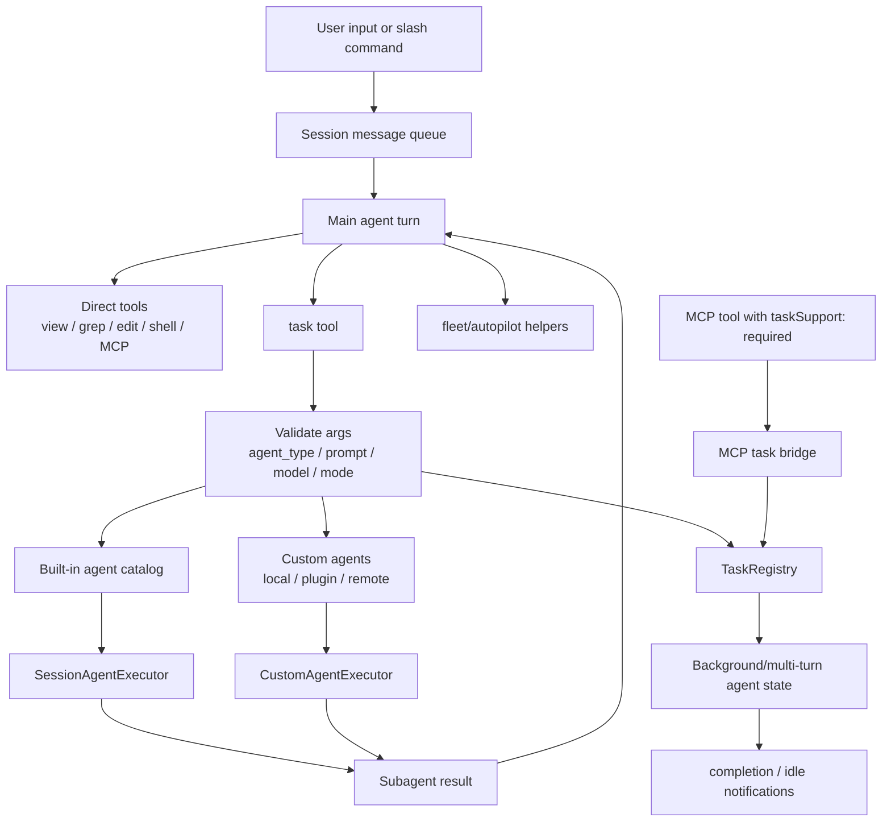
```mermaid
flowchart TD
    User["User input or slash command"] --> Queue["Session message queue"]
    Queue --> MainAgent["Main agent turn"]

    MainAgent --> DirectTools["Direct tools\nview / grep / edit / shell / MCP"]
    MainAgent --> TaskTool["task tool"]
    MainAgent --> Fleet["fleet/autopilot helpers"]

    TaskTool --> Validate["Validate args\nagent_type / prompt / model / mode"]
    Validate --> BuiltIn["Built-in agent catalog"]
    Validate --> Custom["Custom agents\nlocal / plugin / remote"]
    Validate --> Registry["TaskRegistry"]

    BuiltIn --> Executor["SessionAgentExecutor"]
    Custom --> CustomExec["CustomAgentExecutor"]
    Registry --> BgAgent["Background/multi-turn agent state"]

    Executor --> Result["Subagent result"]
    CustomExec --> Result
    BgAgent --> Notify["completion / idle notifications"]
    Result --> MainAgent

    MCP["MCP tool with taskSupport: required"] --> McpBridge["MCP task bridge"]
    McpBridge --> Registry
```

The orchestration model is layered:

1. **Prompt/UI layer** — slash commands and plan/autopilot UI create ordinary prompts or mode changes.
2. **Tool layer** — the `task` tool exposes subagent dispatch to the model.
3. **Agent catalog layer** — built-in, custom, plugin, and remote agents become valid `agent_type` values.
4. **Registry layer** — `TaskRegistry` tracks background agent state, progress, messages, and cancellation.
5. **Executor layer** — session/custom/MCP executors run turns, emit events, apply hooks, and return results.

## Division of responsibility and communication

The collaboration model is intentionally hierarchical. The main agent is the planner and synthesizer; subagents are delegated workers; custom agents are specialized worker definitions that plug into the same subagent pathway.

| Participant | Primary responsibility | Communication surface | What it does not do directly |
|---|---|---|---|
| Main agent | Interpret the user request, decide whether to delegate, choose `agent_type`, provide full task context, merge returned results, and decide the final user response. | Calls the model-visible `task` tool; reads background results/notifications; can send follow-up messages to idle multi-turn agents. | It does not share live model state with a subagent. Delegation is prompt/result based, not a shared memory coroutine. |
| Built-in subagent | Execute a focused job such as exploration, command execution, review, research, or memory consolidation. | Receives a task prompt through `task`; returns a text result for sync mode, or writes status/result through `TaskRegistry` for background/multi-turn mode. | It normally does not talk to the user directly; its output is routed back through the main session. |
| Custom agent | Provide a named, user/plugin/remote-defined specialization with its own instructions, tools, MCP servers, skills, and optional model preference. | Registered in the agent catalog; selected by `agent_type`; executed through the custom-agent executor; reports through the same result and registry paths as built-ins. | It is not a separate scheduler or peer-to-peer agent network. It is a specialized implementation behind the same `task` interface. |
| Task registry | Track background and multi-turn agent records, status, message queues, latest responses, cancellation, progress, and completion. | In-process registry APIs such as start, wait, result, message, cancellation, and idle notifications. | It does not reason about tasks; it stores state and wakes waiters. |
| Hooks | Inject external policy/context and optionally block agent stop events. | `subagentStart`, `subagentStop`, and `agentStop` hooks. | Hooks are not agents; they are lifecycle callbacks around agent execution. |

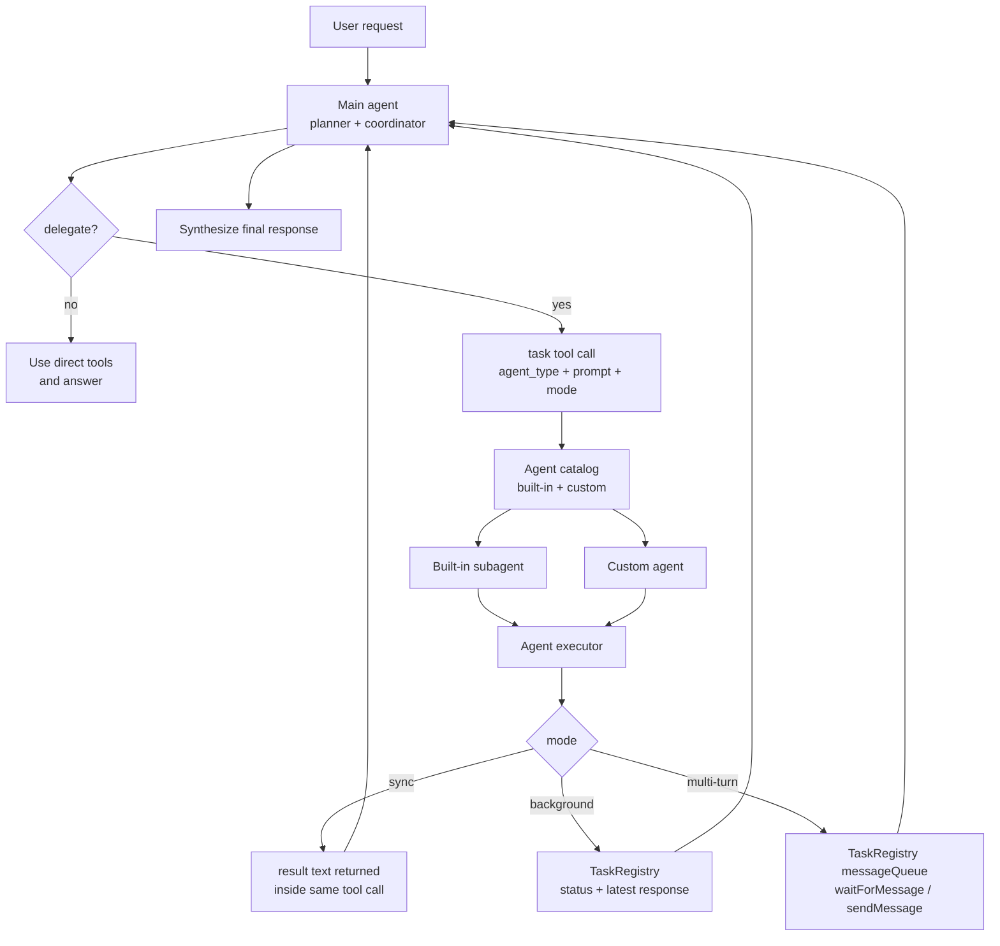
```mermaid
flowchart TD
    User["User request"] --> Main["Main agent\nplanner + coordinator"]
    Main --> Decision{"delegate?"}
    Decision -->|no| Direct["Use direct tools\nand answer"]
    Decision -->|yes| Task["task tool call\nagent_type + prompt + mode"]

    Task --> Catalog["Agent catalog\nbuilt-in + custom"]
    Catalog --> BuiltIn["Built-in subagent"]
    Catalog --> Custom["Custom agent"]

    BuiltIn --> Exec["Agent executor"]
    Custom --> Exec
    Exec --> ResultPath{"mode"}
    ResultPath -->|sync| SyncResult["result text returned\ninside same tool call"]
    ResultPath -->|background| Registry["TaskRegistry\nstatus + latest response"]
    ResultPath -->|multi-turn| Queue["TaskRegistry messageQueue\nwaitForMessage / sendMessage"]

    SyncResult --> Main
    Registry --> Main
    Queue --> Main
    Main --> Final["Synthesize final response"]
```

### Sync communication

In sync mode, communication is simple and request/response shaped:

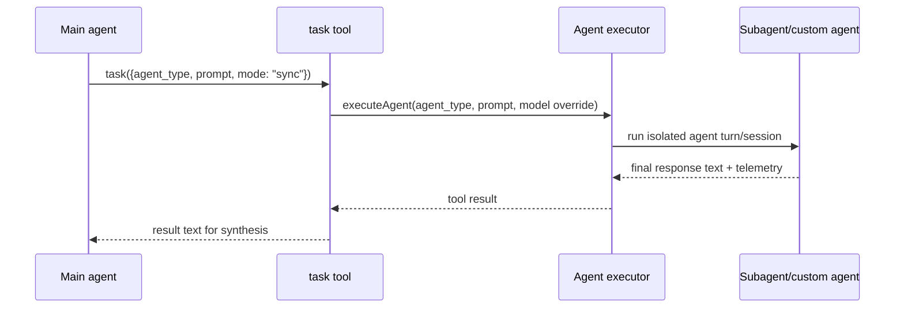
```mermaid
sequenceDiagram
    participant Main as Main agent
    participant Task as task tool
    participant Exec as Agent executor
    participant Sub as Subagent/custom agent

    Main->>Task: task({agent_type, prompt, mode: "sync"})
    Task->>Exec: executeAgent(agent_type, prompt, model override)
    Exec->>Sub: run isolated agent turn/session
    Sub-->>Exec: final response text + telemetry
    Exec-->>Task: tool result
    Task-->>Main: result text for synthesis
```

The main agent must put enough context in `prompt` because the subagent does not automatically inherit the full hidden reasoning state of the main agent. It gets runtime/session context assembled by the executor, custom-agent instructions if applicable, skills, hooks, and the explicit task prompt.

### Background communication

In background mode, the first `task` call returns quickly with an `agent_id`; subsequent coordination goes through the registry and session notifications.

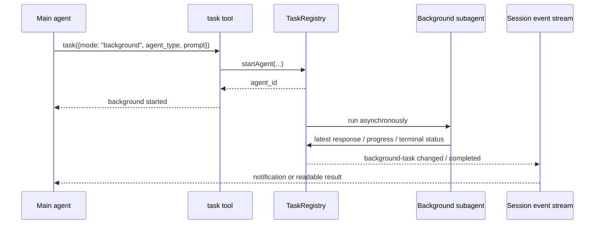
```mermaid
sequenceDiagram
    participant Main as Main agent
    participant Task as task tool
    participant Registry as TaskRegistry
    participant Agent as Background subagent
    participant Session as Session event stream

    Main->>Task: task({mode: "background", agent_type, prompt})
    Task->>Registry: startAgent(...)
    Registry-->>Task: agent_id
    Task-->>Main: background started
    Registry->>Agent: run asynchronously
    Agent->>Registry: latest response / progress / terminal status
    Registry-->>Session: background-task changed / completed
    Session-->>Main: notification or readable result
```

This is the main channel for parallel work. The main agent can continue unrelated work while agents run, then read results when notified. Background agents still count against subagent concurrency limits.

### Multi-turn communication

When multi-turn agents are enabled, a background-capable agent can become idle instead of exiting after a response. At that point communication becomes mailbox-like:

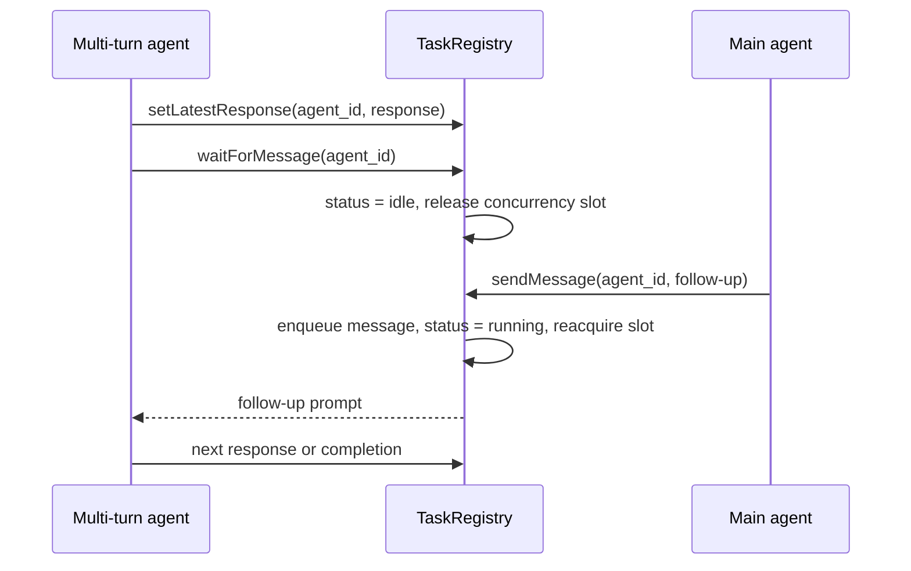
```mermaid
sequenceDiagram
    participant Agent as Multi-turn agent
    participant Registry as TaskRegistry
    participant Main as Main agent

    Agent->>Registry: setLatestResponse(agent_id, response)
    Agent->>Registry: waitForMessage(agent_id)
    Registry->>Registry: status = idle, release concurrency slot
    Main->>Registry: sendMessage(agent_id, follow-up)
    Registry->>Registry: enqueue message, status = running, reacquire slot
    Registry-->>Agent: follow-up prompt
    Agent->>Registry: next response or completion
```

The important distinction is that multi-turn follow-up is explicit. The main agent sends another prompt/message to the idle agent; the agents still do not share a live call stack or streaming internal thoughts.

### Custom-agent communication path

Custom agents enter through the catalog and then use the same delegation contract as built-ins. Their differences are in setup, not in the high-level communication protocol:

1. local, plugin, or remote definitions are loaded and normalized;
2. agent metadata contributes name, description, instructions, tools, MCP servers, skills, and optional model preference;
3. the `task` schema exposes eligible custom-agent names as valid `agent_type` values;
4. the custom-agent executor builds the prompt context, loads its tools/skills, runs lifecycle hooks, executes one or more turns, and returns a result;
5. sync, background, multi-turn, telemetry, cancellation, and concurrency behavior reuse the normal task/registry pathways.

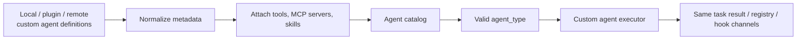
```mermaid
flowchart LR
    Files["Local / plugin / remote\ncustom agent definitions"] --> Normalize["Normalize metadata"]
    Normalize --> Tools["Attach tools, MCP servers, skills"]
    Tools --> Catalog["Agent catalog"]
    Catalog --> TaskType["Valid agent_type"]
    TaskType --> Executor["Custom agent executor"]
    Executor --> Shared["Same task result / registry / hook channels"]
```

So the answer to “how do custom agents collaborate with normal agents?” is: the main agent selects them exactly like any other subagent, by name. They specialize the worker implementation, but they do not bypass the main agent’s orchestration or the registry’s state model.

## Agent catalog and selection

The built-in agent list is defined by the `BUILT_IN_AGENTS` catalog and includes:

| Agent | Purpose in the bundled description |
|---|---|
| `explore` | Fast codebase exploration/research, especially parallel independent search threads. |
| `task` | Execute commands/tests/builds/lints with summarized output. |
| `general-purpose` | Broad autonomous CLI agent. |
| `rubber-duck` | Independent critique of plans/implementations. |
| `code-review` | High signal-to-noise review of changes. |
| `research` | Deep research with searches and citations. |
| `rem-agent` | Memory/subconscious consolidation using the context board. |

Custom agents are loaded from several sources:

- local user/project agent Markdown files;
- plugin-provided agent files;
- remote GitHub custom-agent API responses;
- agent frontmatter fields such as `name`, `description`, `tools`, `mcp-servers`, `model`, `skills`, `github`, and `user-invocable`.

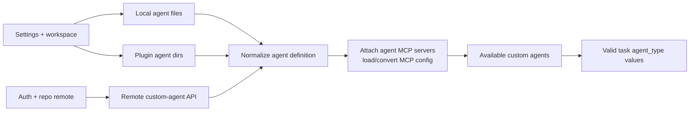
```mermaid
flowchart LR
    Settings["Settings + workspace"] --> Local["Local agent files"]
    Settings --> Plugin["Plugin agent dirs"]
    Auth["Auth + repo remote"] --> Remote["Remote custom-agent API"]

    Local --> Normalize["Normalize agent definition"]
    Plugin --> Normalize
    Remote --> Normalize

    Normalize --> Mcp["Attach agent MCP servers\nload/convert MCP config"]
    Mcp --> Catalog["Available custom agents"]
    Catalog --> TaskTypes["Valid task agent_type values"]
```

The `task` tool’s valid agent types are the active built-ins plus custom agents whose names normalize into the custom-agent map. If both a built-in and custom agent could handle a task, the prompt instructions tell the model to prefer the custom agent because it may contain environment-specific knowledge.

## The `task` tool lifecycle

The tool named `task` is constructed by `createTaskTool(...)`. Its input schema requires:

- `description` — short UI intent;
- `prompt` — full task instructions for the subagent;
- `agent_type` — built-in or custom agent name;
- `name` — short human-readable agent ID seed;
- optional `model` override;
- optional `mode`, either `sync` or `background`.

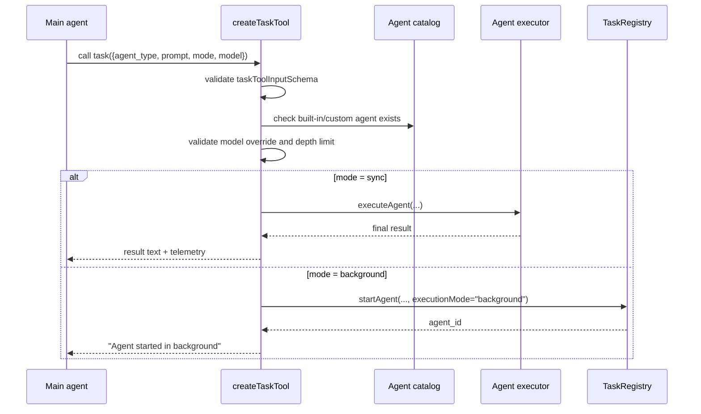
```mermaid
sequenceDiagram
    participant M as Main agent
    participant T as createTaskTool
    participant C as Agent catalog
    participant E as Agent executor
    participant R as TaskRegistry

    M->>T: call task({agent_type, prompt, mode, model})
    T->>T: validate taskToolInputSchema
    T->>C: check built-in/custom agent exists
    T->>T: validate model override and depth limit
    alt mode = sync
        T->>E: executeAgent(...)
        E-->>T: final result
        T-->>M: result text + telemetry
    else mode = background
        T->>R: startAgent(..., executionMode="background")
        R-->>T: agent_id
        T-->>M: "Agent started in background"
    end
```

Important behavior in the dispatch callback:

- Unknown `agent_type` fails with a valid-types list.
- Optional `model` is validated against `availableModels`.
- A cost/multiplier guard may downgrade a subagent model to the session model if the requested model is considered too expensive relative to the session model.
- `explore` may get an implicit low-effort `gpt-5.4-mini` override when the relevant experiment flag is enabled.
- `rubber-duck` may use a complementary model family when enabled.
- Subagent recursion is capped by `COPILOT_SUBAGENT_MAX_DEPTH`, defaulting to `6`.
- Concurrent subagents are capped by `COPILOT_SUBAGENT_MAX_CONCURRENT`, with plan-dependent defaults and an env cap up to `256`.

## Sync vs background execution

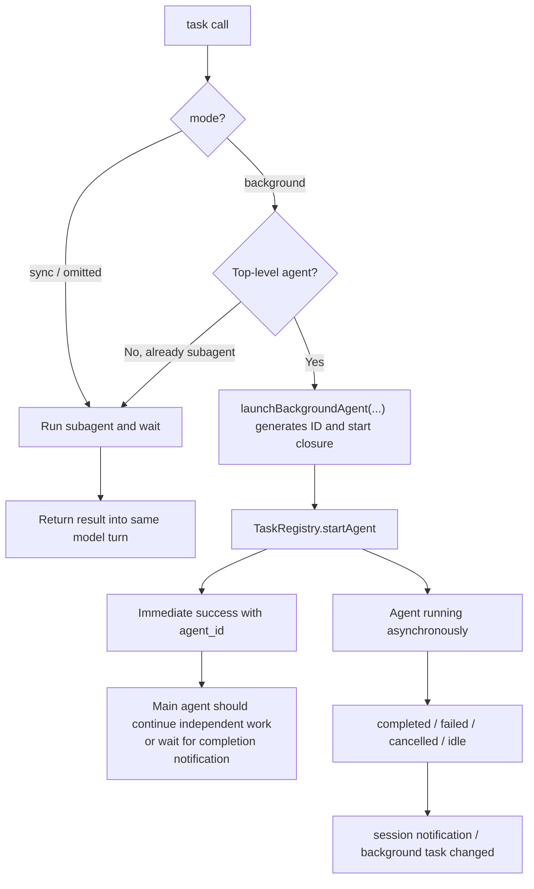
```mermaid
flowchart TD
    Call["task call"] --> Mode{"mode?"}

    Mode -->|"sync / omitted"| Sync["Run subagent and wait"]
    Sync --> Return["Return result into same model turn"]

    Mode -->|"background"| Allowed{"Top-level agent?"}
    Allowed -->|"No, already subagent"| Sync
    Allowed -->|"Yes"| Start["launchBackgroundAgent(...) generates ID and start closure"]
    Start --> Register["TaskRegistry.startAgent"]
    Register --> Immediate["Immediate success with agent_id"]
    Immediate --> Continue["Main agent should continue independent work\nor wait for completion notification"]

    Register --> Running["Agent running asynchronously"]
    Running --> Completed["completed / failed / cancelled / idle"]
    Completed --> Notify["session notification / background task changed"]
```

Background mode is intentionally framed as a parallelism tool. The prompt instructions warn the model not to start a background task and immediately poll with `read_agent`; if it needs the result before doing anything else, it should use sync mode instead.

## TaskRegistry state model

`TaskRegistry` is the internal registry for asynchronous work. It stores `type: "agent"` records for subagents and MCP tasks, and shell work can appear elsewhere in session task listings.

Key stored fields include:

- `id`, `type`, `ownerId`, optional `parentId`;
- `agentType`, `description`, `prompt`, `modelOverride`, `executionMode`;
- `status`: `running`, `idle`, `completed`, `failed`, or `cancelled`;
- `messageQueue` for multi-turn follow-up messages;
- `turnHistory` and `latestResponse`;
- progress counters, latest intent, MCP task progress, and executor telemetry;
- `abortController` for cancellation.

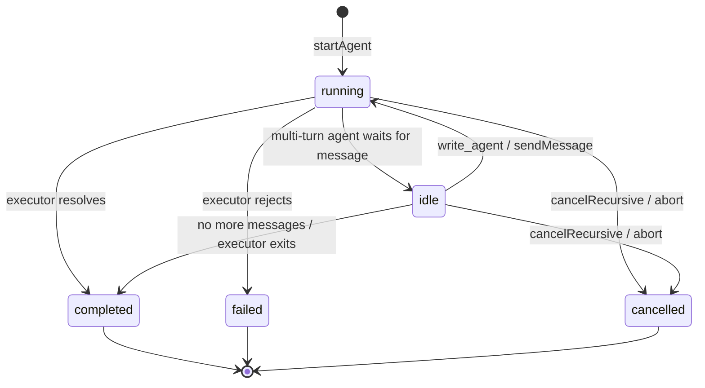
```mermaid
stateDiagram-v2
    [*] --> running: startAgent
    running --> completed: executor resolves
    running --> failed: executor rejects
    running --> cancelled: cancelRecursive / abort
    running --> idle: multi-turn agent waits for message
    idle --> running: write_agent / sendMessage
    idle --> cancelled: cancelRecursive / abort
    idle --> completed: no more messages / executor exits
    completed --> [*]
    failed --> [*]
    cancelled --> [*]
```

The registry also supports:

- `getAgentResult(...)` — wait for a turn, final completion, promotion, or timeout;
- `sendMessage(...)` — append a follow-up message, waking an idle multi-turn agent;
- `waitForMessage(...)` — called by a multi-turn agent to enter `idle` and await a message;
- `setLatestResponse(...)` — records each agent turn and wakes result waiters;
- `promoteAgentToBackground(...)` — lets a running sync-style agent be moved to background;
- `waitForAgents(...)` — used during prompt-mode shutdown to wait for background work.

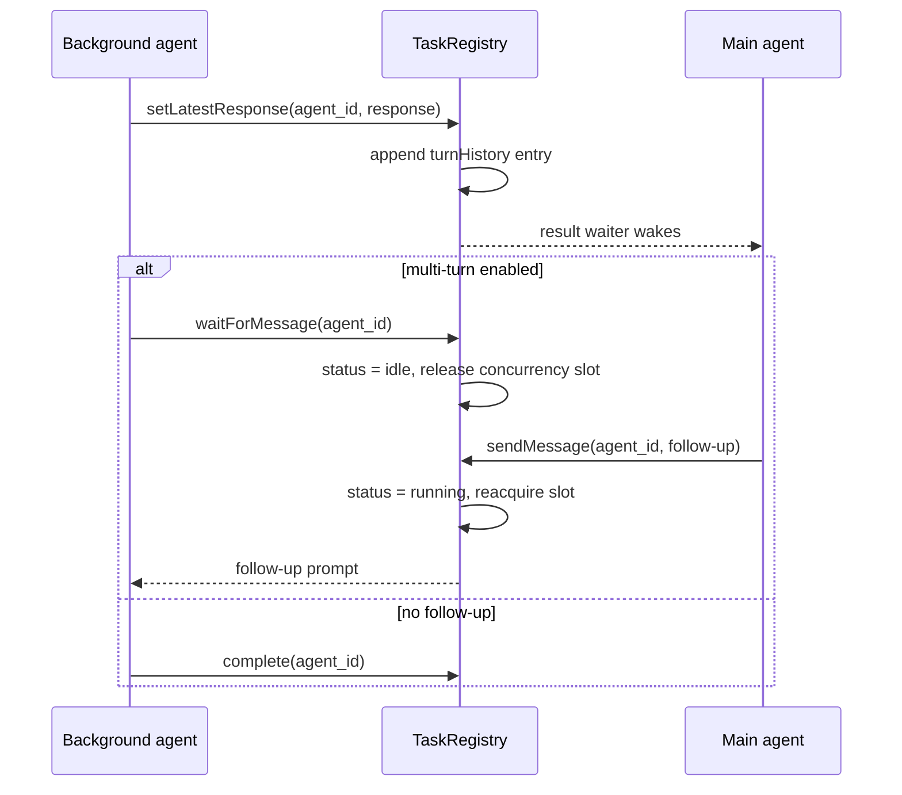
```mermaid
sequenceDiagram
    participant A as Background agent
    participant R as TaskRegistry
    participant M as Main agent

    A->>R: setLatestResponse(agent_id, response)
    R->>R: append turnHistory entry
    R-->>M: result waiter wakes
    alt multi-turn enabled
        A->>R: waitForMessage(agent_id)
        R->>R: status = idle, release concurrency slot
        M->>R: sendMessage(agent_id, follow-up)
        R->>R: status = running, reacquire slot
        R-->>A: follow-up prompt
    else no follow-up
        A->>R: complete(agent_id)
    end
```

## Subagent execution

Built-in agents are executed through `SessionAgentExecutor`. Custom agents have a similar `CustomAgentExecutor` wrapper. Both follow roughly the same pattern:

1. emit a `subagent_session_boundary` start event;
2. initialize or reuse an agent session/toolset;
3. run `subagentStart` hook and prepend any returned `additionalContext`;
4. load skills referenced by the agent definition;
5. run one or more turns;
6. run `subagentStop` hook; if it blocks with a reason, feed that reason back as a new prompt and continue;
7. if multi-turn is enabled, wait for follow-up messages via the registry;
8. emit end/failure boundary and return the final response.

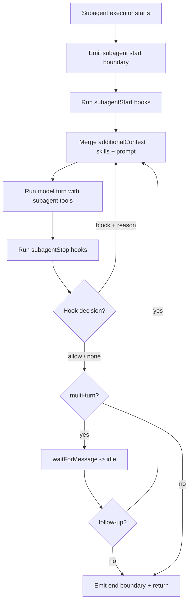
```mermaid
flowchart TD
    Start["Subagent executor starts"] --> BoundaryStart["Emit subagent start boundary"]
    BoundaryStart --> HookStart["Run subagentStart hooks"]
    HookStart --> AddCtx["Merge additionalContext + skills + prompt"]
    AddCtx --> Turn["Run model turn with subagent tools"]
    Turn --> HookStop["Run subagentStop hooks"]
    HookStop --> Decision{"Hook decision?"}
    Decision -->|"block + reason"| AddCtx
    Decision -->|"allow / none"| Multi{"multi-turn?"}
    Multi -->|"yes"| WaitMsg["waitForMessage -> idle"]
    WaitMsg --> More{"follow-up?"}
    More -->|"yes"| AddCtx
    More -->|"no"| End["Emit end boundary + return"]
    Multi -->|"no"| End
```

`assembleSubagentTools(...)` is the recursive tool-assembly point for subagents. It increments `subAgentDepth`, disables background notifications inside subagents, assembles tools by recursively calling `assembleRuntimeTools(...)`, and injects the `task` tool plus helpers such as agent read/write tools when enabled. It chooses between session-based subagents and executor-based subagents behind the `SESSION_BASED_SUBAGENTS` feature flag.

## Hooks around agent orchestration

Hooks are configured through JSON/settings and mapped by `mapHookConfig(...)`. The relevant agent lifecycle hooks are:

| Hook | Payload highlights | Output effect |
|---|---|---|
| `subagentStart` | `sessionId`, `cwd`, `transcriptPath`, `agentName`, `agentDisplayName`, `agentDescription` | May return `additionalContext`, which is prepended to the subagent prompt. Supports `matcher` on agent name. |
| `subagentStop` | `sessionId`, `cwd`, `transcriptPath`, `agentName`, `agentDisplayName`, `stopReason` | May return `decision`/`reason`; a blocking decision can cause another subagent turn with the reason as input. |
| `agentStop` | `sessionId`, `cwd`, `transcriptPath`, `stopReason` | May block the main agent stop; the reason is enqueued as another user message. |

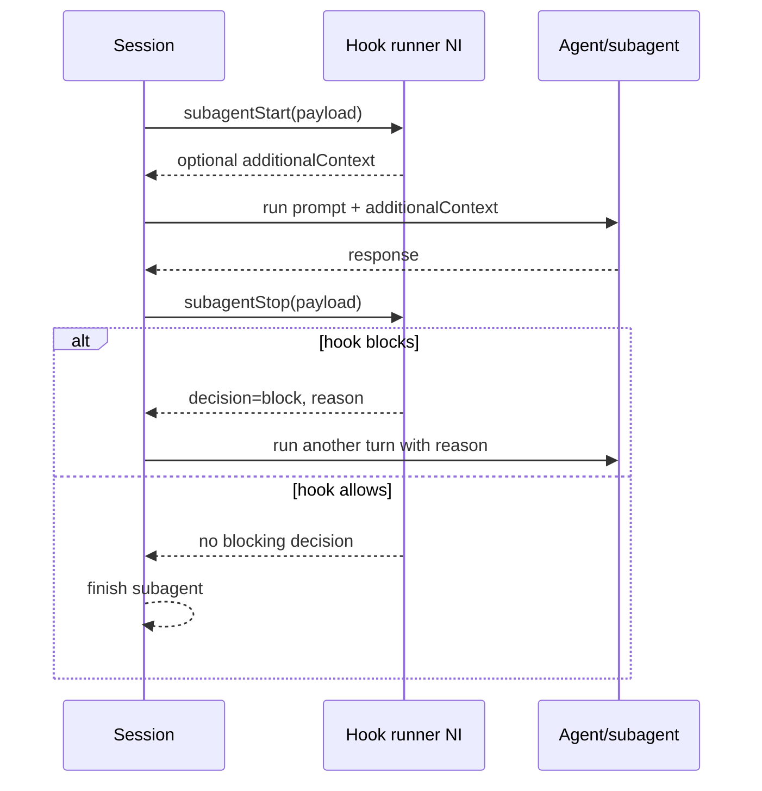
```mermaid
sequenceDiagram
    participant S as Session
    participant H as Hook runner NI
    participant A as Agent/subagent

    S->>H: subagentStart(payload)
    H-->>S: optional additionalContext
    S->>A: run prompt + additionalContext
    A-->>S: response
    S->>H: subagentStop(payload)
    alt hook blocks
        H-->>S: decision=block, reason
        S->>A: run another turn with reason
    else hook allows
        H-->>S: no blocking decision
        S-->>S: finish subagent
    end
```

## Slash commands that orchestrate agents

Several slash commands do not execute complex work directly. They return an `agent-prompt` that nudges the main agent into using `task`.

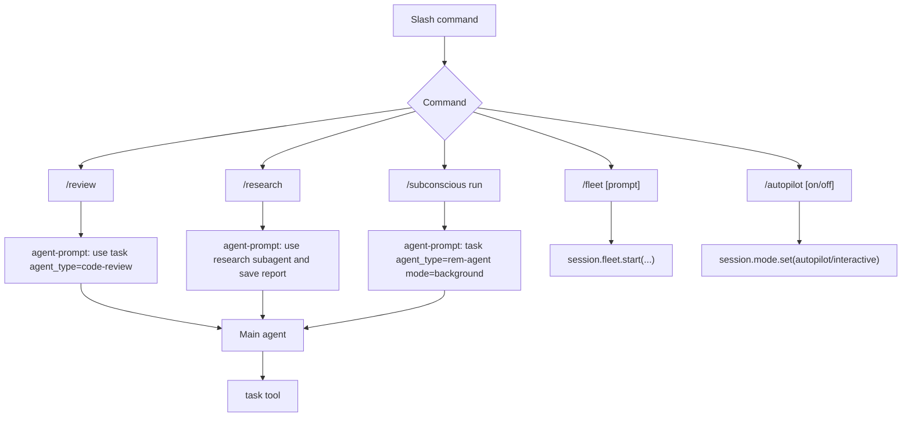
```mermaid
flowchart TD
    Slash["Slash command"] --> Kind{"Command"}
    Kind --> Review["/review"]
    Kind --> Research["/research <topic>"]
    Kind --> Subconscious["/subconscious run"]
    Kind --> Fleet["/fleet [prompt]"]
    Kind --> Autopilot["/autopilot [on/off]"]

    Review --> ReviewPrompt["agent-prompt: use task agent_type=code-review"]
    Research --> ResearchPrompt["agent-prompt: use research subagent and save report"]
    Subconscious --> RemPrompt["agent-prompt: task agent_type=rem-agent mode=background"]
    Fleet --> FleetStart["session.fleet.start(...)"]
    Autopilot --> ModeSet["session.mode.set(autopilot/interactive)"]

    ReviewPrompt --> MainAgent["Main agent"]
    ResearchPrompt --> MainAgent
    RemPrompt --> MainAgent
    MainAgent --> TaskTool["task tool"]
```

Observed examples:

- `/review` injects: use `task` with `agent_type: "code-review"`.
- `/research <topic>` injects a research prompt and a target report path under the session/temp area.
- `/subconscious run` injects a very specific instruction: call `task` exactly once with `agent_type: "rem-agent"`, `mode: "background"`, `name: "rem-consolidate"`, and `description: "Consolidate session learnings"`.
- `/fleet` calls `session.fleet.start({ prompt })` directly.
- `/autopilot` toggles session mode between `interactive` and `autopilot`.

For the detailed `/fleet` implementation path, including `session.fleet.start`, `autopilot_fleet`, SQL `todos`/`todo_deps`, and `TaskRegistry` coordination, see [`fleet-mode.md`](./fleet-mode.md).

## Research orchestrator workflow

The `/research` flow has a large embedded orchestrator prompt built by `buildResearchOrchestratorPrompt(...)`. The top-level agent is explicitly told not to research directly. Instead, it acts as a project manager and dispatches many `research` subagents through `task` in sync mode.

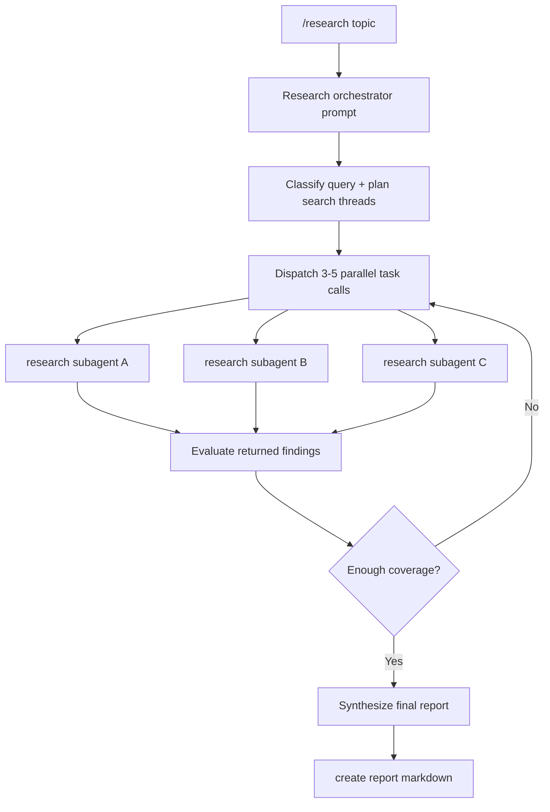
```mermaid
flowchart TD
    UserTopic["/research topic"] --> Prompt["Research orchestrator prompt"]
    Prompt --> Plan["Classify query + plan search threads"]
    Plan --> Dispatch["Dispatch 3-5 parallel task calls"]
    Dispatch --> R1["research subagent A"]
    Dispatch --> R2["research subagent B"]
    Dispatch --> R3["research subagent C"]
    R1 --> Evaluate["Evaluate returned findings"]
    R2 --> Evaluate
    R3 --> Evaluate
    Evaluate --> Gate{"Enough coverage?"}
    Gate -->|"No"| Dispatch
    Gate -->|"Yes"| Report["Synthesize final report"]
    Report --> Save["create report markdown"]
```

Notable constraints in the prompt:

- allowed tools are limited to `task`, `create`, `view` for subagent temp outputs, and `report_intent`;
- direct `grep`, `glob`, `web_fetch`, `web_search`, GitHub MCP tools, `read_agent`, and `ask_user` are forbidden;
- `task` must use `agent_type: "research"` and `mode: "sync"`;
- it encourages at least `6-10` total subagent dispatches for thoroughness.

## MCP task support

MCP tools can declare task support through metadata like `execution.taskSupport`. The bundle caches whether tools are known task tools and whether task support is required. If a tool requires task support, the normal MCP call path is replaced by a task-stream bridge.

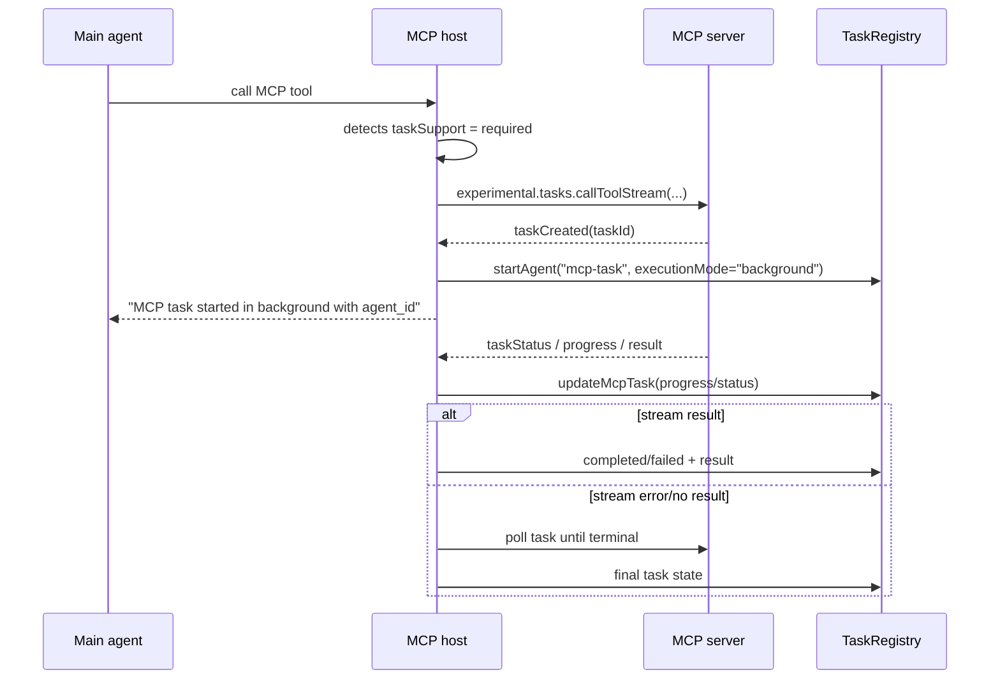
```mermaid
sequenceDiagram
    participant M as Main agent
    participant Host as MCP host
    participant MCP as MCP server
    participant R as TaskRegistry

    M->>Host: call MCP tool
    Host->>Host: detects taskSupport = required
    Host->>MCP: experimental.tasks.callToolStream(...)
    MCP-->>Host: taskCreated(taskId)
    Host->>R: startAgent("mcp-task", executionMode="background")
    Host-->>M: "MCP task started in background with agent_id"
    MCP-->>Host: taskStatus / progress / result
    Host->>R: updateMcpTask(progress/status)
    alt stream result
        Host->>R: completed/failed + result
    else stream error/no result
        Host->>MCP: poll task until terminal
        Host->>R: final task state
    end
```

Important differences from normal subagents:

- MCP tasks are represented in the same registry as `agentType: "mcp-task"`.
- Their prompt is the JSON-serialized MCP tool arguments.
- Cancellation propagates back to the MCP task.
- If steering support is enabled, `write_agent`-style follow-up can map to MCP `tasks/steer`; otherwise MCP task agents reject follow-up messages and advise starting a new task.
- Progress is stored under `progress.mcpTask`, including status, message, progress totals, event-stream warnings, and timestamps.

## Autopilot and prompt-mode task completion

Non-interactive prompt mode (`runPromptMode(...)`) wires task completion into the session event stream. When the model calls the task-completion tool, the session emits `session.task_complete`. Autopilot listens for `session.idle`; if the task is not complete, no abort happened, and the continuation limit is not reached, it sends an internal continuation prompt.

The important distinction is that autopilot is a mode/lifecycle feature, not merely an ask-user toggle. `--autopilot` selects autopilot mode, injects autopilot system instructions, adds the `task_complete` tool, and enables continuation. `--no-ask-user` instead suppresses the `ask_user` capability/tool in the TUI path and does not create continuation by itself. The detailed flag comparison is in [`autopilot-and-no-ask-user.md`](./autopilot-and-no-ask-user.md).

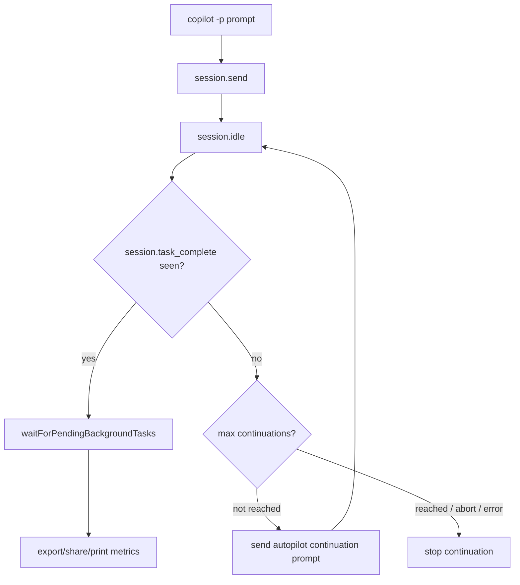
```mermaid
flowchart TD
    Prompt["copilot -p prompt"] --> Send["session.send"]
    Send --> Idle["session.idle"]
    Idle --> Done{"session.task_complete seen?"}
    Done -->|"yes"| WaitBg["waitForPendingBackgroundTasks"]
    Done -->|"no"| Limit{"max continuations?"}
    Limit -->|"not reached"| Continue["send autopilot continuation prompt"]
    Continue --> Idle
    Limit -->|"reached / abort / error"| Stop["stop continuation"]
    WaitBg --> Exit["export/share/print metrics"]
```

This explains why prompt mode can keep working autonomously after the first answer: `session.idle` does not necessarily mean the overall requested task is done; `session.task_complete` is the explicit completion signal.

## Subconscious / `rem-agent`

There are two observed paths into the memory-consolidation agent:

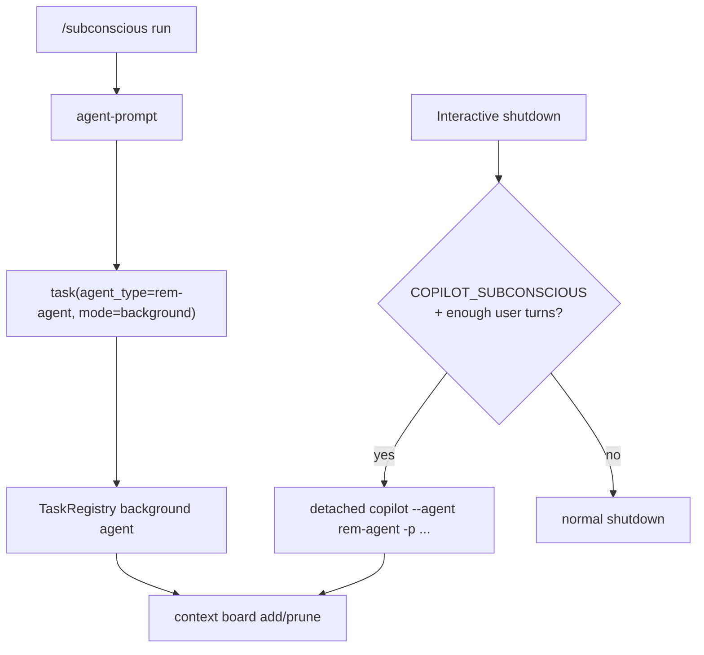
```mermaid
flowchart TD
    Manual["/subconscious run"] --> Prompt["agent-prompt"]
    Prompt --> Task["task(agent_type=rem-agent, mode=background)"]
    Task --> Registry["TaskRegistry background agent"]
    Registry --> Board["context board add/prune"]

    Shutdown["Interactive shutdown"] --> Gate{"COPILOT_SUBCONSCIOUS\n+ enough user turns?"}
    Gate -->|"yes"| Spawn["detached copilot --agent rem-agent -p ..."]
    Spawn --> Board
    Gate -->|"no"| End["normal shutdown"]
```

The manual path uses the normal `task` tool. The shutdown path launches a detached process with `--agent rem-agent`, `-p` set to the context-board update prompt, `--yolo`, `--silent`, and environment values tying the detached session to the parent session/engagement.

For the full memory architecture, including the cloud memory API, local JSONL strategy, memory permissions, dynamic context board persistence, `context_board` commands, sidekick launch conditions, and inbox flow, see [`memory-and-context-board.md`](../02-context-and-input/memory-and-context-board.md).

## Key takeaways

- `task` is not just another helper; it is the public model-facing orchestration surface for subagents.
- `TaskRegistry` is the core in-process task registry for background/multi-turn work.
- Built-in and custom agents share the same high-level lifecycle: prompt assembly, optional hooks, one or more turns, telemetry/progress, and result capture.
- Background mode is designed for real parallel work, not polling.
- Multi-turn agents use `turnHistory`, `messageQueue`, `waitForMessage`, and `sendMessage` to keep an agent alive after a response.
- Hooks can inject context at subagent start and can force additional turns at subagent/main-agent stop.
- MCP task support maps external long-running MCP tools into the same background-agent UI/state model.
- Slash commands often act as orchestration macros: they generate prompts or mode changes that lead the main agent toward the `task` tool.
