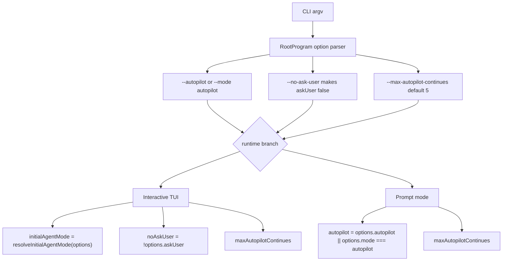
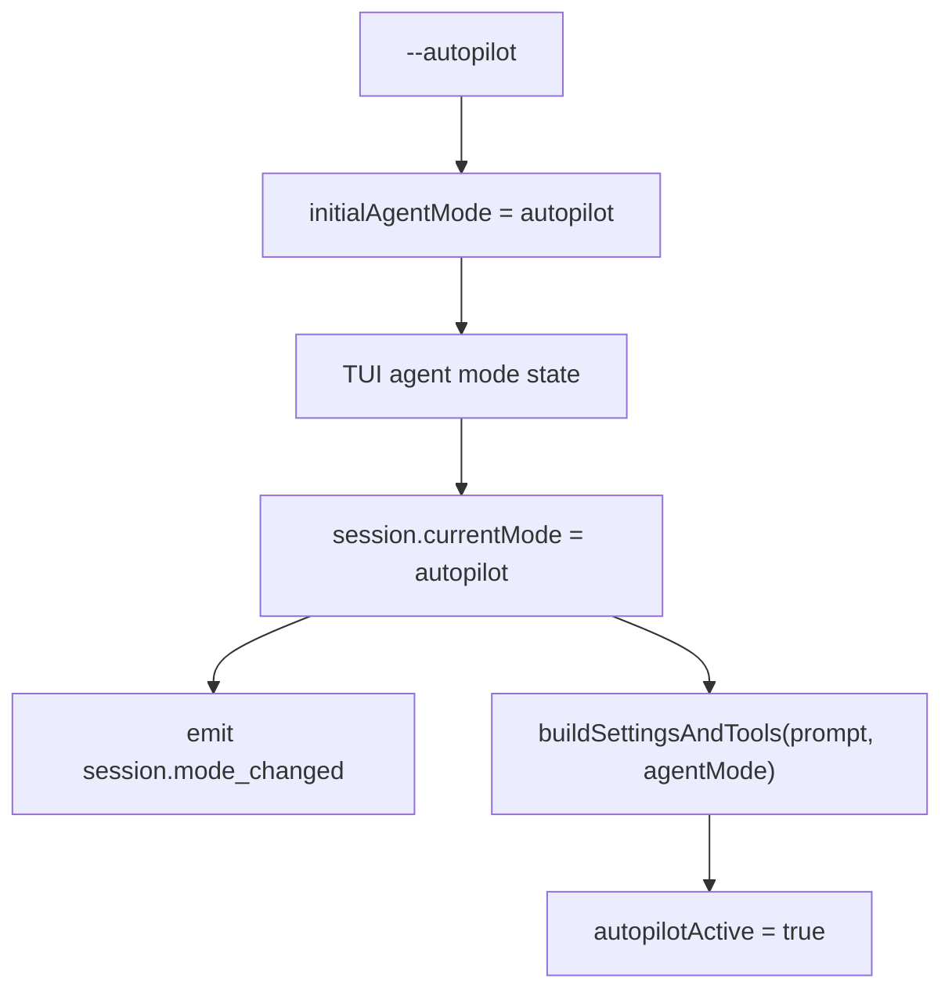
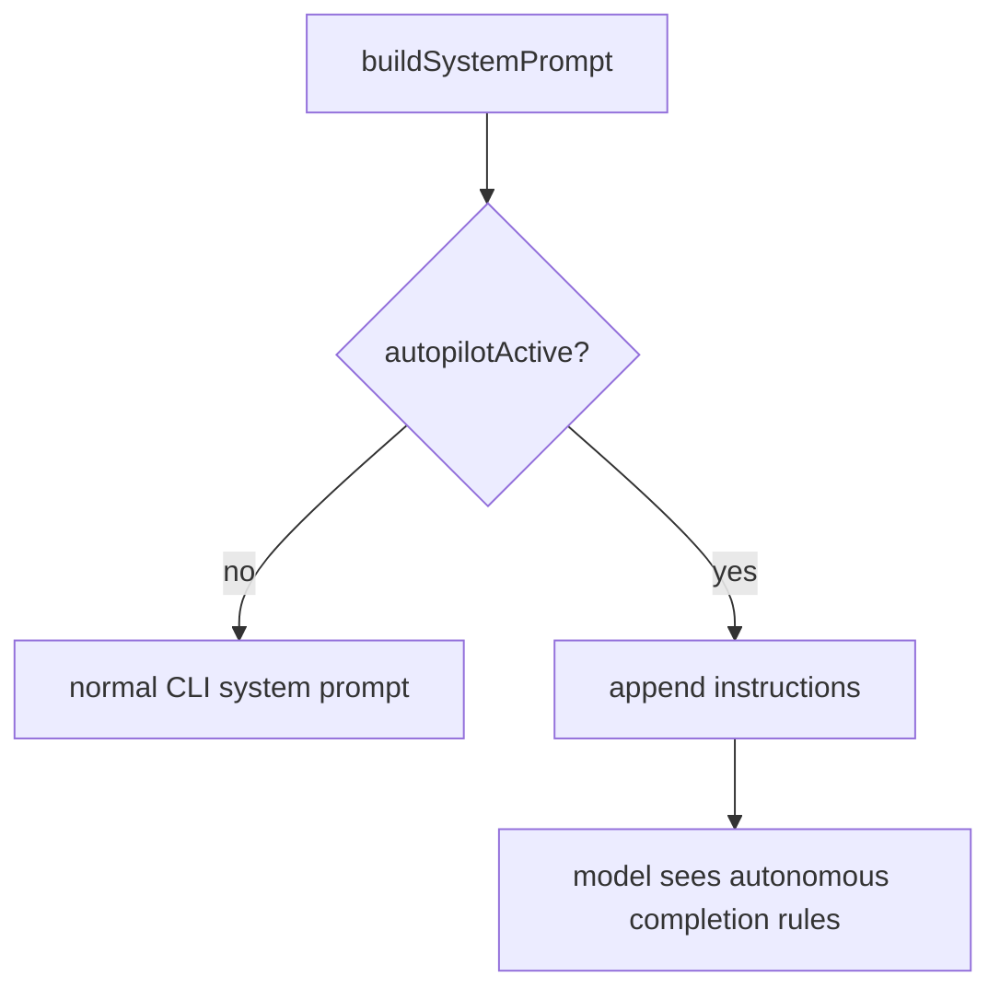
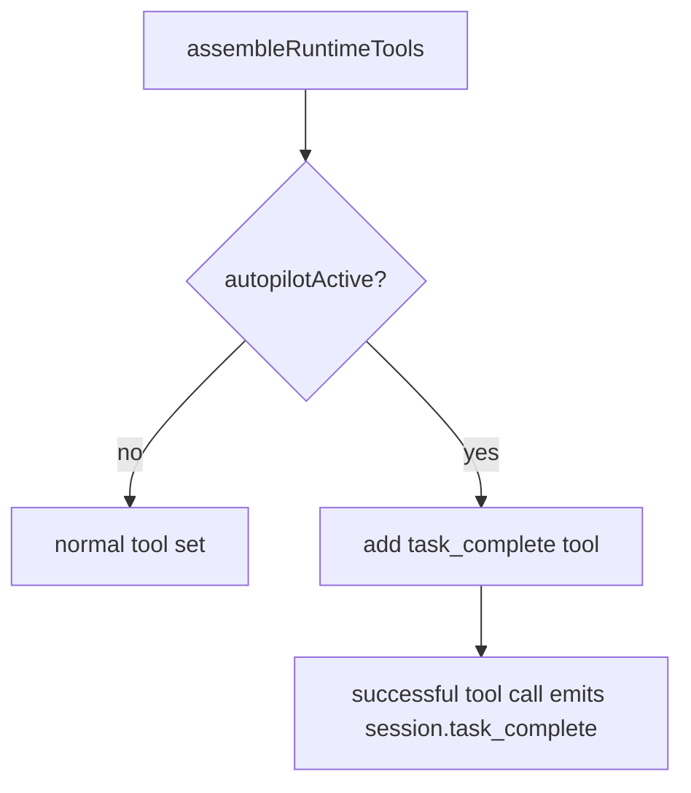
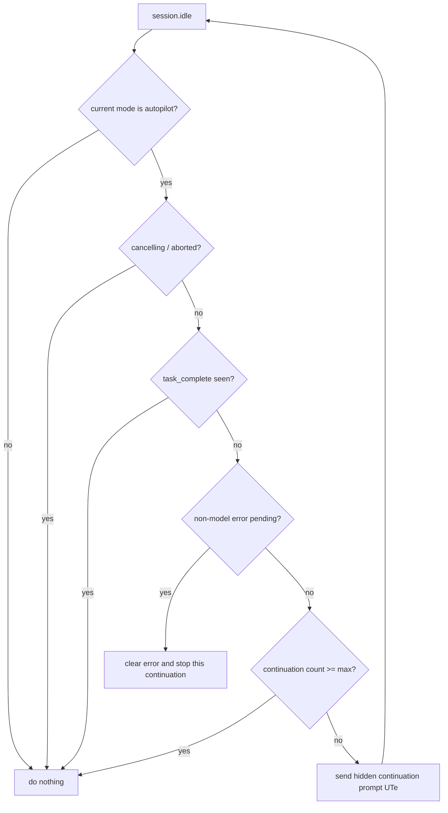
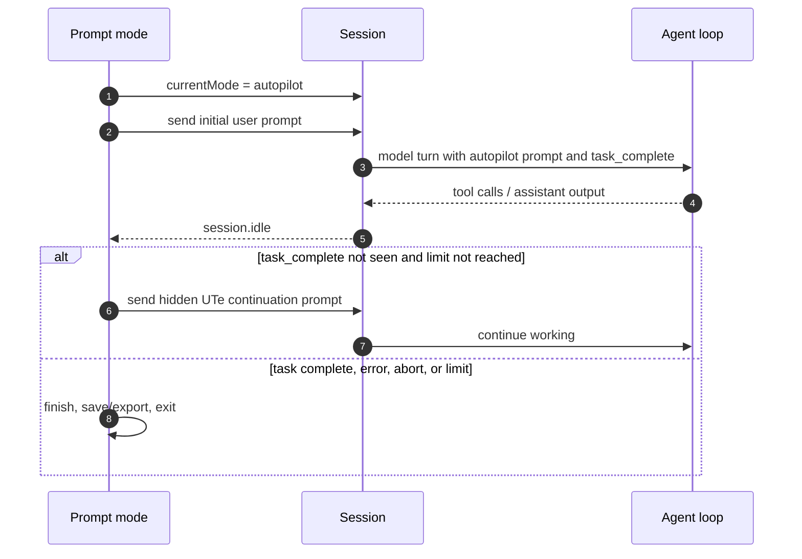
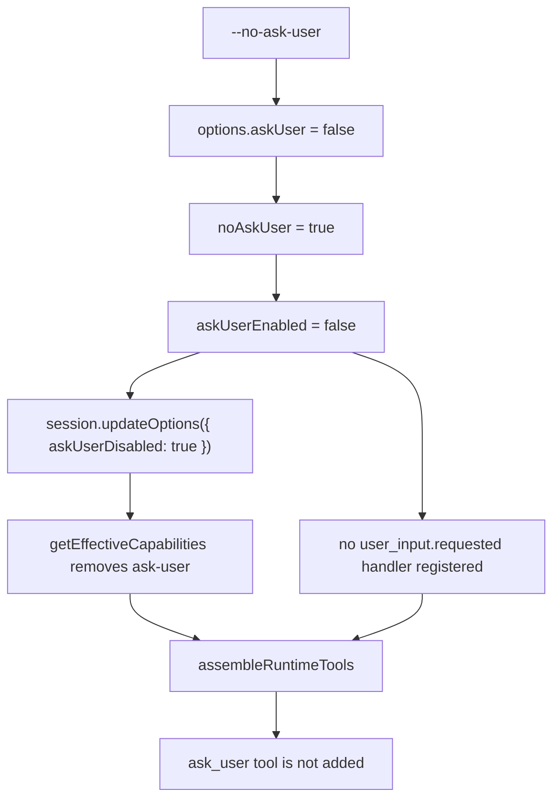
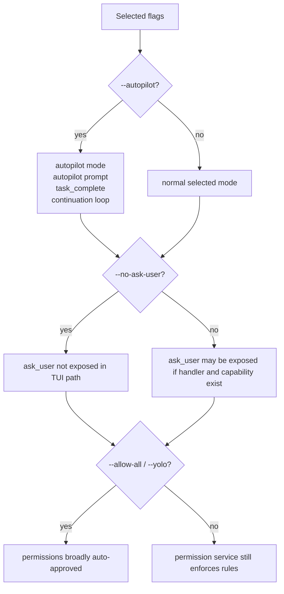
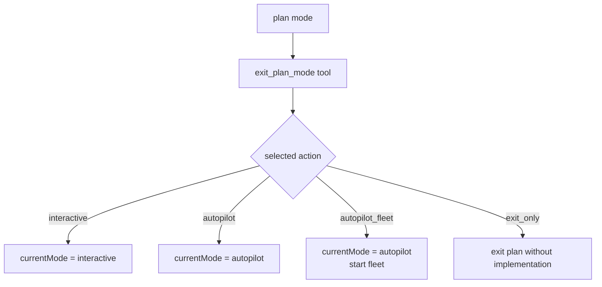

# Autopilot and no-ask-user flags

This document explains how the extracted `@github/copilot` CLI bundle implements the two autonomy-related flags:

- `--autopilot`
- `--no-ask-user`

They sound similar, but they operate at different layers. `--autopilot` changes the agent mode and continuation behavior. `--no-ask-user` changes the model-visible tool/capability surface by removing the `ask_user` path in interactive sessions.

## Short answer

| Flag | Primary layer | Main effect | What it is not |
|---|---|---|---|
| `--autopilot` | Agent mode and task lifecycle | Starts the session in autopilot mode, injects autopilot instructions, exposes `task_complete`, and can keep sending internal continuation prompts until completion or a limit. | It is not the same as `--allow-all`; it does not automatically grant all tool, path, and URL permissions by itself. |
| `--no-ask-user` | Capability and tool assembly | Disables the `ask-user` capability so the `ask_user` or elicitation tool is not exposed to the model in the interactive/TUI session path. | It is not a mode switch, does not inject autopilot instructions, and does not create continuation turns. |

In practical terms:

- `--autopilot` means "keep working autonomously until the task is complete or blocked."
- `--no-ask-user` means "do not give the model the structured tool it would use to ask the human a question."

## Source anchors

`app.js` is minified, so these anchors are version-specific lookup aids for the inspected `@github/copilot` `1.0.48` bundle.

| Area | Semantic alias | Minified anchor | Approx. line | What it shows |
|---|---|---:|---:|---|
| CLI flags | `RootProgram` options | `--no-ask-user`, `--autopilot`, `--max-autopilot-continues`, `--mode` | 8221 | Flag definitions, defaults, choices, and conflicts. |
| Initial mode helper | `resolveInitialAgentMode(...)` | `F8a(...)` | 7816 | Chooses `mode`, then `autopilot`, then `plan` for the TUI initial mode. |
| Root dispatch | `mainCliAction(...)` | `noAskUser: !t.askUser`, `autopilot: t.autopilot || t.mode === "autopilot"` | 8327 | Routes parsed flags into TUI and prompt-mode branches. |
| TUI session host | `InteractiveTuiRoot` | `jQa(...)`, `zB = !noAskUser && config.askUser !== false` | 7335-7340 | Computes ask-user availability and passes `askUserDisabled` into session options. |
| Session capability filter | `Session.getEffectiveCapabilities()` | `askUserDisabled`, `delete("ask-user")` | 4471 | Removes the `ask-user` capability when disabled. |
| Session mode state | `Session.currentMode` | `_currentMode`, `session.mode_changed` | 4471 | Tracks the current agent mode and emits mode-change events. |
| Tool config | `buildSettingsAndTools(...)` | `autopilotActive: r === "autopilot"` | 4481 | Marks the active turn as autopilot for prompt and tool assembly. |
| Prompt assembly | `buildSystemPrompt(...)` | `p.autopilotActive ? jIs : ""` | 3834, 3949 | Adds the `<autopilot_mode>` prompt block when autopilot is active. |
| Tool assembly | `assembleRuntimeTools(...)` | `ask-user`, `requestUserInput`, `$Vn()` | 5734 | Adds `ask_user` only when the capability and handler exist; adds `task_complete` when autopilot is active. |
| `ask_user` tool | `createAskUserTool(...)` | `ZYr(...)`, `ZE = "ask_user"`, `HW` | 602 | Defines the structured user-question tool and the autonomous fallback answer. |
| `task_complete` tool | `createTaskCompleteTool(...)` | `$Vn()`, `UM = "task_complete"`, `UTe` | 4140-4149 | Defines explicit task completion and the internal continuation prompt. |
| TUI continuation loop | `useAutopilotContinuation(...)` | `F5o(...)` | 6615 | Continues after `session.idle` until `task_complete`, error, abort, or max count. |
| Prompt-mode continuation loop | `executePromptDirectly(...)` | `session.task_complete`, `session.idle`, `UTe` | 7416 | Non-interactive autopilot loop. |
| Slash command | `/autopilot` | `Rps(...)`, `Deo` | 1300, 4918 | Runtime and TUI slash-command paths for toggling autopilot. |
| Plan exit actions | `exit_plan_mode` | `autopilot`, `autopilot_fleet` | 3624, 4481, 7340 | Plan approval can switch into autopilot or autopilot plus fleet. |

## CLI parsing and dispatch

The root command defines the relevant options together:

- `--no-ask-user` is a negated Commander-style boolean. It causes the parsed option `askUser` to become false.
- `--max-autopilot-continues <count>` defaults to `5` and is parsed as an integer.
- `--mode <mode>` accepts `interactive`, `plan`, or `autopilot`.
- `--autopilot` starts in autopilot mode and conflicts with `--mode` and `--plan`.
- `--plan` starts in plan mode and conflicts with `--mode` and `--autopilot`.



The key routing asymmetry in the inspected bundle is that `noAskUser` is explicitly passed into the TUI branch. The prompt-mode branch receives the autopilot boolean and continuation limit, but no separate `noAskUser` property is visible in the root dispatch.

## `--autopilot` implementation

`--autopilot` is implemented as an agent mode plus a completion protocol.

### Mode selection

For interactive/TUI sessions, the helper `resolveInitialAgentMode(...)` returns:

1. `options.mode`, if provided;
2. `"autopilot"`, if `--autopilot` was used;
3. `"plan"`, if `--plan` was used;
4. otherwise the TUI defaults to `"interactive"`.

The foreground session tracks this through `currentMode`. Changing it emits `session.mode_changed` and affects later tool and prompt assembly.



The same mode can also be reached after startup:

- `/autopilot on` or `/autopilot` toggles the mode in interactive sessions.
- Exiting plan mode can choose `autopilot` or `autopilot_fleet` as the selected action.
- ACP session-mode mapping also recognizes an autopilot mode URI.

### Prompt changes

When `autopilotActive` is true, system prompt assembly appends an `<autopilot_mode>` block. The block tells the model to:

- decide instead of asking;
- continue executing without waiting for user input;
- call `task_complete` only when the whole task is done and verified;
- avoid calling `task_complete` after partial progress, unresolved failures, or unverified edits.



### Tool changes

Autopilot adds a special terminal tool named `task_complete`. The tool is only added when the tool config has `autopilotActive` set.



The `task_complete` tool is the runtime's explicit done signal. A normal assistant message is not enough to stop autopilot continuation; the loop watches for the event emitted by the tool.

### Continuation loop in the TUI

The TUI registers a continuation hook that watches session events:

- `session.task_complete` with success not false marks the task as done.
- `session.error` marks an error, except `model_call` errors are treated differently.
- `abort` marks cancellation.
- `session.idle` is the trigger point for deciding whether to continue.

When the session becomes idle and the mode is still `autopilot`, the hook sends an internal user message if all of these are true:

- the task has not been marked complete;
- cancellation or abort is not active;
- no non-model-call error is pending;
- the continuation count has not reached `maxAutopilotContinues`.

The internal prompt is `UTe`, a reminder that the task has not been completed with `task_complete`. In the TUI path this send also includes `displayPrompt: ""`, `billable`, and `requiredTool: "task_complete"`.



### Continuation loop in prompt mode

Prompt mode uses a similar loop, but without the TUI renderer. When the `autopilot` boolean is true:

1. it sets `session.currentMode = "autopilot"`;
2. sends the initial prompt;
3. waits for `session.idle`;
4. sends the same hidden continuation prompt until the task completes, an error occurs, the session aborts, or the limit is reached.



### Interaction requests while in autopilot

Autopilot mode is also treated specially by several human-interaction adapters:

- If `ask_user` is available but the current mode is autopilot, the TUI responds with the fallback text stored in `HW`, telling the model that the user is not available and it should make good decisions.
- Prompt-mode autopilot installs a similar `user_input.requested` fallback response.
- TUI permission prompts in autopilot are not shown as normal dialogs; requests are answered as `user-not-available` unless an allow rule already handles them.
- Elicitation and MCP sampling requests are declined or skipped in autopilot when approval is not already available.

This is why autopilot can be autonomous but still bounded by the permission system.

## `--no-ask-user` implementation

`--no-ask-user` is implemented by removing a capability and therefore preventing tool assembly from exposing `ask_user`.

### TUI path

In the interactive/TUI branch, root dispatch passes `noAskUser: !options.askUser`. The TUI then computes an effective boolean similar to:

```text
askUserEnabled = !noAskUser && config.askUser !== false
```

That value controls two things:

1. whether the TUI registers a handler for `user_input.requested` events;
2. whether the session option `askUserDisabled` is true.

The session's `getEffectiveCapabilities()` method removes `"ask-user"` when `askUserDisabled` is true. Later, runtime tool assembly only adds `ask_user` when both conditions hold:

- the effective capabilities include `"ask-user"`;
- a request handler exists, either `requestUserInput` or the elicitation-backed alternative.



The `ask_user` tool itself is a structured question mechanism. When enabled, it lets the model ask one question at a time with optional choices and optional freeform input. `--no-ask-user` prevents that tool from being visible in the first place.

### Prompt-mode caveat

In the inspected root dispatch, `noAskUser` is not separately passed into the prompt-mode call. Prompt mode is already non-interactive, so normal human dialog is unavailable. The important observed behaviors are:

- ordinary prompt mode does not have the TUI ask-user dialog surface;
- prompt-mode autopilot installs a fallback `user_input.requested` response using the same autonomous `HW` text;
- the explicit `askUserDisabled` capability-removal path is visible in the TUI/foreground session setup, not in the prompt-mode argument list.

So the flag's clean implementation path is the interactive/TUI capability path. Prompt mode handles lack of user interaction primarily through non-interactive handlers and permission denial behavior.

## Behavioral comparison

| Question | `--autopilot` | `--no-ask-user` |
|---|---|---|
| Changes initial agent mode? | Yes. Starts in `autopilot` mode, or `--mode autopilot` does the same. | No. The session can remain interactive, plan, or any other selected mode. |
| Changes the system prompt? | Yes. Adds the `<autopilot_mode>` block. | Not directly. It changes capabilities/tools, not the core mode prompt. |
| Adds `task_complete`? | Yes, when `autopilotActive` is true. | No. |
| Creates continuation turns? | Yes. On `session.idle`, sends hidden continuation prompts until completion, abort/error, or limit. | No. |
| Removes `ask_user`? | No, not by itself. If `ask_user` remains available, autopilot adapters answer it with an autonomous fallback instead of showing a normal prompt. | Yes in the TUI path, by removing the `ask-user` capability and not registering the user-input handler. |
| Affects permission approvals? | It changes how prompts are handled while in autopilot: unresolved permission prompts become unavailable/denied instead of blocking for a human. It does not grant permissions by itself. | No. Permission prompts and permission rules are a separate subsystem. |
| Equivalent to `--allow-all` or `--yolo`? | No. | No. |
| Can be combined with `--allow-all`? | Yes. That creates autopilot mode plus broad permission approval. | Yes. That removes ask-user while separately broadening permissions. |
| Can be combined with the other flag? | Yes in the TUI path. | Yes in the TUI path. |

## Combined scenarios



Common combinations:

| Combination | Result |
|---|---|
| `--autopilot` only | Autonomous mode with `task_complete` and continuation. The model is instructed not to ask; if `ask_user` is available and invoked, the runtime can answer with the autonomous fallback. Permissions still need allow rules or they are unavailable/denied in autopilot. |
| `--no-ask-user` only | Normal selected mode, but the TUI path does not expose `ask_user`. There is no autopilot prompt, no `task_complete`, and no continuation loop. |
| `--autopilot --no-ask-user` | Autopilot mode plus no structured ask-user tool in the TUI path. This is a stronger no-clarification setup, but permissions are still not automatically approved. |
| `--autopilot --allow-all` or `--autopilot --yolo` | Autopilot mode plus broad permission approval. This is closer to full autonomous execution, but it is implemented by combining two independent systems. |
| `--no-ask-user --allow-all` | The model cannot use `ask_user` in the TUI path, and permissions are broadly approved, but the agent is not in autopilot unless mode is set separately. |

## Relationship to plan mode and fleet

Autopilot is also an exit option from plan mode. The `exit_plan_mode` tool can present actions including:

- `interactive`
- `autopilot`
- `autopilot_fleet`
- `exit_only`

When the selected action is `autopilot`, the session mode becomes autopilot. When the selected action is `autopilot_fleet`, the session mode also becomes autopilot and the fleet workflow is started after mode switch.



## Key takeaways

- `--autopilot` is a mode and lifecycle feature: prompt instructions, `task_complete`, event-driven continuation, and special handling for human-interaction requests.
- `--no-ask-user` is a tool-surface feature: it removes the `ask-user` capability in the TUI path so `ask_user` is not assembled.
- The flags are orthogonal. Use both when you want autonomous mode and no structured clarification tool.
- Neither flag grants file, shell, MCP, path, or URL permissions. Use allow rules, `--allow-all`, or `--yolo` for permission auto-approval.
- In autopilot, unresolved permission and user-interaction requests are treated as unavailable or answered with an autonomous fallback rather than blocking for a human.
