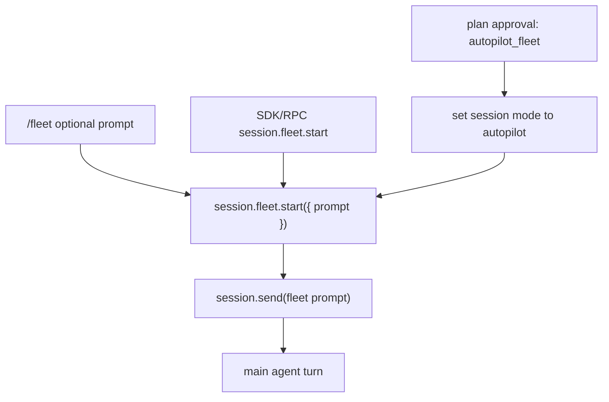
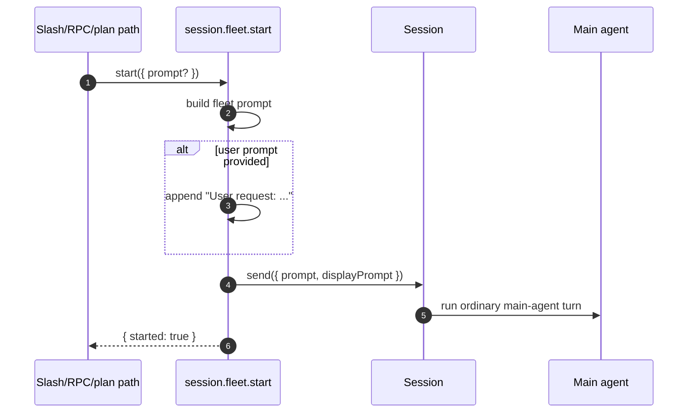
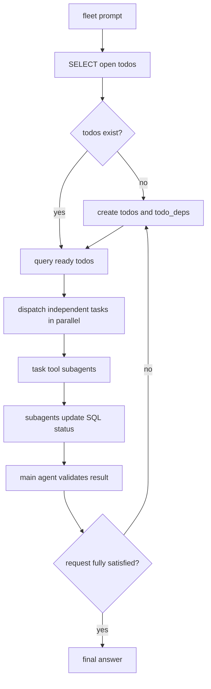
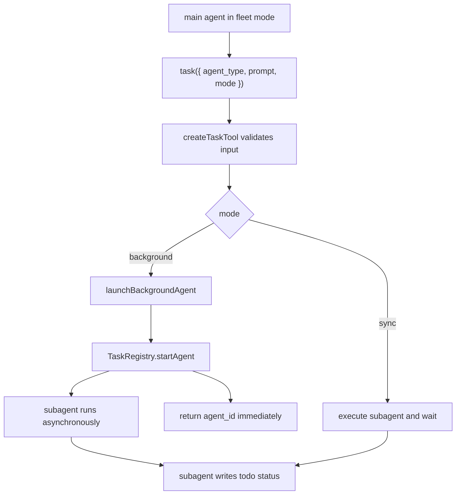
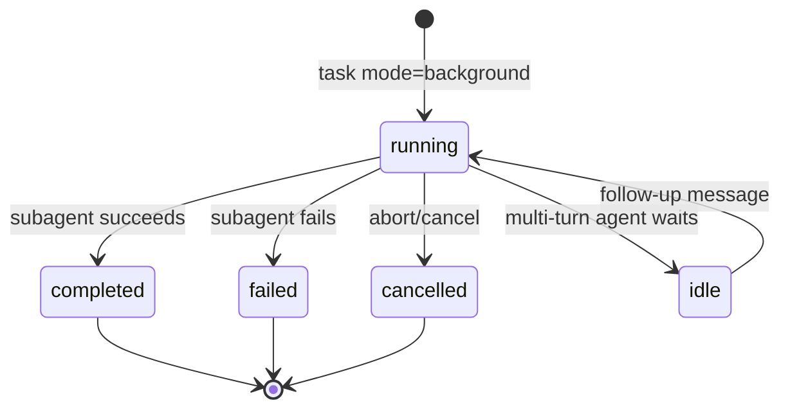
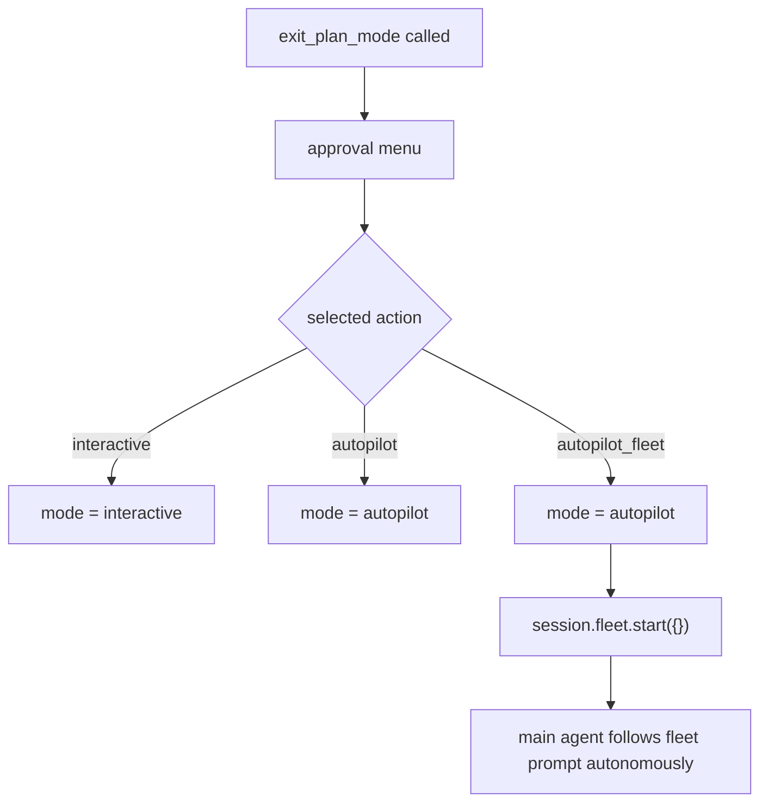
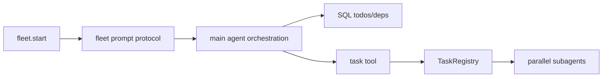

# Fleet mode implementation in Copilot CLI

This document explains how the `/fleet` feature is implemented in the extracted `@github/copilot` CLI bundle. Fleet mode is best understood as a prompt-driven orchestration mode: it asks the main agent to act like a project manager, split work into SQL-backed todos, dispatch independent subtasks through the `task` tool, and validate the combined result.

`app.js` is bundled and minified, so this document uses semantic aliases as the stable names. Minified symbols are retained only as search anchors for the analyzed `@github/copilot` `1.0.48` artifact.

## Source anchors

| Area | Semantic alias | Minified anchor | Approx. line | Role |
|---|---|---:|---:|---|
| Slash command handler | `fleetCommand(...)` | `Lps(t, e)` | 1305 | Handles `/fleet [prompt]`, trims the prompt, and calls `session.fleet.start(...)`. |
| Slash command registration | `builtInSlashCommands` | command object with `name: "fleet"` | 1340 | Registers `/fleet` as a built-in runtime command: “Enable fleet mode for parallel subagent execution”. |
| Fleet API implementation | `createFleetApi(session)` | `rKn(t)` | 4361 | Adds `session.fleet.start({ prompt })`; builds the fleet prompt and sends it into the current session. |
| Fleet prompt template | `FLEET_MODE_PROMPT` | `eKn` | 4363 | Instructs the main agent to use SQL todos and parallel `task` calls. |
| Fleet API schema | `FleetStartRequest`, `FleetStartResult` | `tKn` | 4396 | Defines the `prompt` input and `{ started: boolean }` result shape for the session API. |
| Session API surface | `SessionApi.fleet` | `fleet=rKn(this)` | 4471 | Exposes fleet operations on the session object. |
| RPC schema | `session.fleet.start` | `schemas/api.schema.json` | 552, 3012 | Exposes fleet start over JSON-RPC/SDK with an experimental stability marker. |
| Plan-mode action | `autopilot_fleet` | `cZ` | 3617-3625, 6405, 7340 | Lets the plan approval UI accept a plan and immediately start autopilot plus fleet mode. |
| Task execution layer | `createTaskTool(...)` | `I6n(...)` | 3735-3815 | Executes the subagents that fleet mode asks the main agent to dispatch. |
| Background tracking | `TaskRegistry` | `B3` | 3367 | Tracks background subagents, status, messages, cancellation, and completion. |
| SQL coordination | `session SQL tool` | `todos`, `todo_deps` instructions | 5205-5268 | Provides per-session todo/dependency tables used as the fleet source of truth. |

## Key idea

Fleet mode does not introduce a separate scheduler, worker pool, or special “fleet agent” executor. Its implementation is intentionally thin:

```text
/fleet [prompt]
  -> fleetCommand(...)
  -> session.fleet.start({ prompt })
  -> session.send({ prompt: FLEET_MODE_PROMPT + optional user prompt })
  -> main agent uses task tool and SQL todos to coordinate subagents
```

The parallelism comes from normal `task` tool calls, especially `mode: "background"`, and the background work is tracked by the existing `TaskRegistry`.

## Entry points

There are three observed ways to enter fleet mode.



### Slash command path

The `/fleet` slash command is registered as a built-in command. Its handler trims any text after the command and forwards it to the session API:

```text
fleetCommand(context, input):
  prompt = input.trim()
  await context.fleet.start({ prompt: prompt || undefined })
  return { kind: "completed" }
```

### Session API and RPC path

The session API exposes `fleet.start`. The schema also exposes this as an experimental RPC method named `session.fleet.start`:

```text
FleetStartRequest:
  sessionId: string
  prompt?: string

FleetStartResult:
  started: boolean
```

This means fleet can be started by the TUI slash-command surface or by an SDK/protocol client that can call session APIs.

### Plan approval path

Plan mode can offer an `autopilot_fleet` action. When selected, the runtime exits plan mode, sets the session to autopilot, and then starts fleet mode. The UI label observed in the bundle is:

```text
Accept plan and build on autopilot + /fleet
```

## What `session.fleet.start` does

The fleet API implementation is small. It builds a prompt and sends it into the existing session:



The display text is also generated here:

- with a prompt: `Fleet deployed: <prompt>`;
- without a prompt: `Fleet deployed`.

## Fleet prompt contract

The embedded fleet prompt tells the main agent to:

1. check existing todos in the per-session SQL database;
2. decompose the request into todos if none exist;
3. use `todo_deps` to represent true dependencies;
4. query ready todos whose dependencies are done;
5. dispatch independent todos in parallel through the `task` tool;
6. instruct each subagent to update its todo status;
7. treat SQL status as the source of truth;
8. validate the work after subagents finish;
9. decompose and dispatch additional work if the original request is not complete.



The important nuance is that the scheduler is mostly a **model-followed protocol** rather than imperative JavaScript control flow. The code injects the protocol; the main agent executes it using existing tools.

## SQL as the coordination layer

Fleet relies on the session SQL tool’s default tables.

| Table | Purpose |
|---|---|
| `todos` | Stores work items and their status: `pending`, `in_progress`, `done`, or `blocked`. |
| `todo_deps` | Stores dependency edges between todos. |

The fleet prompt uses SQL examples equivalent to:

```sql
SELECT id, title, status FROM todos WHERE status != 'done';
```

and a ready-work query based on dependencies:

```sql
SELECT * FROM todos
WHERE status = 'pending'
AND id NOT IN (
    SELECT todo_id
    FROM todo_deps td
    JOIN todos t ON td.depends_on = t.id
    WHERE t.status != 'done'
);
```

Subagents are told to update their assigned todo when they finish:

```sql
UPDATE todos SET status = 'done' WHERE id = '<todo-id>';
UPDATE todos SET status = 'blocked' WHERE id = '<todo-id>';
```

This gives fleet mode a shared coordination state that survives across turns within the same session.

## Subagent execution path

Fleet mode does not bypass the normal subagent machinery. It asks the main agent to call the `task` tool.



The fleet prompt specifically discourages fake parallelism:

- do not dispatch only one background subagent when independent work exists;
- prefer a sync subagent if there is only one task to run;
- dispatch multiple background subagents in the same turn when work can run independently;
- only serialize todos that have real dependency edges.

## TaskRegistry relationship

Background fleet work is normal background subagent work. The `TaskRegistry` stores records with fields such as:

- `id`;
- `agentType`;
- `description`;
- `prompt`;
- `modelOverride`;
- `executionMode`;
- status such as `running`, `idle`, `completed`, `failed`, or `cancelled`;
- latest response and turn history;
- abort/cancellation state.



Fleet mode therefore inherits cancellation, status updates, timeline rendering, task listing, and prompt-mode shutdown waiting from the existing task infrastructure.

## Autopilot plus fleet

`autopilot_fleet` is a plan-mode approval action, not a separate fleet implementation. The flow is:



The model-side instructions for `exit_plan_mode` recommend including `autopilot_fleet` for highly parallelizable work or parallelizable todo sets.

## Feature and limit interactions

The `/fleet` command itself appears to be a built-in command without a direct feature gate in the analyzed bundle. However, its effectiveness depends on surrounding capabilities:

| Capability | Fleet impact |
|---|---|
| `task` tool | Required for subagent dispatch. |
| `TaskRegistry` | Required for background subagent tracking. |
| Session SQL tool | Provides `todos` and `todo_deps` coordination. |
| Background task support | Allows multiple subagents to run concurrently. |
| `COPILOT_SUBAGENT_MAX_CONCURRENT` | Caps concurrent subagent execution. |
| `COPILOT_SUBAGENT_MAX_DEPTH` | Caps nested subagent recursion. |
| `SUBAGENT_PARALLELISM_PROMPTS` | Affects model instructions around subagent parallelism. |
| `REMOVE_PARALLEL_TOOL_PROMPT` | Can remove generic parallel-tool prompting from system instructions. |
| Model/account limits | Affect available models, cost guards, and concurrency behavior. |

## Why this design matters

Fleet mode is lightweight because it composes existing runtime pieces:



This gives the feature flexibility: improvements to the `task` tool, background agents, SQL timeline rendering, model prompting, and plan-mode approval can improve fleet mode without adding a separate scheduler implementation.

## Takeaways

- Fleet mode is primarily `session.send(fleetPrompt)`, not a standalone executor.
- `/fleet`, RPC `session.fleet.start`, and plan-mode `autopilot_fleet` all converge on the same session API.
- The main agent remains the orchestrator; subagents do the delegated work.
- SQL `todos` and `todo_deps` act as the coordination source of truth.
- Parallelism comes from multiple `task` calls, especially `mode: "background"`, tracked by `TaskRegistry`.
- Fleet mode’s correctness depends on final validation by the main agent, not only on subagent completion.