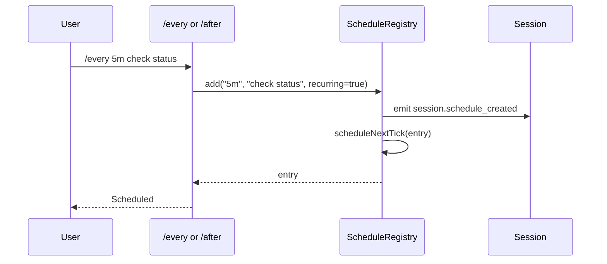
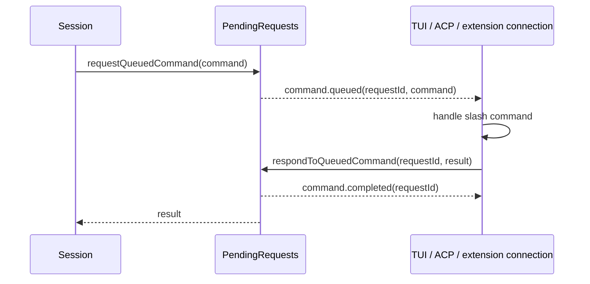

# Scheduled prompts and command queue

This document explains how the extracted Copilot CLI bundle implements scheduled prompts and queued command dispatch. In the analyzed `app.js`, `/every` and `/after` are user-visible slash commands backed by an in-session `ScheduleRegistry`, while `command.queued`, `command.execute`, and `command.completed` are ephemeral client-dispatch events used to route slash commands to the correct interactive/protocol owner.

The key distinction is:

- **Scheduled prompts** enqueue plain user messages on a timer.
- **Queued commands** ask a UI/protocol client to execute or route slash-command text.

Because `app.js` is bundled/minified, symbol names are unstable. Line references below are searchable anchors in the extracted `1.0.48` bundle.

## Source anchors

| Area | Anchor strings / minified symbols | Approx. `app.js` line | What it shows |
|---|---|---:|---|
| Slash commands | `/every`, `/after`, `YBn(...)` | 1303, 1340 | User-visible recurring and one-shot scheduled prompt commands. |
| Schedule validation | `Invalid interval`, `Minimum interval`, `Maximum interval`, `J7n=1e4`, `Z7n=864e5` | 4210 | Intervals are parsed and bounded between 10 seconds and 1 day. |
| Slash-command restriction | `only schedules plain messages — slash commands are not supported` | 1303 | Scheduled entries cannot be slash commands. |
| Registry class | `ScheduleRegistry`, minified `Sbt` | 4210 | Stores entries, hydrates from events, schedules timers, and disposes on shutdown. |
| Create/cancel events | `session.schedule_created`, `session.schedule_cancelled` | 4210, 4361 | Durable session events define schedule state. |
| Session access | `getScheduleRegistry()` | 4471, 7344 | Registry is lazily created and reused by TUI dialogs/tools. |
| Tool API bridge | `enableManageScheduleTool`, `scheduleApi` | 4471, 4481 | Schedule management can be exposed to tools when enabled. |
| Command request queue | `command.queued`, `command.execute`, `command.completed` | 4210, 4361, 4481, 6100 | Ephemeral client command routing and completion lifecycle. |
| Queue mutation | `pending_messages.modified` | 4479 | Prompt queue changes notify the UI. |
| Cleanup | `session.shutdown` | 4210, 4361 | Schedule timers are disposed when the session shuts down. |

## User-visible scheduled prompts

The main user-facing commands are:

| Command | Description | Runtime mode |
|---|---|---|
| `/every <interval> <prompt>` | Schedule a recurring prompt for the current session. | Re-arms after each tick. |
| `/after <delay> <prompt>` | Schedule a one-shot prompt for the current session. | Fires once, then cancels itself. |

Both commands are marked experimental in the slash-command table, can run during agent execution, and do not stop queue processing.

## Parsing and validation

The shared parser (`YBn(...)` in the minified bundle) expects:

```text
/<every|after> <interval-or-delay> <prompt>
```

It performs these checks:

1. Argument text must not be empty.
2. The first non-space token is parsed as an interval/delay.
3. The rest of the input becomes the prompt text.
4. Prompt text must not be empty.
5. Prompt text must not start with `/`.
6. The parsed interval must be within bounds.

The error text makes the key design choice explicit:

> `/every` only schedules plain messages — slash commands are not supported.

This prevents scheduled prompts from becoming a hidden automation channel for arbitrary slash commands such as `/mcp`, `/plugin`, or `/reset-allowed-tools`.

## Interval limits

The interval parser accepts human-readable values such as `30s`, `5m`, `2h`, and `1d`. The `ScheduleRegistry` helper validates:

| Constant | Value | Meaning |
|---|---:|---|
| `J7n` | `10,000` ms | Minimum interval: 10 seconds. |
| `Z7n` | `86,400,000` ms | Maximum interval: 1 day. |

Invalid values produce guidance like “Try 30s, 5m, 2h, or 1d.”

## ScheduleRegistry state

Each scheduled entry has this shape:

| Field | Meaning |
|---|---|
| `id` | Sequential schedule ID within the session. |
| `intervalMs` | Delay between ticks in milliseconds. |
| `prompt` | Plain prompt text to enqueue. |
| `recurring` | `true` for `/every`, `false` for `/after`. |
| runtime-only `timer` | Active timeout handle. |
| runtime-only `cancelled` | Prevents future ticks. |
| runtime-only `inFlightCleanup` | Cleanup callback for any active queued work. |

The public/listed entry returned by `X7n(...)` omits runtime-only timer fields.

## Event-sourced hydration

The registry is event-sourced. On construction it calls `hydrate()` and replays prior session events:

| Event | Hydration effect |
|---|---|
| `session.schedule_created` | Add or update an entry in the in-memory schedule map. |
| `session.schedule_cancelled` | Remove an entry from the map. |

The registry also tracks the highest seen ID and sets `nextId = maxId + 1`. After replay, it schedules timers for all remaining entries.

This design makes scheduled prompts survive session replay/resume within the event log model without needing a separate schedules file.

## Creating and cancelling schedules



Cancellation uses `stop(id)`, which:

1. finds the entry;
2. cancels its timer and in-flight cleanup;
3. deletes it from the entries map;
4. emits `session.schedule_cancelled`;
5. returns the public entry snapshot.

`cancelAll()` is called by `dispose()`.

## Timer execution

At each tick, the registry enqueues the scheduled prompt into the session as a normal prompt/message. For recurring entries, it schedules the next tick unless the entry was cancelled. For one-shot entries, it cancels/removes the entry after firing.

Because scheduled prompts become ordinary queued user prompts, they inherit the same model/tool/permission behavior as manually submitted prompts.

## Shutdown behavior

The registry subscribes to `session.shutdown` in its constructor. On shutdown it calls `dispose()`, which:

- marks the registry disposed;
- cancels all timers;
- clears all entries;
- unsubscribes from the shutdown listener.

If code attempts to add an entry after disposal, it throws `ScheduleRegistry has been disposed`.

## Manage-schedule tool bridge

The session has an `enableManageScheduleTool` option. When set, the tool initialization context includes:

```text
scheduleApi: this.getScheduleRegistry()
```

This allows a tool or UI component to list/cancel/manage scheduled prompts through the registry, without duplicating schedule state.

The TUI also has a schedule manager dialog path that receives `registry: session.getScheduleRegistry()`.

## Command queue events

The command queue is related but separate from scheduled prompts. It is used when slash commands need to be executed by a UI/protocol client or routed to a command owner.

| Event | Persistence | Meaning |
|---|---|---|
| `command.queued` | Ephemeral | A queued slash command text should be handled by a client. |
| `command.execute` | Ephemeral | A registered command should be dispatched to its owning connection. |
| `command.completed` | Ephemeral | The pending command request has been resolved; clients can dismiss UI. |

The session pending-request manager stores request resolvers keyed by request ID and emits these events.

## Queued command lifecycle



The `command.execute` path is similar but includes `commandName` and `args`, and the embedded server can route the event to the connection that owns a registered command.

## Interaction with the prompt queue

The session prompt queue emits `pending_messages.modified` whenever queued messages change. Scheduled prompts and manually submitted prompts both flow through this queue. Commands are handled specially:

- if a queued item is `kind: "command"`, the session checks whether there are `command.queued` listeners;
- if a client handles the command and requests queue processing to stop, the session clears remaining queued items;
- otherwise command execution errors are logged and queue processing continues.

This makes commands client-mediated while keeping ordinary scheduled messages inside the agent queue.

## Why scheduled slash commands are blocked

Blocking scheduled slash commands avoids several edge cases:

- recurring `/mcp` or `/plugin` management changes;
- recurring permission resets;
- recursive `/every` creation;
- background command execution without clear user intent;
- ambiguous command ownership in ACP/embedded-server sessions.

By scheduling only plain prompts, the feature acts like a timed user reminder/request rather than a general cron system.

## Relationship to other docs

- `tui-and-slash-commands.md` explains general slash-command registration and TUI dialogs.
- `session-support-implementation.md` explains event replay and session persistence.
- `built-in-tool-execution-pipeline.md` explains tool events that scheduled prompts may later trigger.
- `autopilot-and-no-ask-user.md` explains autonomous continuation modes that scheduled prompts can interact with.
