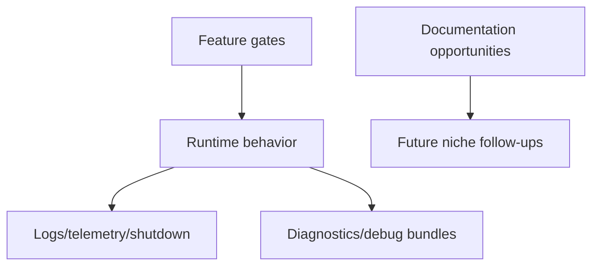

# Operations and research

Feature gates, diagnostics, debug bundles, observability/update/shutdown, and the original documentation backlog.

## How this volume fits

## Pages

| Page | Why read it | File |
|---|---|---|
| [Feature gates and rollout logic in `app.js`](./feature-gates.md) | Gate tiers, rollout inputs, env/settings overrides, remote experiments, repo/team allowlists, and MCP permission gates. | `feature-gates.md` |
| [Diagnostics, feedback, and debug bundles](./diagnostics-feedback-debug-bundles.md) | /diagnose, /feedback, /bug, /collect-debug-logs, .tgz bundles, secret gist uploads, and debug-log paths. | `diagnostics-feedback-debug-bundles.md` |
| [Observability, update, and shutdown workflows](./observability-update-shutdown.md) | Logging, telemetry, OpenTelemetry, debug artifacts, update/version paths, and graceful shutdown. | `observability-update-shutdown.md` |
| [Further documentation opportunities in `app.js`](./documentation-opportunities.md) | Historical scan report, implemented backlog, command surfaces, and future niche follow-ups. | `documentation-opportunities.md` |

## Reading guidance

- Operational docs explain gates, logging, diagnostics, and shutdown.
- The research backlog is retained as historical methodology and future niche ideas.

## Back to wiki home

- [Wiki home](../README.md)
- [Full table of contents](../SUMMARY.md)
