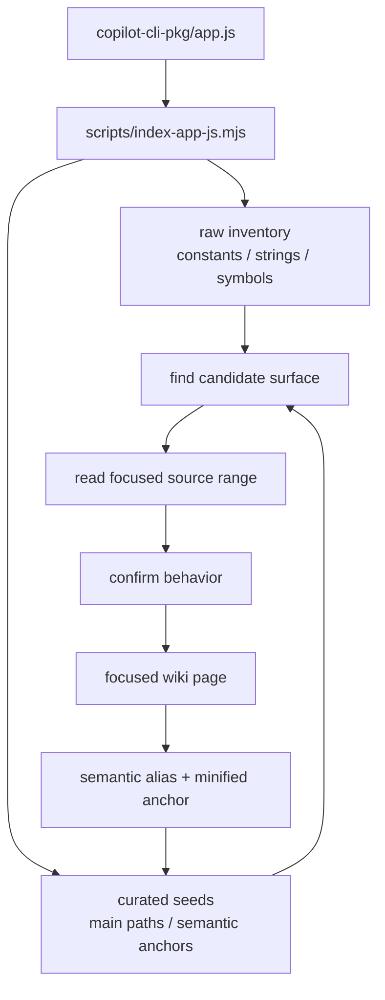
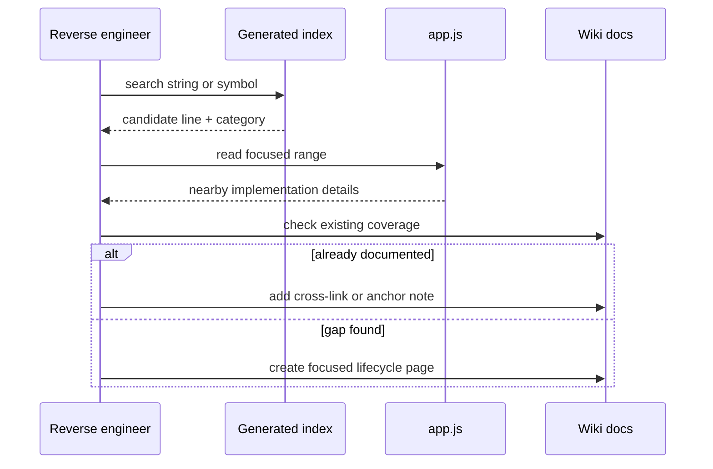

# `app.js` source atlas and generated indexes

This page explains how to keep a navigable map of the huge, bundled `copilot-cli-pkg/app.js` file without hand-reading all 8k+ minified lines. It pairs a generated inventory under `source-atlas/` with curated semantic anchors in the wiki.

The short version: use `scripts/index-app-js.mjs` to generate raw symbol and constant/string inventories, then use the curated path seeds below to trace the major runtime routes. The generated index is a discovery aid; the focused docs remain the source of confirmed behavior.

## Source anchors

| Area | Anchor | Approx. line / path | Role |
|---|---|---:|---|
| Bundle under analysis | `copilot-cli-pkg/app.js` | `8684` lines | Minified production runtime that the index scans. |
| Index generator | `scripts/index-app-js.mjs` | repository script | Generates raw symbol, declaration, event, env var, slash command, tool-name, JSON-RPC-ish method, and curated path seed indexes. |
| Generated output | `source-atlas/` | generated repository-root directory | Stores `README.md`, `constants.md`, `symbols.md`, `summary.json`, `surface-index.json`, and `declarations.json`. |
| High-level feature map | [`main-feature-map.md`](../00-overview/main-feature-map.md) | docs page | Human-curated overview of major `app.js` capabilities and runtime ownership. |
| Historical scan report | [`documentation-opportunities.md`](./documentation-opportunities.md) | docs page | Earlier script-assisted scan methodology and backlog history. |

## Current generated inventory

The latest generated scan of `copilot-cli-pkg/app.js` produced:

| Surface | Count |
|---|---:|
| Bundle size | `11,865,779` bytes |
| Bundle lines | `8,684` |
| Function declarations | `8,597` |
| Class declarations/assignments | `1,893` |
| `var`/`let`/`const` declaration blocks | `32,661` |
| Environment-variable-like strings | `182` |
| Feature/config-like uppercase keys | `1,550` |
| Experiment flag strings | `24` |
| Event strings | `91` |
| JSON-RPC/method-like strings | `58` |
| Confirmed slash commands | `22` |
| Raw slash-like candidates | `125` |
| Known tool-name hits | `25` |
| Packaged YAML agent definitions | `6` |
| Curated semantic anchor seeds | `17` |
| Curated main path seeds | `10` |

The generated files intentionally mix raw scan output with a small curated seed list. The repository ignores the large extracted package artifacts under `/artifacts/`, but keeps the root `source-atlas/` directory as a generated baseline so package updates can be compared by diffing the index output.

| Artifact | Use it for |
|---|---|
| `source-atlas/README.md` | Quick summary, main path seed table, semantic anchor seed table, regeneration notes. |
| `source-atlas/constants.md` | Human-readable env vars, feature-like keys, experiment flags, event strings, JSON-RPC-ish methods, slash command candidates, tool-name hits, and packaged agent definitions. |
| `source-atlas/symbols.md` | Truncated Markdown sample of functions, classes, and declaration blocks. |
| `source-atlas/summary.json` | Machine-readable counts, source hash, main path seeds, and semantic anchor seeds. |
| `source-atlas/surface-index.json` | Machine-readable constant/string surface inventory. |
| `source-atlas/declarations.json` | Machine-readable function/class/declaration-block inventory. |

## Why this is not a full call graph

A bundled/minified artifact is hostile to precise static call-graph extraction:

- symbol names are short, unstable, and often reused;
- module wrappers and generated helpers create a lot of noise;
- object literals, schemas, and closures are more important than many individual functions;
- some behavior is runtime-provided by MCP servers, plugins, SDK extensions, custom agents, hooks, and user/repository files;
- exact line numbers shift whenever the package is rebuilt.

So the atlas uses a more reliable workflow:



The generated index answers “where should I look first?” The wiki answers “what does this path mean?”

## Main runtime paths

Use these as top-level routes through the bundle.

| Path | Typical trigger | Start with these anchors | Existing docs |
|---|---|---|---|
| Startup and runtime mode routing | `copilot` argv, stdin, TTY, global options | `RootProgram`, `j$o`, `u1t`, `--server`, `--headless`, `--acp` | [`main-feature-map.md`](../00-overview/main-feature-map.md), [`cli-runtime-workflows.md`](../01-runtime-and-ui/cli-runtime-workflows.md) |
| Session and event lifecycle | new/resume/continue/name/fork/session APIs | `session.start`, `Session.send`, `tool.execution_complete`, `session.task_complete`, `session.idle` | [`session-support-implementation.md`](../03-sessions-and-remote/session-support-implementation.md), [`system-events-and-ui-projection.md`](../03-sessions-and-remote/system-events-and-ui-projection.md) |
| Prompt and context assembly | session initialization, subagent creation, slash command prompt macro, provider request | `buildSystemPrompt`, `X3e`, `Wmt`, `currentSystemMessage`, custom-instruction and skill loaders | [`prompt-sources.md`](../02-context-and-input/prompt-sources.md), [`app-js-prompt-catalog.md`](../02-context-and-input/app-js-prompt-catalog.md) |
| Model request, streaming, retry, and compaction | agent turn needs a completion with tools | `getCompletionWithTools`, request processors, `BasicTruncator`, `CompactionProcessor`, rate-limit strings | [`model-api-routing.md`](../06-models-and-reliability/model-api-routing.md), [`resilience-rate-limits-concurrency.md`](../06-models-and-reliability/resilience-rate-limits-concurrency.md), [`conversation-compaction.md`](../02-context-and-input/conversation-compaction.md) |
| Runtime tool assembly | session/subagent tool initialization or tool surface invalidation | `HCr`, `assembleRuntimeTools`, `initializeAndValidateTools`, `session.tools_updated` | [`runtime-tool-assembly-and-filtering.md`](../04-tools-and-integrations/runtime-tool-assembly-and-filtering.md) |
| Tool execution lifecycle | model emits a tool call | `tool.execution_start`, `preToolUse`, `permissionRequest`, `tool.execution_complete` | [`built-in-tool-execution-pipeline.md`](../04-tools-and-integrations/built-in-tool-execution-pipeline.md) |
| Subagent and task orchestration | main model calls `task`; slash macro steers toward an agent | `I6n`, `TaskRegistry`, `B3`, `SessionAgentExecutor`, `dZ`, `agent_completed` | [`agent-task-orchestration.md`](../07-agents-and-automation/agent-task-orchestration.md), [`built-in-agents.md`](../07-agents-and-automation/built-in-agents.md) |
| Integrations and extension loading | MCP config, plugins, SDK extension gate, IDE bridge | `McpHost`, plugin loaders, `setupExtensionsForSession`, `session.extensions_loaded`, `callIdeTool` | [`mcp-support-implementation.md`](../04-tools-and-integrations/mcp-support-implementation.md), [`plugin-extension-architecture.md`](../04-tools-and-integrations/plugin-extension-architecture.md), [`copilot-sdk-extension-support.md`](../04-tools-and-integrations/copilot-sdk-extension-support.md), [`ide-lsp-editor-integration.md`](../04-tools-and-integrations/ide-lsp-editor-integration.md) |
| Permissions, policy, and sandbox boundaries | tool/path/URL/MCP/hook/shell action needs approval or policy check | `PermissionService`, `permissionRequest`, `allow-tool`, `deny-tool`, content exclusion strings, sandbox strings | [`permission-system-design.md`](../05-security-and-policy/permission-system-design.md), [`content-exclusion-and-redaction.md`](../05-security-and-policy/content-exclusion-and-redaction.md), [`hooks-lifecycle-automation.md`](../05-security-and-policy/hooks-lifecycle-automation.md), [`sandboxing.md`](../05-security-and-policy/sandboxing.md) |
| Operations, diagnostics, and shutdown | diagnostic command, telemetry/logging event, update check, signal/shutdown | `/diagnose`, `/collect-debug-logs`, `ShutdownService`, `OpenTelemetry`, update strings | [`diagnostics-feedback-debug-bundles.md`](./diagnostics-feedback-debug-bundles.md), [`observability-update-shutdown.md`](./observability-update-shutdown.md) |

## Constant and string surfaces

For a minified bundle, strings often provide better entry points than minified function names.

| Surface | Why scan it | Generated location |
|---|---|---|
| Environment variables | Finds operational knobs, provider config, hidden debug toggles, CI/agent env, telemetry, and detached-session context. | `constants.md` → “Environment variables” |
| Feature/config-like keys | Finds feature gates, schema keys, config flags, and object-literal surfaces that may not appear as standalone constants. | `constants.md` → “Feature/config-like object keys” |
| Experiment flag strings | Finds `copilot_cli_*` remote experiment names and gate override paths. | `constants.md` → “Experiment flag strings” |
| Event strings | Finds session/tool/assistant/subagent/hook lifecycle edges and UI/persistence contracts. | `constants.md` → “Event strings” |
| JSON-RPC-ish methods | Finds API/server/SDK/session boundary methods. | `constants.md` → “JSON-RPC-ish method strings” |
| Slash commands | Separates a curated confirmed command list from raw slash-like false positives. | `constants.md` → “Confirmed slash commands” and “Slash-like raw string candidates” |
| Known tool names | Finds important built-in tool and helper names without pretending to discover every dynamic MCP/plugin/extension tool. | `constants.md` → “Known tool-name hits” |
| Packaged agent YAML | Finds static built-in agent prompt files outside inline `app.js` strings. | `constants.md` → “Packaged agent definition files” |

## Symbol and declaration surfaces

The symbol inventory is intentionally low-level. It helps find nearby code, but it should not be treated as stable API documentation.

| Surface | Use it when |
|---|---|
| Function declarations | You know a minified function name or want to inspect functions clustered around a line range. |
| Class declarations/assignments | You need class-like state machines, managers, clients, React components, or service wrappers. |
| Declaration blocks | You need constants in a bundled module wrapper, such as gate tables, tool names, schema aliases, or prompt fragments. |

The generated Markdown is capped so it stays readable. Use `declarations.json` when you need the full list.

## Reverse-engineering workflow

1. **Start from a user-visible surface.** Examples: `/review`, `session.task_complete`, `COPILOT_SUBAGENT_MAX_DEPTH`, `task`, `session.extensions_loaded`.
2. **Look it up in the generated index.** Use `constants.md` first; if you already know a minified function/class name, use `symbols.md` or `declarations.json`.
3. **Read a focused source range.** Use the line anchor plus nearby strings instead of scrolling the full bundle.
4. **Classify the path.** Decide whether it is startup/mode routing, prompt assembly, model request, tool assembly, tool execution, subagents, integrations, policy, persistence, or operations.
5. **Map minified names to semantic aliases.** For example, `B3` becomes `TaskRegistry`; `I6n(...)` becomes `createTaskTool(...)`; `nHn` becomes `BUILT_IN_AGENTS`.
6. **Cross-check existing docs.** If a page already covers the lifecycle, add a small anchor/cross-link. If it is missing, create a focused page.
7. **Regenerate after package updates.** Diff `source-atlas/` to spot new commands, events, env vars, tools, or anchors.



## Regenerating the index

From the repository root:

```sh
node scripts/index-app-js.mjs
```

Useful variants:

```sh
node scripts/index-app-js.mjs --app artifacts/copilot-cli-pkg-test/app.js --out source-atlas-test
```

```sh
node scripts/index-app-js.mjs --markdown-limit 500
```

After regeneration, inspect:

- `source-atlas/summary.json` for count or hash changes;
- `source-atlas/constants.md` for new command/event/env/config surfaces;
- `source-atlas/declarations.json` for new or moved symbols;
- the generated `README.md` for resolved main path and semantic anchor seed shifts.

## Caveats

- Generated “first line” values are raw first hits for a string or minified name. A short minified symbol such as `B3` or `dZ` can appear earlier as an unrelated substring; confirm by reading context.
- Raw slash-like candidates include URL paths and API routes. Use the confirmed command list for user-facing slash commands.
- Feature/config-like keys intentionally include false positives from schemas and object literals.
- JSON-RPC-ish methods are identified by prefix/string shape; confirm protocol behavior in [`embedded-server-acp-protocol.md`](../01-runtime-and-ui/embedded-server-acp-protocol.md), [`api-and-session-event-schemas.md`](../03-sessions-and-remote/api-and-session-event-schemas.md), or SDK docs before treating them as public methods.
- Generated artifacts are version-specific to the analyzed `copilot-cli-pkg/app.js` hash.

## Key takeaways

- Do not read `app.js` linearly; start from strings, events, commands, tools, env vars, or curated semantic anchors.
- The generated index gives fast raw discovery; the wiki provides confirmed interpretation.
- Main runtime paths are stable enough to document even when minified names and line numbers shift.
- Diffing generated artifacts after package updates is the fastest way to find new reverse-engineering work.
