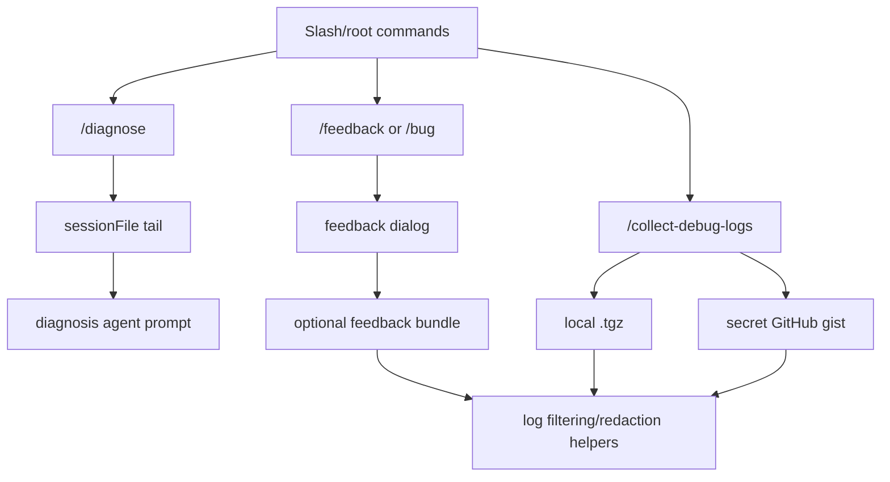
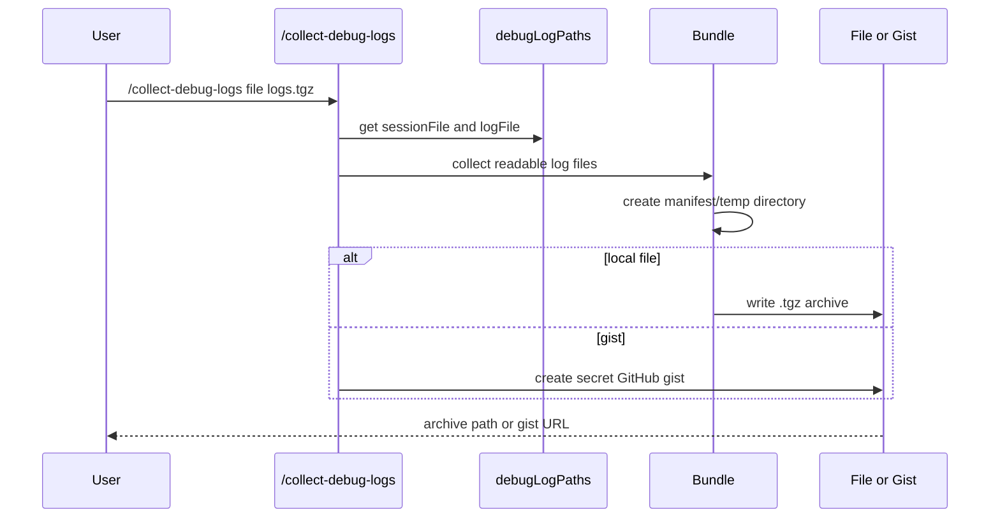

# Diagnostics, feedback, and debug bundles

This document explains how diagnostics, feedback, and debug-log collection are implemented in the extracted Copilot CLI `app.js` bundle. The main user-facing surfaces are `/diagnose`, `/feedback` (alias `/bug`), and `/collect-debug-logs`, plus hidden root CLI flags for collecting debug bundles by session ID.

The important implementation point is that diagnostics and feedback are split into three paths:

- `/diagnose` asks the agent to analyze the current session log;
- `/feedback` opens a feedback dialog and can attach logs when the gate allows it;
- `/collect-debug-logs` packages session/log files into a local `.tgz` or uploads them to a secret GitHub gist.

Because `app.js` is bundled/minified, symbol names are unstable. Line references below are searchable anchors in the extracted bundle and will shift across releases.

## Source anchors

| Semantic alias | Minified anchor | Approx. `app.js` line | Role |
|---|---|---:|---|
| Diagnose command | `/diagnose`, `Analyze the current session log` | 4643, 4934 | Staff-only command builds an agent prompt from session log tail and optional user prompt. |
| Diagnose gate | `DIAGNOSE:"staff"`, `diagnoseEnabled:e.DIAGNOSE` | 239, 7344 | Command visibility is feature/staff gated. |
| Feedback command | `/feedback`, alias `/bug`, `Provide feedback about the CLI` | 4643, 4942 | Opens feedback dialog with session/log paths and optional log collection. |
| Debug-log gate | `COLLECT_DEBUG_LOGS:"staff"`, `collectDebugLogsEnabled:e.COLLECT_DEBUG_LOGS` | 239, 7344 | Debug bundle collection is separately gated. |
| Collect command | `/collect-debug-logs`, `file`, `gist`, `Collect debug logs to .tgz file or GitHub gist` | 4643, 5023 | Command saves local archive or uploads secret gist. |
| Debug paths | `debugLogPaths`, `sessionFile`, `logFile` | 4940, 4942, 5023 | Commands receive current session and runtime log file paths. |
| Archive naming | `copilot-debug-logs-<id>.tgz`, `copilot-debug-logs-${Date.now()}` | 4515, 5023, 8225 | Local bundles are assembled in a temp directory and written as `.tgz`. |
| Gist upload | `POST /gists`, `public:false`, `secret GitHub gist` | 4515, 5023 | Debug logs can be uploaded as a secret gist when logged in. |
| Feedback bundle | `feedback.md`, `feedback-manifest.json`, `additional-logs` | 4515 | Feedback bundles include details, manifest, and optional extra logs. |
| Root flags | `--collect-debug-logs <sessionId>`, `--collect-debug-logs-output <path>` | 8225 | Non-interactive root command can collect a session’s logs to `.tgz`. |

## Capability map

## `/diagnose`

`/diagnose` is a staff-only command enabled by the `DIAGNOSE` feature gate. It accepts an optional free-form prompt. The implementation:

1. Reads `debugLogPaths.sessionFile`.
2. Verifies the file exists; if not, it reports that at least one prompt must be sent first.
3. Reads the tail of the session log, around 30 lines in the evidence.
4. Builds an agent prompt asking the model to analyze errors, unexpected behavior, performance issues, and noteworthy events.
5. Includes the session log path for further investigation.

This command does not itself package logs. It turns the current log into an investigation prompt for the agent.

## `/feedback` and `/bug`

`/feedback` has alias `/bug`. It opens a feedback dialog with:

| Dialog field | Source |
|---|---|
| `canCollectLogs` | `featureFlags.COLLECT_DEBUG_LOGS` |
| `currentSessionId` | `session.getSessionId()` |
| `debugLogPaths` | Runtime context paths. |
| `cwd` | Current process working directory. |

This command is allowed during agent execution, so users can report issues without needing to stop the current session first.

## `/collect-debug-logs`

`/collect-debug-logs` is staff-only and supports these forms:

| Invocation | Behavior |
|---|---|
| `/collect-debug-logs` | Save a local `.tgz` in the current directory. |
| `/collect-debug-logs file [path]` | Save a local `.tgz` at the specified path. |
| `/collect-debug-logs gist` | Upload logs to a secret GitHub gist. |

Invalid subcommands return a usage timeline entry listing examples.

## Local archive path

The local archive helper chooses an output path as follows:

| Input | Output path behavior |
|---|---|
| explicit path | Resolve explicit path, relative to current working directory when not absolute. |
| no path | Use `copilot-debug-logs-<sessionId>.tgz` in the current directory. |
| collision-avoid mode | Try suffixes like `name (1).tgz` when writing with exclusive creation. |

The archive is assembled in a temporary directory named like `copilot-debug-logs-<timestamp>`, then compressed to `.tgz`, then the temp directory is removed.

## Files included in bundles

The bundle helpers collect a map of file names to string content. Evidence shows support for:

| Bundle entry | Meaning |
|---|---|
| session log file | Event/session transcript for the current session. |
| runtime log file | CLI debug/runtime log. |
| `feedback.md` | User-provided feedback details. |
| `feedback-manifest.json` | Manifest with version, timestamp, session ID, and file list. |
| `additional-logs/<name>` | Optional user-provided extra files/directories, capped when reading directories. |

If there are no files to include, helpers throw explicit errors such as `No debug log files found to save` or `No files to include in feedback bundle`.

## Secret gist upload

The gist path uses the GitHub API to create a gist with:

- description like `Copilot CLI debug logs - session <id>`;
- `public:false`;
- files mapped from collected log entries;
- GitHub API version header.

The `/collect-debug-logs gist` command first gets an auth token, then opens a dialog in `collect-debug-logs` mode with `mode:"gist"`, token, current session ID, session/log file paths, and current directory.

GitHub labels these gists as “secret”, which means they are unlisted rather than private to the local machine: anyone with the URL can access the contents. The command therefore requires login and should be treated as a deliberate support/debug action.

## Root CLI collection flags

The root command includes hidden staff-only options:

| Flag | Meaning |
|---|---|
| `--collect-debug-logs <sessionId>` | Collect debug logs for a session and save to `.tgz`. |
| `--collect-debug-logs-output <path>` | Output path; default is `copilot-debug-logs-<sessionId>.tgz` in current directory. |

This allows log collection without entering the interactive TUI.

## Feature gates and command filtering

Diagnostics and debug collection are independently gated:

| Gate | Default tier in analyzed bundle | Controls |
|---|---|---|
| `DIAGNOSE` | `staff` | `/diagnose` command visibility. |
| `COLLECT_DEBUG_LOGS` | `staff` | `/collect-debug-logs` visibility and feedback dialog log-collection option. |

The TUI command builder receives both `diagnoseEnabled` and `collectDebugLogsEnabled`, then filters staff-only commands depending on staff state.

## Redaction and log filtering

The evidence for this topic overlaps with broader redaction/content handling elsewhere in the bundle. For debug bundles, the important points are:

- bundle helpers read known session/log paths rather than arbitrary hidden state;
- additional logs are opt-in through a path;
- file contents pass through helper functions before inclusion;
- command/output redaction is handled in other runtime paths such as secret env var redaction and secret-scanning remediation.

This document should be read alongside `content-exclusion-and-redaction.md` for the broader sensitive-data story.

## End-to-end collection flow

## Relationship to other docs

- `observability-update-shutdown.md` covers logging, telemetry, update checks, and shutdown cleanup.
- `system-events-and-ui-projection.md` explains how diagnostic/feedback results appear as timeline/dialog events.
- `content-exclusion-and-redaction.md` explains broader redaction and content exclusion behavior.
- `settings-config-persistence.md` explains log/config path roots.
- `feature-gates.md` explains staff-gated command visibility.
