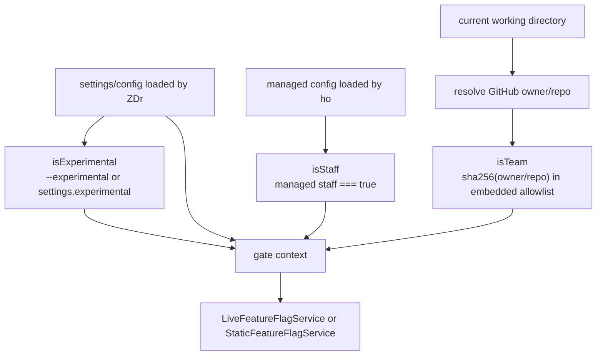
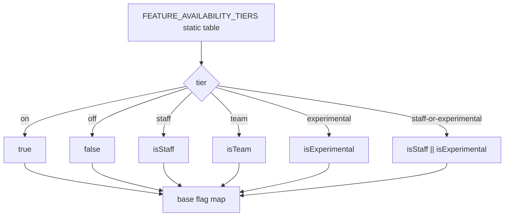
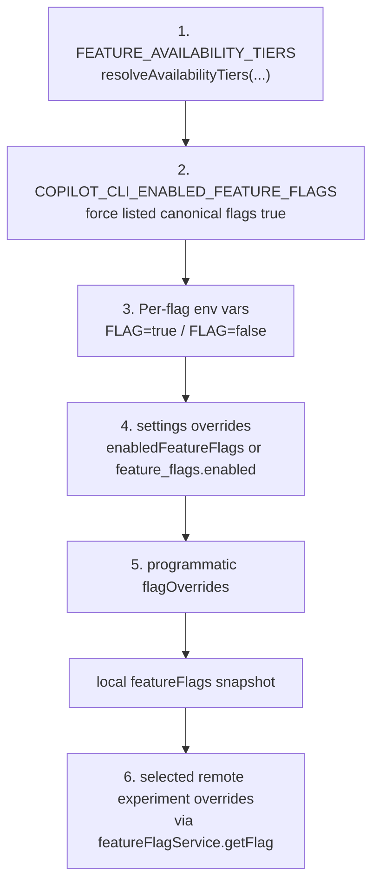
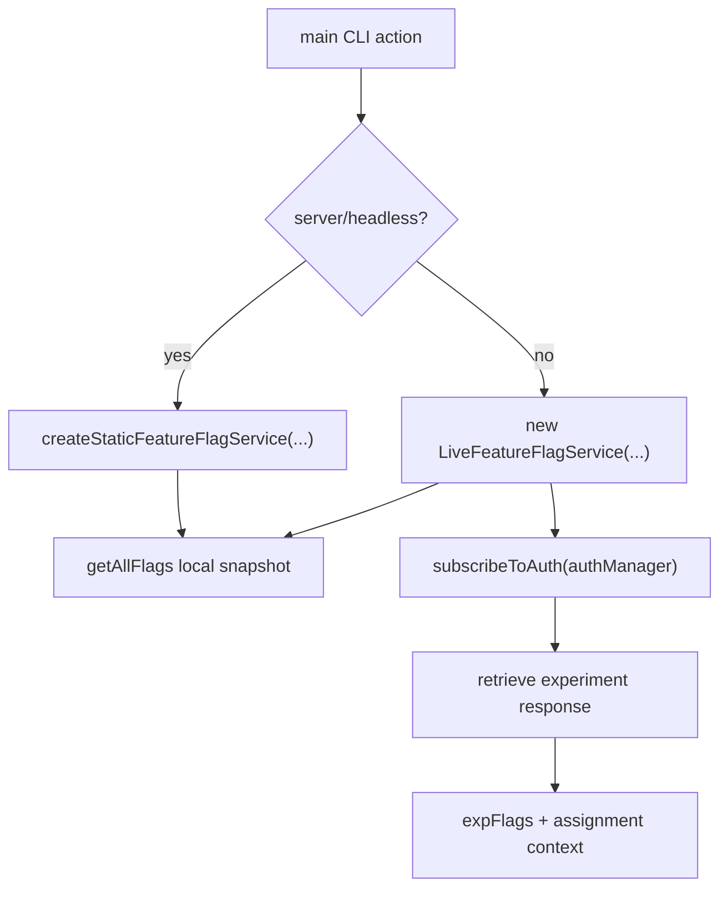
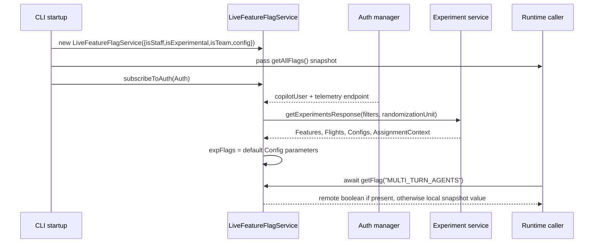
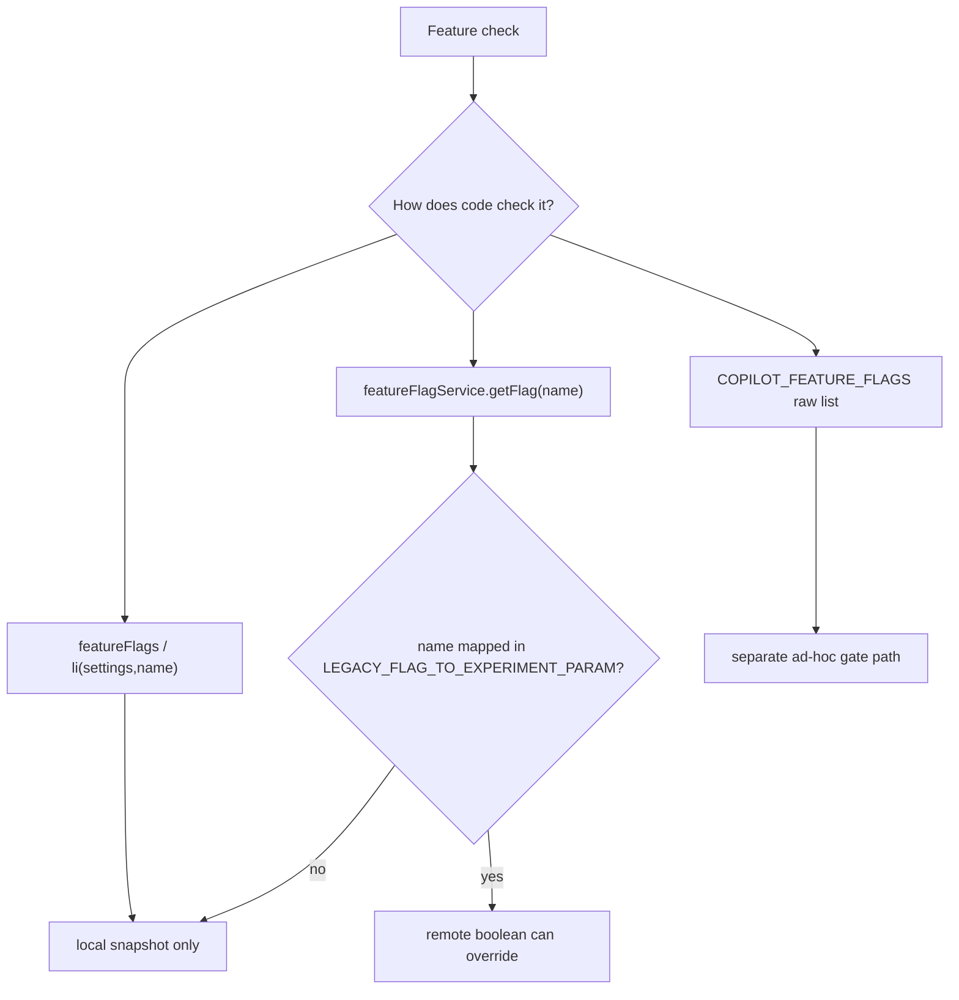
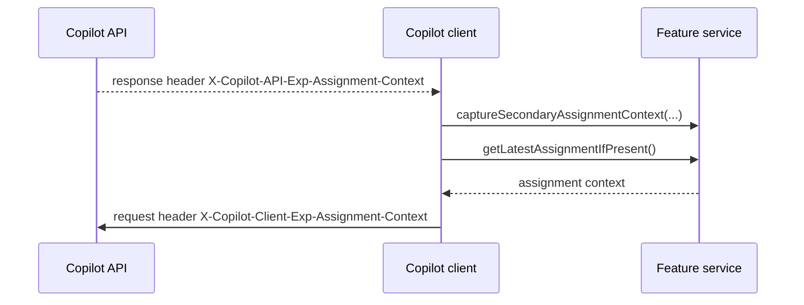
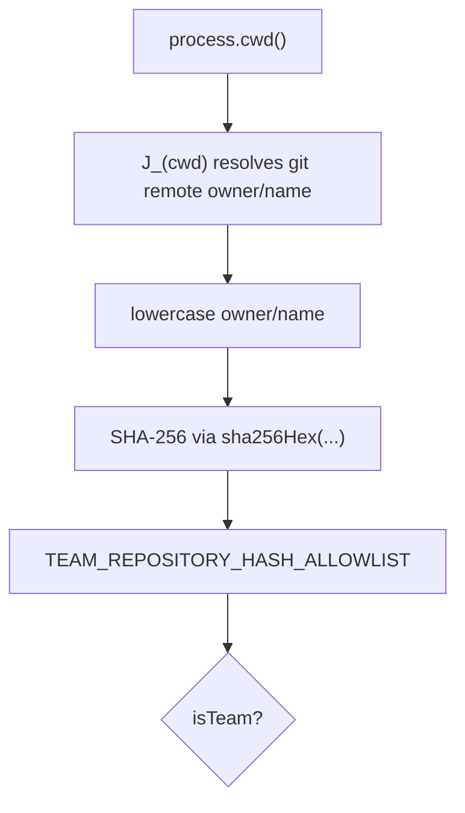
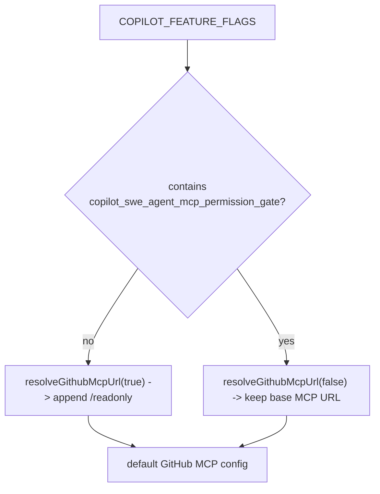

# Feature gates and rollout logic in Copilot CLI

This document explains how “gates” work in the extracted `@github/copilot` CLI bundle. In this bundle, “gate” mostly means **feature availability control**: a feature starts from a built-in availability tier, then can be changed by environment variables, settings, programmatic overrides, and sometimes remote experiment assignment.

There is also one literal MCP permission-gate flag path. That path is covered separately below.

## Source anchors

`app.js` is bundled/minified, so the documentation uses semantic aliases as the primary names and keeps the generated symbols only as version-specific lookup aids for the analyzed `@github/copilot` bundle (they will shift across releases).

| Area | Semantic alias | Minified anchor | Approx. line | What it does |
|---|---|---:|---:|---|
| Settings schema | `enabledFeatureFlags`, `feature_flags.enabled`, `experimental` | same strings | 239 | User/settings-level gate inputs. |
| Low-level feature lookup | `isLocalFeatureFlagEnabled(settings, flagName)` | `li(t,e)` | 239 | Reads `settings.featureFlags[name]` or lowercase equivalent. |
| Static gate table | `FEATURE_AVAILABILITY_TIERS`, `KNOWN_FEATURE_FLAGS`, `DEFAULT_ALWAYS_ON_FLAGS`, `FEATURE_FLAG_DESCRIPTIONS` | `v1e`, `I1e`, `kfe`, `L8r` | 239 | Declares all known CLI feature flags, availability tiers, defaults, and descriptions. |
| Sandbox gate | `SANDBOX` | `SANDBOX:"off"` | 239 | Controls whether the local `/sandbox` slash command is exposed; defaults to off. |
| Tier resolver | `resolveAvailabilityTiers(isStaff,isExperimental,isTeam)` | `bLt(...)` | 239 | Converts `on/off/staff/team/experimental/staff-or-experimental` tiers into booleans. |
| Env overrides | `applyEnvironmentFlagOverrides(flags)` | `ELt(...)` | 239 | Applies `COPILOT_CLI_ENABLED_FEATURE_FLAGS` and per-flag env variables. |
| Settings overrides | `applySettingsFlagOverrides(config, flags)` | `_Lt(...)` | 239 | Applies `enabledFeatureFlags` or legacy `feature_flags.enabled`. |
| Flag name normalization | `normalizeFeatureFlagName(name)` | `ALt(...)` | 239 | Case-insensitive mapping from input name to canonical flag name. |
| Feature service | `LiveFeatureFlagService` | `Pfe` | 239 | Live feature flag service; resolves local gates and remote experiment overrides. |
| Static feature service | `StaticFeatureFlagService`, `createStaticFeatureFlagService(context)` | `ILt`, `X8r(...)` | 239 | Synchronous/static feature service used for server/headless-style paths. |
| Experiment mapping | `LEGACY_FLAG_TO_EXPERIMENT_PARAM` | `Z8r` | 239 | Maps selected legacy feature flags to remote experiment parameter names. |
| Experiment request filters | `buildExperimentRequestFilters(...)` | `W8r(...)` | 239 | Builds TAS/experiment filters from version, audience, opt-in, first launch, plan, etc. |
| Assignment context headers | `captureApiExperimentAssignmentContext(...)`, `API_EXPERIMENT_ASSIGNMENT_CONTEXT_HEADER`, `CLIENT_EXPERIMENT_ASSIGNMENT_CONTEXT_HEADER` | `S3(...)`, `TBn`, `TSe` | 1252 | Captures API assignment context and sends it back on future API calls. |
| Repo/team gate | `isTeamRepositoryAllowlisted(cwd)`, `TEAM_REPOSITORY_HASH_ALLOWLIST`, `sha256Hex(value)` | `W$o(...)`, `w5a`, `xo(...)` | 7441, 926 | Hashes `owner/repo` and checks an embedded allowlist. |
| CLI construction | main `.action(...)` | main `.action(...)` | 8298 | Builds `{isStaff,isExperimental,isTeam,config}` and creates the feature service. |
| MCP permission gate | `hasMcpPermissionGateFlag(env)`, `MCP_PERMISSION_GATE_FLAG`, `resolveGithubMcpUrl(readonly)` | `O7n(...)`, `CUs`, `p5e(...)` | 4207, 1343 | Checks `COPILOT_FEATURE_FLAGS` for `copilot_swe_agent_mcp_permission_gate` and chooses GitHub MCP URL mode. |

## Can the original names be recovered?

Not from this extracted package alone. The published package includes `app.js` but no `app.js.map` or `sourcesContent`, and the only `sourceMappingURL` hits in `app.js` are embedded CSS/vendor artifacts. `package.json` points to `github/copilot-cli` and records build commit `eb38dfb`; exact pre-minification names would require that source tree or a matching sourcemap.

What is recoverable is a set of **semantic names** derived from call sites, data flow, string constants, schemas, and side effects. These should be treated as analysis aliases, not proven source identifiers.

| Semantic alias | Minified anchor | Confidence | Why |
|---|---|---:|---|
| `isLocalFeatureFlagEnabled(settings, flagName)` | `li(t,e)` | High | Reads `settings.featureFlags[flag]` or lowercase equivalent and falls back to `false`. |
| `FEATURE_AVAILABILITY_TIERS` | `v1e` | High | Object mapping feature names to `on`, `off`, `staff`, `team`, `experimental`, etc. |
| `KNOWN_FEATURE_FLAGS` | `I1e` | High | `Object.keys(FEATURE_AVAILABILITY_TIERS)`. |
| `DEFAULT_ALWAYS_ON_FLAGS` or `STATIC_DEFAULT_FLAGS` | `kfe` | Medium | Frozen map where each flag is `true` only when the tier is exactly `on`. Used for reset/default state. |
| `FEATURE_FLAG_DESCRIPTIONS` | `L8r` | High | Human-readable descriptions for selected flags. |
| `normalizeFeatureFlagName(name)` | `ALt(name)` | High | Case-insensitive lookup returning the canonical known feature flag name. |
| `resolveAvailabilityTiers(isStaff,isExperimental,isTeam)` | `bLt(...)` | High | Converts `FEATURE_AVAILABILITY_TIERS` availability tiers into a boolean flag map. |
| `applyEnvironmentFlagOverrides(flags)` | `ELt(flags)` | High | Applies `COPILOT_CLI_ENABLED_FEATURE_FLAGS` and direct per-flag env vars. |
| `applySettingsFlagOverrides(config, flags)` | `_Lt(config, flags)` | High | Applies `enabledFeatureFlags` and legacy `feature_flags.enabled`. |
| `LiveFeatureFlagService` | `Pfe` | High | Maintains local flags, subscribes to auth, fetches experiment assignments, exposes async getters. |
| `StaticFeatureFlagService` | `ILt` | High | Same local resolution surface but no live auth/experiment retrieval; env experiment overrides only. |
| `createStaticFeatureFlagService(context)` | `X8r(context)` | High | Factory returning `new StaticFeatureFlagService(context)`. |
| `LEGACY_FLAG_TO_EXPERIMENT_PARAM` | `Z8r` | High | Maps local feature flag names to experiment parameter names. |
| `buildExperimentRequestFilters(...)` | `W8r(filtersInput)` | Medium-high | Builds TAS filter/randomization-unit payload from CLI version, audience, opt-in, first launch, plan, tracking ID. |
| `resolveExperimentBackedFlag(...)` | `Vf(service, expName, legacyName, fallbackFlags)` | High | Uses `getFlagWithExpOverride` when service exists, otherwise falls back to snapshot flags. |
| `captureApiExperimentAssignmentContext(...)` | `S3(headers, service)` | High | Reads `X-Copilot-API-Exp-Assignment-Context` and stores it on the feature service. |
| `API_EXPERIMENT_ASSIGNMENT_CONTEXT_HEADER` | `TBn` | High | Constant string `X-Copilot-API-Exp-Assignment-Context`. |
| `CLIENT_EXPERIMENT_ASSIGNMENT_CONTEXT_HEADER` | `TSe` | High | Constant string `X-Copilot-Client-Exp-Assignment-Context`. |
| `isTeamRepositoryAllowlisted(cwd)` | `W$o(cwd)` | High | Resolves `owner/repo`, SHA-256 hashes it, checks embedded allowlist. |
| `TEAM_REPOSITORY_HASH_ALLOWLIST` | `w5a` | High | Set of two SHA-256 hashes used by `isTeamRepositoryAllowlisted(...)`. |
| `sha256Hex(value)` | `xo(value)` | High | Uses Node `crypto.createHash("sha256")` and returns hex digest. |
| `hasMcpPermissionGateFlag(env)` | `O7n(env)` | High | Checks raw `COPILOT_FEATURE_FLAGS` for `copilot_swe_agent_mcp_permission_gate`. |
| `MCP_PERMISSION_GATE_FLAG` | `CUs` | High | Constant string `copilot_swe_agent_mcp_permission_gate`. |
| `resolveGithubMcpUrl(readonly)` | `p5e(readonly)` | Medium-high | Builds GitHub MCP URL and appends `/readonly` when requested. |

These aliases are used throughout the diagrams and prose below so the document reads like source-level architecture notes. The `Minified anchor` column remains available for cross-referencing back into the minified bundle.

## Gate inputs

The main CLI action builds the gate context before starting sessions:

The important inputs are:

- `isStaff`: loaded from the CLI’s managed config (`ho.load(...).staff === true`). This is intentionally separate from ordinary user settings.
- `isExperimental`: `--experimental` if provided, otherwise `settings.experimental`, otherwise `false`.
- `isTeam`: a repo allowlist check. `isTeamRepositoryAllowlisted(process.cwd())` resolves the GitHub repo, lowercases `owner/name`, hashes it with SHA-256 via `sha256Hex(...)`, and checks two embedded hashes in `TEAM_REPOSITORY_HASH_ALLOWLIST`.
- `config`: the normal settings object, which can contain explicit feature flag overrides.
- `streamerMode` and auth/user fields: used for remote experiment audience/telemetry context, especially staff audience filters.

## Built-in availability tiers

The table `FEATURE_AVAILABILITY_TIERS` maps each known CLI flag to an availability tier. The resolver `resolveAvailabilityTiers(isStaff,isExperimental,isTeam)` converts those tiers to booleans.

| Tier in `FEATURE_AVAILABILITY_TIERS` | Resolved value |
|---|---|
| `on` | Always `true`. |
| `off` | Always `false`. |
| `staff` | `true` only when `isStaff` is true. |
| `team` | `true` only when `isTeam` is true. |
| `experimental` | `true` only when `isExperimental` is true. |
| `staff-or-experimental` | `true` when either `isStaff` or `isExperimental` is true. |

Examples from the embedded table:

| Flag | Tier | Meaning in this bundle |
|---|---|---|
| `SESSION_STORE` | `on` | Local session store support is always enabled. |
| `MCP_TASKS` | `experimental` | MCP task protocol support only appears in experimental mode or explicit overrides. |
| `MULTI_TURN_AGENTS` | `experimental` | Multi-turn subagents require experimental/override/experiment enablement. |
| `copilot-feature-agentic-memory` | `on` | Enables the service-backed agentic memory path unless the explicit disabled flag is set. |
| `copilot-feature-agentic-memory-disabled` | `off` | Explicitly disables the cloud memory path when enabled. |
| `copilot_feature_agentic_memory_user_scoped` | `staff` | Allows user-scoped memory behavior when no repository scope is available. |
| `COPILOT_SUBCONSCIOUS` | `team` | Enables the dynamic context board, `rem-agent`, `/subconscious`, and shutdown consolidation paths. |
| `BACKGROUND_SESSIONS` | `staff-or-experimental` | Enabled for staff or experimental mode. |
| `REMOTE_KICKSTART` | `team` | Requires the hashed repo/team allowlist unless explicitly overridden. |
| `STATUS_LINE` | `experimental` | Custom status line is experimental. |
| `SANDBOX` | `off` | Hides the local `/sandbox` command unless explicitly enabled by gate overrides. |
| `CLOUD_SESSION_STORE` | `staff` | Staff-gated cloud session store. |
| `TOOL_SEARCH` | `off` | Disabled by default. |

## Override precedence

After the tier resolver builds a base flag map, later sources can override it.

The practical precedence is:

1. **Static tier defaults** from `FEATURE_AVAILABILITY_TIERS`, resolved by `resolveAvailabilityTiers(...)`.
2. **`COPILOT_CLI_ENABLED_FEATURE_FLAGS`**: comma-separated canonical flag names, normalized with `normalizeFeatureFlagName(...)`, force flags on.
3. **Per-flag environment variables**: each canonical flag name can be set directly, for example `MCP_TASKS=true` or `MULTI_TURN_AGENTS=false`.
4. **Settings overrides**:
   - `enabledFeatureFlags`: map of feature name to boolean.
   - `feature_flags.enabled`: legacy/list style that only turns flags on.
5. **Programmatic `flagOverrides`** supplied to the feature service.
6. **Remote experiment override** for flags listed in `LEGACY_FLAG_TO_EXPERIMENT_PARAM`, but only when callers ask the service asynchronously through `getFlag(...)` / `getFlagWithExpOverride(...)` / helper methods.

One subtle but important point: `getAllFlags()` returns the local resolved snapshot. It does **not** wait for remote experiment assignment. Runtime code that needs experiment-aware values must call the feature service.

## Live vs static feature service

There are two feature-service implementations:

| Service | Created by | Behavior |
|---|---|---|
| `LiveFeatureFlagService` | `new LiveFeatureFlagService(context)` | Live service used in normal CLI modes. It resolves local flags immediately, subscribes to auth changes, fetches remote experiment assignments, and notifies listeners. |
| `StaticFeatureFlagService` | `createStaticFeatureFlagService(context)` | Static service used when the CLI starts server/headless-style paths. It resolves immediately from local settings/env plus explicit experiment env overrides and does not fetch remote assignments. |

## Remote experiment flow

The `LiveFeatureFlagService` starts with local flags, then waits for authentication. On auth changes:

1. If there is no Copilot user, telemetry endpoint, or tracking ID, it resets remote experiment state.
2. It builds filters with `buildExperimentRequestFilters(...)`, including:
   - CLI version;
   - prerelease status;
   - audience (`github`, `microsoft`, or `external`-style categorization);
   - experimental opt-in;
   - extension/client name (`CopilotCLI`);
   - first-launch timestamp;
   - Copilot plan.
3. It calls the experiment/TAS client.
4. It extracts parameters from the `default` config in the response.
5. It stores assignment context and wakes waiters.
6. `getFlag(...)` can use those experiment parameters to override selected legacy feature flags.

Flags in the `LEGACY_FLAG_TO_EXPERIMENT_PARAM` mapping can be remote-overridden. Examples include:

- `GPT_FOR_SUBAGENTS`;
- `GPT_5_4_MINI_FOR_EXPLORE`;
- `DYNAMIC_INSTRUCTIONS_RETRIEVAL`;
- `SKILLS_INSTRUCTIONS`;
- `WEBSOCKET_RESPONSES`;
- `RUBBER_DUCK_AGENT`;
- `REPLACEMENT_BLOCKS`;
- `MULTI_TURN_AGENTS`;
- `SESSION_BASED_SUBAGENTS`.

Other flags are local/snapshot-only unless some specific code path reads a different raw flag source.

## Snapshot gates vs service gates

The bundle uses two styles of checks:

| Style | Example | Behavior |
|---|---|---|
| Snapshot lookup | `isLocalFeatureFlagEnabled(settings, "MCP_TASKS")` or `featureFlags.MCP_TASKS` | Uses the local `featureFlags` object already merged into runtime settings. No remote wait. |
| Service lookup | `await featureFlagService.getFlag("REPLACEMENT_BLOCKS")` | Can wait for remote experiment assignment and use mapped experiment overrides. |
| Helper wrapper | `resolveExpFlag(expName, legacyName)` | Calls `resolveExperimentBackedFlag(...)`, which uses `featureFlagService.getFlagWithExpOverride(...)` when available, otherwise falls back to snapshot flags. |
| Raw environment lookup | `COPILOT_FEATURE_FLAGS` parsing | Separate from canonical CLI gate service; used by some agent/MCP-specific paths. |

Representative examples:

- `MULTI_TURN_AGENTS`: background task/subagent paths call `resolveExpFlag("copilot_cli_multi_turn_agents", "MULTI_TURN_AGENTS")`, so this can be experiment-aware.
- `DYNAMIC_INSTRUCTIONS_RETRIEVAL`: resolved through `resolveExpFlag(...)`, then additional runtime eligibility checks decide whether embedding retrieval actually starts.
- `MCP_TASKS`: MCP client capabilities check `isLocalFeatureFlagEnabled(settings, "MCP_TASKS")`, so it behaves like a local snapshot/settings gate in the observed path.
- `SHELL_ERROR_CLASSIFICATION`: shell tools call `featureFlagService.getFlag("SHELL_ERROR_CLASSIFICATION")`; if there is no experiment mapping for that flag, it returns the local resolved value.
- `REMOTE_KICKSTART`: background remote session start checks `featureFlagService.getFlag("REMOTE_KICKSTART")`; in the static table it is `team` gated.
- `SANDBOX`: the slash-command builder receives `sandboxEnabled` and exposes `/sandbox` only when this local gate is true. The command then toggles `settings.sandbox.enabled`; see [`sandboxing.md`](../05-security-and-policy/sandboxing.md).
- Agentic memory and subconscious behavior combine service flags, local settings, repository/user scope, and sidekick gates; see [`memory-and-context-board.md`](../02-context-and-input/memory-and-context-board.md) for the dedicated memory flow.

## Assignment-context headers

The experiment system also carries assignment context through API headers:

- API responses may include `X-Copilot-API-Exp-Assignment-Context`.
- `captureApiExperimentAssignmentContext(headers, featureFlagService)` captures that value into the service as a secondary assignment context.
- Copilot API clients send `X-Copilot-Client-Exp-Assignment-Context` on future requests when an assignment context is present.

This header path is about experiment assignment continuity and telemetry/request context. It is not the same as directly flipping the local `featureFlags` snapshot.

## The repo/team gate

The `team` tier is not a generic account/team API check in this bundle. It is a repository allowlist:

`isTeamRepositoryAllowlisted(...)` returns `true` only if the current repository hashes to one of the embedded values. Team-tier flags such as `REMOTE_KICKSTART`, `GH_CLI_OVER_MCP`, `NATIVE_CURSOR`, and `SHELL_SPAWN_BACKEND` therefore default on only in those allowlisted repositories, unless explicitly overridden by env/settings/programmatic overrides.

## The literal MCP permission gate

There is a separate raw env gate named `copilot_swe_agent_mcp_permission_gate`:

- `hasMcpPermissionGateFlag(process.env)` checks whether `COPILOT_FEATURE_FLAGS` contains `copilot_swe_agent_mcp_permission_gate`, case-insensitively.
- GitHub MCP configuration calls `resolveGithubMcpUrl(!hasMcpPermissionGateFlag(process.env))`.
- `resolveGithubMcpUrl(true)` appends `/readonly` to the GitHub MCP URL.
- Therefore, when the permission gate flag is **absent**, the default GitHub MCP endpoint is forced to readonly mode.
- When the permission gate flag is **present**, the default GitHub MCP URL is not rewritten to `/readonly` by that helper.

This path is intentionally separate from `COPILOT_CLI_ENABLED_FEATURE_FLAGS` and the canonical `FEATURE_AVAILABILITY_TIERS` table. It is an ad-hoc raw environment gate used by MCP setup.

The generic permission service, including how MCP tool requests are approved or denied after they are available, is covered in [`permission-system-design.md`](../05-security-and-policy/permission-system-design.md).

## How gates affect behavior

Gates in this bundle generally do one of four things:

1. **Expose or hide UI/runtime features** — for example status line, voice, prompt frame, background sessions, and `/sandbox`.
2. **Enable tool/runtime capabilities** — for example MCP Tasks, shell spawn backend, focused tools, sidekick/context agents.
3. **Change model/tool prompt content** — for example removing cwd listing, removing parallel-tool prompt text, adding subagent parallelism prompts.
4. **Select implementation paths** — for example WebSocket responses, dynamic instruction retrieval, session-based subagents, multi-turn agents.

The gate usually does not perform permission enforcement by itself. Permission enforcement is handled later by the permissions/rules layer, MCP tool allowlists, auth checks, path/url guards, and tool callbacks. A feature gate decides whether code paths and tools are available; permission gates decide whether an available tool call may run.

## Key takeaways

- The main gate table is `FEATURE_AVAILABILITY_TIERS`; it defines *availability tiers*, not just booleans.
- `resolveAvailabilityTiers(...)` converts availability tiers into local booleans from `isStaff`, `isExperimental`, and `isTeam`.
- `isTeam` is a hashed current-repository allowlist.
- Env/settings/programmatic overrides can force local gate values.
- Remote experiment assignment only affects flags read through the feature-flag service and mapped in `LEGACY_FLAG_TO_EXPERIMENT_PARAM`.
- `getAllFlags()` is a local snapshot; `featureFlagService.getFlag(...)` can be remote/experiment-aware.
- `COPILOT_CLI_ENABLED_FEATURE_FLAGS` and `COPILOT_FEATURE_FLAGS` are different mechanisms in this bundle.
- `SANDBOX` is a local gate for exposing `/sandbox`; it is not the same as the hidden `--cloud` cloud-session feature.
- The MCP permission gate is a raw `COPILOT_FEATURE_FLAGS` check that controls whether the default GitHub MCP URL is readonly.

Related docs: [`sandboxing.md`](../05-security-and-policy/sandboxing.md), [`permission-system-design.md`](../05-security-and-policy/permission-system-design.md), [`sessions-remote-cloud.md`](../03-sessions-and-remote/sessions-remote-cloud.md), and [Main feature map](../00-overview/main-feature-map.md).
