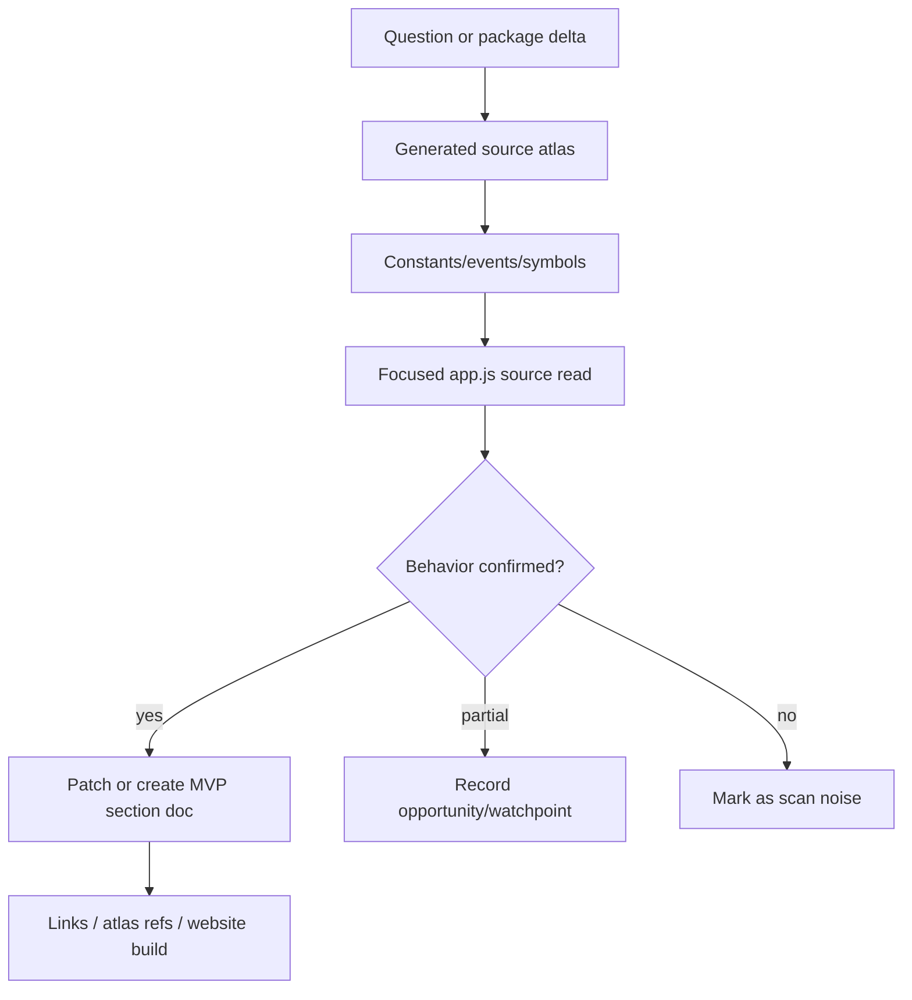

# Research atlas

This appendix keeps discovery machinery separate from the main runtime narrative. Use it when you are starting from a raw constant, event name, minified symbol, slash command, feature key, source-atlas diff, or documentation backlog item.

The atlas is a triage layer, not proof. Promote a finding into the main MVP sections only after a focused source read confirms behavior.

## Source-anchor policy

This page is a research guide. Linked pages and generated artifacts carry the concrete anchors.

| Semantic alias | Minified anchor | Scope |
|---|---|---|
| Research atlas chapter | N/A — navigation page | Groups generated source indexes, constants-first discovery, methodology notes, and follow-up candidates. |
| Atlas/research pages | See linked topic pages and `source-atlas/` | Concrete bundle anchors and generated inventories live in destination artifacts. |

## Research workflow

## Primary reading order

| Order | Page or artifact | Research question answered |
|---:|---|---|
| 1 | [`app.js` source atlas and generated indexes](app-js-source-atlas.md) | How are raw symbol/string inventories generated, and which semantic anchors seed source reading? |
| 2 | [Hosted agent environment](../05-hosted-agent-ops/hosted-agent-environment.md) | What does a promoted constants-first finding look like once source-confirmed? |
| 3 | [Further documentation opportunities](documentation-opportunities.md) | Which historical scan results are closed, narrowed, or still useful as future watchpoints? |
| 4 | `source-atlas/README.md` | Generated atlas output checked into the repository root. |

## When to use this appendix

| Starting point | Use this path |
|---|---|
| Raw env var or event string | `source-atlas/constants.md` → [app.js source atlas](app-js-source-atlas.md) → focused source read. |
| New package/bundle diff | Regenerate or compare `source-atlas/` → inspect changed strings/events/API surfaces → patch affected MVP docs. |
| Minified symbol with unclear role | `source-atlas/symbols.md` / `declarations.json` → nearby source anchors → existing semantic page. |
| Documentation gap | [Further documentation opportunities](documentation-opportunities.md) → relevant MVP section → source-confirmed update. |

## Promotion rules

- Treat generated atlas hits as leads, not behavioral proof.
- Add or update a main section page only when the source path confirms behavior.
- Keep constants-only or bundled-SDK-only observations as watchpoints unless runtime wiring is confirmed.
- After promoted findings, update relevant section README files, `docs/SUMMARY.md`, `docs/README.md`, atlas seeds when appropriate, and the website build.

## Navigation

- [Start here](../00-start-here/README.md)
- [Full table of contents](../SUMMARY.md)
