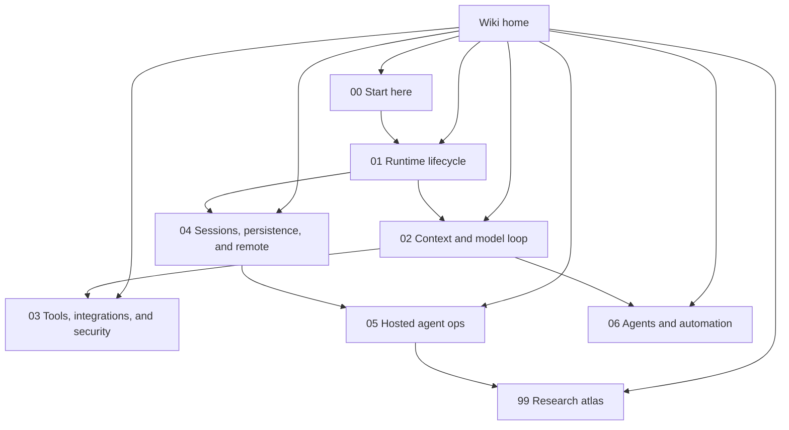

# Copilot CLI `app.js` reverse-engineering wiki

This wiki documents the extracted `@github/copilot` CLI bundle with source-anchored implementation notes. The analyzed artifact is:

`copilot-cli-pkg/app.js`

The MVP information architecture is organized around the shortest useful reader journey for understanding a coding-agent runtime. The MVP sections below are both the physical layout and the canonical reader path.

Because `app.js` is bundled/minified, symbol names are unstable. Source anchors are intended for searching the analyzed bundle, not as public API names.

## Semantic alias and minified anchor mapping

This home page is a navigation index, not a direct `app.js` implementation analysis. Concrete topic pages map stable semantic aliases to version-specific minified anchors.

| Semantic alias | Minified anchor | Scope |
|---|---|---|
| Wiki home | N/A — navigation page | Orients readers to the MVP sections and reading paths. |
| MVP section indexes | N/A — see linked section README pages | Curated reader routes through source-anchored implementation pages. |
| Topic implementation pages | See page-level source anchor tables | Bundle-specific anchors live in focused implementation documents. |

## MVP wiki map

## MVP sections

| Section | Purpose |
|---|---|
| [Start here](00-start-here/README.md) | Minimal orientation: what the bundle is, how to read minified anchors, and the first path through the runtime. |
| [Runtime lifecycle](01-runtime-lifecycle/README.md) | Loader/bootstrap, root command routing, TUI/headless/server/ACP modes, terminal/runtime support, and shutdown. |
| [Context and model loop](02-context-model-loop/README.md) | Prompt/context assembly, attachments, memory, compaction, provider routing, retries, quota, and usage accounting. |
| [Tools, integrations, and security](03-tools-integrations-security/README.md) | Runtime tool assembly/execution, MCP/plugins/SDK/IDE/web bridges, permissions, redaction, hooks, sandboxing, and persistent policy. |
| [Sessions, persistence, and remote](04-sessions-persistence-remote/README.md) | Event-sourced sessions, replay, SessionFs, SQLite/FTS, fork/rewind, UI projection, repository context, and remote control. |
| [Hosted agent ops](05-hosted-agent-ops/README.md) | Hosted job environment, `COPILOT_AGENT_*` settings, hosted MCP/OIDC bootstrap, firewall/trajectory outputs, debug bundles, OTel, and feature gates. |
| [Agents and automation](06-agents-automation/README.md) | Built-in/custom agents, task/subagent orchestration, autopilot/no-ask-user, fleet mode, and scheduled prompts. |
| [Research atlas](99-research-atlas/README.md) | Generated source indexes, constants-first discovery, methodology notes, and future watchpoints. |

## Recommended reading paths

| Goal | Read this path |
|---|---|
| Get oriented quickly | [Start here](00-start-here/README.md) → [Runtime lifecycle](01-runtime-lifecycle/README.md) → [Context and model loop](02-context-model-loop/README.md) |
| Understand one complete agent turn | [Runtime lifecycle](01-runtime-lifecycle/README.md) → [Context and model loop](02-context-model-loop/README.md) → [Tools, integrations, and security](03-tools-integrations-security/README.md) |
| Understand durable sessions | [Sessions, persistence, and remote](04-sessions-persistence-remote/README.md) → [End-to-end session lifecycle](04-sessions-persistence-remote/session-lifecycle-end-to-end.md) → [Persistence pipeline](04-sessions-persistence-remote/persistence-pipeline.md) |
| Understand hosted/cloud coding-agent behavior | [Hosted agent ops](05-hosted-agent-ops/README.md) → [Hosted agent environment](05-hosted-agent-ops/hosted-agent-environment.md) → [Remote control implementation](04-sessions-persistence-remote/remote-control-implementation.md) |
| Review trust boundaries | [Tools, integrations, and security](03-tools-integrations-security/README.md) → [Permission system design](03-tools-integrations-security/permission-system-design.md) → [Content exclusion and redaction](03-tools-integrations-security/content-exclusion-and-redaction.md) → [Debug bundle redaction boundaries](05-hosted-agent-ops/debug-bundle-redaction-boundaries.md) |
| Study automation and subagents | [Agents and automation](06-agents-automation/README.md) → [Agent and task orchestration](06-agents-automation/agent-task-orchestration.md) → [Built-in agents](06-agents-automation/built-in-agents.md) |
| Triage a raw constant or minified symbol | [Research atlas](99-research-atlas/README.md) → [`app.js` source atlas](99-research-atlas/app-js-source-atlas.md) → generated `source-atlas/` outputs in the repository root. |

## Cross-cutting implementation matrix

| Concern | Primary MVP section | Supporting sections |
|---|---|---|
| Runtime mode selection | [Runtime lifecycle](01-runtime-lifecycle/README.md) | [Start here](00-start-here/README.md), [Sessions, persistence, and remote](04-sessions-persistence-remote/README.md) |
| Context engineering | [Context and model loop](02-context-model-loop/README.md) | [Agents and automation](06-agents-automation/README.md), [Tools, integrations, and security](03-tools-integrations-security/README.md) |
| Tool execution | [Tools, integrations, and security](03-tools-integrations-security/README.md) | [Hosted agent ops](05-hosted-agent-ops/README.md), [Agents and automation](06-agents-automation/README.md) |
| Session/event lifecycle | [Sessions, persistence, and remote](04-sessions-persistence-remote/README.md) | [Runtime lifecycle](01-runtime-lifecycle/README.md), [Hosted agent ops](05-hosted-agent-ops/README.md) |
| Hosted coding-agent operation | [Hosted agent ops](05-hosted-agent-ops/README.md) | [Sessions, persistence, and remote](04-sessions-persistence-remote/README.md), [Tools, integrations, and security](03-tools-integrations-security/README.md) |
| Permissions and redaction | [Tools, integrations, and security](03-tools-integrations-security/README.md) | [Hosted agent ops](05-hosted-agent-ops/README.md), [Context and model loop](02-context-model-loop/README.md) |
| Subagents and automation | [Agents and automation](06-agents-automation/README.md) | [Context and model loop](02-context-model-loop/README.md), [Sessions, persistence, and remote](04-sessions-persistence-remote/README.md) |
| Source discovery and diff triage | [Research atlas](99-research-atlas/README.md) | All MVP sections after findings are confirmed. |

## Implementation page inventory

For a compact full table of contents, see [SUMMARY.md](SUMMARY.md). The detailed source-anchored pages remain intentionally focused inside the MVP section directories; section indexes explain how to read them in order.

## Naming and maintenance conventions

| Area | Convention |
|---|---|
| Canonical reader path | Use the MVP section directories (`00-start-here` through `99-research-atlas`). |
| Deep implementation pages | Keep focused pages source-anchored; move or merge them only when the page scope changes, not merely to chase numbering. |
| Topic titles | Prefer reader-facing titles over historical source filenames. Keep `app.js` in the title only when the page is specifically about bundle-level behavior. |
| Adding pages | Add the page under the closest MVP section when it is part of the main reader path; use Research atlas for raw discovery notes and watchpoints. |
| Link text | Use human-readable page titles in prose; reserve raw filenames for maintenance tables. |

## Important caveat

These pages document a bundled/minified production artifact, not clean source. Semantic names in prose and diagrams are explanatory aliases. Generated/minified symbols are retained only when useful as search anchors for the analyzed bundle.

## Author

This wiki was created and is maintained by **Yingting Huang**.
