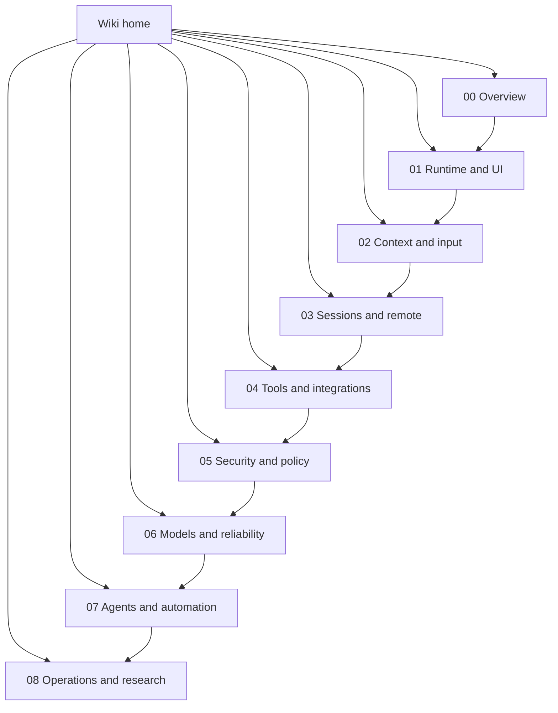

# Copilot CLI `app.js` reverse-engineering wiki

This wiki organizes the implementation notes for the extracted `@github/copilot` CLI bundle around reader journeys instead of a flat list of files. The analyzed artifact is:

`copilot-cli-pkg/app.js`

The docs are based on static inspection of the extracted package, command/help output, string/anchor extraction, and script-assisted scans. Because `app.js` is bundled/minified, symbol names are unstable; source anchors are intended for searching the analyzed bundle, not as public API names.

## Semantic alias and minified anchor mapping

This home page is a navigation index, not a direct `app.js` implementation analysis. Concrete topic pages map stable semantic aliases to version-specific minified anchors.

| Semantic alias | Minified anchor | Scope |
|---|---|---|
| Wiki home | N/A — navigation page | Orients readers to sections and reading paths. |
| Section indexes | N/A — see linked section README pages | Each section index points to topic pages with concrete mappings. |
| Topic implementation pages | See page-level `Minified anchor` tables | Bundle-specific anchors live in the focused implementation documents. |

## Wiki map

## Sections

| Section | Purpose | Pages |
|---|---|---:|
| [Overview](./00-overview/README.md) | Start here: what the extracted bundle is, how to read the docs, the high-level feature map, and the context/harness engineering split. | 2 |
| [Runtime and UI](./01-runtime-and-ui/README.md) | Bootstrap, root command routing, interactive TUI, terminal ergonomics, voice mode, protocol server modes, and rendering support. | 7 |
| [Context and input](./02-context-and-input/README.md) | Everything that becomes model-visible context: prompts, custom instructions, attachments, memory, compaction, and rewind boundaries. | 7 |
| [Sessions and remote](./03-sessions-and-remote/README.md) | Local event-sourced sessions, cloud/remote control, SQLite indexing, UI projection, repository metadata, and Mission Control steering. | 7 |
| [Tools and integrations](./04-tools-and-integrations/README.md) | Built-in tools, validation/review tools, MCP, plugins, IDE/LSP/editor bridges, web access, and integration overview surfaces. | 9 |
| [Security and policy](./05-security-and-policy/README.md) | Permissions, content exclusion, hooks, sandboxing, and persistent policy/configuration state. | 6 |
| [Models and reliability](./06-models-and-reliability/README.md) | Authentication, provider selection, wire APIs, resilience, rate limits, usage metrics, quota, and billing. | 4 |
| [Agents and automation](./07-agents-and-automation/README.md) | Task orchestration, subagents, autopilot, fleet mode, and scheduled prompt/command automation. | 4 |
| [Operations and research](./08-operations-and-research/README.md) | Feature gates, diagnostics, debug bundles, observability/update/shutdown, and the original documentation backlog. | 4 |

## Naming and maintenance conventions

| Area | Convention |
|---|---|
| Section directories | Numbered prefixes preserve a stable reading order while keeping related pages together. |
| Topic filenames | Use short lower-kebab-case wiki slugs. Rename only when a page's scope changes, not just because a title is reworded. |
| Topic titles | Prefer reader-facing titles over historical source filenames. Keep `app.js` in the title only when the page is specifically about bundle-level behavior. |
| Merging pages | Merge only when two pages describe the same lifecycle or runtime boundary. Otherwise keep focused implementation pages and connect them through section indexes. |
| Adding pages | Add the page under the closest section, then update that section `README.md`, the root page index, and `SUMMARY.md`. |
| Link text | Use human-readable page titles in prose; reserve raw filenames for tables or maintenance notes. |

## Recommended reading paths

| Goal | Read this path |
|---|---|
| Get oriented quickly | [Overview](./00-overview/README.md) → [Runtime and UI](./01-runtime-and-ui/README.md) → [Context and input](./02-context-and-input/README.md) |
| Separate context engineering from harness engineering | [Main feature map](./00-overview/main-feature-map.md) → [Context and input](./02-context-and-input/README.md) → [Tools and integrations](./04-tools-and-integrations/README.md) → [Security and policy](./05-security-and-policy/README.md) |
| Understand local/remote session behavior | [Sessions and remote](./03-sessions-and-remote/README.md) → [Operations and research](./08-operations-and-research/README.md) |
| Trace a model request end to end | [Context and input](./02-context-and-input/README.md) → [Tools and integrations](./04-tools-and-integrations/README.md) → [Models and reliability](./06-models-and-reliability/README.md) |
| Review safety and trust boundaries | [Security and policy](./05-security-and-policy/README.md) → [Tools and integrations](./04-tools-and-integrations/README.md) → [Operations and research](./08-operations-and-research/README.md) |
| Study automation and subagents | [Context and input](./02-context-and-input/README.md) → [Agents and automation](./07-agents-and-automation/README.md) → [Sessions and remote](./03-sessions-and-remote/README.md) |

## Cross-cutting implementation matrix

| Concern | Primary section | Key supporting sections |
|---|---|---|
| Context engineering | [Context and input](./02-context-and-input/README.md) | [Overview](./00-overview/main-feature-map.md), [Models and reliability](./06-models-and-reliability/README.md), [Agents and automation](./07-agents-and-automation/README.md) |
| Harness engineering | [Runtime and UI](./01-runtime-and-ui/README.md) | [Tools and integrations](./04-tools-and-integrations/README.md), [Security and policy](./05-security-and-policy/README.md), [Agents and automation](./07-agents-and-automation/README.md) |
| Prompt/context assembly | [Context and input](./02-context-and-input/README.md) | [Tools and integrations](./04-tools-and-integrations/README.md), [Models and reliability](./06-models-and-reliability/README.md) |
| Session/event lifecycle | [Sessions and remote](./03-sessions-and-remote/README.md) | [Runtime and UI](./01-runtime-and-ui/README.md), [Operations and research](./08-operations-and-research/README.md) |
| Tool execution | [Tools and integrations](./04-tools-and-integrations/README.md) | [Security and policy](./05-security-and-policy/README.md), [Agents and automation](./07-agents-and-automation/README.md) |
| Permissions and redaction | [Security and policy](./05-security-and-policy/README.md) | [Context and input](./02-context-and-input/README.md), [Tools and integrations](./04-tools-and-integrations/README.md) |
| Model routing and quota | [Models and reliability](./06-models-and-reliability/README.md) | [Operations and research](./08-operations-and-research/README.md) |
| Remote/cloud operation | [Sessions and remote](./03-sessions-and-remote/README.md) | [Runtime and UI](./01-runtime-and-ui/README.md), [Security and policy](./05-security-and-policy/README.md) |

## Complete page index

| Section | Page | Covers |
|---|---|---|
| Overview | [`app.js` overview](./00-overview/what-is-app-js.md) | Bundle identity, responsibilities, and caveats. |
| Overview | [Main feature map for Copilot CLI](./00-overview/main-feature-map.md) | High-level map of feature areas, runtime ownership, context engineering, and harness engineering. |
| Runtime and UI | [Loader and bootstrap workflows](./01-runtime-and-ui/loader-bootstrap.md) | SEA/npm loader chain, restart wrapper, secure module loading, and bootstrap safeguards. |
| Runtime and UI | [CLI runtime workflows](./01-runtime-and-ui/cli-runtime-workflows.md) | Root CLI routing, pre-action setup, prompt/headless/server dispatch, and session resolution. |
| Runtime and UI | [Interactive TUI and slash-command workflows](./01-runtime-and-ui/tui-and-slash-commands.md) | Interactive TUI event loop, dialogs, slash command macros, and permission surfaces. |
| Runtime and UI | [Terminal setup and shell environment](./01-runtime-and-ui/terminal-setup-and-shell-environment.md) | Terminal detection, Shift+Enter setup, shell context, and command-history state. |
| Runtime and UI | [Voice mode and Foundry Local](./01-runtime-and-ui/voice-mode-foundry-local.md) | Foundry Local dictation runtime, voice settings, native audio modules, and model cache checks. |
| Runtime and UI | [Embedded server, ACP, and JSON-RPC protocol](./01-runtime-and-ui/embedded-server-acp-protocol.md) | JSON-RPC/ACP server modes, external tool calls, elicitation, sampling, and commands. |
| Runtime and UI | [Tree-sitter WASM usage in the Copilot CLI](./01-runtime-and-ui/tree-sitter-wasm-usage.md) | Packaged Tree-sitter grammars, highlight queries, rich diff rendering, and fallback behavior. |
| Context and input | [Prompt sources in Copilot CLI](./02-context-and-input/prompt-sources.md) | Static/runtime prompt sources, YAML package prompts, instructions, MCP prompts, hooks, and provider mapping. |
| Context and input | [`app.js` prompt catalog](./02-context-and-input/app-js-prompt-catalog.md) | Curated extracted prompts from `app.js`, normalized placeholders, prompt families, and system prompt composition workflows. |
| Context and input | [Custom agents and skills packaging](./02-context-and-input/custom-agents-and-skills-packaging.md) | AGENTS.md, SKILL.md, built-in skills, plugin/remote/provided agents, skill directories, skill invocation, allowed-tools, and enable/disable events. |
| Context and input | [Attachment and file-ingestion pipeline](./02-context-and-input/attachments-and-file-ingestion.md) | Native image/document attachments, tagged-file fallback, MIME detection, payload mapping, and limits. |
| Context and input | [Memory and dynamic context board in Copilot CLI](./02-context-and-input/memory-and-context-board.md) | Agentic memory API, local memory, dynamic context board, rem-agent, sidekicks, and shutdown consolidation. |
| Context and input | [Conversation compaction and memory compression in Copilot CLI](./02-context-and-input/conversation-compaction.md) | /compact, automatic compaction, request-time prompt trimming, summary replacement, checkpoints, hooks, telemetry, and UI status. |
| Context and input | [Checkpoints, undo, rewind, and fork](./02-context-and-input/checkpoints-undo-rewind.md) | /undo, /rewind, /fork, event-log truncation/replay, snapshot_rewind, and workspace events. |
| Sessions and remote | [Session support implementation in the Copilot CLI](./03-sessions-and-remote/session-support-implementation.md) | Event-sourced local persistence, workspace artifacts, startup resolution, APIs, and handoff behavior. |
| Sessions and remote | [API and session event schema contracts](./03-sessions-and-remote/api-and-session-event-schemas.md) | JSON-RPC and session event schemas, SDK generation surfaces, event envelopes, and `app.js` forwarding/replay cross-checks. |
| Sessions and remote | [Session, remote, cloud, and history workflows](./03-sessions-and-remote/sessions-remote-cloud.md) | Resume/continue/name handling, background sessions, cloud sessions, remote steering, and history. |
| Sessions and remote | [Session-store SQLite indexing](./03-sessions-and-remote/session-store-sqlite-indexing.md) | session-store.db schema, FTS/search, /reindex, Chronicle, refs, cloud sync, and backfill. |
| Sessions and remote | [System events and UI projection](./03-sessions-and-remote/system-events-and-ui-projection.md) | System messages, notifications, info/warning/error events, timeline entries, and ephemeral UI projection. |
| Sessions and remote | [Git, repository, PR, and ref context](./03-sessions-and-remote/git-repository-context.md) | Git root/branch/head/base detection, session refs, PR context, and GitHub MCP overlap. |
| Sessions and remote | [Remote control implementation in Copilot CLI](./03-sessions-and-remote/remote-control-implementation.md) | Mission Control exporter, command polling, /remote, permission bridging, and remote task attach. |
| Tools and integrations | [Built-in tool execution pipeline](./04-tools-and-integrations/built-in-tool-execution-pipeline.md) | Tool registration, model-visible schemas, permission/hook flow, execution events, streaming, and telemetry. |
| Tools and integrations | [Runtime tool assembly and filtering](./04-tools-and-integrations/runtime-tool-assembly-and-filtering.md) | Session options, model config, MCP, external tools, custom agents, allow/exclude filters, deferred tool search, and final model-visible toolsets. |
| Tools and integrations | [Shell command execution lifecycle](./04-tools-and-integrations/shell-command-execution-lifecycle.md) | Bash/PowerShell tool assembly, PTY vs process backends, sync/async/detached commands, shell task tracking, background promotion, and large-output handling. |
| Tools and integrations | [Coding-agent validation and review toolchain](./04-tools-and-integrations/coding-agent-validation-toolchain.md) | `parallel_validation`, `code_review`, CodeQL, secret scanning, advisory checks, trivial-change declarations, budgets, and validation telemetry. |
| Tools and integrations | [MCP support implementation in the Copilot CLI](./04-tools-and-integrations/mcp-support-implementation.md) | MCP config discovery, transports, host lifecycle, tool exposure, OAuth, permissions, and tasks. |
| Tools and integrations | [Plugin and extension architecture](./04-tools-and-integrations/plugin-extension-architecture.md) | Plugin install/cache/config lifecycle, marketplaces, local plugin dirs, contributions, and SDK loading. |
| Tools and integrations | [IDE, LSP, and editor integration](./04-tools-and-integrations/ide-lsp-editor-integration.md) | IDE tools, selections, diagnostics, diffs, session title sync, LSP config, and extension state. |
| Tools and integrations | [Web search, URL fetching, and URL permissions](./04-tools-and-integrations/web-search-url-fetching.md) | Built-in web_fetch, GitHub MCP web_search, URL allow/deny persistence, and web-tool gates. |
| Tools and integrations | [Integrations, permissions, auth, and config workflows](./04-tools-and-integrations/integrations-permissions-config.md) | Cross-cutting overview of MCP, plugins, permissions, auth/provider selection, login, and updates. |
| Security and policy | [Permission system design in Copilot CLI](./05-security-and-policy/permission-system-design.md) | Central PermissionService pipeline, rule precedence, path/URL managers, prompts, scopes, and allow-all behavior. |
| Security and policy | [Content exclusion and redaction](./05-security-and-policy/content-exclusion-and-redaction.md) | Content-exclusion service, policy fetch/merge, filtered outputs, bypass limits, secret env vars, and redaction. |
| Security and policy | [Hooks and lifecycle automation](./05-security-and-policy/hooks-lifecycle-automation.md) | Hook schema, command/HTTP hooks, VS Code aliases, security restrictions, events, and lifecycle automation. |
| Security and policy | [Sandbox Implementation](./05-security-and-policy/sandboxing.md) | Local command sandboxing, /sandbox, SANDBOX gate, shell wiring, MXC policy, and platform caveats. |
| Security and policy | [MXC binary reverse-engineering notes](./05-security-and-policy/mxc-bin-reverse-engineering.md) | Static analysis of bundled MXC helpers, compiler fingerprints, Linux LXC execution, Windows helper roles, and sandbox implications. |
| Security and policy | [Settings and configuration persistence](./05-security-and-policy/settings-config-persistence.md) | Config roots, typed stores, writeKey/load paths, settings overlays, URL/MCP/plugin/sandbox state, and migration. |
| Models and reliability | [Models, providers, and authentication workflows](./06-models-and-reliability/models-providers-auth.md) | Auth manager, login, GitHub tokens, BYOK/custom providers, offline mode, model selection, and effort. |
| Models and reliability | [Model API routing and provider wire formats](./06-models-and-reliability/model-api-routing.md) | Routing to Chat Completions, Responses, WebSocket Responses, and Anthropic Messages APIs. |
| Models and reliability | [Rate limits, concurrency, retries, and error recovery](./06-models-and-reliability/resilience-rate-limits-concurrency.md) | Retry policy, rate-limit recovery, auto-mode switching, queue pauses, concurrency limits, fallback, and cancellation. |
| Models and reliability | [Usage, quota, and billing metrics](./06-models-and-reliability/usage-quota-billing-metrics.md) | /usage, assistant.usage, session.usage_info, premium/AI-unit metrics, token details, and billing/quota errors. |
| Agents and automation | [Agent and task orchestration in Copilot CLI](./07-agents-and-automation/agent-task-orchestration.md) | Task tool dispatch, TaskRegistry, main/subagent/custom-agent collaboration, hooks, MCP tasks, research, and fleet. |
| Agents and automation | [Autopilot and no-ask-user flags](./07-agents-and-automation/autopilot-and-no-ask-user.md) | Implementation comparison of --autopilot, --no-ask-user, continuation, task_complete, ask_user, and permission boundaries. |
| Agents and automation | [Fleet mode implementation in Copilot CLI](./07-agents-and-automation/fleet-mode.md) | /fleet, session.fleet.start, autopilot_fleet, SQL todo coordination, dependencies, and parallel subagents. |
| Agents and automation | [Scheduled prompts and command queue](./07-agents-and-automation/scheduled-prompts-and-command-queue.md) | /every and /after parsing, ScheduleRegistry replay, queue integration, and ephemeral command dispatch. |
| Operations and research | [Feature gates and rollout logic in Copilot CLI](./08-operations-and-research/feature-gates.md) | Gate tiers, rollout inputs, env/settings overrides, remote experiments, repo/team allowlists, and MCP permission gates. |
| Operations and research | [Diagnostics, feedback, and debug bundles](./08-operations-and-research/diagnostics-feedback-debug-bundles.md) | /diagnose, /feedback, /bug, /collect-debug-logs, .tgz bundles, secret gist uploads, and debug-log paths. |
| Operations and research | [Observability, update, and shutdown workflows](./08-operations-and-research/observability-update-shutdown.md) | Logging, telemetry, OpenTelemetry, debug artifacts, update/version paths, and graceful shutdown. |
| Operations and research | [Further documentation opportunities for Copilot CLI](./08-operations-and-research/documentation-opportunities.md) | Historical scan report, implemented backlog, command surfaces, and future niche follow-ups. |

## Full table of contents

For a compact sidebar-style table of contents, see [SUMMARY.md](./SUMMARY.md).

## Important caveat

These pages document a bundled/minified production artifact, not clean source. Semantic names in prose and diagrams are explanatory aliases. Generated/minified symbols are retained only when useful as search anchors for the analyzed bundle.

## Author

This wiki was created and is maintained by **Yingting Huang**.
